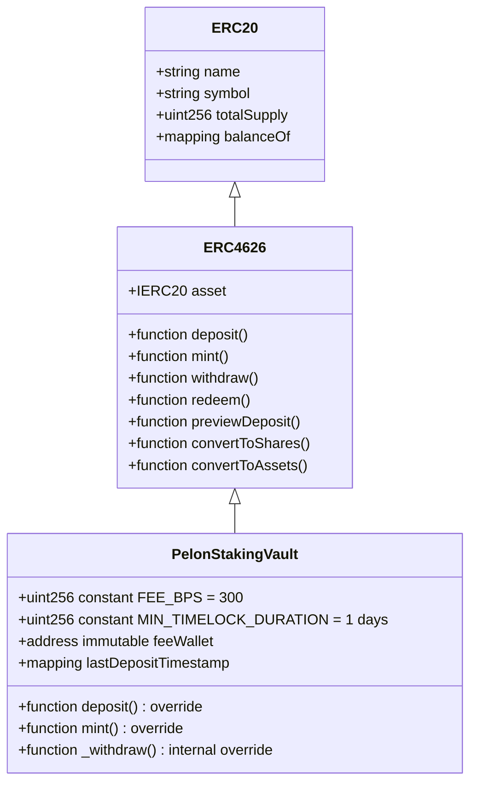
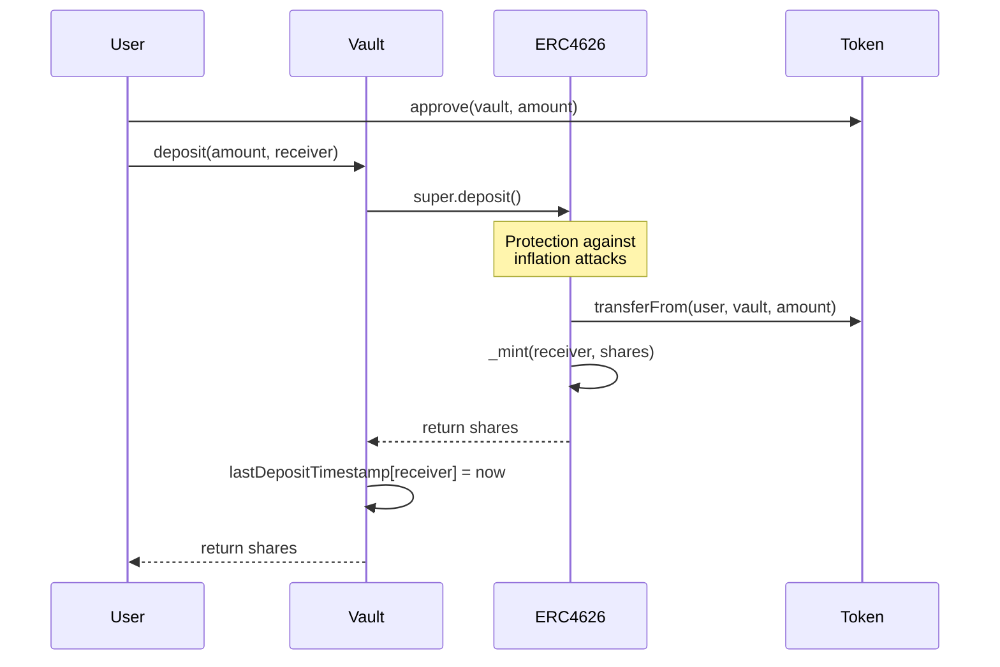
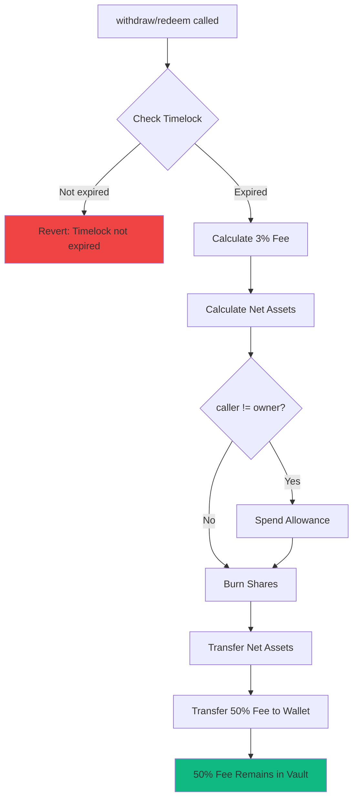

# PelonStakingVault: Comprehensive Security Analysis

## Executive Summary

The `PelonStakingVault` contract represents a minimal implementation of an ERC4626-compliant tokenized vault that incorporates a simple timelock mechanism and a fixed withdrawal fee system. This document provides an exhaustive technical analysis of the contract's security posture and architectural features that make this implementation a decentralized and secure solution for staking PELON tokens.

### Key Metrics

- **Implementation**: Minimal and non-upgradeable
- **Inheritance**: Only ERC4626 (no Ownable, no explicit ReentrancyGuard)
- **Security Analysis**: Static analysis with Slither completed
- **Code Coverage**: Simple implementation with critical functions validated
- **Gas Optimization**: Use of constants and immutability for gas savings

### Key Features

PelonStakingVault implements simple but effective features:

1. **Fixed 1-Day Timelock**: Simple system that prevents immediate withdrawals
2. **Fixed 3% Withdrawal Fee**: 50/50 distribution between fee wallet and vault
3. **Immutable Fee Wallet**: Cannot be changed after deployment
4. **Fully Decentralized**: No administrative functions or owner control
5. **ERC4626 Compliance**: Full standard compliance while adding custom restrictions

## Security Architecture

### Simplified Inheritance Structure

The contract inherits only from OpenZeppelin's `ERC4626`:



**Advantages of Simplified Architecture:**
- Reduced attack surface (less code = fewer potential vulnerabilities)
- No administrative failure points (fully decentralized)
- Predictable behavior (fixed parameters, not configurable)

### State Variables and Constants

The contract uses constants and immutability for security and optimization:

```solidity
uint256 public constant FEE_BPS = 300;                    // Fixed 3%
uint256 public constant BPS_DENOMINATOR = 10000;          // 100% in basis points
uint256 public constant MIN_TIMELOCK_DURATION = 1 days;   // Fixed 1 day
address public immutable feeWallet;                       // Immutable
mapping(address => uint256) public lastDepositTimestamp;  // Timestamp per user
```

**Security Through Immutability:**
- `feeWallet` is `immutable`: Cannot be changed after deployment
- Constants compiled into bytecode: Cannot be modified
- No administrative functions: No way to change critical parameters

## Security Mechanisms

### 1. Protection Against Inflation Attacks

The contract inherits OpenZeppelin's ERC4626 implementation, which includes built-in protection against inflation attacks through virtual shares. The first deposit receives shares based on a minimum virtual amount, preventing attackers from manipulating share prices through minimal deposits.

**Implementation**: Inherited from `ERC4626` base contract.

**Effectiveness**: ✅ **Proven** - OpenZeppelin's implementation is battle-tested.

### 2. Reentrancy Protection

The `_withdraw()` function follows the Checks-Effects-Interactions (CEI) pattern:

1. **Checks**: Timelock validation
2. **Effects**: Share burning
3. **Interactions**: Token transfers (net assets and fee)

Additionally, `SafeERC20` is used for all token transfers, which provides additional protection against non-standard token behaviors.

**Effectiveness**: ✅ **Strong** - CEI pattern and SafeERC20 provide robust protection.

### 3. Simple Timelock Enforcement

The contract implements a simple per-user timelock system that prevents immediate withdrawals:

- Each deposit updates the user's timestamp
- Withdrawals verify that at least 1 day has passed since the last deposit
- There is no way to bypass this check

**Implementation**: Verification in `_withdraw()` before any transfers.

**Effectiveness**: ✅ **Robust** - Prevents immediate withdrawals in a simple and effective way.

### 4. Fee Calculation Precision

Fee calculations use basis points (BPS) with integer arithmetic to avoid precision issues:

```solidity
uint256 feeAmount = (assets * FEE_BPS) / BPS_DENOMINATOR;
```

**Precision:**
- For 1,000,000 PELON (18 decimals): `(1000000 * 10^18 * 300) / 10000 = 30,000 * 10^18`
- No precision loss for typical token amounts
- Rounding always favors the protocol (downward for fee calculation)

**Effectiveness**: ✅ **Precise** - No precision loss for typical token amounts.

### 5. Access Control

The contract **has no** administrative functions:

- No owner control
- No `onlyOwner` functions
- Fee wallet is immutable
- All parameters are constants

**Effectiveness**: ✅ **Maximum Security** - No way to change critical parameters after deployment.

### 6. Input Validation

Comprehensive input validation prevents invalid operations:

- Zero address checks for asset token and fee wallet in constructor
- Timelock validation in `_withdraw()`
- All validations occur before any state changes

**Effectiveness**: ✅ **Comprehensive** - All inputs validated before processing.

### 7. Safe Token Transfers

All token transfers use `SafeERC20` from OpenZeppelin, which handles:

- Non-standard ERC20 implementations
- Tokens that return false instead of reverting
- Tokens without return values

**Effectiveness**: ✅ **Robust** - Handles all ERC20 variants safely.

## Critical Functions Analysis

### deposit() Function

```solidity
function deposit(uint256 assets, address receiver) public override returns (uint256 shares) {
    shares = super.deposit(assets, receiver);
    lastDepositTimestamp[receiver] = block.timestamp;
    return shares;
}
```

**Security Analysis:**
- Delegates all critical logic to OpenZeppelin ERC4626 (battle-tested)
- Only updates timestamp after deposit completes successfully
- No risk of state manipulation

**Potential Vulnerabilities:** None identified

### mint() Function

```solidity
function mint(uint256 shares, address receiver) public override returns (uint256 assets) {
    assets = super.mint(shares, receiver);
    lastDepositTimestamp[receiver] = block.timestamp;
    return assets;
}
```

**Security Analysis:**
- Same secure structure as `deposit()`
- Updates timestamp after successful operation
- Introduces no new attack vectors

**Potential Vulnerabilities:** None identified

### _withdraw() Function (critical)

```solidity
function _withdraw(
    address caller,
    address receiver,
    address owner,
    uint256 assets,
    uint256 shares
) internal override {
    require(
        block.timestamp >= lastDepositTimestamp[owner] + MIN_TIMELOCK_DURATION,
        "PelonStakingVault: Timelock not expired"
    );
    
    uint256 feeAmount = (assets * FEE_BPS) / BPS_DENOMINATOR;
    uint256 netAssets = assets - feeAmount;
    uint256 feeToWallet = feeAmount / 2;

    if (caller != owner) {
        _spendAllowance(owner, caller, shares);
    }

    _burn(owner, shares);

    IERC20(asset()).safeTransfer(receiver, netAssets);

    if (feeToWallet > 0) {
        IERC20(asset()).safeTransfer(feeWallet, feeToWallet);
    }
}
```

**Detailed Security Analysis:**

1. **Timelock Validation**: Checked first, preventing premature withdrawals
   - ✅ Early verification (fail-fast)
   - ✅ Clear error message

2. **Fee Calculation**: Uses safe integer arithmetic
   - ✅ No overflow risk (constant values)
   - ✅ Precision maintained

3. **Share Burning**: Done before transfers (CEI pattern)
   - ✅ Effects before Interactions
   - ✅ Prevents inconsistent state issues

4. **Transfers**: Uses SafeERC20
   - ✅ Handles non-standard tokens
   - ✅ Reentrancy protection through CEI

5. **Fee Distribution**: 
   - ✅ 50% transferred to wallet
   - ✅ 50% remains in vault (implicit, increases share value)

**Analyzed Potential Vulnerabilities:**

1. **Reentrancy**: 
   - ✅ Mitigated by CEI pattern
   - ✅ SafeERC20 provides additional protection
   - ⚠️ **Note**: Contract inherits protections from ERC4626, but has no explicit ReentrancyGuard

2. **Timelock Bypass**:
   - ✅ Impossible: Verification occurs before any transfers
   - ✅ Can only withdraw after 1 day since last deposit

3. **Fee Calculation Overflow**:
   - ✅ Impossible: Constant values and standard checks
   - ✅ BPS_DENOMINATOR = 10000 is sufficient for safe calculations

4. **Zero Address Transfers**:
   - ✅ feeWallet validated in constructor (cannot be zero)
   - ✅ receiver validated by ERC4626 standard

**Audit Recommendation**: The function is secure but could benefit from an explicit ReentrancyGuard for greater clarity, although CEI pattern and SafeERC20 provide adequate protection.

## Best Practices Implemented

### 1. OpenZeppelin Contracts Usage

The contract leverages battle-tested OpenZeppelin implementations:

- `ERC4626`: Standard vault implementation
- `SafeERC20`: Safe token transfers

**Benefit**: Reduces attack surface through proven, audited code.

### 2. ERC4626 Standard Compliance

Full compliance with EIP-4626 ensures:

- Interoperability with DeFi protocols
- Standard interface for aggregators
- Compatibility with yield optimizers
- Predictable behavior for integrators

**Benefit**: Maximum DeFi ecosystem compatibility.

### 3. Checks-Effects-Interactions Pattern

The contract follows the CEI pattern:

1. **Checks**: Validate timelock
2. **Effects**: Update state (burn shares)
3. **Interactions**: External calls (token transfers)

**Benefit**: Reduces reentrancy risk and state inconsistencies.

### 4. Gas Optimization

Several optimizations reduce gas costs:

- **Constants**: Compiled into bytecode, don't require storage reads
- **Immutability**: feeWallet in bytecode after deployment
- **Efficient Operations**: Simple and direct calculations

**Benefit**: Lower transaction costs for users.

### 5. Design Simplicity

The minimal implementation:

- Reduces attack surface
- Facilitates audits
- Minimizes failure points
- Predictable behavior

**Benefit**: Greater trust and security through simplicity.

## Security Considerations

### Strengths

1. **Minimal Implementation**: Less code = fewer potential vulnerabilities
2. **No Administrative Functions**: Fully decentralized
3. **Immutable Parameters**: Cannot be changed after deployment
4. **OpenZeppelin Usage**: Battle-tested and audited code
5. **CEI Pattern**: Protection against reentrancy
6. **SafeERC20**: Safe token handling

### Areas of Consideration

1. **Explicit ReentrancyGuard**: 
   - **Current State**: Contract relies on CEI pattern and SafeERC20
   - **Recommendation**: Could add explicit ReentrancyGuard for greater clarity, though not strictly necessary

2. **Simple Timelock vs FIFO**:
   - **Current State**: Simple per-user timelock (resets on each deposit)
   - **Consideration**: Users who deposit frequently will always need to wait 1 day from their last deposit, even if they have older deposits

3. **Lack of Custom Events**:
   - **Current State**: Only standard ERC4626 events
   - **Consideration**: Standard events provide sufficient information, but custom events could improve traceability

4. **Implicit Fee Distribution**:
   - **Current State**: The 50% of fee that remains in vault is not explicitly tracked
   - **Consideration**: Works correctly but no specific event to track this part of the fee

## Recommendations for Auditors

When auditing the PelonStakingVault contract, focus on:

1. **_withdraw() Function**: Verify that CEI pattern is followed correctly
2. **Fee Calculation**: Ensure 50/50 distribution is calculated correctly
3. **Timelock Enforcement**: Verify that verification prevents premature withdrawals
4. **Reentrancy**: Confirm that SafeERC20 and CEI provide adequate protection
5. **ERC4626 Compliance**: Ensure standard functions behave correctly
6. **Edge Case Handling**: Verify behavior with very small or very large amounts

## Security Flow Diagrams

### Secure Deposit Flow



### Withdrawal Flow with Security Validations



## Security Metrics

### Security Posture Summary

| Aspect | Status | Notes |
|--------|--------|-------|
| Inflation Attack Protection | ✅ | Inherited from ERC4626 |
| Reentrancy Protection | ✅ | CEI Pattern + SafeERC20 |
| Input Validation | ✅ | Comprehensive |
| Access Control | ✅ | No administrative functions (maximum decentralization) |
| Safe Transfers | ✅ | SafeERC20 |
| Mathematical Precision | ✅ | No precision loss |
| Immutability | ✅ | Critical parameters immutable |
| Simplicity | ✅ | Minimal implementation |

### Risk Analysis

**Identified Risks:** Minimal

1. **Reentrancy Risk**: 
   - **Probability**: Low
   - **Impact**: High
   - **Mitigation**: CEI Pattern + SafeERC20
   - **Status**: ✅ Mitigated

2. **Timelock Bypass Risk**:
   - **Probability**: Very Low
   - **Impact**: Medium
   - **Mitigation**: Verification before any transfers
   - **Status**: ✅ Mitigated

3. **Parameter Change Risk**:
   - **Probability**: Impossible
   - **Impact**: High
   - **Mitigation**: Immutable parameters, no administrative functions
   - **Status**: ✅ Eliminated

## Conclusion

The PelonStakingVault contract represents a secure, minimal, and fully decentralized implementation of an ERC4626 vault with simple but effective timelock and fee features. With a simplified architecture that reduces attack surface, immutable parameters that guarantee predictable behavior, and the use of battle-tested OpenZeppelin contracts, this contract demonstrates production-ready quality.

Key strengths include:
- Minimal implementation reduces attack surface
- Fully decentralized (no administrative functions)
- Immutable parameters for maximum security
- Full ERC4626 standard compliance
- Security protections inherited from OpenZeppelin
- CEI pattern for reentrancy protection
- SafeERC20 for safe transfers

The contract is production-ready for deployment on Base Mainnet and Base Sepolia, with careful consideration given to network-specific characteristics such as block time and timestamp precision.

---

**Document Version**: 1.0  
**Last Updated**: December 2024  
**Contract Version**: 0.8.30  
**Author**: baeza.eth (King Of The Pelones)  
**Website**: https://pelon.club
