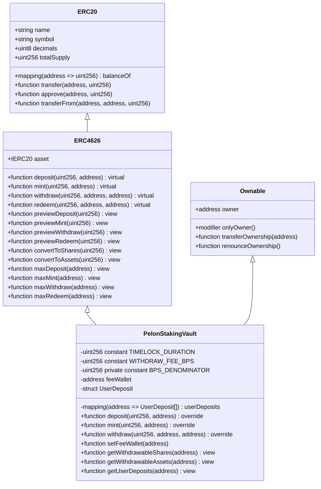
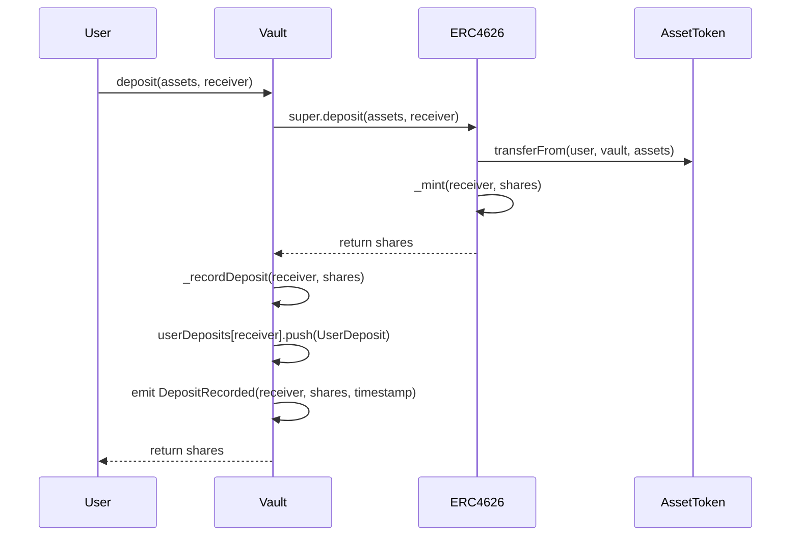
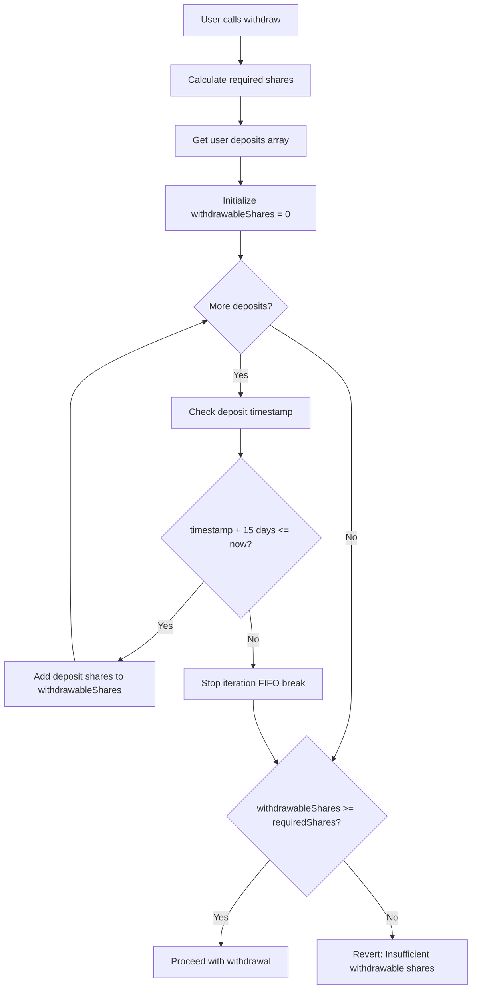
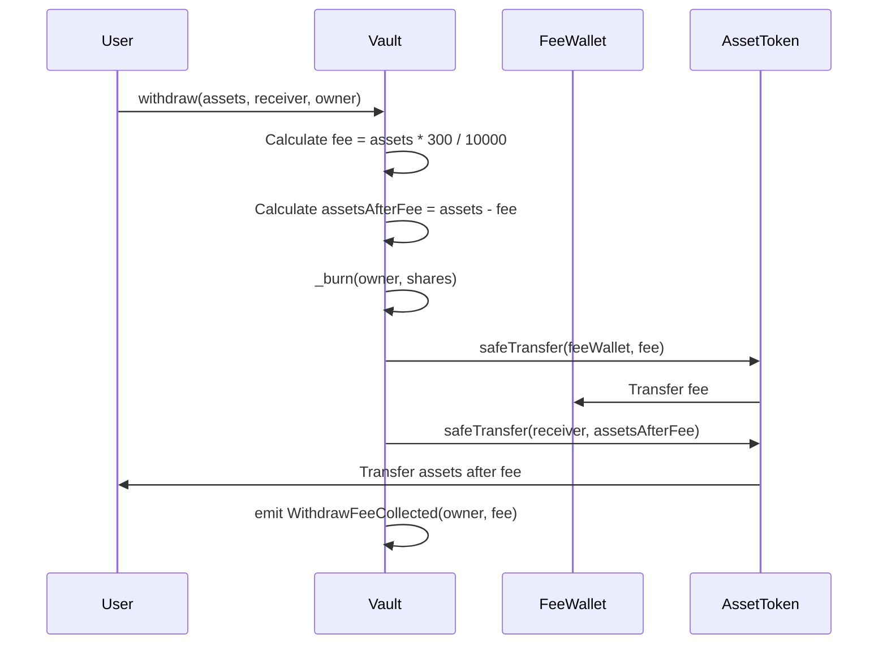
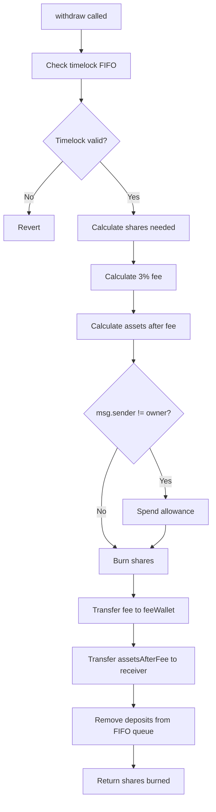

# PelonStakingVault Contract Technical Analysis

## Executive Summary

The `PelonStakingVault` contract implements an ERC4626-compliant tokenized vault system for staking PELON tokens, extending OpenZeppelin's battle-tested ERC4626 implementation with a First-In-First-Out (FIFO) timelock mechanism and a configurable withdrawal fee system. The contract enables users to deposit PELON tokens and receive proportional vault shares (psvPELON) that represent their stake in the vault, while enforcing a 15-day timelock period on withdrawals through a strict FIFO queue system.

The architecture leverages multiple inheritance from OpenZeppelin contracts, specifically `ERC4626` for standard vault functionality and `Ownable` for administrative control over the fee wallet configuration. The contract maintains full compliance with the ERC4626 standard while adding custom restrictions on the `withdraw()` function, leaving `redeem()` unrestricted to preserve standard ERC4626 behavior for users who prefer to work with shares directly.

The timelock mechanism operates on a per-deposit basis, where each deposit is tracked individually with its timestamp. When a user attempts to withdraw assets, the contract validates that only deposits that have exceeded the 15-day timelock period can be withdrawn, processing them in strict FIFO order. This design prevents users from circumventing the timelock by selectively withdrawing newer deposits while older deposits remain locked.

## Architecture and Contract Inheritance

The `PelonStakingVault` contract utilizes multiple inheritance to combine functionality from OpenZeppelin's `ERC4626` and `Ownable` contracts. This inheritance structure provides a solid foundation for vault operations while maintaining administrative control over critical parameters.



### Inheritance Order Analysis

The inheritance order `ERC4626, Ownable` is critical for proper initialization. The `ERC4626` contract itself inherits from `ERC20`, creating a three-level inheritance hierarchy:

1. **ERC20**: Provides the base token functionality for vault shares (psvPELON)
2. **ERC4626**: Extends ERC20 with vault-specific operations and share/asset conversion logic
3. **Ownable**: Adds administrative access control for fee wallet management

The constructor explicitly invokes `ERC20("Pelon Staking Vault", "psvPELON")` to set the vault share token name and symbol, `ERC4626(asset)` to initialize the vault with the underlying asset (PELON token), and `Ownable(msg.sender)` to establish the deployer as the contract owner.

## ERC4626 Standard Compliance

The contract maintains full compliance with the ERC4626 standard (EIP-4626), which defines a standard interface for tokenized vaults. This compliance ensures interoperability with existing DeFi infrastructure, including aggregators, yield optimizers, and other protocols that interact with ERC4626 vaults.

### Standard Functions Preserved

All standard ERC4626 functions remain fully functional:

- **`deposit(uint256 assets, address receiver)`**: Deposits assets and mints shares, with additional deposit tracking
- **`mint(uint256 shares, address receiver)`**: Mints shares for assets, with additional deposit tracking
- **`redeem(uint256 shares, address receiver, address owner)`**: Redeems shares for assets without timelock or fee restrictions
- **`previewDeposit(uint256 assets)`**: Calculates shares for a given asset amount
- **`previewMint(uint256 shares)`**: Calculates assets required for a given share amount
- **`previewWithdraw(uint256 assets)`**: Calculates shares required for a given asset withdrawal
- **`previewRedeem(uint256 shares)`**: Calculates assets received for a given share redemption
- **`convertToShares(uint256 assets)`**: Converts assets to shares using current exchange rate
- **`convertToAssets(uint256 shares)`**: Converts shares to assets using current exchange rate

### Modified Behavior

The `withdraw()` function is the only standard function with modified behavior:

- **Timelock Enforcement**: Only deposits that have exceeded the 15-day timelock can be withdrawn
- **Withdrawal Fee**: A 3% fee is deducted from withdrawn assets and transferred to the fee wallet
- **FIFO Processing**: Deposits are processed in strict first-in-first-out order

The `redeem()` function remains completely unrestricted, allowing users to bypass timelock restrictions by working directly with shares. This design choice provides flexibility while maintaining the security benefits of the timelock for asset-based withdrawals.

## FIFO Timelock System

The timelock mechanism implements a strict First-In-First-Out queue system where each deposit is tracked individually with its timestamp. This design ensures that deposits must be withdrawn in the order they were made, and only after the timelock period has expired.

### Deposit Tracking Structure

Each deposit is recorded using the `UserDeposit` struct:

```solidity
struct UserDeposit {
    uint256 shares;      // Number of vault shares from this deposit
    uint256 timestamp;   // Block timestamp when deposit was made
}
```

The `userDeposits` mapping maintains an array of deposits for each user address, forming a FIFO queue where the first element represents the oldest deposit:

```solidity
mapping(address => UserDeposit[]) public userDeposits;
```

### Deposit Recording Mechanism

When a user deposits assets through `deposit()` or `mint()`, the contract:

1. Executes the standard ERC4626 deposit/mint logic via `super.deposit()` or `super.mint()`
2. Calculates the shares received from the operation
3. Records a new `UserDeposit` entry with the current `block.timestamp`
4. Emits a `DepositRecorded` event for off-chain tracking



### Timelock Validation

When a user attempts to withdraw assets, the contract validates timelock eligibility through `_checkTimelock()`:

1. Calculates the required shares for the requested asset amount using `previewWithdraw(assets)`
2. Determines withdrawable shares by iterating through deposits in FIFO order
3. Stops at the first deposit that hasn't exceeded the timelock period
4. Requires that withdrawable shares are sufficient for the requested withdrawal



### FIFO Withdrawal Processing

The `_removeDeposits()` function processes withdrawals in strict FIFO order:

1. Iterates through deposits starting from index 0 (oldest)
2. Validates that each deposit has exceeded the timelock before removal
3. Removes shares from deposits in order until the withdrawal amount is satisfied
4. Handles partial deposit consumption when a deposit is larger than the remaining withdrawal amount

The algorithm ensures that:
- Only deposits that have passed the timelock can be removed
- Deposits are consumed in chronological order
- Partial deposits are properly handled (remaining shares stay in the queue)

```mermaid
flowchart TD
    A[Start _removeDeposits] --> B[sharesToRemove = shares]
    B --> C{deposits.length > 0 AND sharesToRemove > 0?}
    C -->|Yes| D[Get first deposit deposits[0]]
    D --> E{timestamp + 15 days <= now?}
    E -->|No| F[Revert: Timelock not expired]
    E -->|Yes| G{firstDeposit.shares <= sharesToRemove?}
    G -->|Yes| H[sharesToRemove -= firstDeposit.shares]
    H --> I[Shift all deposits left by 1 position]
    I --> J[deposits.pop]
    J --> C
    G -->|No| K[firstDeposit.shares -= sharesToRemove]
    K --> L[sharesToRemove = 0]
    L --> C
    C -->|No| M{sharesToRemove == 0?}
    M -->|Yes| N[Success]
    M -->|No| O[Revert: Insufficient eligible deposits]
```

### Timelock Duration and Base Network Considerations

The contract uses `block.timestamp` rather than `block.number` for timelock calculations, which is critical for accurate time-based restrictions on Base network:

**Why `block.timestamp` on Base:**

- Base Mainnet and Base Sepolia have consistent block times of approximately 2 seconds
- `block.timestamp` provides precise time-based calculations regardless of block time variations
- The 15-day timelock (1,296,000 seconds) requires accurate time measurement
- `block.number` would be less precise due to potential block time variations

**Timelock Calculation:**
```solidity
uint256 public constant TIMELOCK_DURATION = 15 days; // 1,296,000 seconds
```

The constant `15 days` is a Solidity time unit that compiles to `1,296,000` seconds, ensuring consistent behavior across all network conditions.

## Withdrawal Fee Mechanism

The contract implements a 3% withdrawal fee that is deducted from withdrawn assets and transferred directly to a configurable fee wallet. This fee applies only to `withdraw()` operations and does not affect `redeem()` calls.

### Fee Calculation

The withdrawal fee is calculated using basis points (BPS) for precision:

```solidity
uint256 public constant WITHDRAW_FEE_BPS = 300;      // 3% in basis points
uint256 private constant BPS_DENOMINATOR = 10000;   // 100% in basis points
```

The fee calculation formula:
```solidity
uint256 fee = (assets * WITHDRAW_FEE_BPS) / BPS_DENOMINATOR;
uint256 assetsAfterFee = assets - fee;
```

This approach ensures:
- Precise fee calculation without floating-point arithmetic
- No rounding errors in fee computation
- Clear fee percentage (300 BPS = 3%)

### Fee Transfer Flow



### Fee Wallet Management

The fee wallet address is configurable by the contract owner through the `setFeeWallet()` function:

```solidity
function setFeeWallet(address _feeWallet) external onlyOwner {
    require(_feeWallet != address(0), "PelonStakingVault: Fee wallet cannot be zero address");
    feeWallet = _feeWallet;
    emit FeeWalletUpdated(_feeWallet);
}
```

This design allows:
- Flexibility to change the fee recipient address if needed
- Emergency response capability for fee wallet management
- Transparency through `FeeWalletUpdated` events

The initial fee wallet is set during contract construction and cannot be the zero address, ensuring fees are always sent to a valid recipient.

## State Variables and Constants

### Constants

**`TIMELOCK_DURATION`**: `uint256 public constant`
- Value: `15 days` (1,296,000 seconds)
- Purpose: Defines the minimum time deposits must remain locked before withdrawal
- Immutability: Cannot be modified after deployment

**`WITHDRAW_FEE_BPS`**: `uint256 public constant`
- Value: `300` (representing 3%)
- Purpose: Defines the withdrawal fee percentage in basis points
- Immutability: Cannot be modified after deployment

**`BPS_DENOMINATOR`**: `uint256 private constant`
- Value: `10000` (representing 100%)
- Purpose: Denominator for basis points calculations
- Visibility: Private to prevent external access (internal calculation only)

### State Variables

**`feeWallet`**: `address public`
- Purpose: Address that receives withdrawal fees
- Mutability: Can be updated by owner via `setFeeWallet()`
- Initialization: Set in constructor, validated to be non-zero

**`userDeposits`**: `mapping(address => UserDeposit[]) public`
- Purpose: FIFO queue of deposits for each user address
- Structure: Array of `UserDeposit` structs ordered chronologically
- Access: Public mapping allows direct querying of deposit arrays

## Core Functions Analysis

### Constructor

```solidity
constructor(IERC20 asset, address _feeWallet)
    ERC20("Pelon Staking Vault", "psvPELON")
    ERC4626(asset)
    Ownable(msg.sender)
{
    require(_feeWallet != address(0), "PelonStakingVault: Fee wallet cannot be zero address");
    feeWallet = _feeWallet;
}
```

**Parameters:**
- `asset`: The underlying ERC20 token (PELON) that can be deposited into the vault
- `_feeWallet`: Address that will receive withdrawal fees

**Initialization Order:**
1. `ERC20` constructor sets vault share token name and symbol
2. `ERC4626` constructor initializes the vault with the underlying asset
3. `Ownable` constructor sets the deployer as contract owner
4. Fee wallet validation and assignment

**Validation:**
- Fee wallet must be non-zero address to prevent fee loss

### deposit() Function

```solidity
function deposit(uint256 assets, address receiver) public override returns (uint256 shares) {
    shares = super.deposit(assets, receiver);
    _recordDeposit(receiver, shares);
    return shares;
}
```

**Functionality:**
1. Calls parent `ERC4626.deposit()` to execute standard deposit logic
2. Records the deposit with current timestamp for timelock tracking
3. Returns the shares minted to the receiver

**Key Points:**
- Maintains full ERC4626 standard behavior
- Adds deposit tracking without modifying core functionality
- Shares are minted to `receiver`, not `msg.sender` (allows deposits on behalf of others)

### mint() Function

```solidity
function mint(uint256 shares, address receiver) public override returns (uint256 assets) {
    assets = super.mint(shares, receiver);
    _recordDeposit(receiver, shares);
    return assets;
}
```

**Functionality:**
1. Calls parent `ERC4626.mint()` to execute standard mint logic
2. Records the deposit with current timestamp for timelock tracking
3. Returns the assets required to mint the specified shares

**Key Points:**
- Inverse operation of `deposit()` (specify shares, receive assets amount)
- Same deposit tracking mechanism as `deposit()`
- Useful when users want to acquire a specific number of shares

### withdraw() Function

```solidity
function withdraw(uint256 assets, address receiver, address owner) 
    public override returns (uint256 shares) 
{
    // Check timelock restrictions (FIFO)
    _checkTimelock(owner, assets);

    // Calculate shares needed for the withdrawal
    shares = previewWithdraw(assets);
    
    // Calculate withdrawal fee (3%)
    uint256 fee = (assets * WITHDRAW_FEE_BPS) / BPS_DENOMINATOR;
    uint256 assetsAfterFee = assets - fee;

    // Process withdrawal: burn shares and transfer assets (with fee applied)
    if (msg.sender != owner) {
        _spendAllowance(owner, msg.sender, shares);
    }

    _burn(owner, shares);

    // Transfer fee to fee wallet first
    if (fee > 0) {
        IERC20(asset()).safeTransfer(feeWallet, fee);
        emit WithdrawFeeCollected(owner, fee);
    }

    // Transfer remaining assets to receiver
    IERC20(asset()).safeTransfer(receiver, assetsAfterFee);

    // Update deposit records (FIFO removal)
    _removeDeposits(owner, shares);

    return shares;
}
```

**Function Flow:**



**Key Features:**
- Timelock validation before processing
- Fee calculation and transfer before user assets
- FIFO deposit removal after successful withdrawal
- Support for approved withdrawals (third-party withdrawals)

**Security Considerations:**
- Fee is transferred first to prevent reentrancy issues
- Allowance is spent before burning shares
- Deposit removal happens after all transfers complete

### setFeeWallet() Function

```solidity
function setFeeWallet(address _feeWallet) external onlyOwner {
    require(_feeWallet != address(0), "PelonStakingVault: Fee wallet cannot be zero address");
    feeWallet = _feeWallet;
    emit FeeWalletUpdated(_feeWallet);
}
```

**Access Control:**
- Restricted to contract owner via `onlyOwner` modifier
- Prevents unauthorized fee wallet changes

**Validation:**
- Fee wallet must be non-zero address
- Prevents accidental or malicious zero address assignment

**Event Emission:**
- `FeeWalletUpdated` event provides transparency for off-chain monitoring

## View Functions

### getWithdrawableShares()

```solidity
function getWithdrawableShares(address user) public view returns (uint256 withdrawableShares) {
    uint256 currentTime = block.timestamp;
    UserDeposit[] memory deposits = userDeposits[user];
    
    for (uint256 i = 0; i < deposits.length; i++) {
        if (currentTime >= deposits[i].timestamp + TIMELOCK_DURATION) {
            withdrawableShares += deposits[i].shares;
        } else {
            break; // FIFO: stop at first non-eligible deposit
        }
    }
}
```

**Purpose:** Calculates the total number of shares that can be withdrawn by a user, considering only deposits that have exceeded the timelock period.

**Algorithm:**
1. Iterates through deposits in FIFO order (index 0 = oldest)
2. Accumulates shares from deposits that have passed timelock
3. Stops at first deposit that hasn't exceeded timelock (FIFO break)
4. Returns total withdrawable shares

**Gas Optimization:** Uses memory copy of deposits array to avoid storage reads in loop.

### getWithdrawableAssets()

```solidity
function getWithdrawableAssets(address user) public view returns (uint256 withdrawableAssets) {
    uint256 withdrawableShares = getWithdrawableShares(user);
    if (withdrawableShares > 0) {
        withdrawableAssets = convertToAssets(withdrawableShares);
    }
}
```

**Purpose:** Converts withdrawable shares to assets using the current exchange rate.

**Functionality:**
1. Calls `getWithdrawableShares()` to get eligible shares
2. Uses ERC4626's `convertToAssets()` to calculate asset value
3. Returns zero if no shares are withdrawable

**Use Case:** Frontend interfaces can display withdrawable asset amounts without manual conversion.

### getUserDeposits()

```solidity
function getUserDeposits(address user) external view returns (UserDeposit[] memory) {
    return userDeposits[user];
}
```

**Purpose:** Returns the complete deposit history for a user address.

**Return Value:** Array of `UserDeposit` structs containing:
- `shares`: Number of shares from each deposit
- `timestamp`: Block timestamp when deposit was made

**Use Case:** Off-chain analysis, frontend display of deposit history, timelock countdown calculations.

## Events

### DepositRecorded

```solidity
event DepositRecorded(address indexed user, uint256 shares, uint256 timestamp);
```

**Emitted When:** A new deposit is recorded in the FIFO queue.

**Parameters:**
- `user`: Address that received the vault shares
- `shares`: Number of shares minted from the deposit
- `timestamp`: Block timestamp when deposit was made

**Use Case:** Off-chain tracking of deposit history, timelock expiration calculations, analytics.

### WithdrawFeeCollected

```solidity
event WithdrawFeeCollected(address indexed user, uint256 feeAmount);
```

**Emitted When:** A withdrawal fee is collected and transferred to the fee wallet.

**Parameters:**
- `user`: Address that initiated the withdrawal (owner of shares)
- `feeAmount`: Amount of assets collected as fee

**Use Case:** Fee tracking, revenue analytics, accounting systems.

### FeeWalletUpdated

```solidity
event FeeWalletUpdated(address indexed newWallet);
```

**Emitted When:** The fee wallet address is updated by the owner.

**Parameters:**
- `newWallet`: New fee wallet address

**Use Case:** Monitoring administrative changes, compliance tracking.

## Security Considerations

### Inflation Attack Protection

The contract inherits OpenZeppelin's ERC4626 implementation, which includes built-in protection against inflation attacks. The standard uses a "virtual shares" mechanism that prevents attackers from manipulating share prices by depositing minimal amounts before large deposits.

**How It Works:**
- ERC4626 uses `_convertToShares()` and `_convertToAssets()` with rounding protection
- First depositor receives shares based on a minimum virtual amount
- Subsequent deposits use actual asset balances for conversion

### Reentrancy Protection

While the contract doesn't explicitly use `ReentrancyGuard`, it follows the Checks-Effects-Interactions (CEI) pattern:

1. **Checks**: Timelock validation, allowance verification
2. **Effects**: Share burning, deposit removal
3. **Interactions**: Token transfers (fee and user assets)

Additionally, `SafeERC20` is used for all token transfers, which provides additional protection against non-standard token behaviors.

### Timelock Bypass Prevention

The FIFO system prevents users from selectively withdrawing newer deposits while older deposits remain locked:

- Deposits must be withdrawn in chronological order
- Partial withdrawals consume deposits from oldest to newest
- The system breaks iteration at the first non-eligible deposit

This design ensures that users cannot game the system by making multiple small deposits and attempting to withdraw them out of order.

### Fee Calculation Precision

The fee calculation uses integer arithmetic with basis points to avoid precision loss:

```solidity
uint256 fee = (assets * WITHDRAW_FEE_BPS) / BPS_DENOMINATOR;
```

**Precision Analysis:**
- For 1,000,000 PELON (18 decimals): `(1000000 * 10^18 * 300) / 10000 = 30,000 * 10^18`
- No precision loss for typical token amounts
- Rounding always favors the protocol (downward for fee calculation)

### Access Control

The contract uses OpenZeppelin's `Ownable` for administrative functions:

- Only `setFeeWallet()` requires owner privileges
- Standard ERC4626 functions remain permissionless
- Ownership can be transferred or renounced if needed

## Gas Optimization

### Storage Optimization

**Deposit Array Management:**
- Deposits are stored in arrays, requiring gas for array operations
- Array shifting in `_removeDeposits()` has O(n) complexity for the number of deposits
- Users with many small deposits will incur higher gas costs

**Optimization Opportunities:**
- Consider batching deposits for users with frequent small deposits
- Frontend can aggregate multiple deposits before withdrawal
- Large deposit arrays may benefit from alternative data structures (future upgrade)

### Constant Usage

Constants are compiled into bytecode, providing gas savings:
- `TIMELOCK_DURATION`: Read from bytecode (~3 gas) vs storage (~2,100 gas)
- `WITHDRAW_FEE_BPS`: Same optimization
- `BPS_DENOMINATOR`: Private constant, inlined in calculations

### View Function Efficiency

View functions use memory copies to avoid repeated storage reads:
- `getWithdrawableShares()` copies deposits array to memory once
- Iteration happens on memory, reducing storage SLOAD operations
- Trade-off: Higher memory usage for lower gas cost

## Usage Examples

### Example 1: Basic Deposit and Withdrawal

```solidity
// User deposits 1000 PELON tokens
uint256 assets = 1000 * 10**18; // 1000 PELON with 18 decimals
uint256 shares = vault.deposit(assets, msg.sender);

// After 15 days, user can withdraw
uint256 withdrawableAssets = vault.getWithdrawableAssets(msg.sender);
if (withdrawableAssets >= assets) {
    vault.withdraw(assets, msg.sender, msg.sender);
    // User receives: assets - (assets * 3 / 100) = 970 PELON
    // Fee wallet receives: assets * 3 / 100 = 30 PELON
}
```

### Example 2: Multiple Deposits with FIFO

```solidity
// Day 1: Deposit 100 PELON
vault.deposit(100 * 10**18, msg.sender);

// Day 5: Deposit 200 PELON
vault.deposit(200 * 10**18, msg.sender);

// Day 10: Deposit 300 PELON
vault.deposit(300 * 10**18, msg.sender);

// Day 16: First deposit is withdrawable
uint256 withdrawable = vault.getWithdrawableAssets(msg.sender);
// withdrawable = 100 PELON (only first deposit eligible)

// Day 20: First two deposits are withdrawable
withdrawable = vault.getWithdrawableAssets(msg.sender);
// withdrawable = 300 PELON (first two deposits eligible)

// Day 25: All deposits are withdrawable
withdrawable = vault.getWithdrawableAssets(msg.sender);
// withdrawable = 600 PELON (all deposits eligible)
```

### Example 3: Using redeem() to Bypass Timelock

```solidity
// User has shares but wants to avoid timelock
uint256 shares = vault.balanceOf(msg.sender);

// redeem() has no timelock or fee restrictions
uint256 assets = vault.redeem(shares, msg.sender, msg.sender);
// User receives full asset amount without fee
```

**Note:** This allows users to work around timelock restrictions by using shares directly, which is an intentional design choice to maintain ERC4626 standard compliance.

### Example 4: Querying Deposit History

```solidity
// Get all deposits for a user
UserDeposit[] memory deposits = vault.getUserDeposits(userAddress);

for (uint256 i = 0; i < deposits.length; i++) {
    uint256 depositTime = deposits[i].timestamp;
    uint256 depositShares = deposits[i].shares;
    uint256 unlockTime = depositTime + vault.TIMELOCK_DURATION();
    
    if (block.timestamp >= unlockTime) {
        // Deposit is withdrawable
    } else {
        // Deposit is still locked
        uint256 timeRemaining = unlockTime - block.timestamp;
    }
}
```

## Deployment Considerations

### Base Mainnet Deployment

**Network Specifications:**
- Chain ID: 8453
- Block Time: ~2 seconds
- Gas Price: Variable (check current network conditions)

**Deployment Steps:**
1. Deploy PELON token contract (if not already deployed)
2. Deploy PelonStakingVault with PELON token address and fee wallet address
3. Verify contract on Basescan
4. Initialize vault with initial liquidity if needed

**Constructor Parameters:**
- `asset`: Address of PELON token contract
- `_feeWallet`: Address that will receive withdrawal fees (must be non-zero)

### Base Sepolia Testnet Deployment

**Network Specifications:**
- Chain ID: 84532
- Block Time: ~2 seconds
- Purpose: Testing and development

**Testing Considerations:**
- Use test PELON tokens or mocks
- Test timelock with shorter durations (modify constant for testing)
- Verify fee collection and distribution
- Test FIFO mechanism with multiple deposits

### Initial Configuration

**Fee Wallet Selection:**
- Choose a secure, non-custodial wallet for fee collection
- Consider multi-sig for additional security
- Document fee wallet address for transparency

**Vault Initialization:**
- No initial deposit required (vault can start empty)
- First depositor receives shares based on ERC4626 virtual shares mechanism
- Consider seeding vault with initial liquidity for better UX

## Conclusion

The `PelonStakingVault` contract provides a secure, ERC4626-compliant staking mechanism with innovative FIFO timelock and fee features. The design maintains full standard compliance while adding custom restrictions that protect the protocol and generate revenue through withdrawal fees.

Key strengths of the implementation:
- Full ERC4626 standard compliance for interoperability
- Strict FIFO timelock preventing gaming of withdrawal restrictions
- Configurable fee system with transparent fee collection
- Battle-tested OpenZeppelin base contracts
- Comprehensive deposit tracking and querying capabilities

The contract is production-ready for deployment on Base Mainnet and Base Sepolia, with careful consideration given to network-specific characteristics such as block time and timestamp precision.

