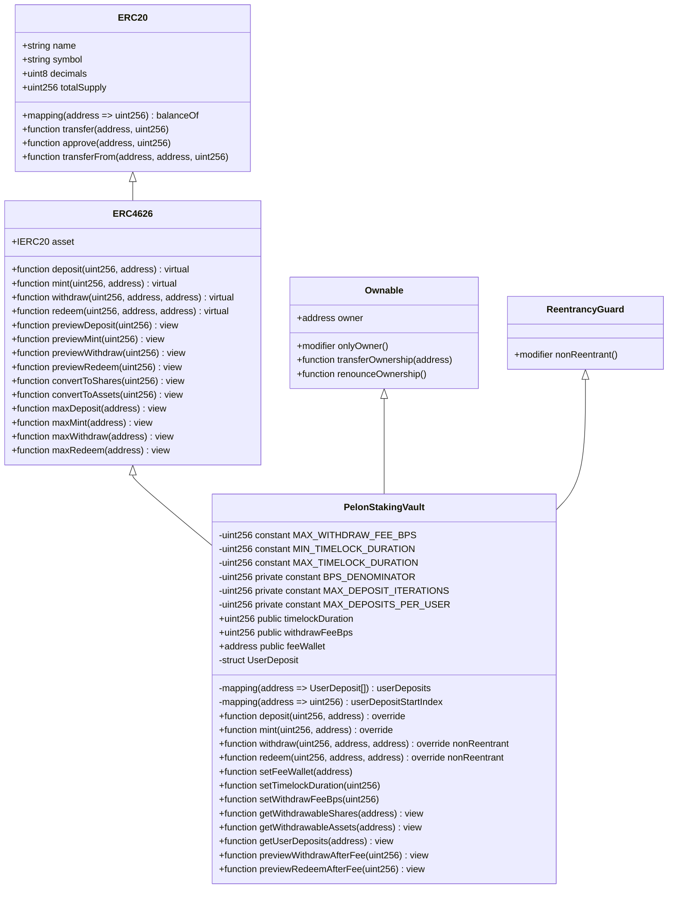
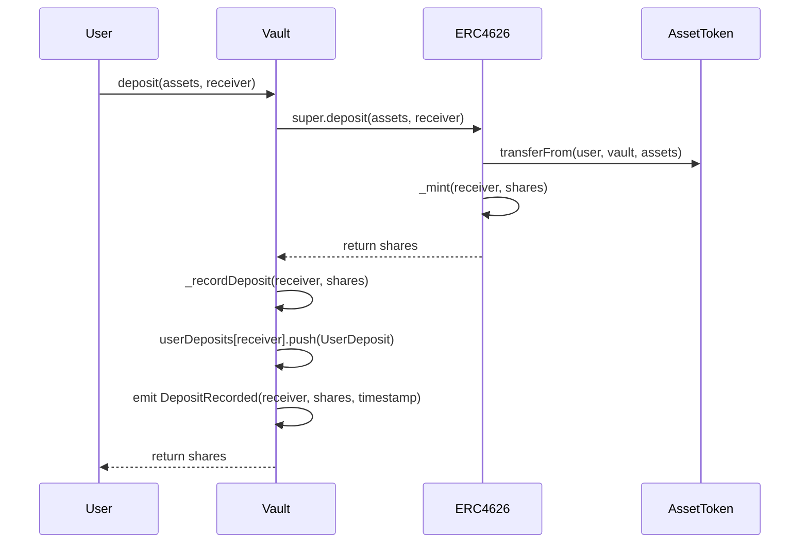
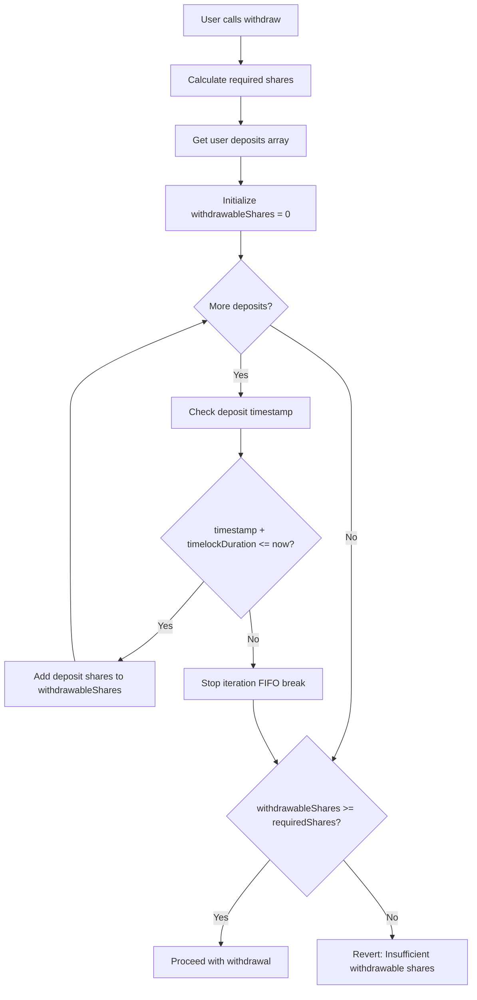
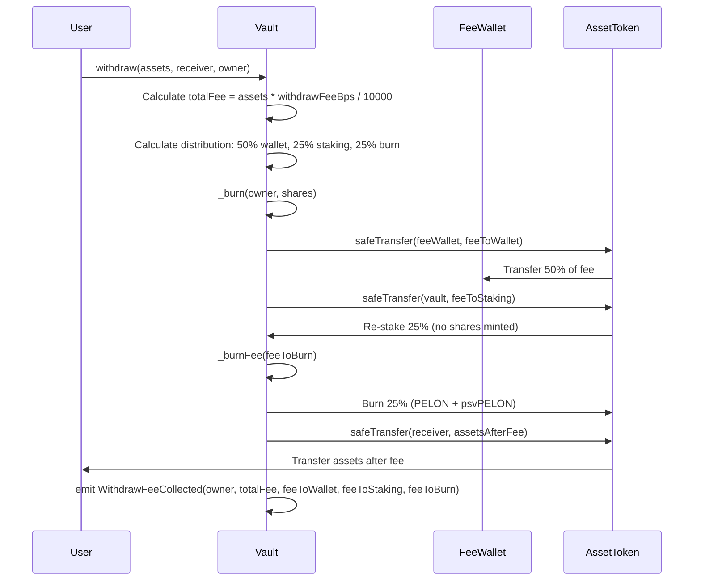
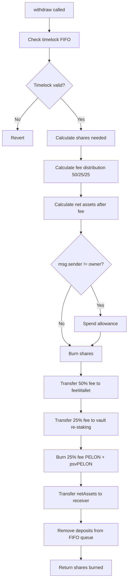
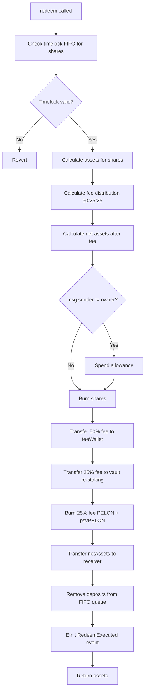

# PelonStakingVault Contract Technical Analysis

## Executive Summary

The `PelonStakingVault` contract implements an ERC4626-compliant tokenized vault system for staking PELON tokens, extending OpenZeppelin's battle-tested ERC4626 implementation with a First-In-First-Out (FIFO) timelock mechanism and a configurable withdrawal fee system. The contract enables users to deposit PELON tokens and receive proportional vault shares (psvPELON) that represent their stake in the vault, while enforcing a configurable timelock period (default 15 days, range 1-90 days) on withdrawals through a strict FIFO queue system.

The architecture leverages multiple inheritance from OpenZeppelin contracts, specifically `ERC4626` for standard vault functionality, `Ownable` for administrative control over fee wallet, timelock, and fee configuration, and `ReentrancyGuard` for protection against reentrancy attacks. The contract maintains full compliance with the ERC4626 standard while adding custom restrictions on both `withdraw()` and `redeem()` functions, applying timelock and withdrawal fees to both operations to ensure consistency and prevent circumvention of restrictions.

The timelock mechanism operates on a per-deposit basis, where each deposit is tracked individually with its timestamp. When a user attempts to withdraw assets, the contract validates that only deposits that have exceeded the configurable timelock period (default 15 days) can be withdrawn, processing them in strict FIFO order. This design prevents users from circumventing the timelock by selectively withdrawing newer deposits while older deposits remain locked.

## Architecture and Contract Inheritance

The `PelonStakingVault` contract utilizes multiple inheritance to combine functionality from OpenZeppelin's `ERC4626` and `Ownable` contracts. This inheritance structure provides a solid foundation for vault operations while maintaining administrative control over critical parameters.



### Inheritance Order Analysis

The inheritance order `ERC4626, Ownable, ReentrancyGuard` is critical for proper initialization. The `ERC4626` contract itself inherits from `ERC20`, creating a multi-level inheritance hierarchy:

1. **ERC20**: Provides the base token functionality for vault shares (psvPELON)
2. **ERC4626**: Extends ERC20 with vault-specific operations and share/asset conversion logic
3. **Ownable**: Adds administrative access control for fee wallet, timelock, and fee configuration
4. **ReentrancyGuard**: Provides protection against reentrancy attacks via `nonReentrant` modifier

The constructor explicitly invokes `ERC20("Pelon Staking Vault", "psvPELON")` to set the vault share token name and symbol, `ERC4626(asset)` to initialize the vault with the underlying asset (PELON token), and `Ownable(msg.sender)` to establish the deployer as the contract owner. `ReentrancyGuard` is inherited to protect `withdraw()` and `redeem()` functions.

## ERC4626 Standard Compliance

The contract maintains full compliance with the ERC4626 standard (EIP-4626), which defines a standard interface for tokenized vaults. This compliance ensures interoperability with existing DeFi infrastructure, including aggregators, yield optimizers, and other protocols that interact with ERC4626 vaults.

### Standard Functions Preserved

All standard ERC4626 functions remain fully functional:

- **`deposit(uint256 assets, address receiver)`**: Deposits assets and mints shares, with additional deposit tracking
- **`mint(uint256 shares, address receiver)`**: Mints shares for assets, with additional deposit tracking
- **`redeem(uint256 shares, address receiver, address owner)`**: Redeems shares for assets with timelock restrictions and configurable withdrawal fee (default 3%)
- **`previewDeposit(uint256 assets)`**: Calculates shares for a given asset amount
- **`previewMint(uint256 shares)`**: Calculates assets required for a given share amount
- **`previewWithdraw(uint256 assets)`**: Calculates shares required for a given asset withdrawal
- **`previewRedeem(uint256 shares)`**: Calculates assets received for a given share redemption
- **`convertToShares(uint256 assets)`**: Converts assets to shares using current exchange rate
- **`convertToAssets(uint256 shares)`**: Converts shares to assets using current exchange rate

### Modified Behavior

Both `withdraw()` and `redeem()` functions have modified behavior with the same restrictions:

- **Timelock Enforcement**: Only deposits that have exceeded the configurable timelock period (default 15 days, range 1-90 days) can be withdrawn
- **Withdrawal Fee**: A configurable fee (default 3%, maximum 10%) is deducted from withdrawn assets and distributed: 50% to fee wallet, 25% re-staked (increases share value), 25% burned
- **FIFO Processing**: Deposits are processed in strict first-in-first-out order

Both functions apply these restrictions consistently, ensuring there is no way to bypass the timelock or fee. The main difference between `withdraw()` and `redeem()` is that `withdraw()` works with assets (PELON tokens) while `redeem()` works with shares (psvPELON).

## FIFO Timelock System

The timelock mechanism implements a strict First-In-First-Out queue system where each deposit is tracked individually with its timestamp. This design ensures that deposits must be withdrawn in the order they were made, and only after the timelock period has expired.

### Deposit Tracking Structure

Each deposit is recorded using the `UserDeposit` struct:

```solidity
struct UserDeposit {
    uint256 shares;      // Number of vault shares from this deposit
    uint256 timestamp;   // Block timestamp when deposit was made
}
```

The `userDeposits` mapping maintains an array of deposits for each user address, forming a FIFO queue where the first element represents the oldest deposit:

```solidity
mapping(address => UserDeposit[]) public userDeposits;
```

### Deposit Recording Mechanism

When a user deposits assets through `deposit()` or `mint()`, the contract:

1. Executes the standard ERC4626 deposit/mint logic via `super.deposit()` or `super.mint()`
2. Calculates the shares received from the operation
3. Validates that the user doesn't exceed `MAX_DEPOSITS_PER_USER` (1000 active deposits)
4. Records a new `UserDeposit` entry with the current `block.timestamp`
5. Emits a `DepositRecorded` event for off-chain tracking

**Deposit Limit:**
- Maximum of 1000 active deposits per user address
- Active deposits = total deposits - deposits consumed (tracked via `userDepositStartIndex`)
- Prevents gas exhaustion from users with excessive deposit counts
- Validation occurs in `_recordDeposit()` before adding new deposit



### Timelock Validation

When a user attempts to withdraw assets, the contract validates timelock eligibility through `_checkTimelock()`:

1. Calculates the required shares for the requested asset amount using `previewWithdraw(assets)`
2. Determines withdrawable shares by iterating through deposits in FIFO order
3. Stops at the first deposit that hasn't exceeded the timelock period
4. Requires that withdrawable shares are sufficient for the requested withdrawal



### FIFO Withdrawal Processing

The `_removeDeposits()` function processes withdrawals in strict FIFO order using an optimized index-based system:

1. Uses `userDepositStartIndex` to track the starting position of active deposits
2. Iterates through deposits starting from `startIndex` (oldest active deposit)
3. Validates that each deposit has exceeded the timelock before removal
4. Removes shares from deposits in order until the withdrawal amount is satisfied
5. Updates `userDepositStartIndex` to skip processed deposits (gas optimization)
6. Handles partial deposit consumption when a deposit is larger than the remaining withdrawal amount

**Gas Optimization:**
Instead of shifting array elements (O(n) complexity), the contract uses an index-based approach:
- `userDepositStartIndex[user]` tracks where active deposits begin
- When deposits are fully consumed, the index is incremented
- This avoids expensive array shifting operations
- Maximum of `MAX_DEPOSIT_ITERATIONS` (500) iterations to prevent gas exhaustion

The algorithm ensures that:
- Only deposits that have passed the timelock can be removed
- Deposits are consumed in chronological order
- Partial deposits are properly handled (remaining shares stay in the queue)
- Gas costs are minimized through index-based optimization

```mermaid
flowchart TD
    A[Start _removeDeposits] --> B[sharesToRemove = shares]
    B --> C{deposits.length > 0 AND sharesToRemove > 0?}
    C -->|Yes| D[Get first deposit deposits[0]]
    D --> E{timestamp + timelockDuration <= now?}
    E -->|No| F[Revert: Timelock not expired]
    E -->|Yes| G{firstDeposit.shares <= sharesToRemove?}
    G -->|Yes| H[sharesToRemove -= firstDeposit.shares]
    H --> I[Shift all deposits left by 1 position]
    I --> J[deposits.pop]
    J --> C
    G -->|No| K[firstDeposit.shares -= sharesToRemove]
    K --> L[sharesToRemove = 0]
    L --> C
    C -->|No| M{sharesToRemove == 0?}
    M -->|Yes| N[Success]
    M -->|No| O[Revert: Insufficient eligible deposits]
```

### Timelock Duration and Base Network Considerations

The contract uses `block.timestamp` rather than `block.number` for timelock calculations, which is critical for accurate time-based restrictions on Base network:

**Why `block.timestamp` on Base:**

- Base Mainnet and Base Sepolia have consistent block times of approximately 2 seconds
- `block.timestamp` provides precise time-based calculations regardless of block time variations
- The configurable timelock (default 15 days = 1,296,000 seconds) requires accurate time measurement
- `block.number` would be less precise due to potential block time variations

**Timelock Configuration:**
```solidity
uint256 public timelockDuration; // Default: 15 days (1,296,000 seconds)
uint256 public constant MIN_TIMELOCK_DURATION = 1 days;
uint256 public constant MAX_TIMELOCK_DURATION = 90 days;
```

The timelock duration is configurable by the contract owner via `setTimelockDuration()` within the range of 1-90 days. The default value of `15 days` (1,296,000 seconds) is set in the constructor, ensuring consistent behavior across all network conditions.

**Administrative Control:**
The contract owner can update the timelock duration using `setTimelockDuration(uint256 duration)`, which validates that the new duration is within the allowed range (1-90 days). This provides flexibility to adjust the timelock period based on protocol needs while maintaining reasonable bounds.

## Withdrawal Fee Mechanism

The contract implements a configurable withdrawal fee (default 3%, maximum 10%) that is deducted from withdrawn assets and distributed across three destinations: 50% to the fee wallet, 25% re-staked into the vault (without minting shares, increasing value per share), and 25% burned (both PELON tokens and equivalent psvPELON shares). This fee applies to both `withdraw()` and `redeem()` operations, ensuring that all withdrawals are subject to the same fee distribution.

### Fee Calculation

The withdrawal fee is calculated using basis points (BPS) for precision:

```solidity
uint256 public withdrawFeeBps; // Default: 300 (3%), configurable up to 1000 (10%)
uint256 public constant MAX_WITHDRAW_FEE_BPS = 1000; // 10% maximum
uint256 private constant BPS_DENOMINATOR = 10000; // 100% in basis points
```

The fee calculation formula:
```solidity
uint256 totalFee = (assets * withdrawFeeBps) / BPS_DENOMINATOR;
```

This approach ensures:
- Precise fee calculation without floating-point arithmetic
- No rounding errors in fee computation
- Configurable fee percentage (default 300 BPS = 3%, maximum 1000 BPS = 10%)

### Fee Distribution (50/25/25)

The withdrawal fee is split into three components:

1. **50% to Fee Wallet**: Direct transfer to the configurable fee wallet address
2. **25% Re-staking**: Transferred back to the vault contract WITHOUT minting new shares
   - This increases `totalAssets()` while `totalSupply()` remains constant
   - Effectively increases the value per share for all existing holders
   - Provides a compounding reward mechanism that benefits all stakers
3. **25% Burned**: Both PELON tokens and equivalent psvPELON shares are burned
   - Reduces total supply of both assets and shares
   - Creates deflationary pressure on the token

**Fee Distribution Calculation:**
```solidity
function _calculateFeeDistribution(uint256 assets) 
    internal 
    view 
    returns (uint256 feeToWallet, uint256 feeToBurn, uint256 feeToStaking, uint256 totalFee) 
{
    uint256 denominatorSquared = BPS_DENOMINATOR * BPS_DENOMINATOR;
    
    feeToWallet = (assets * withdrawFeeBps * 5000) / denominatorSquared; // 50%
    feeToBurn = (assets * withdrawFeeBps * 2500) / denominatorSquared; // 25%
    feeToStaking = (assets * withdrawFeeBps * 2500) / denominatorSquared; // 25%
    totalFee = feeToWallet + feeToBurn + feeToStaking;
}
```

### Re-staking Mechanism Benefits

The 25% re-staking component creates value for all vault participants:

- **Value Per Share Increase**: When assets are added to the vault without minting shares, the exchange rate (`totalAssets / totalSupply`) increases
- **Compounding Effect**: All existing holders benefit from the increased value per share
- **Long-term Incentive**: Encourages long-term staking as the value per share grows over time
- **No Dilution**: Unlike traditional staking rewards that mint new tokens, this mechanism doesn't dilute existing holders

**Example:**
- Vault has 1,000,000 PELON assets and 1,000,000 psvPELON shares (1:1 ratio)
- User withdraws 10,000 PELON with 3% fee = 300 PELON total fee
- Fee distribution: 150 PELON to wallet, 75 PELON re-staked, 75 PELON burned
- New state: 1,000,075 PELON assets, 999,925 psvPELON shares
- New exchange rate: 1.00015 PELON per share (0.015% increase for all holders)

### Fee Transfer Flow



### Fee Configuration Management

The withdrawal fee percentage is configurable by the contract owner through the `setWithdrawFeeBps()` function:

```solidity
function setWithdrawFeeBps(uint256 feeBps) external onlyOwner {
    require(
        feeBps <= MAX_WITHDRAW_FEE_BPS,
        "PelonStakingVault: Withdrawal fee exceeds maximum"
    );
    withdrawFeeBps = feeBps;
    emit WithdrawFeeBpsUpdated(feeBps);
}
```

**Constraints:**
- Maximum fee: 10% (1000 BPS)
- Default fee: 3% (300 BPS)
- Can be set to 0% if needed (no fee)

### Fee Wallet Management

The fee wallet address is configurable by the contract owner through the `setFeeWallet()` function:

```solidity
function setFeeWallet(address newFeeWallet) external onlyOwner {
    require(newFeeWallet != address(0), "PelonStakingVault: Fee wallet cannot be zero address");
    feeWallet = newFeeWallet;
    emit FeeWalletUpdated(newFeeWallet);
}
```

This design allows:
- Flexibility to change the fee recipient address if needed
- Emergency response capability for fee wallet management
- Transparency through `FeeWalletUpdated` events

The initial fee wallet is set during contract construction and cannot be the zero address, ensuring fees are always sent to a valid recipient.

## State Variables and Constants

### Constants

**`MAX_WITHDRAW_FEE_BPS`**: `uint256 public constant`
- Value: `1000` (representing 10%)
- Purpose: Maximum allowed withdrawal fee percentage in basis points
- Immutability: Cannot be modified after deployment

**`MIN_TIMELOCK_DURATION`**: `uint256 public constant`
- Value: `1 days` (86,400 seconds)
- Purpose: Minimum allowed timelock duration
- Immutability: Cannot be modified after deployment

**`MAX_TIMELOCK_DURATION`**: `uint256 public constant`
- Value: `90 days` (7,776,000 seconds)
- Purpose: Maximum allowed timelock duration
- Immutability: Cannot be modified after deployment

**`BPS_DENOMINATOR`**: `uint256 private constant`
- Value: `10000` (representing 100%)
- Purpose: Denominator for basis points calculations
- Visibility: Private to prevent external access (internal calculation only)

**`MAX_DEPOSIT_ITERATIONS`**: `uint256 private constant`
- Value: `500`
- Purpose: Maximum number of deposit iterations allowed in `_removeDeposits()` to prevent gas exhaustion
- Visibility: Private constant for internal use

**`MAX_DEPOSITS_PER_USER`**: `uint256 private constant`
- Value: `1000`
- Purpose: Maximum number of active deposits allowed per user address
- Visibility: Private constant for internal validation

### State Variables

**`timelockDuration`**: `uint256 public`
- Purpose: Defines the minimum time deposits must remain locked before withdrawal
- Default Value: `15 days` (1,296,000 seconds)
- Range: 1-90 days (configurable by owner)
- Mutability: Can be updated by owner via `setTimelockDuration()`
- Initialization: Set in constructor to 15 days

**`withdrawFeeBps`**: `uint256 public`
- Purpose: Defines the withdrawal fee percentage in basis points
- Default Value: `300` (representing 3%)
- Maximum Value: `1000` (representing 10%)
- Mutability: Can be updated by owner via `setWithdrawFeeBps()`
- Initialization: Set in constructor to 300 BPS (3%)

**`feeWallet`**: `address public`
- Purpose: Address that receives 50% of withdrawal fees
- Mutability: Can be updated by owner via `setFeeWallet()`
- Initialization: Set in constructor, validated to be non-zero

**`userDeposits`**: `mapping(address => UserDeposit[]) public`
- Purpose: FIFO queue of deposits for each user address
- Structure: Array of `UserDeposit` structs ordered chronologically
- Access: Public mapping allows direct querying of deposit arrays

**`userDepositStartIndex`**: `mapping(address => uint256) public`
- Purpose: Optimized index tracking for FIFO deposit removal
- Functionality: Tracks the starting index of active deposits, avoiding expensive array shifting operations
- Gas Optimization: Reduces gas costs for users with many deposits by using index-based removal instead of array shifting

## Core Functions Analysis

### Constructor

```solidity
constructor(IERC20 assetToken, address _feeWallet)
    ERC20("Pelon Staking Vault", "psvPELON")
    ERC4626(assetToken)
    Ownable(msg.sender)
{
    require(address(assetToken) != address(0), "PelonStakingVault: Asset token cannot be zero address");
    require(_feeWallet != address(0), "PelonStakingVault: Fee wallet cannot be zero address");
    feeWallet = _feeWallet;
    timelockDuration = 15 days;  // Default: 15 days
    withdrawFeeBps = 300;        // Default: 3% (300 basis points)
}
```

**Parameters:**
- `assetToken`: The underlying ERC20 token (PELON) that can be deposited into the vault
- `_feeWallet`: Address that will receive 50% of withdrawal fees

**Initialization Order:**
1. `ERC20` constructor sets vault share token name and symbol
2. `ERC4626` constructor initializes the vault with the underlying asset
3. `Ownable` constructor sets the deployer as contract owner
4. Asset token validation (must be non-zero address)
5. Fee wallet validation and assignment (must be non-zero address)
6. Set default timelock duration to 15 days
7. Set default withdrawal fee to 3% (300 basis points)

**Default Values:**
- `timelockDuration`: 15 days (1,296,000 seconds)
- `withdrawFeeBps`: 300 (representing 3%)

**Validation:**
- Asset token must be non-zero address
- Fee wallet must be non-zero address to prevent fee loss

### deposit() Function

```solidity
function deposit(uint256 assets, address receiver) public override returns (uint256 shares) {
    shares = super.deposit(assets, receiver);
    _recordDeposit(receiver, shares);
    return shares;
}
```

**Functionality:**
1. Calls parent `ERC4626.deposit()` to execute standard deposit logic
2. Records the deposit with current timestamp for timelock tracking
3. Returns the shares minted to the receiver

**Key Points:**
- Maintains full ERC4626 standard behavior
- Adds deposit tracking without modifying core functionality
- Shares are minted to `receiver`, not `msg.sender` (allows deposits on behalf of others)

### mint() Function

```solidity
function mint(uint256 shares, address receiver) public override returns (uint256 assets) {
    assets = super.mint(shares, receiver);
    _recordDeposit(receiver, shares);
    return assets;
}
```

**Functionality:**
1. Calls parent `ERC4626.mint()` to execute standard mint logic
2. Records the deposit with current timestamp for timelock tracking
3. Returns the assets required to mint the specified shares

**Key Points:**
- Inverse operation of `deposit()` (specify shares, receive assets amount)
- Same deposit tracking mechanism as `deposit()`
- Useful when users want to acquire a specific number of shares

### withdraw() Function

```solidity
function withdraw(uint256 assets, address receiver, address owner) 
    public override nonReentrant returns (uint256 shares) 
{
    // Check timelock restrictions (FIFO)
    _checkTimelock(owner, assets);

    // Calculate shares needed for the withdrawal
    shares = previewWithdraw(assets);
    
    // Calculate fee distribution (50/25/25)
    (uint256 feeToWallet, uint256 feeToBurn, uint256 feeToStaking, uint256 totalFee) = _calculateFeeDistribution(assets);
    uint256 netAssets = assets - totalFee;

    // Process withdrawal: burn shares and transfer assets (with fee applied)
    if (msg.sender != owner) {
        _spendAllowance(owner, msg.sender, shares);
    }

    _burn(owner, shares);
    _removeDeposits(owner, shares);

    // Distribute fees
    if (totalFee > 0) {
        if (feeToWallet > 0) {
            IERC20(asset()).safeTransfer(feeWallet, feeToWallet);
        }

        if (feeToStaking > 0) {
            IERC20(asset()).safeTransfer(address(this), feeToStaking);
        }

        if (feeToBurn > 0) {
            _burnFee(feeToBurn);
        }

        emit WithdrawFeeCollected(owner, totalFee, feeToWallet, feeToStaking, feeToBurn);
    }

    // Transfer remaining assets to receiver
    IERC20(asset()).safeTransfer(receiver, netAssets);

    return shares;
}
```

**Function Flow:**



**Key Features:**
- Timelock validation before processing
- Fee calculation and transfer before user assets
- FIFO deposit removal after successful withdrawal
- Support for approved withdrawals (third-party withdrawals)

**Security Considerations:**
- Protected with `nonReentrant` modifier from `ReentrancyGuard`
- Fee is distributed before user assets to prevent reentrancy issues
- Allowance is spent before burning shares
- Deposit removal happens after all transfers complete

### redeem() Function

```solidity
function redeem(uint256 shares, address receiver, address owner) 
    public override nonReentrant returns (uint256 assets) 
{
    require(shares > 0, "PelonStakingVault: Cannot redeem zero shares");
    require(receiver != address(0), "PelonStakingVault: Receiver cannot be zero address");
    
    _checkTimelockForShares(owner, shares);

    assets = previewRedeem(shares);
    
    (uint256 feeToWallet, uint256 feeToBurn, uint256 feeToStaking, uint256 totalFee) = _calculateFeeDistribution(assets);
    uint256 assetsAfterFee = assets - totalFee;

    if (msg.sender != owner) {
        _spendAllowance(owner, msg.sender, shares);
    }

    _burn(owner, shares);
    _removeDeposits(owner, shares);

    if (totalFee > 0) {
        if (feeToWallet > 0) {
            IERC20(asset()).safeTransfer(feeWallet, feeToWallet);
        }

        if (feeToStaking > 0) {
            IERC20(asset()).safeTransfer(address(this), feeToStaking);
        }

        if (feeToBurn > 0) {
            _burnFee(feeToBurn);
        }

        emit WithdrawFeeCollected(owner, totalFee, feeToWallet, feeToStaking, feeToBurn);
    }

    IERC20(asset()).safeTransfer(receiver, assetsAfterFee);
    emit RedeemExecuted(owner, shares, assets, receiver);

    return assets;
}
```

**Function Flow:**



**Key Features:**
- Timelock validation before processing (checks shares instead of assets)
- Fee calculation and distribution (50/25/25) before user assets
- FIFO deposit removal after successful redemption
- Support for approved redemptions (third-party redemptions)
- Same fee distribution and restrictions as `withdraw()`

**Security Considerations:**
- Protected with `nonReentrant` modifier from `ReentrancyGuard`
- Fee is distributed before user assets to prevent reentrancy issues
- Allowance is spent before burning shares
- Deposit removal happens after all transfers complete

**Difference from `withdraw()`:**
- `withdraw()`: User specifies asset amount, contract calculates shares needed
- `redeem()`: User specifies share amount, contract calculates assets received
- Both apply same timelock and fee restrictions
- Both use same fee distribution mechanism (50/25/25)

### setFeeWallet() Function

```solidity
function setFeeWallet(address newFeeWallet) external onlyOwner {
    require(newFeeWallet != address(0), "PelonStakingVault: Fee wallet cannot be zero address");
    feeWallet = newFeeWallet;
    emit FeeWalletUpdated(newFeeWallet);
}
```

**Access Control:**
- Restricted to contract owner via `onlyOwner` modifier
- Prevents unauthorized fee wallet changes

**Validation:**
- Fee wallet must be non-zero address
- Prevents accidental or malicious zero address assignment

**Event Emission:**
- `FeeWalletUpdated` event provides transparency for off-chain monitoring

### setTimelockDuration() Function

```solidity
function setTimelockDuration(uint256 duration) external onlyOwner {
    require(
        duration >= MIN_TIMELOCK_DURATION && duration <= MAX_TIMELOCK_DURATION,
        "PelonStakingVault: Timelock duration out of bounds"
    );
    timelockDuration = duration;
    emit TimelockDurationUpdated(duration);
}
```

**Access Control:**
- Restricted to contract owner via `onlyOwner` modifier
- Prevents unauthorized timelock duration changes

**Validation:**
- Duration must be between 1 day (MIN_TIMELOCK_DURATION) and 90 days (MAX_TIMELOCK_DURATION)
- Prevents setting timelock to unreasonable values

**Event Emission:**
- `TimelockDurationUpdated` event provides transparency for off-chain monitoring

**Use Cases:**
- Adjust timelock based on protocol needs
- Shorten timelock for better user experience (minimum 1 day)
- Lengthen timelock for stronger commitment incentives (maximum 90 days)

### setWithdrawFeeBps() Function

```solidity
function setWithdrawFeeBps(uint256 feeBps) external onlyOwner {
    require(
        feeBps <= MAX_WITHDRAW_FEE_BPS,
        "PelonStakingVault: Withdrawal fee exceeds maximum"
    );
    withdrawFeeBps = feeBps;
    emit WithdrawFeeBpsUpdated(feeBps);
}
```

**Access Control:**
- Restricted to contract owner via `onlyOwner` modifier
- Prevents unauthorized fee changes

**Validation:**
- Fee must not exceed 10% (1000 BPS)
- Can be set to 0% if needed (no fee)
- Prevents setting fees to unreasonable values

**Event Emission:**
- `WithdrawFeeBpsUpdated` event provides transparency for off-chain monitoring

**Use Cases:**
- Adjust fee based on protocol economics
- Reduce fee to encourage more withdrawals
- Increase fee (up to 10%) to generate more revenue
- Set to 0% to temporarily disable fees

## View Functions

### getWithdrawableShares()

```solidity
function getWithdrawableShares(address user) public view returns (uint256 withdrawableShares) {
    uint256 currentTime = block.timestamp;
    UserDeposit[] storage deposits = userDeposits[user];
    uint256 startIndex = userDepositStartIndex[user];
    
    for (uint256 i = startIndex; i < deposits.length; i++) {
        if (currentTime >= deposits[i].timestamp + timelockDuration) {
            withdrawableShares += deposits[i].shares;
        } else {
            break; // FIFO: stop at first non-eligible deposit
        }
    }
    return withdrawableShares;
}
```

**Purpose:** Calculates the total number of shares that can be withdrawn by a user, considering only deposits that have exceeded the timelock period.

**Algorithm:**
1. Starts iteration from `userDepositStartIndex[user]` (optimized starting point)
2. Iterates through deposits in FIFO order
3. Accumulates shares from deposits that have passed timelock
4. Stops at first deposit that hasn't exceeded timelock (FIFO break)
5. Returns total withdrawable shares

**Gas Optimization:** 
- Uses `startIndex` to skip already-processed deposits
- Uses storage reference to avoid unnecessary memory copies
- Only iterates through active deposits

### getWithdrawableAssets()

```solidity
function getWithdrawableAssets(address user) public view returns (uint256 withdrawableAssets) {
    uint256 withdrawableShares = getWithdrawableShares(user);
    if (withdrawableShares > 0) {
        withdrawableAssets = convertToAssets(withdrawableShares);
    }
}
```

**Purpose:** Converts withdrawable shares to assets using the current exchange rate.

**Functionality:**
1. Calls `getWithdrawableShares()` to get eligible shares
2. Uses ERC4626's `convertToAssets()` to calculate asset value
3. Returns zero if no shares are withdrawable

**Use Case:** Frontend interfaces can display withdrawable asset amounts without manual conversion.

### getUserDeposits()

```solidity
function getUserDeposits(address user) external view returns (UserDeposit[] memory) {
    return userDeposits[user];
}
```

**Purpose:** Returns the complete deposit history for a user address.

**Return Value:** Array of `UserDeposit` structs containing:
- `shares`: Number of shares from each deposit
- `timestamp`: Block timestamp when deposit was made

**Use Case:** Off-chain analysis, frontend display of deposit history, timelock countdown calculations.

### previewWithdrawAfterFee()

```solidity
function previewWithdrawAfterFee(uint256 assets) public view returns (uint256 netAssets) {
    uint256 fee = (assets * withdrawFeeBps) / BPS_DENOMINATOR;
    netAssets = assets - fee;
}
```

**Purpose:** Calculates the net assets a user would receive after the withdrawal fee is deducted.

**Parameters:**
- `assets`: The amount of assets (PELON tokens) to withdraw

**Return Value:** Net assets after fee deduction

**Difference from `previewWithdraw()`:**
- `previewWithdraw()`: ERC4626 standard function that shows shares needed (before fee consideration)
- `previewWithdrawAfterFee()`: Shows actual assets received after fee deduction

**Use Case:** Frontend interfaces can show users exactly how much they'll receive after fees, improving transparency.

### previewRedeemAfterFee()

```solidity
function previewRedeemAfterFee(uint256 shares) public view returns (uint256 netAssets) {
    uint256 assets = previewRedeem(shares);
    uint256 fee = (assets * withdrawFeeBps) / BPS_DENOMINATOR;
    netAssets = assets - fee;
}
```

**Purpose:** Calculates the net assets a user would receive after redeeming shares and deducting the withdrawal fee.

**Parameters:**
- `shares`: The amount of shares (psvPELON) to redeem

**Return Value:** Net assets after fee deduction

**Difference from `previewRedeem()`:**
- `previewRedeem()`: ERC4626 standard function that shows assets before fee (per standard)
- `previewRedeemAfterFee()`: Shows actual assets received after fee deduction

**Use Case:** Frontend interfaces can show users exactly how much they'll receive after redeeming shares and paying fees.

## Internal Functions

The contract includes several internal functions that handle core logic:

### _recordDeposit()

```solidity
function _recordDeposit(address user, uint256 shares) internal {
    if (shares > 0) {
        uint256 currentLength = userDeposits[user].length;
        uint256 startIndex = userDepositStartIndex[user];
        uint256 activeDeposits = currentLength - startIndex;
        
        require(
            activeDeposits < MAX_DEPOSITS_PER_USER,
            "PelonStakingVault: Maximum deposits per user exceeded"
        );
        
        userDeposits[user].push(UserDeposit({
            shares: shares,
            timestamp: block.timestamp
        }));
        emit DepositRecorded(user, shares, block.timestamp);
    }
}
```

**Purpose:** Records a new deposit in the user's FIFO queue with the current timestamp.

**Key Features:**
- Validates that the user doesn't exceed `MAX_DEPOSITS_PER_USER` (1000 active deposits)
- Active deposits = total deposits - consumed deposits (tracked via `userDepositStartIndex`)
- Emits `DepositRecorded` event for off-chain tracking

### _checkTimelock()

```solidity
function _checkTimelock(address ownerAddress, uint256 assets) internal view {
    uint256 requiredShares = previewWithdraw(assets);
    uint256 withdrawableShares = getWithdrawableShares(ownerAddress);
    
    require(
        withdrawableShares >= requiredShares,
        "PelonStakingVault: Insufficient withdrawable shares (timelock not expired)"
    );
}
```

**Purpose:** Validates that the user has sufficient withdrawable shares (timelock expired) for the requested withdrawal.

**Validation:**
- Calculates required shares using `previewWithdraw(assets)`
- Gets withdrawable shares using `getWithdrawableShares(ownerAddress)`
- Reverts if insufficient withdrawable shares

### _checkTimelockForShares()

```solidity
function _checkTimelockForShares(address ownerAddress, uint256 shares) internal view {
    uint256 withdrawableShares = getWithdrawableShares(ownerAddress);
    
    require(
        withdrawableShares >= shares,
        "PelonStakingVault: Insufficient withdrawable shares (timelock not expired)"
    );
}
```

**Purpose:** Validates that the user has sufficient withdrawable shares for redeeming the specified share amount.

**Validation:**
- Gets withdrawable shares using `getWithdrawableShares(ownerAddress)`
- Reverts if insufficient withdrawable shares

### _removeDeposits()

```solidity
function _removeDeposits(address ownerAddress, uint256 shares) internal {
    UserDeposit[] storage deposits = userDeposits[ownerAddress];
    uint256 startIndex = userDepositStartIndex[ownerAddress];
    uint256 sharesToRemove = shares;
    uint256 currentTime = block.timestamp;
    uint256 iterations = 0;

    while (sharesToRemove > 0 && startIndex < deposits.length && iterations < MAX_DEPOSIT_ITERATIONS) {
        UserDeposit storage currentDeposit = deposits[startIndex];

        if (currentDeposit.shares <= sharesToRemove) {
            sharesToRemove -= currentDeposit.shares;
            startIndex++;
        } else {
            currentDeposit.shares -= sharesToRemove;
            sharesToRemove = 0;
        }
        
        unchecked {
            iterations++;
        }
    }

    require(sharesToRemove <= 0, "PelonStakingVault: Insufficient eligible deposits");
    
    userDepositStartIndex[ownerAddress] = startIndex;
    
    emit DepositsRemoved(ownerAddress, shares, startIndex);
}
```

**Purpose:** Removes shares from the user's FIFO deposit queue in chronological order.

**Key Features:**
- Uses optimized index-based removal (no array shifting)
- Starts from `userDepositStartIndex` to skip already-processed deposits
- Validates timelock eligibility implicitly (only eligible deposits should be processed)
- Handles partial deposit consumption
- Maximum `MAX_DEPOSIT_ITERATIONS` (500) to prevent gas exhaustion
- Updates `userDepositStartIndex` to optimize future operations
- Emits `DepositsRemoved` event

### _calculateFeeDistribution()

```solidity
function _calculateFeeDistribution(uint256 assets) 
    internal 
    view 
    returns (uint256 feeToWallet, uint256 feeToBurn, uint256 feeToStaking, uint256 totalFee) 
{
    uint256 denominatorSquared = BPS_DENOMINATOR * BPS_DENOMINATOR;
    
    feeToWallet = (assets * withdrawFeeBps * 5000) / denominatorSquared; // 50%
    feeToBurn = (assets * withdrawFeeBps * 2500) / denominatorSquared; // 25%
    feeToStaking = (assets * withdrawFeeBps * 2500) / denominatorSquared; // 25%
    totalFee = feeToWallet + feeToBurn + feeToStaking;
}
```

**Purpose:** Calculates the fee distribution across three destinations (50/25/25).

**Distribution:**
- 50% to fee wallet
- 25% to be burned
- 25% to be re-staked

**Precision:** Uses `denominatorSquared` for precise calculation without floating-point arithmetic.

### _burnFee()

```solidity
function _burnFee(uint256 assets) internal {
    if (assets > 0) {
        uint256 balance = IERC20(asset()).balanceOf(address(this));
        uint256 burnAmount = assets > balance ? balance : assets;
        if (burnAmount > 0) {
            // Calculate equivalent shares and burn them
            uint256 sharesToBurn = convertToShares(burnAmount);
            if (sharesToBurn > 0) {
                _burn(address(this), sharesToBurn);
            }
            ERC20Burnable(asset()).burn(burnAmount);
            emit FeeBurned(assets, burnAmount);
        }
    }
}
```

**Purpose:** Burns both PELON tokens and equivalent psvPELON shares for the fee burn component.

**Process:**
1. Calculates equivalent shares for the burn amount
2. Burns psvPELON shares from the vault's balance
3. Burns PELON tokens using `ERC20Burnable.burn()`
4. Emits `FeeBurned` event

**Safety:** Handles cases where vault balance might be less than requested burn amount.

## Events

### DepositRecorded

```solidity
event DepositRecorded(address indexed user, uint256 shares, uint256 timestamp);
```

**Emitted When:** A new deposit is recorded in the FIFO queue.

**Parameters:**
- `user`: Address that received the vault shares
- `shares`: Number of shares minted from the deposit
- `timestamp`: Block timestamp when deposit was made

**Use Case:** Off-chain tracking of deposit history, timelock expiration calculations, analytics.

### WithdrawFeeCollected

```solidity
event WithdrawFeeCollected(
    address indexed user, 
    uint256 feeAmount, 
    uint256 feeToWallet, 
    uint256 feeToRestake, 
    uint256 feeToBurn
);
```

**Emitted When:** A withdrawal fee is collected and distributed across the three destinations.

**Parameters:**
- `user`: Address that initiated the withdrawal (owner of shares)
- `feeAmount`: Total amount of assets collected as fee
- `feeToWallet`: Amount sent to fee wallet (50% of total fee)
- `feeToRestake`: Amount re-staked into vault (25% of total fee)
- `feeToBurn`: Amount burned (25% of total fee)

**Use Case:** Fee tracking, revenue analytics, accounting systems, monitoring re-staking and burn amounts.

### TimelockDurationUpdated

```solidity
event TimelockDurationUpdated(uint256 indexed newDuration);
```

**Emitted When:** The timelock duration is updated by the owner.

**Parameters:**
- `newDuration`: New timelock duration in seconds

**Use Case:** Monitoring administrative changes, compliance tracking, off-chain systems that need to track timelock changes.

### WithdrawFeeBpsUpdated

```solidity
event WithdrawFeeBpsUpdated(uint256 indexed newFeeBps);
```

**Emitted When:** The withdrawal fee percentage is updated by the owner.

**Parameters:**
- `newFeeBps`: New withdrawal fee in basis points

**Use Case:** Monitoring administrative changes, compliance tracking, frontend applications that display fee information.

### FeeWalletUpdated

```solidity
event FeeWalletUpdated(address indexed newWallet);
```

**Emitted When:** The fee wallet address is updated by the owner.

**Parameters:**
- `newWallet`: New fee wallet address

**Use Case:** Monitoring administrative changes, compliance tracking.

### DepositsRemoved

```solidity
event DepositsRemoved(address indexed user, uint256 shares, uint256 newStartIndex);
```

**Emitted When:** Shares are removed from a user's deposit queue during withdrawal or redemption.

**Parameters:**
- `user`: Address that owns the deposits
- `shares`: Number of shares removed from deposits
- `newStartIndex`: New starting index for active deposits (gas optimization)

**Use Case:** Tracking deposit queue updates, monitoring FIFO processing, off-chain analytics.

### FeeBurned

```solidity
event FeeBurned(uint256 assets, uint256 actualBurned);
```

**Emitted When:** Fee assets are burned (both PELON tokens and psvPELON shares).

**Parameters:**
- `assets`: Amount of assets requested to be burned
- `actualBurned`: Actual amount burned (may be less if vault balance is insufficient)

**Use Case:** Tracking burn amounts, deflationary metrics, tokenomics analysis.

### WithdrawExecuted

```solidity
event WithdrawExecuted(address indexed user, uint256 assets, uint256 shares, address indexed receiver);
```

**Emitted When:** A withdrawal is successfully executed via `withdraw()`.

**Parameters:**
- `user`: Address that initiated the withdrawal (owner of shares)
- `assets`: Amount of assets withdrawn (before fee)
- `shares`: Number of shares burned
- `receiver`: Address that received the net assets

**Use Case:** Tracking withdrawal transactions, analytics, frontend notifications.

### RedeemExecuted

```solidity
event RedeemExecuted(address indexed user, uint256 shares, uint256 assets, address indexed receiver);
```

**Emitted When:** A redemption is successfully executed via `redeem()`.

**Parameters:**
- `user`: Address that initiated the redemption (owner of shares)
- `shares`: Number of shares redeemed
- `assets`: Amount of assets received (before fee)
- `receiver`: Address that received the net assets

**Use Case:** Tracking redemption transactions, analytics, frontend notifications.

## Security Considerations

### Inflation Attack Protection

The contract inherits OpenZeppelin's ERC4626 implementation, which includes built-in protection against inflation attacks. The standard uses a "virtual shares" mechanism that prevents attackers from manipulating share prices by depositing minimal amounts before large deposits.

**How It Works:**
- ERC4626 uses `_convertToShares()` and `_convertToAssets()` with rounding protection
- First depositor receives shares based on a minimum virtual amount
- Subsequent deposits use actual asset balances for conversion

### Reentrancy Protection

The contract uses OpenZeppelin's `ReentrancyGuard` to protect against reentrancy attacks:

- **`withdraw()` and `redeem()` functions**: Protected with `nonReentrant` modifier
- **CEI Pattern**: Additionally follows Checks-Effects-Interactions pattern:
  1. **Checks**: Timelock validation, allowance verification
  2. **Effects**: Share burning, deposit removal
  3. **Interactions**: Token transfers (fee and user assets)

Additionally, `SafeERC20` is used for all token transfers, which provides additional protection against non-standard token behaviors.

### Timelock Bypass Prevention

The FIFO system prevents users from selectively withdrawing newer deposits while older deposits remain locked:

- Deposits must be withdrawn in chronological order
- Partial withdrawals consume deposits from oldest to newest
- The system breaks iteration at the first non-eligible deposit

This design ensures that users cannot game the system by making multiple small deposits and attempting to withdraw them out of order.

### Fee Calculation Precision

The fee calculation uses integer arithmetic with basis points to avoid precision loss:

```solidity
uint256 fee = (assets * WITHDRAW_FEE_BPS) / BPS_DENOMINATOR;
```

**Precision Analysis:**
- For 1,000,000 PELON (18 decimals): `(1000000 * 10^18 * 300) / 10000 = 30,000 * 10^18`
- No precision loss for typical token amounts
- Rounding always favors the protocol (downward for fee calculation)

### Access Control

The contract uses OpenZeppelin's `Ownable` for administrative functions:

- Only `setFeeWallet()` requires owner privileges
- Standard ERC4626 functions remain permissionless
- Ownership can be transferred or renounced if needed

## Gas Optimization

### Storage Optimization

**Deposit Array Management:**
- Deposits are stored in arrays, requiring gas for array operations
- Array shifting in `_removeDeposits()` has O(n) complexity for the number of deposits
- Users with many small deposits will incur higher gas costs

**Optimization Opportunities:**
- Consider batching deposits for users with frequent small deposits
- Frontend can aggregate multiple deposits before withdrawal
- Large deposit arrays may benefit from alternative data structures (future upgrade)

### Constant Usage

Constants are compiled into bytecode, providing gas savings:
- `MIN_TIMELOCK_DURATION`, `MAX_TIMELOCK_DURATION`: Read from bytecode (~3 gas) vs storage (~2,100 gas)
- `MAX_WITHDRAW_FEE_BPS`: Same optimization
- `BPS_DENOMINATOR`: Private constant, inlined in calculations

**Note:** `timelockDuration` and `withdrawFeeBps` are state variables (not constants) as they are configurable by the owner. They are read from storage, which costs ~2,100 gas per read.

### View Function Efficiency

View functions use memory copies to avoid repeated storage reads:
- `getWithdrawableShares()` copies deposits array to memory once
- Iteration happens on memory, reducing storage SLOAD operations
- Trade-off: Higher memory usage for lower gas cost

## Usage Examples

### Example 1: Basic Deposit and Withdrawal

```solidity
// User deposits 1000 PELON tokens
uint256 assets = 1000 * 10**18; // 1000 PELON with 18 decimals
uint256 shares = vault.deposit(assets, msg.sender);

// After 15 days, user can withdraw
uint256 withdrawableAssets = vault.getWithdrawableAssets(msg.sender);
if (withdrawableAssets >= assets) {
    vault.withdraw(assets, msg.sender, msg.sender);
    // User receives: assets - (assets * 3 / 100) = 970 PELON
    // Fee distribution (3% = 30 PELON total):
    //   - Fee wallet: 15 PELON (50%)
    //   - Re-staked: 7.5 PELON (25%, increases share value)
    //   - Burned: 7.5 PELON (25%, both PELON and psvPELON)
}
```

### Example 2: Multiple Deposits with FIFO

```solidity
// Day 1: Deposit 100 PELON
vault.deposit(100 * 10**18, msg.sender);

// Day 5: Deposit 200 PELON
vault.deposit(200 * 10**18, msg.sender);

// Day 10: Deposit 300 PELON
vault.deposit(300 * 10**18, msg.sender);

// Day 16: First deposit is withdrawable
uint256 withdrawable = vault.getWithdrawableAssets(msg.sender);
// withdrawable = 100 PELON (only first deposit eligible)

// Day 20: First two deposits are withdrawable
withdrawable = vault.getWithdrawableAssets(msg.sender);
// withdrawable = 300 PELON (first two deposits eligible)

// Day 25: All deposits are withdrawable
withdrawable = vault.getWithdrawableAssets(msg.sender);
// withdrawable = 600 PELON (all deposits eligible)
```

### Example 3: Using redeem() to Redeem Shares

```solidity
// User has shares and wants to redeem them for assets
uint256 shares = 1000 * 10**18; // 1000 shares

// Verify that shares are withdrawable (timelock expired)
uint256 withdrawableShares = vault.getWithdrawableShares(msg.sender);
require(withdrawableShares >= shares, "Timelock not expired");

// redeem() applies timelock and configurable fee (default 3%)
uint256 assets = vault.redeem(shares, msg.sender, msg.sender);
// User receives assets after applying configurable withdrawal fee
// Fee is distributed: 50% to wallet, 25% re-staked, 25% burned
```

**Note:** `redeem()` now applies the same timelock and fee restrictions as `withdraw()`, ensuring consistency in vault behavior.

### Example 4: Querying Deposit History

```solidity
// Get all deposits for a user
UserDeposit[] memory deposits = vault.getUserDeposits(userAddress);

for (uint256 i = 0; i < deposits.length; i++) {
    uint256 depositTime = deposits[i].timestamp;
    uint256 depositShares = deposits[i].shares;
    uint256 unlockTime = depositTime + vault.timelockDuration();
    
    if (block.timestamp >= unlockTime) {
        // Deposit is withdrawable
    } else {
        // Deposit is still locked
        uint256 timeRemaining = unlockTime - block.timestamp;
    }
}
```

## Deployment Considerations

### Base Mainnet Deployment

**Network Specifications:**
- Chain ID: 8453
- Block Time: ~2 seconds
- Gas Price: Variable (check current network conditions)

**Deployment Steps:**
1. Deploy PELON token contract (if not already deployed)
2. Deploy PelonStakingVault with PELON token address and fee wallet address
3. Verify contract on Basescan
4. Initialize vault with initial liquidity if needed

**Constructor Parameters:**
- `asset`: Address of PELON token contract
- `_feeWallet`: Address that will receive withdrawal fees (must be non-zero)

### Base Sepolia Testnet Deployment

**Network Specifications:**
- Chain ID: 84532
- Block Time: ~2 seconds
- Purpose: Testing and development

**Testing Considerations:**
- Use test PELON tokens or mocks
- Test timelock with different durations using `setTimelockDuration()`
- Verify fee collection and distribution
- Test FIFO mechanism with multiple deposits

### Initial Configuration

**Fee Wallet Selection:**
- Choose a secure, non-custodial wallet for fee collection
- Consider multi-sig for additional security
- Document fee wallet address for transparency

**Vault Initialization:**
- No initial deposit required (vault can start empty)
- First depositor receives shares based on ERC4626 virtual shares mechanism
- Consider seeding vault with initial liquidity for better UX

## Conclusion

The `PelonStakingVault` contract provides a secure, ERC4626-compliant staking mechanism with innovative FIFO timelock and fee features. The design maintains full standard compliance while adding custom restrictions that protect the protocol and generate revenue through withdrawal fees.

Key strengths of the implementation:
- Full ERC4626 standard compliance for interoperability
- Configurable timelock system (1-90 days, default 15 days) preventing gaming of withdrawal restrictions
- Configurable fee system (0-10%, default 3%) with transparent fee distribution (50/25/25)
- Re-staking mechanism that increases value per share for all holders
- Optimized FIFO system using index-based removal for gas efficiency
- Deposit limits preventing gas exhaustion (max 1000 deposits per user)
- Battle-tested OpenZeppelin base contracts
- Comprehensive deposit tracking and querying capabilities
- Preview functions showing net assets after fees

The contract is production-ready for deployment on Base Mainnet and Base Sepolia, with careful consideration given to network-specific characteristics such as block time and timestamp precision.

