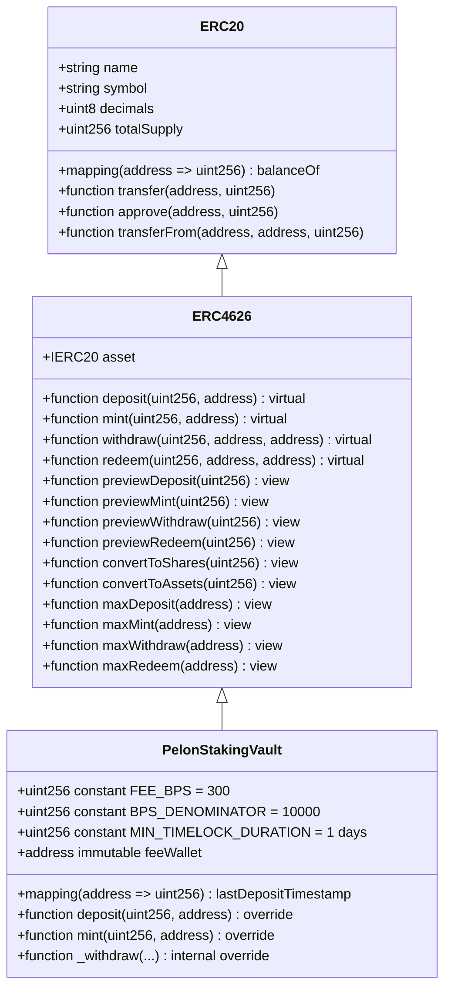
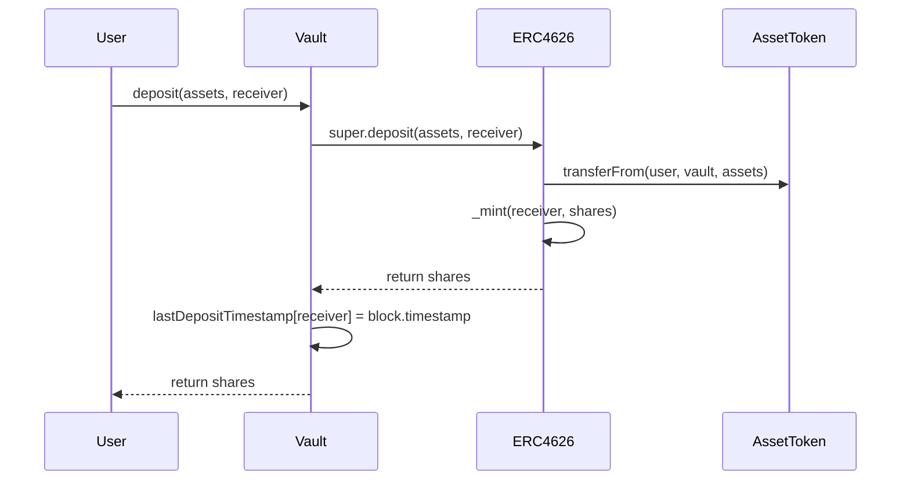
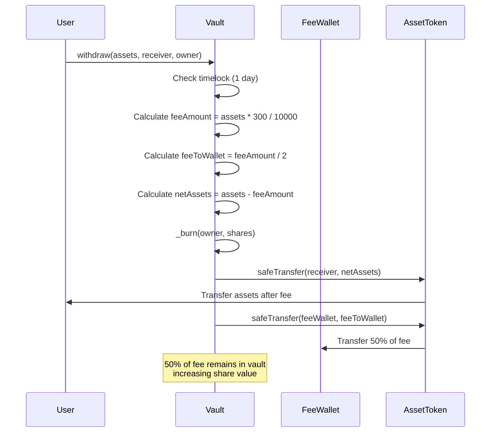
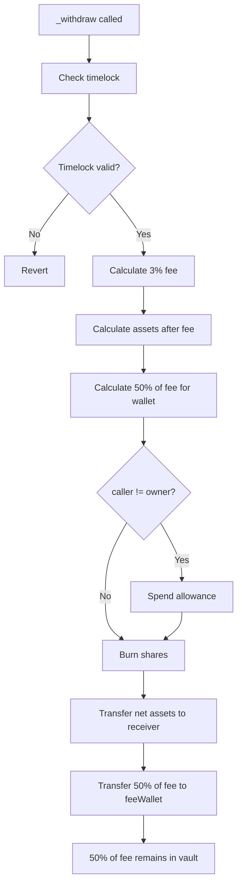

# PelonStakingVault Contract Technical Analysis

## Executive Summary

The `PelonStakingVault` contract implements an ERC4626-compliant tokenized vault for staking PELON tokens. It is a minimal, non-upgradeable implementation that extends OpenZeppelin's battle-tested implementation with a simple timelock mechanism and a fixed withdrawal fee system. The contract enables users to deposit PELON tokens and receive proportional vault shares (CALDERO) that represent their stake in the vault, while enforcing a fixed 1-day timelock period on withdrawals.

The architecture uses only the inheritance from OpenZeppelin's `ERC4626` contract for standard vault functionality. The contract maintains full compliance with the ERC4626 standard while adding custom restrictions in the `_withdraw()` function, applying timelock and withdrawal fees to all withdrawal and redemption operations to ensure consistency.

The timelock mechanism is simple and per-user: each time a user deposits, their last deposit timestamp is updated. When a user attempts to withdraw assets, the contract validates that at least 1 day has passed since their last deposit. This design prevents immediate withdrawals and reduces short-term volatility.

## Architecture and Contract Inheritance

The `PelonStakingVault` contract inherits only from OpenZeppelin's `ERC4626` contract. This inheritance structure provides a solid foundation for vault operations while maintaining a minimal implementation.



### Inheritance Order Analysis

The `ERC4626` contract itself inherits from `ERC20`, creating a two-level inheritance hierarchy:

1. **ERC20**: Provides the base token functionality for vault shares (CALDERO)
2. **ERC4626**: Extends ERC20 with vault-specific operations and share/asset conversion logic

The constructor explicitly invokes `ERC20("Pelon Vault: Caldero", "CALDERO")` to set the vault share token name and symbol, and `ERC4626(asset)` to initialize the vault with the underlying asset (PELON token).

**Design Features:**
- No administrative functions (fully decentralized)
- No owner control
- Immutable fee wallet (set once in constructor)
- Minimal implementation reduces attack surface

## ERC4626 Standard Compliance

The contract maintains full compliance with the ERC4626 standard (EIP-4626), which defines a standard interface for tokenized vaults. This compliance ensures interoperability with existing DeFi infrastructure, including aggregators, yield optimizers, and other protocols that interact with ERC4626 vaults.

### Standard Functions Preserved

All standard ERC4626 functions remain fully functional:

- **`deposit(uint256 assets, address receiver)`**: Deposits assets and mints shares, with additional update of last deposit timestamp
- **`mint(uint256 shares, address receiver)`**: Mints shares for assets, with additional update of last deposit timestamp
- **`withdraw(uint256 assets, address receiver, address owner)`**: Withdraws assets with timelock restrictions and fixed withdrawal fee (3%)
- **`redeem(uint256 shares, address receiver, address owner)`**: Redeems shares for assets with timelock restrictions and fixed withdrawal fee (3%)
- **`previewDeposit(uint256 assets)`**: Calculates shares for a given asset amount
- **`previewMint(uint256 shares)`**: Calculates assets required for a given share amount
- **`previewWithdraw(uint256 assets)`**: Calculates shares required for a given asset withdrawal
- **`previewRedeem(uint256 shares)`**: Calculates assets received for a given share redemption
- **`convertToShares(uint256 assets)`**: Converts assets to shares using current exchange rate
- **`convertToAssets(uint256 shares)`**: Converts shares to assets using current exchange rate

### Modified Behavior

The `_withdraw()` function has modified behavior:

- **Timelock Enforcement**: Assets can only be withdrawn if at least 1 day has passed since the user's last deposit
- **Withdrawal Fee**: A fixed 3% fee is deducted from withdrawn assets and distributed: 50% to fee wallet, 50% remains in vault (increases share value)

## Simple Timelock System

The timelock mechanism implements a simple per-user system where only the timestamp of the last deposit is tracked. This design ensures that users cannot withdraw immediately after depositing.

### Deposit Tracking Structure

Each user has a single timestamp that is updated on each deposit:

```solidity
mapping(address => uint256) public lastDepositTimestamp;
```

This mapping maintains the block timestamp when the user made their last deposit (through `deposit()` or `mint()`).

### Deposit Recording Mechanism

When a user deposits assets through `deposit()` or `mint()`, the contract:

1. Executes the standard ERC4626 deposit/mint logic via `super.deposit()` or `super.mint()`
2. Updates `lastDepositTimestamp[receiver]` with the current `block.timestamp`



### Timelock Validation

When a user attempts to withdraw assets, the contract validates timelock eligibility:

1. Gets the user's last deposit timestamp
2. Verifies that `block.timestamp >= lastDepositTimestamp[owner] + MIN_TIMELOCK_DURATION`
3. If validation fails, the transaction reverts with the message "PelonStakingVault: Timelock not expired"

```mermaid
flowchart TD
    A[User calls withdraw/redeem] --> B[Get lastDepositTimestamp[owner]]
    B --> C{block.timestamp >= timestamp + 1 day?}
    C -->|No| D[Revert: Timelock not expired]
    C -->|Yes| E[Proceed with withdrawal]
```

### Timelock Duration

The contract uses a fixed timelock of 1 day:

```solidity
uint256 public constant MIN_TIMELOCK_DURATION = 1 days; // 86400 seconds
```

**Timelock Characteristics:**
- Fixed duration: 1 day (86400 seconds)
- Not configurable (constant)
- Checked on every withdrawal/redeem operation
- Resets on each new deposit (updates the timestamp)

**Considerations:**
- The timelock resets every time the user deposits
- If a user deposits multiple times, only the timestamp of the last deposit counts
- The timelock prevents immediate withdrawals but allows withdrawals after 1 day

## Withdrawal Fee Mechanism

The contract implements a fixed 3% withdrawal fee that is deducted from withdrawn assets and distributed across two destinations: 50% to the immutable fee wallet and 50% remains in the vault (implicitly increases share value).

### Fee Calculation

The withdrawal fee is calculated using basis points (BPS) for precision:

```solidity
uint256 public constant FEE_BPS = 300; // 3%
uint256 public constant BPS_DENOMINATOR = 10000; // 100% in basis points
```

The fee calculation formula:
```solidity
uint256 feeAmount = (assets * FEE_BPS) / BPS_DENOMINATOR;
```

This approach ensures:
- Precise fee calculation without floating-point arithmetic
- No rounding errors in fee computation
- Fixed fee percentage (300 BPS = 3%)

### Fee Distribution (50/50)

The withdrawal fee is split into two components:

1. **50% to Fee Wallet**: Direct transfer to the immutable fee wallet address
2. **50% Remains in Vault**: The remainder of the fee stays in the vault contract
   - This increases `totalAssets()` while `totalSupply()` remains constant (or decreases if shares are burned)
   - Effectively increases the value per share for all existing holders
   - Provides a compounding reward mechanism that benefits all stakers

**Fee Distribution Calculation:**
```solidity
uint256 feeAmount = (assets * FEE_BPS) / BPS_DENOMINATOR;
uint256 netAssets = assets - feeAmount;
uint256 feeToWallet = feeAmount / 2; // 50%
// The other 50% remains in vault implicitly
```

### Benefits of Vault Retention Mechanism

The component that remains in the vault (50%) creates value for all vault participants:

- **Value Per Share Increase**: When assets are withdrawn with a fee, part of the fee remains in the vault without minting additional shares, which increases the exchange rate (`totalAssets / totalSupply`)
- **Compounding Effect**: All existing holders benefit from the increased value per share
- **Long-term Incentive**: Encourages long-term staking as the value per share grows over time
- **No Dilution**: Unlike traditional staking rewards that mint new tokens, this mechanism doesn't dilute existing holders

**Example:**
- Vault has 1,000,000 PELON assets and 1,000,000 CALDERO shares (1:1 ratio)
- User withdraws 10,000 PELON with 3% fee = 300 PELON total fee
- Fee distribution: 150 PELON to wallet, 150 PELON remains in vault
- New state: 1,000,150 PELON assets, 999,900 CALDERO shares
- New exchange rate: ~1.00025 PELON per share (0.025% increase for all holders)

### Fee Transfer Flow



### Fee Wallet Management

The fee wallet address is **immutable** and is set during contract construction:

```solidity
address public immutable feeWallet;
```

This design provides:
- Security: Cannot be changed after deployment (fully decentralized)
- Transparency: Address is set once and remains constant
- Simplicity: No administrative functions required

The initial fee wallet is set during contract construction and cannot be the zero address, ensuring fees are always sent to a valid recipient.

## State Variables and Constants

### Constants

**`FEE_BPS`**: `uint256 public constant`
- Value: `300` (representing 3%)
- Purpose: Fixed withdrawal fee percentage in basis points
- Immutability: Cannot be modified after deployment

**`BPS_DENOMINATOR`**: `uint256 public constant`
- Value: `10000` (representing 100%)
- Purpose: Denominator for basis points calculations
- Visibility: Public for transparency

**`MIN_TIMELOCK_DURATION`**: `uint256 public constant`
- Value: `1 days` (86,400 seconds)
- Purpose: Fixed timelock duration
- Immutability: Cannot be modified after deployment

### State Variables

**`feeWallet`**: `address public immutable`
- Purpose: Address that receives 50% of withdrawal fees
- Mutability: Immutable (set in constructor and cannot change)
- Initialization: Set in constructor, validated to be non-zero

**`lastDepositTimestamp`**: `mapping(address => uint256) public`
- Purpose: Tracks the timestamp of each user's last deposit
- Functionality: Updated every time a user deposits or mints shares
- Usage: Checked in withdrawal/redeem operations to validate timelock

## Core Functions Analysis

### Constructor

```solidity
constructor(IERC20 assetToken, address _feeWallet)
    ERC20("Pelon Vault: Caldero", "CALDERO")
    ERC4626(assetToken)
{
    require(address(assetToken) != address(0), "PelonStakingVault: Asset token cannot be zero address");
    require(_feeWallet != address(0), "PelonStakingVault: Fee wallet cannot be zero address");
    feeWallet = _feeWallet;
}
```

**Parameters:**
- `assetToken`: The underlying ERC20 token (PELON) that can be deposited into the vault
- `_feeWallet`: Address that will receive 50% of withdrawal fees

**Initialization Order:**
1. `ERC20` constructor sets vault share token name and symbol ("Pelon Vault: Caldero", "CALDERO")
2. `ERC4626` constructor initializes the vault with the underlying asset
3. Constructor parameter validation

**Validation:**
- Asset token must be non-zero address
- Fee wallet must be non-zero address to prevent fee loss

### deposit() Function

```solidity
function deposit(uint256 assets, address receiver) public override returns (uint256 shares) {
    shares = super.deposit(assets, receiver);
    lastDepositTimestamp[receiver] = block.timestamp;
    return shares;
}
```

**Functionality:**
1. Calls parent `ERC4626.deposit()` to execute standard deposit logic
2. Updates the last deposit timestamp for the receiver
3. Returns the shares minted to the receiver

**Key Points:**
- Maintains full ERC4626 standard behavior
- Adds timelock update without modifying core functionality
- Shares are minted to `receiver`, not `msg.sender` (allows deposits on behalf of others)

### mint() Function

```solidity
function mint(uint256 shares, address receiver) public override returns (uint256 assets) {
    assets = super.mint(shares, receiver);
    lastDepositTimestamp[receiver] = block.timestamp;
    return assets;
}
```

**Functionality:**
1. Calls parent `ERC4626.mint()` to execute standard mint logic
2. Updates the last deposit timestamp for the receiver
3. Returns the assets required to mint the specified shares

**Key Points:**
- Inverse operation of `deposit()` (specify shares, receive assets amount)
- Same timelock update mechanism as `deposit()`
- Useful when users want to acquire a specific number of shares

### _withdraw() Function (internal override)

```solidity
function _withdraw(
    address caller,
    address receiver,
    address owner,
    uint256 assets,
    uint256 shares
) internal override {
    require(
        block.timestamp >= lastDepositTimestamp[owner] + MIN_TIMELOCK_DURATION,
        "PelonStakingVault: Timelock not expired"
    );
    
    uint256 feeAmount = (assets * FEE_BPS) / BPS_DENOMINATOR;
    
    uint256 netAssets = assets - feeAmount;
    
    uint256 feeToWallet = feeAmount / 2;

    if (caller != owner) {
        _spendAllowance(owner, caller, shares);
    }

    _burn(owner, shares);

    IERC20(asset()).safeTransfer(receiver, netAssets);

    if (feeToWallet > 0) {
        IERC20(asset()).safeTransfer(feeWallet, feeToWallet);
    }
}
```

**Function Flow:**



**Key Features:**
- Timelock validation before processing
- Fee calculation and transfer
- 50% of fee implicitly remains in vault
- Support for approved withdrawals (third-party withdrawals)

**Security Considerations:**
- Timelock is checked first to prevent premature withdrawals
- Fee is calculated before transfers
- Allowance is spent before burning shares
- Uses `SafeERC20` for secure token transfers

## Events

The contract does not define custom events. It uses only the standard ERC4626 events:

- **`Deposit`**: Emitted when assets are deposited (inherited from ERC4626)
- **`Withdraw`**: Emitted when assets are withdrawn (inherited from ERC4626)

These standard events provide sufficient information for off-chain tracking and analytics.

## Security Considerations

### Protection Against Inflation Attacks

The contract inherits OpenZeppelin's ERC4626 implementation, which includes built-in protection against inflation attacks. The standard uses a "virtual shares" mechanism that prevents attackers from manipulating share prices by depositing minimal amounts before large deposits.

**How It Works:**
- ERC4626 uses `_convertToShares()` and `_convertToAssets()` with rounding protection
- First depositor receives shares based on a minimum virtual amount
- Subsequent deposits use actual asset balances for conversion

### Reentrancy Protection

The contract inherits reentrancy protections from OpenZeppelin's ERC4626 implementation. The `_withdraw()` function follows the Checks-Effects-Interactions (CEI) pattern:

1. **Checks**: Timelock validation
2. **Effects**: Share burning
3. **Interactions**: Token transfers (net assets and fee)

`SafeERC20` is used for all token transfers, which provides additional protection against non-standard token behaviors.

### Timelock Bypass Prevention

The simple timelock system prevents users from withdrawing immediately after depositing:

- Each deposit updates the user's timestamp
- Withdrawals verify that at least 1 day has passed since the last deposit
- There is no way to bypass this check

This design ensures that users cannot make immediate withdrawals, reducing short-term volatility.

### Fee Calculation Precision

The fee calculation uses integer arithmetic with basis points to avoid precision loss:

```solidity
uint256 feeAmount = (assets * FEE_BPS) / BPS_DENOMINATOR;
```

**Precision Analysis:**
- For 1,000,000 PELON (18 decimals): `(1000000 * 10^18 * 300) / 10000 = 30,000 * 10^18`
- No precision loss for typical token amounts
- Rounding always favors the protocol (downward for fee calculation)

### Access Control

The contract **has no** administrative functions:

- No owner control
- No `onlyOwner` functions
- Fee wallet is immutable
- All parameters are constants

This design provides:
- Maximum decentralization
- No risk of unauthorized changes
- Predictable and transparent behavior

## Gas Optimization

### Constant Usage

Constants are compiled into bytecode, providing gas savings:
- `FEE_BPS`: Read from bytecode (~3 gas) vs storage (~2,100 gas)
- `BPS_DENOMINATOR`: Same optimization
- `MIN_TIMELOCK_DURATION`: Same optimization

### Immutability

The fee wallet is `immutable`, which means:
- Stored in bytecode after deployment
- Read from bytecode instead of storage
- Significant gas savings

### View Functions

ERC4626 view functions are available for queries without gas cost:
- `convertToShares()` and `convertToAssets()` for conversions
- `previewDeposit()`, `previewMint()`, `previewWithdraw()`, `previewRedeem()` for estimations

## Usage Examples

### Example 1: Basic Deposit and Withdrawal

```solidity
// User deposits 1000 PELON tokens
uint256 assets = 1000 * 10**18; // 1000 PELON with 18 decimals
uint256 shares = vault.deposit(assets, msg.sender);

// After 1 day, user can withdraw
// (assuming no additional deposits were made)
vault.withdraw(assets, msg.sender, msg.sender);
// User receives: assets - (assets * 3 / 100) = 970 PELON
// Fee distribution (3% = 30 PELON total):
//   - Fee wallet: 15 PELON (50%)
//   - Remains in vault: 15 PELON (50%, increases share value)
```

### Example 2: Multiple Deposits

```solidity
// Day 0: Deposit 100 PELON
vault.deposit(100 * 10**18, msg.sender);
// lastDepositTimestamp[msg.sender] = block.timestamp (Day 0)

// Day 0.5: Deposit 200 PELON
vault.deposit(200 * 10**18, msg.sender);
// lastDepositTimestamp[msg.sender] = block.timestamp (Day 0.5) - RESETS

// Day 1.5: Can withdraw (1 day since last deposit on Day 0.5)
vault.withdraw(200 * 10**18, msg.sender, msg.sender);
// User receives: 194 PELON (after 3% fee)
```

**Important Note:** The timelock resets on each deposit. If a user deposits multiple times, only the time since the last deposit counts.

### Example 3: Using redeem() to Redeem Shares

```solidity
// User has shares and wants to redeem them for assets
uint256 shares = 1000 * 10**18; // 1000 shares

// Verify that timelock has passed (1 day since last deposit)
// If timelock has not expired, transaction will revert

// redeem() applies timelock and 3% fee
uint256 assets = vault.redeem(shares, msg.sender, msg.sender);
// User receives assets after applying 3% fee
```

**Note:** `redeem()` also applies the same timelock and fee restrictions as `withdraw()`, ensuring consistency in vault behavior.

## Deployment Considerations

### Base Mainnet Deployment

**Network Specifications:**
- Chain ID: 8453
- Block Time: ~2 seconds
- Gas Price: Variable (check current network conditions)

**Deployment Steps:**
1. Deploy PELON token contract (if not already deployed)
2. Deploy PelonStakingVault with PELON token address and fee wallet address
3. Verify contract on Basescan
4. Initialize vault with initial liquidity if needed

**Constructor Parameters:**
- `assetToken`: Address of PELON token contract
- `_feeWallet`: Address that will receive withdrawal fees (must be non-zero, immutable)

### Base Sepolia Testnet Deployment

**Network Specifications:**
- Chain ID: 84532
- Block Time: ~2 seconds
- Purpose: Testing and development

**Testing Considerations:**
- Use test PELON tokens or mocks
- Test timelock with different scenarios
- Verify fee collection and distribution
- Test behavior with multiple deposits

### Initial Configuration

**Fee Wallet Selection:**
- Choose a secure, non-custodial wallet for fee collection
- Consider multi-sig for additional security
- Document fee wallet address for transparency
- **IMPORTANT**: Address cannot be changed after deployment (immutable)

**Vault Initialization:**
- No initial deposit required (vault can start empty)
- First depositor receives shares based on ERC4626 virtual shares mechanism
- Consider seeding vault with initial liquidity for better UX

## Conclusion

The `PelonStakingVault` contract provides a secure, ERC4626-compliant staking mechanism with simple but effective timelock and fee features. The design maintains full standard compliance while adding custom restrictions that protect the protocol and generate revenue through withdrawal fees.

Key strengths of the implementation:
- Full ERC4626 standard compliance for interoperability
- Fixed timelock system (1 day) preventing immediate withdrawals
- Fixed fee system (3%) with transparent fee distribution (50/50)
- Vault retention mechanism that increases value per share for all holders
- Minimal implementation reduces attack surface
- Fully decentralized (no administrative functions)
- Battle-tested OpenZeppelin base contracts
- Immutable fee wallet for maximum security

The contract is production-ready for deployment on Base Mainnet and Base Sepolia, with careful consideration given to network-specific characteristics such as block time and timestamp precision.

---

**Last Updated:** December 2024  
**Design System Version:** 1.0.0  
**Active Theme:** Minimalist and Decentralized  
**Author:** baeza.eth (King Of The Pelones)
