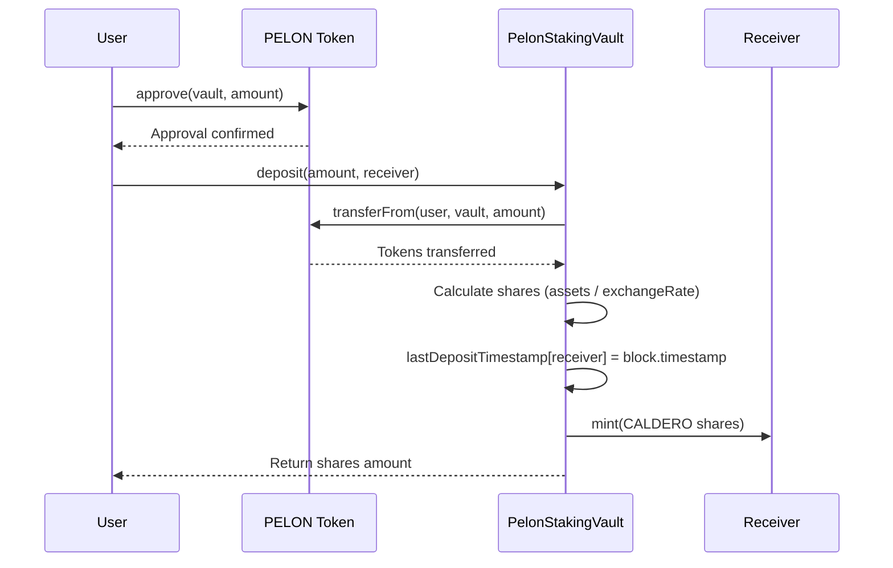
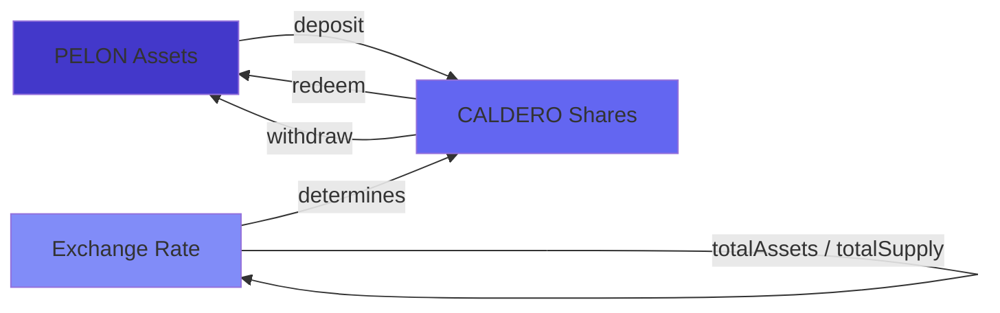
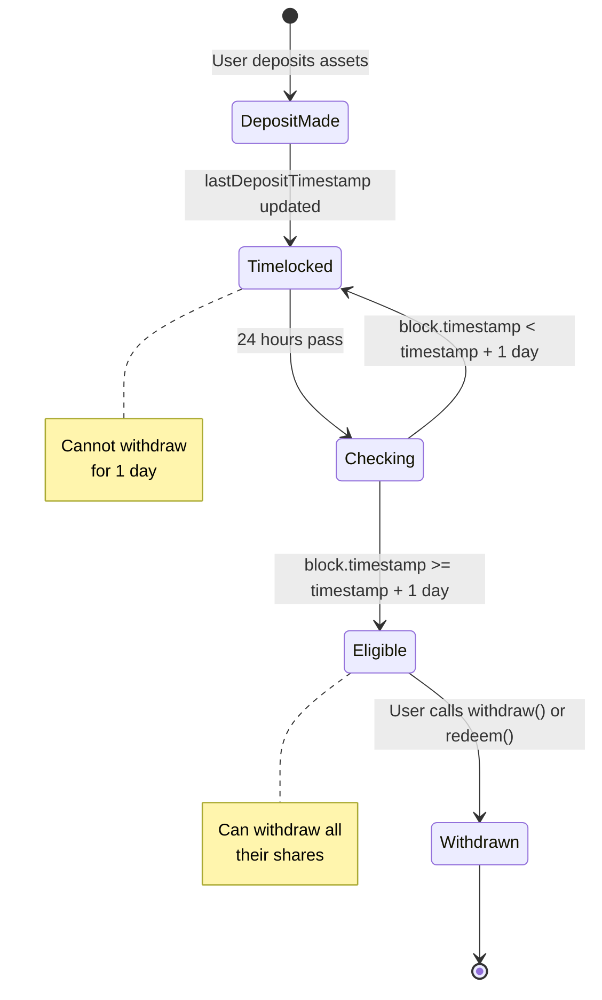
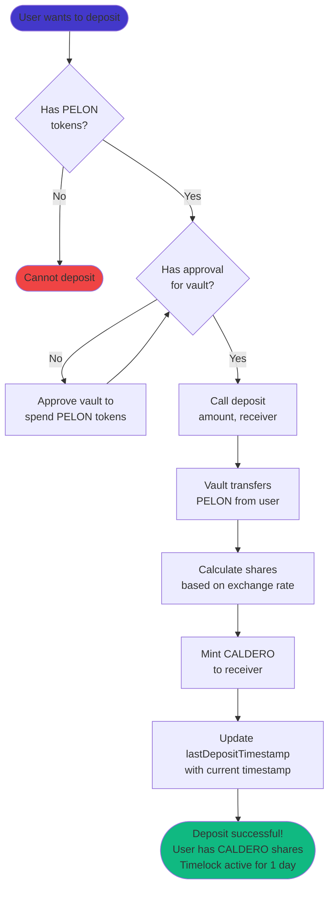
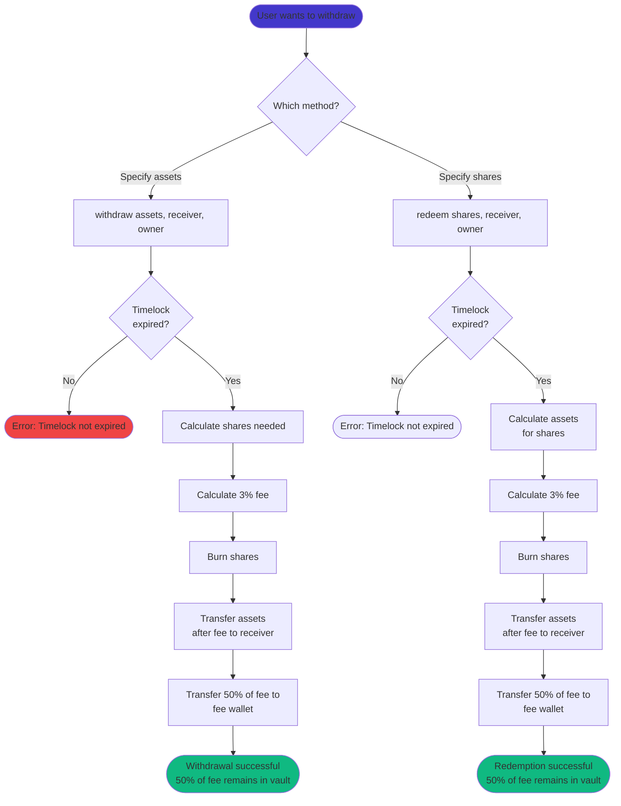

# PelonStakingVault User Guide

## Introduction

The PelonStakingVault is an ERC4626-compliant tokenized vault that allows you to stake your PELON tokens. When you deposit PELON tokens into the vault, you receive vault shares (CALDERO) that represent your proportional ownership of the vault's assets. This guide explains how the vault works, how to interact with it, and what to expect when staking your tokens.

### What is an ERC4626 Vault?

ERC4626 is a standard interface for tokenized vaults in DeFi. Think of it like a mutual fund: you deposit assets (PELON tokens), and you receive shares (CALDERO) that represent your portion of the fund. The key advantage is that these shares are themselves ERC20 tokens, meaning you can transfer them, trade them, or use them in other DeFi protocols.

The vault maintains a ratio between assets and shares. Initially, this ratio is 1:1 (1 PELON = 1 CALDERO), but it can change based on the vault's total assets and total shares. The ERC4626 standard provides built-in functions to convert between assets and shares accurately.

### Why Use PelonStakingVault?

The PelonStakingVault implements two key mechanisms:

1. **Fixed 1-Day Timelock**: Each deposit locks the assets for a fixed period of 1 day before they can be withdrawn. The timelock resets every time you make a new deposit, counting from the last deposit.

2. **Fixed 3% Withdrawal Fee**: When you withdraw assets using the `withdraw()` or `redeem()` functions, a fixed 3% fee is automatically deducted and distributed: 50% to fee wallet, 50% remains in the vault (increases share value for all holders).

These mechanisms encourage short-term staking by ensuring that all withdrawals are subject to the same timelock and fee restrictions. The component that remains in the vault provides additional value to all vault participants by increasing the value per share.

### Core Concepts

**Assets**: PELON tokens that you deposit into the vault. These are the underlying tokens.

**Shares**: CALDERO tokens that represent your ownership in the vault. You receive these when you deposit assets.

**Exchange Rate**: The ratio between assets and shares. Calculated as `totalAssets / totalSupply`. When the vault is empty, the rate is 1:1. As assets are added or removed, the rate adjusts.

**Timelock**: A fixed period of 1 day during which deposited assets cannot be withdrawn using `withdraw()` or `redeem()`. The timelock applies per user and resets on each new deposit.

## Vault Mechanics

### How Deposits Work

When you deposit PELON tokens into the vault, the following happens:

1. You approve the vault contract to spend your PELON tokens (one-time or per-transaction).
2. You call `deposit(amount, receiver)` specifying how many PELON tokens to deposit and who should receive the shares.
3. The vault transfers your PELON tokens from your wallet to the vault contract.
4. The vault calculates how many shares you should receive based on the current exchange rate.
5. The vault mints CALDERO shares to your specified receiver address.
6. The vault updates the receiver's last deposit timestamp.

The number of shares you receive depends on the current exchange rate. If you're the first depositor, you'll receive shares at a 1:1 ratio. If others have already deposited, the rate may differ slightly due to rounding or if the vault has accumulated assets.



### Share Calculation

The vault uses ERC4626's standard share calculation mechanism. When you deposit assets, the vault calculates shares using:

```
shares = assets * totalSupply / totalAssets
```

If the vault is empty (totalSupply = 0), the first deposit uses a simplified calculation that ensures you receive shares equal to your assets (1:1 ratio), minus any rounding.

For subsequent deposits, the formula ensures that you receive a proportional share of the vault based on the current total assets. This protects against inflation attacks where someone could manipulate the vault's value.

### Converting Between Assets and Shares

The vault provides several view functions to help you understand the relationship between assets and shares:

- `convertToAssets(shares)`: Returns how many PELON tokens a given amount of shares represents
- `convertToShares(assets)`: Returns how many shares a given amount of PELON tokens would receive
- `previewDeposit(assets)`: Shows how many shares you'd receive for a deposit
- `previewWithdraw(assets)`: Shows how many shares would be burned for a withdrawal (before fee, per ERC4626 standard)
- `previewRedeem(shares)`: Shows how many assets you'd receive for redeeming shares (before fee, per ERC4626 standard)

**Important:** The standard ERC4626 preview functions (`previewWithdraw` and `previewRedeem`) show amounts before fees, as per the standard. To calculate how much you'll receive after the 3% fee, you can calculate manually: `assets - (assets * 3 / 100)`.

These functions are view-only and don't require gas. Use them to plan your transactions before executing them.



## Simple Timelock System

### Understanding the Fixed Timelock

Each user has a single timestamp that is updated every time they deposit. When you deposit, the vault updates your last deposit timestamp with the current moment. Assets can only be withdrawn if at least 1 day has passed since your last deposit.

**Timelock Characteristics:**
- **Fixed duration**: 1 day (86400 seconds)
- **Not configurable**: It's a contract constant
- **Resets on each deposit**: Every time you deposit, the timelock resets counting from that moment
- **Applies to all your shares**: No matter how many times you deposit, the timelock applies to all your shares based on your last deposit

### How the Timelock Works

The timelock works simply:

1. When you make a deposit (or mint), the vault updates your `lastDepositTimestamp` with the current `block.timestamp`.
2. When you attempt to withdraw (using `withdraw()` or `redeem()`), the vault verifies that `block.timestamp >= lastDepositTimestamp + 1 day`.
3. If the timelock hasn't expired, the transaction reverts with the message "PelonStakingVault: Timelock not expired".

This design prevents immediate withdrawals and reduces short-term volatility.



### Example: Multiple Deposits

Understanding timelock behavior with multiple deposits is important:

**Scenario:**
- **Day 0**: Deposit 1000 PELON → Receive 1000 CALDERO
  - `lastDepositTimestamp[yourAddress] = Day 0`
- **Day 0.5**: Deposit 500 PELON → Receive 500 CALDERO
  - `lastDepositTimestamp[yourAddress] = Day 0.5` (resets!)
- **Day 1**: Attempt to withdraw
  - Check: `Day 1 >= Day 0.5 + 1 day?` → `Day 1 >= Day 1.5?` → **NO**
  - Transaction **reverts** (only 0.5 days have passed since last deposit)
- **Day 1.5**: Can withdraw
  - Check: `Day 1.5 >= Day 0.5 + 1 day?` → `Day 1.5 >= Day 1.5?` → **YES**
  - You can withdraw **all** your shares (1500 CALDERO), not just from the last deposit

**Important Point:** The timelock resets every time you deposit. This means if you deposit frequently, you'll always need to wait 1 day from your last deposit to withdraw, even if some of your earlier deposits are more than 1 day old.

### Why Does the Timelock Reset?

The simple per-user timelock with reset on each deposit:
- Prevents immediate withdrawals after depositing
- Reduces short-term volatility
- Simplifies contract implementation
- Ensures there's always at least 1 day between deposit and withdrawal

## Withdrawal Fee System

### The Fixed Fee

When you withdraw assets using the `withdraw()` or `redeem()` functions, a fixed 3% fee is automatically deducted from the withdrawal amount. This fee is calculated as:

```
fee = assets * 300 / 10000
```

Where 300 represents 3% in basis points. The fee is deducted before the assets are transferred to you.

### Fee Distribution (50/50)

The withdrawal fee is distributed across two destinations:

1. **50% to Fee Wallet**: Direct transfer to the immutable fee wallet address (set when deploying the contract)

2. **50% Remains in Vault**: The remainder of the fee stays in the vault contract
   - This increases the value per share for all existing holders
   - Provides a compounding reward mechanism that benefits all stakers
   - Your shares become more valuable even if you don't withdraw

### Fee Calculation Example

If you withdraw 1000 PELON tokens with a 3% fee:

```
Total Fee = 1000 * 300 / 10000 = 30 PELON
Assets received = 1000 - 30 = 970 PELON

Fee Distribution:
- Fee wallet: 15 PELON (50%)
- Remains in vault: 15 PELON (50%, increases share value)
```

You receive 970 PELON, and the 30 PELON fee is distributed as shown above.

### Benefits of Vault Retention

The component that remains in the vault (50%) creates value for all vault participants:

- **Value Per Share Increase**: When assets are withdrawn with a fee, part of the fee remains in the vault without minting additional shares, which increases the exchange rate
- **All Holders Benefit**: Every existing holder's shares become more valuable
- **Compounding Effect**: The longer you stake, the more you benefit from fees others pay
- **No Dilution**: Unlike traditional rewards that mint new tokens, this doesn't dilute existing holders

**Example:**
- Vault has 1,000,000 PELON and 1,000,000 shares (1:1 ratio)
- Someone withdraws 10,000 PELON with 3% fee = 300 PELON total fee
- 150 PELON remains in vault (without minting new shares)
- New state: 1,000,150 PELON, 999,900 shares
- New exchange rate: 1.00025 PELON per share (0.025% increase for all!)

### Fee Configuration

The withdrawal fee percentage is **fixed** at 3% and cannot be changed. This provides:
- Complete transparency (everyone knows exactly how much is charged)
- Predictable behavior
- Maximum decentralization (no administrative functions)

### Fee and Timelock Interaction

Both `withdraw()` and `redeem()` are subject to the same timelock and fee restrictions:

- **Use `withdraw()`**: Subject to 1-day timelock and 3% fee. You specify the exact amount of assets you want to withdraw.
- **Use `redeem()`**: Subject to 1-day timelock and 3% fee. You specify the amount of shares you want to redeem.

Both functions have the same behavior in terms of restrictions and fees. The main difference is that `withdraw()` works with assets (PELON tokens) while `redeem()` works with shares (CALDERO).

## User Operations

### Making a Deposit

**Step 1: Approve the Vault**

Before depositing, you must approve the vault contract to spend your PELON tokens. This is a standard ERC20 approval:

```solidity
pelonToken.approve(vaultAddress, amount);
```

You can approve a specific amount for a single deposit, or approve a larger amount (or `type(uint256).max` for unlimited) if you plan to make multiple deposits.

**Step 2: Call deposit()**

Once approved, call the vault's `deposit()` function:

```solidity
vault.deposit(amount, receiver);
```

Where:
- `amount`: The number of PELON tokens to deposit (in wei, accounting for 18 decimals)
- `receiver`: The address that will receive the CALDERO shares (usually your own address)

The function returns the number of shares you received. You can also check your CALDERO balance after the transaction to verify.

**Step 3: Verify Your Deposit**

After depositing, you can verify:
- Your CALDERO balance (should equal the shares returned)
- Your last deposit timestamp: `lastDepositTimestamp(yourAddress)` returns the timestamp of your last deposit



### Checking Your Shares

Your CALDERO shares are ERC20 tokens, so you can check your balance using the standard ERC20 `balanceOf()` function:

```solidity
caldero.balanceOf(yourAddress)
```

You can also use the vault's `balanceOf()` function directly, since CALDERO is the vault's share token.

### Checking Timelock

Before withdrawing, you can check if your timelock has expired by querying directly:

```solidity
uint256 lastDeposit = vault.lastDepositTimestamp(yourAddress);
uint256 currentTime = block.timestamp;
bool canWithdraw = currentTime >= lastDeposit + 1 days;
```

Or simply attempt to withdraw and see if the transaction reverts (if the timelock hasn't expired, it will revert with the message "PelonStakingVault: Timelock not expired").

### Withdrawing Assets

You have two options for withdrawing:

#### Option 1: withdraw() - Asset-Based Withdrawal

This function lets you specify exactly how many PELON tokens you want to withdraw:

```solidity
vault.withdraw(assets, receiver, owner);
```

Where:
- `assets`: The number of PELON tokens you want to withdraw
- `receiver`: Address that will receive the PELON tokens
- `owner`: Address that owns the shares (usually your address, or use `msg.sender`)

**Important**: This function:
- Is subject to the 1-day timelock (must have passed since your last deposit)
- Charges a 3% withdrawal fee
- Calculates and burns the required shares automatically

#### Option 2: redeem() - Share-Based Withdrawal

This function lets you specify how many shares to redeem:

```solidity
vault.redeem(shares, receiver, owner);
```

Where:
- `shares`: The number of CALDERO shares to redeem
- `receiver`: Address that will receive the PELON tokens
- `owner`: Address that owns the shares

**Important**: This function:
- Is subject to the 1-day timelock (must have passed since your last deposit)
- Charges a 3% withdrawal fee
- Calculates and transfers the corresponding assets for the redeemed shares



### When to Use Each Method

**Use `withdraw()` when:**
- You know exactly how many PELON tokens you need
- Your timelock has expired (1 day since your last deposit)
- You're okay with paying the 3% fee
- You want to withdraw specific asset amounts

**Use `redeem()` when:**
- You know exactly how many shares you want to redeem
- Your timelock has expired (1 day since your last deposit)
- You're okay with paying the 3% fee
- You're working with share amounts rather than asset amounts

## Practical Use Cases

### Case 1: Simple Deposit and Withdrawal

**Scenario**: Alice deposits 10,000 PELON tokens and waits 1 day before withdrawing.

**Day 0 - Deposit:**
- Alice approves the vault for 10,000 PELON
- Alice calls `deposit(10000 * 10^18, aliceAddress)`
- Vault transfers 10,000 PELON from Alice
- Vault mints 10,000 CALDERO to Alice (assuming 1:1 ratio)
- `lastDepositTimestamp[aliceAddress] = Day 0`

**Day 0 - Verification:**
- Alice's CALDERO balance: 10,000
- Timelock: Not expired (needs 1 day)

**Day 1.1 - Withdrawal:**
- Timelock expired (1.1 > 1 day)
- Alice calls `withdraw(10000 * 10^18, aliceAddress, aliceAddress)`
- Fee calculation: 10,000 * 300 / 10,000 = 300 PELON total fee
- Fee distribution:
  - Fee wallet: 150 PELON (50%)
  - Remains in vault: 150 PELON (50%, increases share value for all)
- Alice receives: 10,000 - 300 = 9,700 PELON
- Alice's CALDERO balance: 0

**Result**: Alice staked for 1.1 days, received 9,700 PELON back (97% of original), paid 300 PELON fee (3%). The 150 PELON that remains in the vault increases the value per share for all remaining vault participants.

### Case 2: Multiple Deposits and Timelock Reset

**Scenario**: Bob makes two deposits at different times and wants to understand when he can withdraw.

**Timeline:**
- **Day 0**: Bob deposits 5,000 PELON → Receives 5,000 CALDERO
  - `lastDepositTimestamp[bob] = Day 0`
- **Day 0.5**: Bob deposits 3,000 PELON → Receives 3,000 CALDERO
  - `lastDepositTimestamp[bob] = Day 0.5` (resets!)

**Day 1 - Attempt to Withdraw:**
- Timelock: `Day 1 >= Day 0.5 + 1 day?` → `Day 1 >= Day 1.5?` → **NO**
- Bob attempts: `withdraw(5000 * 10^18, bob, bob)`
- **Result**: Transaction reverts with "PelonStakingVault: Timelock not expired"

**Day 1.5 - Successful Withdrawal:**
- Timelock: `Day 1.5 >= Day 0.5 + 1 day?` → `Day 1.5 >= Day 1.5?` → **YES**
- Bob can withdraw all his shares (8,000 CALDERO)
- Bob calls `withdraw(8000 * 10^18, bob, bob)`
- Bob receives: 8,000 - 240 = 7,760 PELON (after 3% fee)

**Lesson**: The timelock resets on each deposit. If you deposit frequently, you'll always need to wait 1 day from your last deposit.

### Case 3: Attempting Early Withdrawal

**Scenario**: Charlie deposits 1,000 PELON on Day 0 and tries to withdraw on Day 0.5.

**Day 0:**
- Charlie deposits 1,000 PELON → Receives 1,000 CALDERO
- `lastDepositTimestamp[charlie] = Day 0`

**Day 0.5:**
- Timelock: 0.5 days (needs 1 day)
- Charlie attempts: `withdraw(1000 * 10^18, charlieAddress, charlieAddress)`

**Result**: Transaction reverts with error:
```
"PelonStakingVault: Timelock not expired"
```

**Solution**: Charlie must wait until the timelock expires (1 day from deposit). Once the timelock has expired, he can use both `withdraw()` and `redeem()`, both subject to the 3% withdrawal fee.

### Case 4: Partial Withdrawal

**Scenario**: Diana deposits 20,000 PELON and later wants to withdraw only 5,000 PELON.

**Day 0:**
- Diana deposits 20,000 PELON → Receives 20,000 CALDERO
- `lastDepositTimestamp[diana] = Day 0`

**Day 1.5 (timelock expired):**
- Diana wants to withdraw 5,000 PELON
- Diana calls `withdraw(5000 * 10^18, dianaAddress, dianaAddress)`

**Calculation:**
- Shares needed: Calculated by vault based on current exchange rate
- Total fee: 5,000 * 300 / 10,000 = 150 PELON (3% fee)
- Fee distribution:
  - Fee wallet: 75 PELON (50%)
  - Remains in vault: 75 PELON (50%, increases share value)
- Diana receives: 5,000 - 150 = 4,850 PELON
- Diana's remaining CALDERO: ~15,000 (exact amount depends on shares burned)

**Result**: Diana still has ~15,000 CALDERO staked and can withdraw more later, or make additional deposits that will reset her timelock.

### Case 5: withdraw() vs redeem() Comparison

**Scenario**: Eve has 10,000 CALDERO from a deposit made 1.5 days ago. She wants to get her PELON tokens back.

**Using withdraw():**
```solidity
vault.withdraw(10000 * 10^18, eveAddress, eveAddress);
```
- Specifies: 10,000 PELON tokens desired
- Timelock: ✅ Passed (1.5 > 1 day)
- Fee: 3% = 300 PELON
- Fee distribution: 150 to wallet, 150 remains in vault
- Receives: 9,700 PELON
- Shares burned: Calculated automatically (~10,000 if 1:1 rate)

**Using redeem():**
```solidity
vault.redeem(10000 * 10^18, eveAddress, eveAddress);
```
- Specifies: 10,000 CALDERO shares to redeem
- Timelock: ✅ Passed (1.5 > 1 day)
- Fee: 3% = ~300 PELON (calculated on assets received)
- Assets calculated: ~10,000 PELON (based on exchange rate)
- Fee distribution: ~150 to wallet, ~150 remains in vault
- Receives: ~9,700 PELON (after fee)
- Shares burned: 10,000 (exactly as specified)

**Comparison Table:**

| Aspect | withdraw() | redeem() |
|--------|-----------|----------|
| Specify | Asset amount | Share amount |
| Timelock | Required (fixed 1 day) | Required (fixed 1 day) |
| Fee | Fixed 3% | Fixed 3% |
| Receives (10k example) | 9,700 PELON (after 3% fee) | ~9,700 PELON (after 3% fee) |
| Use case | Know asset amount needed | Know share amount to redeem |

**Recommendation**: Both functions have the same timelock and fee restrictions. Use `withdraw()` when you know the exact amount of assets you need, and `redeem()` when you know the exact amount of shares you want to redeem.

## Frequently Asked Questions

### Do I need to approve tokens before depositing?

Yes. The vault contract needs permission to transfer your PELON tokens. You must call `approve(vaultAddress, amount)` on the PELON token contract before calling `deposit()`. This is a standard ERC20 requirement.

You can approve a specific amount for a single transaction, or approve a larger amount (or unlimited with `type(uint256).max`) if you plan to make multiple deposits.

### Can I transfer my CALDERO shares?

Yes. CALDERO is a standard ERC20 token, so you can transfer it like any other token. When you transfer CALDERO to another address, that address becomes the owner of those shares and can redeem or withdraw them (subject to timelock if using `withdraw()`).

However, note that the timelock is tied to the user's address. If you transfer shares to someone else, the timelock check is still based on the original owner's `lastDepositTimestamp`.

### What happens if I try to withdraw before the timelock expires?

If you call `withdraw()` or `redeem()` before 1 day has passed since your last deposit, the transaction will revert with an error message indicating that the timelock has not expired. You must wait for the timelock to expire before you can withdraw your assets.

### How is the value of my shares calculated?

The value of your shares is determined by the vault's exchange rate:

```
shareValue = shares * totalAssets / totalSupply
```

Where:
- `totalAssets`: Total PELON tokens in the vault
- `totalSupply`: Total CALDERO shares in circulation

Initially, when the vault is empty, the rate is 1:1. As assets are added or removed, the rate adjusts. The ERC4626 standard ensures this calculation is accurate and protects against manipulation.

You can check the current value of your shares using:
- `convertToAssets(yourShares)`: Returns the PELON equivalent of your shares
- `previewRedeem(yourShares)`: Shows how many PELON you'd receive for redeeming (before fee)

### Are there deposit or withdrawal limits?

No. The vault does not impose limits on:
- How much you can deposit
- How many deposits you can make
- How much you can withdraw (as long as timelock is satisfied)

The only constraints are:
- You must have sufficient PELON tokens to deposit
- You must have sufficient shares to withdraw/redeem
- `withdraw()` requires that 1 day has passed since your last deposit

### How do I know when I can withdraw?

You can check your last deposit timestamp directly:

```solidity
uint256 lastDeposit = vault.lastDepositTimestamp(yourAddress);
uint256 currentTime = block.timestamp;
bool canWithdraw = currentTime >= lastDeposit + 1 days;
```

Or simply attempt to withdraw and see if the transaction reverts. If the timelock hasn't expired, the transaction will revert with the message "PelonStakingVault: Timelock not expired".

### What if the vault has no assets?

If the vault is empty (no one has deposited), the first depositor will receive shares at a 1:1 ratio. The ERC4626 standard handles this edge case to prevent division by zero and ensure fair share distribution.

### Can I use CALDERO in other DeFi protocols?

Yes. Since CALDERO is a standard ERC20 token, you can use it in any protocol that accepts ERC20 tokens. However, keep in mind that:
- The timelock applies to `withdraw()` and `redeem()` operations, not to the shares themselves
- Other protocols won't know about the timelock mechanism
- To withdraw your assets from the vault, you must wait for the timelock to expire

### What happens to the withdrawal fees?

The fixed 3% withdrawal fee is distributed across two destinations:
1. **50% to Fee Wallet**: Sent to an immutable fee wallet address (set when deploying the contract)
2. **50% Remains in Vault**: Stays in the vault contract, increasing the value per share for all holders

The fee wallet is **immutable** and cannot be changed after deployment. The fee percentage is also **fixed** at 3% and cannot be changed.

Fees are collected on both `withdraw()` and `redeem()` operations.

## Technical Considerations

### Gas Costs

Estimated gas costs for common operations (approximate, varies by network conditions):

- **Approve**: ~46,000 gas (one-time, or per transaction if not using unlimited approval)
- **Deposit**: ~120,000 - 150,000 gas (includes token transfer, share minting, timestamp update)
- **Withdraw**: ~150,000 - 180,000 gas (includes timelock check, fee calculation, share burning, transfers)
- **Redeem**: ~150,000 - 180,000 gas (includes timelock check, fee calculation, share burning, transfers)
- **View functions** (convertToAssets, previewDeposit, etc.): 0 gas (view-only)

These estimates assume standard conditions. Gas costs may vary based on:
- Network congestion
- Current exchange rate calculations

### Best Practices

1. **Check before you transact**: Use view functions (`convertToAssets`, `previewDeposit`, etc.) to verify amounts before executing transactions.

2. **Approve wisely**: Consider approving a larger amount or unlimited if you plan multiple deposits, but be aware of security implications.

3. **Understand timelock**: The timelock resets on each deposit. If you deposit frequently, you'll always need to wait 1 day from your last deposit to withdraw.

4. **Choose the right method**: Use `withdraw()` when you need specific asset amounts. Use `redeem()` when you know the exact amount of shares you want to redeem. Both functions have the same timelock and fee restrictions.

5. **Monitor your shares**: Your CALDERO balance represents your stake. Keep track of it separately from your PELON balance.

6. **Calculate fees manually**: Standard preview functions show amounts before fees. To calculate how much you'll receive after the 3% fee, calculate: `assets - (assets * 3 / 100)`.

### Security Considerations

The PelonStakingVault uses OpenZeppelin's battle-tested contracts:
- **ERC4626**: Standard implementation with inflation attack protection
- **SafeERC20**: Safe token transfer handling

Key security features:
- Reentrancy protection (inherited from ERC4626)
- Safe math operations
- Input validation
- Timelock enforcement prevents premature withdrawals
- Immutable fee wallet (cannot be changed)

Always:
- Verify contract addresses before interacting
- Double-check transaction parameters
- Start with small test amounts
- Review transaction details before confirming

### Getting Help

If you encounter issues or have questions:
- Check this guide first
- Review the technical documentation: [PelonStakingVault Contract Technical Analysis](./pelon-staking-vault.md)
- Contact the team through official channels:
  - Website: https://pelon.club
  - Email: carlos@pelon.club
  - Twitter: https://x.com/PelonClub
  - Telegram: https://t.me/PelonClub

---

**Last Updated**: December 2024  
**Contract Version**: PelonStakingVault v1.0  
**Network**: Base Mainnet / Base Sepolia Testnet

**Key Features:**
- Fixed timelock (1 day)
- Fixed withdrawal fee (3%)
- Fee distribution: 50% wallet, 50% remains in vault (increases share value)
- Fully decentralized (no administrative functions)
