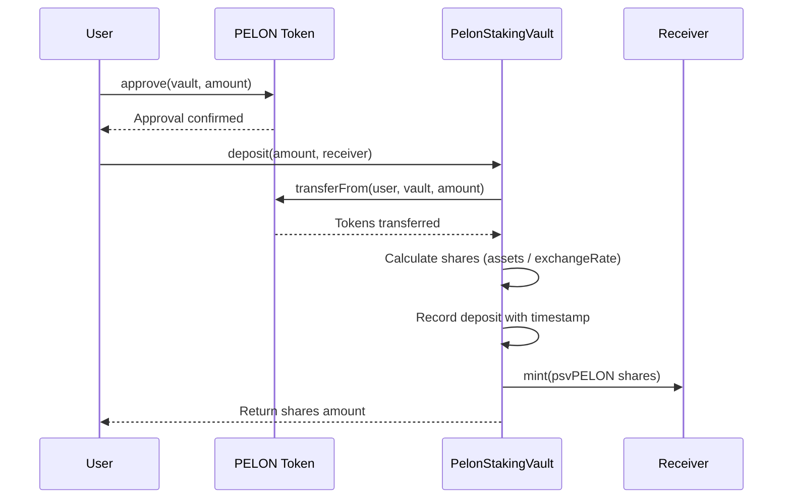
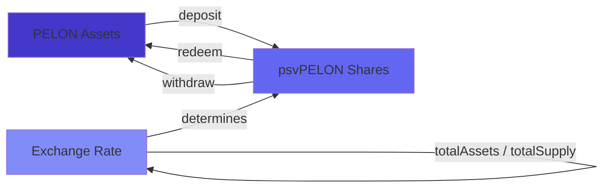
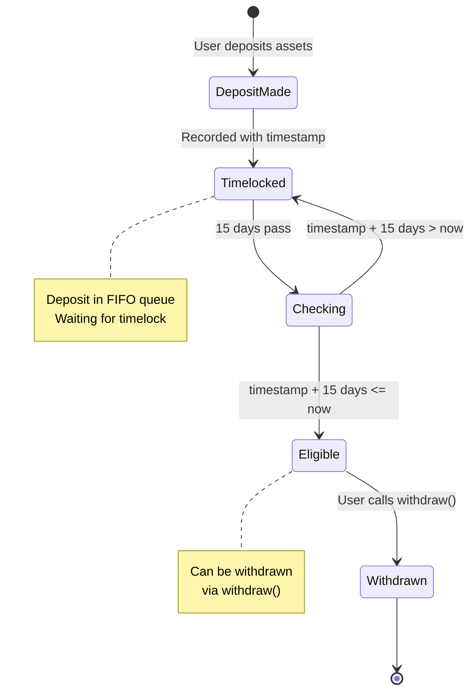
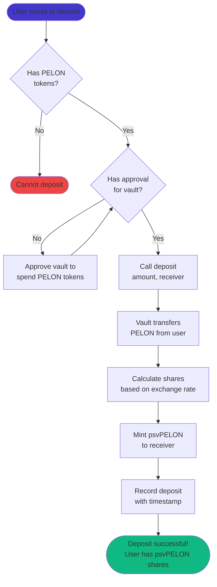
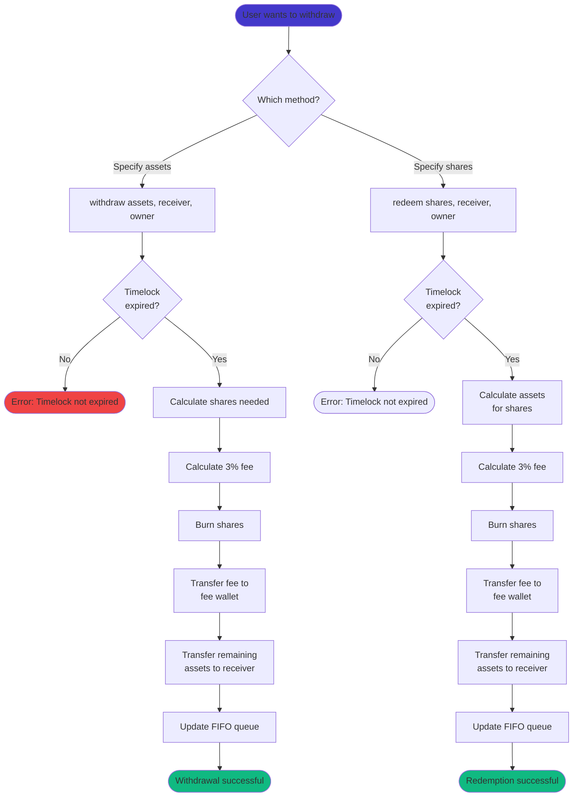

# PelonStakingVault User Guide

## Introduction

The PelonStakingVault is an ERC4626-compliant tokenized vault that allows you to stake your PELON tokens. When you deposit PELON tokens into the vault, you receive vault shares (psvPELON) that represent your proportional ownership of the vault's assets. This guide explains how the vault works, how to interact with it, and what to expect when staking your tokens.

### What is an ERC4626 Vault?

ERC4626 is a standard interface for tokenized vaults in DeFi. Think of it like a mutual fund: you deposit assets (PELON tokens), and you receive shares (psvPELON) that represent your portion of the fund. The key advantage is that these shares are themselves ERC20 tokens, meaning you can transfer them, trade them, or use them in other DeFi protocols.

The vault maintains a ratio between assets and shares. Initially, this ratio is 1:1 (1 PELON = 1 psvPELON), but it can change based on the vault's total assets and total shares. The ERC4626 standard provides built-in functions to convert between assets and shares accurately.

### Why Use PelonStakingVault?

The PelonStakingVault implements two key mechanisms:

1. **Configurable Timelock (FIFO)**: Each deposit is locked for a configurable period (default 15 days, range 1-90 days) before it can be withdrawn. The system uses a First-In-First-Out (FIFO) queue, meaning your oldest deposits become available for withdrawal first. The timelock duration can be adjusted by the contract owner.

2. **Configurable Withdrawal Fee**: When you withdraw assets using the `withdraw()` or `redeem()` functions, a configurable fee (default 3%, maximum 10%) is deducted and distributed: 50% to fee wallet, 25% re-staked (increases share value for all holders), and 25% burned. The fee percentage can be adjusted by the contract owner.

These mechanisms encourage long-term staking by ensuring that all withdrawals are subject to the same timelock and fee restrictions. The re-staking component provides additional value to all vault participants by increasing the value per share.

### Core Concepts

**Assets**: PELON tokens that you deposit into the vault. These are the underlying tokens.

**Shares**: psvPELON tokens that represent your ownership in the vault. You receive these when you deposit assets.

**Exchange Rate**: The ratio between assets and shares. Calculated as `totalAssets / totalSupply`. When the vault is empty, the rate is 1:1. As assets are added or removed, the rate adjusts.

**Timelock**: A configurable period (default 15 days, range 1-90 days) during which deposited assets cannot be withdrawn using `withdraw()` or `redeem()`. The timelock applies per deposit and is tracked individually. The duration can be adjusted by the contract owner.

**FIFO Queue**: First-In-First-Out system where deposits are processed in chronological order. Your oldest deposits become available for withdrawal first.

## Vault Mechanics

### How Deposits Work

When you deposit PELON tokens into the vault, the following happens:

1. You approve the vault contract to spend your PELON tokens (one-time or per-transaction).
2. You call `deposit(amount, receiver)` specifying how many PELON tokens to deposit and who should receive the shares.
3. The vault transfers your PELON tokens from your wallet to the vault contract.
4. The vault calculates how many shares you should receive based on the current exchange rate.
5. The vault mints psvPELON shares to your specified receiver address.
6. The vault records your deposit with a timestamp for timelock tracking.

The number of shares you receive depends on the current exchange rate. If you're the first depositor, you'll receive shares at a 1:1 ratio. If others have already deposited, the rate may differ slightly due to rounding or if the vault has accumulated assets.



### Share Calculation

The vault uses ERC4626's standard share calculation mechanism. When you deposit assets, the vault calculates shares using:

```
shares = assets * totalSupply / totalAssets
```

If the vault is empty (totalSupply = 0), the first deposit uses a simplified calculation that ensures you receive shares equal to your assets (1:1 ratio), minus any rounding.

For subsequent deposits, the formula ensures that you receive a proportional share of the vault based on the current total assets. This protects against inflation attacks where someone could manipulate the vault's value.

### Converting Between Assets and Shares

The vault provides several view functions to help you understand the relationship between assets and shares:

- `convertToAssets(shares)`: Returns how many PELON tokens a given amount of shares represents
- `convertToShares(assets)`: Returns how many shares a given amount of PELON tokens would receive
- `previewDeposit(assets)`: Shows how many shares you'd receive for a deposit
- `previewWithdraw(assets)`: Shows how many shares would be burned for a withdrawal (before fee, per ERC4626 standard)
- `previewRedeem(shares)`: Shows how many assets you'd receive for redeeming shares (before fee, per ERC4626 standard)
- `previewWithdrawAfterFee(assets)`: Shows how many assets you'd actually receive after the withdrawal fee is deducted
- `previewRedeemAfterFee(shares)`: Shows how many assets you'd actually receive after redeeming shares and paying the fee

**Important:** The standard ERC4626 preview functions (`previewWithdraw` and `previewRedeem`) show amounts before fees, as per the standard. Use `previewWithdrawAfterFee()` and `previewRedeemAfterFee()` to see the actual amounts you'll receive after fees.

These functions are view-only and don't require gas. Use them to plan your transactions before executing them.



## FIFO Timelock System

### Understanding the Configurable Timelock

Every deposit you make into the vault is tracked individually with a timestamp. When you deposit, the vault records:
- The number of shares you received
- The exact timestamp of the deposit

These deposits are stored in a queue, ordered chronologically (oldest first). Each deposit must wait for the configurable timelock period (default 15 days = 1,296,000 seconds, range 1-90 days) before it can be withdrawn using the `withdraw()` or `redeem()` functions. The timelock duration is set by the contract owner and can be adjusted within the 1-90 day range.

### How FIFO Works

FIFO (First-In-First-Out) means your oldest deposits become available for withdrawal first. Here's how it works:

1. When you make a deposit, it's added to the end of your personal queue.
2. The vault checks deposits from the beginning (oldest) to the end (newest).
3. Only deposits that have passed the configurable timelock period (default 15 days) are eligible for withdrawal.
4. When you withdraw, the vault removes shares from your oldest eligible deposits first.

This design prevents you from selectively withdrawing newer deposits while older ones remain locked. You must withdraw in chronological order.

### Example: Multiple Deposits

Let's say you make three deposits:

- **Day 0**: Deposit 1000 PELON → Receive 1000 psvPELON (Deposit A)
- **Day 5**: Deposit 500 PELON → Receive 500 psvPELON (Deposit B)
- **Day 10**: Deposit 2000 PELON → Receive 2000 psvPELON (Deposit C)

Your queue looks like this:

```
[Deposit A: 1000 shares, Day 0] → [Deposit B: 500 shares, Day 5] → [Deposit C: 2000 shares, Day 10]
```

**On Day 12 (assuming 15-day timelock):**
- Deposit A is 12 days old (not yet eligible, needs 15 days)
- Deposit B is 7 days old (not yet eligible)
- Deposit C is 2 days old (not yet eligible)
- **Withdrawable shares: 0**

**On Day 16:**
- Deposit A is 16 days old (eligible! 16 > 15)
- Deposit B is 11 days old (not yet eligible)
- Deposit C is 6 days old (not yet eligible)
- **Withdrawable shares: 1000** (only Deposit A)

**On Day 20:**
- Deposit A is 20 days old (eligible)
- Deposit B is 15 days old (eligible! 15 = 15)
- Deposit C is 10 days old (not yet eligible)
- **Withdrawable shares: 1500** (Deposit A + Deposit B)

**On Day 25:**
- Deposit A is 25 days old (eligible)
- Deposit B is 20 days old (eligible)
- Deposit C is 15 days old (eligible! 15 = 15)
- **Withdrawable shares: 3500** (All deposits)

**Note:** The timelock duration is configurable by the contract owner (default 15 days, range 1-90 days). Check the current timelock duration using `timelockDuration()` if needed.



### Why FIFO?

The FIFO system ensures fairness and prevents gaming. Without it, users could:
- Make multiple small deposits
- Withdraw only the newest deposits (if they had passed timelock)
- Keep older deposits locked while accessing newer funds

With FIFO, you must withdraw in order, ensuring that the timelock mechanism works as intended for all deposits.

### Checking Your Withdrawable Amount

Before attempting a withdrawal, you can check how much you can withdraw:

- `getWithdrawableShares(user)`: Returns the total number of shares that have passed the timelock
- `getWithdrawableAssets(user)`: Returns the equivalent amount of PELON tokens for your withdrawable shares

These are view functions (no gas cost) that you can call to verify your available balance before making a withdrawal transaction.

## Withdrawal Fee System

### The Configurable Fee

When you withdraw assets using the `withdraw()` or `redeem()` functions, a configurable fee (default 3%, maximum 10%) is automatically deducted from the withdrawal amount. This fee is calculated as:

```
fee = assets * withdrawFeeBps / 10000
```

Where `withdrawFeeBps` is the current fee in basis points (default 300 = 3%). The fee is deducted before the assets are transferred to you.

### Fee Distribution (50/25/25)

The withdrawal fee is distributed across three destinations:

1. **50% to Fee Wallet**: Direct transfer to the configurable fee wallet address
2. **25% Re-staked**: Transferred back to the vault contract WITHOUT minting new shares
   - This increases the value per share for all existing holders
   - Provides a compounding reward mechanism that benefits all stakers
   - Your shares become more valuable even if you don't withdraw
3. **25% Burned**: Both PELON tokens and equivalent psvPELON shares are burned
   - Reduces total supply, creating deflationary pressure
   - Benefits all token holders through reduced supply

### Fee Calculation Example

If you withdraw 1000 PELON tokens with a 3% fee:

```
Total Fee = 1000 * 300 / 10000 = 30 PELON
Assets received = 1000 - 30 = 970 PELON

Fee Distribution:
- Fee wallet: 15 PELON (50%)
- Re-staked: 7.5 PELON (25%, increases share value)
- Burned: 7.5 PELON (25%, both PELON and psvPELON)
```

You receive 970 PELON, and the 30 PELON fee is distributed as shown above.

### Benefits of Re-staking

The 25% re-staking component creates value for all vault participants:

- **Value Per Share Increase**: When assets are added without minting shares, the exchange rate increases
- **All Holders Benefit**: Every existing holder's shares become more valuable
- **Compounding Effect**: The longer you stake, the more you benefit from re-staking
- **No Dilution**: Unlike traditional rewards that mint new tokens, this doesn't dilute existing holders

**Example:**
- Vault has 1,000,000 PELON and 1,000,000 shares (1:1 ratio)
- Someone withdraws 10,000 PELON with 3% fee = 300 PELON total fee
- 75 PELON is re-staked (no new shares minted)
- New state: 1,000,075 PELON, 999,925 shares
- New exchange rate: 1.00015 PELON per share (0.015% increase for all!)

### Fee Configuration

The withdrawal fee percentage is configurable by the contract owner (default 3%, maximum 10%). The contract owner can:
- Adjust the fee based on protocol economics
- Set it to 0% to temporarily disable fees
- Increase it up to 10% to generate more revenue

Check the current fee using `withdrawFeeBps()` if needed.

### Fee and Timelock Interaction

Both `withdraw()` and `redeem()` are subject to the same timelock and fee restrictions:

- **Use `withdraw()`**: Subject to configurable timelock (FIFO) and configurable fee. You specify the exact amount of assets you want to withdraw.
- **Use `redeem()`**: Subject to configurable timelock (FIFO) and configurable fee. You specify the amount of shares you want to redeem.

Both functions have the same behavior in terms of restrictions and fees. The main difference is that `withdraw()` works with assets (PELON tokens) while `redeem()` works with shares (psvPELON).

## User Operations

### Making a Deposit

**Step 1: Approve the Vault**

Before depositing, you must approve the vault contract to spend your PELON tokens. This is a standard ERC20 approval:

```solidity
pelonToken.approve(vaultAddress, amount);
```

You can approve a specific amount for a single deposit, or approve a larger amount (or `type(uint256).max` for unlimited) if you plan to make multiple deposits.

**Step 2: Call deposit()**

Once approved, call the vault's `deposit()` function:

```solidity
vault.deposit(amount, receiver);
```

Where:
- `amount`: The number of PELON tokens to deposit (in wei, accounting for 18 decimals)
- `receiver`: The address that will receive the psvPELON shares (usually your own address)

The function returns the number of shares you received. You can also check your psvPELON balance after the transaction to verify.

**Step 3: Verify Your Deposit**

After depositing, you can verify:
- Your psvPELON balance (should equal the shares returned)
- Your deposit record: `getUserDeposits(yourAddress)` returns an array of all your deposits with timestamps



### Checking Your Shares

Your psvPELON shares are ERC20 tokens, so you can check your balance using the standard ERC20 `balanceOf()` function:

```solidity
psvPELON.balanceOf(yourAddress)
```

You can also use the vault's `balanceOf()` function directly, since psvPELON is the vault's share token.

### Checking Withdrawable Amounts

Before withdrawing, check how much you can withdraw:

```solidity
// Check withdrawable shares
uint256 shares = vault.getWithdrawableShares(yourAddress);

// Check withdrawable assets (PELON equivalent)
uint256 assets = vault.getWithdrawableAssets(yourAddress);
```

These functions iterate through your deposits in FIFO order and sum up all shares from deposits that have passed the 15-day timelock.

### Withdrawing Assets

You have two options for withdrawing:

#### Option 1: withdraw() - Asset-Based Withdrawal

This function lets you specify exactly how many PELON tokens you want to withdraw:

```solidity
vault.withdraw(assets, receiver, owner);
```

Where:
- `assets`: The number of PELON tokens you want to withdraw
- `receiver`: Address that will receive the PELON tokens
- `owner`: Address that owns the shares (usually your address, or use `msg.sender`)

**Important**: This function:
- Is subject to the 15-day timelock (only withdrawable shares can be used)
- Charges a 3% withdrawal fee
- Calculates and burns the required shares automatically

#### Option 2: redeem() - Share-Based Withdrawal

This function lets you specify how many shares to redeem:

```solidity
vault.redeem(shares, receiver, owner);
```

Where:
- `shares`: The number of psvPELON shares to redeem
- `receiver`: Address that will receive the PELON tokens
- `owner`: Address that owns the shares

**Important**: This function:
- Is subject to the 15-day timelock (only withdrawable shares can be used)
- Charges a 3% withdrawal fee
- Calculates and transfers the corresponding assets for the redeemed shares



### When to Use Each Method

**Use `withdraw()` when:**
- You know exactly how many PELON tokens you need
- Your deposits have passed the 15-day timelock
- You're okay with paying the 3% fee
- You want to withdraw specific asset amounts

**Use `redeem()` when:**
- You know exactly how many shares you want to redeem
- Your deposits have passed the 15-day timelock
- You're okay with paying the 3% fee
- You're working with share amounts rather than asset amounts

## Practical Use Cases

### Case 1: Simple Deposit and Withdrawal

**Scenario**: Alice deposits 10,000 PELON tokens and waits 15 days before withdrawing.

**Day 0 - Deposit:**
- Alice approves the vault for 10,000 PELON
- Alice calls `deposit(10000 * 10^18, aliceAddress)`
- Vault transfers 10,000 PELON from Alice
- Vault mints 10,000 psvPELON to Alice (assuming 1:1 ratio)
- Vault records: Deposit of 10,000 shares at timestamp Day 0

**Day 0 - Verification:**
- Alice's psvPELON balance: 10,000
- `getWithdrawableShares(alice)`: 0 (timelock not expired)
- `getWithdrawableAssets(alice)`: 0

**Day 16 - Withdrawal:**
- Timelock expired (16 > 15 days)
- `getWithdrawableShares(alice)`: 10,000
- `getWithdrawableAssets(alice)`: 10,000 PELON
- Alice calls `withdraw(10000 * 10^18, aliceAddress, aliceAddress)`
- Fee calculation: 10,000 * 300 / 10,000 = 300 PELON total fee
- Fee distribution:
  - Fee wallet: 150 PELON (50%)
  - Re-staked: 75 PELON (25%, increases share value for all)
  - Burned: 75 PELON (25%, both PELON and psvPELON)
- Alice receives: 10,000 - 300 = 9,700 PELON
- Alice's psvPELON balance: 0

**Result**: Alice staked for 16 days, received 9,700 PELON back (97% of original), paid 300 PELON fee (3%). The 75 PELON re-staked increases the value per share for all remaining vault participants.

### Case 2: Multiple Deposits Over Time

**Scenario**: Bob makes three deposits at different times and wants to understand when each becomes available.

**Timeline:**
- **Day 0**: Bob deposits 5,000 PELON → Receives 5,000 psvPELON (Deposit 1)
- **Day 7**: Bob deposits 3,000 PELON → Receives 3,000 psvPELON (Deposit 2)
- **Day 14**: Bob deposits 2,000 PELON → Receives 2,000 psvPELON (Deposit 3)

**Bob's Queue:**
```
[Deposit 1: 5000 shares, Day 0] → [Deposit 2: 3000 shares, Day 7] → [Deposit 3: 2000 shares, Day 14]
```

**Day 10 - Check Status:**
- Deposit 1: 10 days old (not eligible, needs 15 days)
- Deposit 2: 3 days old (not eligible)
- Deposit 3: Not made yet
- `getWithdrawableShares(bob)`: 0

**Day 15 - Check Status:**
- Deposit 1: 15 days old (eligible! 15 >= 15)
- Deposit 2: 8 days old (not eligible, needs 7 more days)
- Deposit 3: 1 day old (not eligible)
- `getWithdrawableShares(bob)`: 5,000 (only Deposit 1)

Bob can withdraw up to 5,000 PELON worth of assets (minus configurable fee, default 3%, if using `withdraw()`).

**Day 22 - Check Status:**
- Deposit 1: 22 days old (eligible)
- Deposit 2: 15 days old (eligible! 15 >= 15)
- Deposit 3: 8 days old (not eligible)
- `getWithdrawableShares(bob)`: 8,000 (Deposit 1 + Deposit 2)

Bob can now withdraw up to 8,000 PELON worth of assets.

**Day 29 - Check Status:**
- All deposits are eligible
- `getWithdrawableShares(bob)`: 10,000 (all deposits)

### Case 3: Attempting Early Withdrawal

**Scenario**: Charlie deposits 1,000 PELON on Day 0 and tries to withdraw on Day 10.

**Day 0:**
- Charlie deposits 1,000 PELON → Receives 1,000 psvPELON

**Day 10:**
- Timelock: 10 days (needs 15 days)
- `getWithdrawableShares(charlie)`: 0
- Charlie attempts: `withdraw(1000 * 10^18, charlieAddress, charlieAddress)`

**Result**: Transaction reverts with error:
```
"PelonStakingVault: Insufficient withdrawable shares (timelock not expired)"
```

**Solution**: Charlie must wait until the timelock expires (default 15 days from deposit). Once the timelock has expired, he can use both `withdraw()` and `redeem()`, both subject to the configurable withdrawal fee (default 3%).

### Case 4: Partial Withdrawal

**Scenario**: Diana deposits 20,000 PELON and later wants to withdraw only 5,000 PELON.

**Day 0:**
- Diana deposits 20,000 PELON → Receives 20,000 psvPELON

**Day 20 (timelock expired):**
- `getWithdrawableShares(diana)`: 20,000
- Diana wants to withdraw 5,000 PELON
- Diana calls `withdraw(5000 * 10^18, dianaAddress, dianaAddress)`

**Calculation:**
- Shares needed: Calculated by vault based on current exchange rate
- Total fee: 5,000 * 300 / 10,000 = 150 PELON (assuming 3% fee)
- Fee distribution:
  - Fee wallet: 75 PELON (50%)
  - Re-staked: 37.5 PELON (25%, increases share value)
  - Burned: 37.5 PELON (25%, both PELON and psvPELON)
- Diana receives: 5,000 - 150 = 4,850 PELON
- Diana's remaining psvPELON: ~15,000 (exact amount depends on shares burned)

**FIFO Update:**
The vault removes shares from Diana's oldest deposit (the 20,000 share deposit) proportionally. If the exchange rate is still 1:1, approximately 5,000 shares are removed from that deposit, leaving 15,000 shares in Deposit 1.

**Result**: Diana still has 15,000 psvPELON staked and can withdraw more later, or make additional deposits that will be added to her queue.

### Case 5: withdraw() vs redeem() Comparison

**Scenario**: Eve has 10,000 psvPELON from a deposit made 20 days ago. She wants to get her PELON tokens back.

**Using withdraw():**
```solidity
vault.withdraw(10000 * 10^18, eveAddress, eveAddress);
```
- Specifies: 10,000 PELON tokens desired
- Timelock: ✅ Passed (20 > 15 days, assuming default timelock)
- Fee: 3% = 300 PELON (assuming default fee)
- Fee distribution: 150 to wallet, 75 re-staked, 75 burned
- Receives: 9,700 PELON
- Shares burned: Calculated automatically (~10,000 if 1:1 rate)

**Using redeem():**
```solidity
vault.redeem(10000 * 10^18, eveAddress, eveAddress);
```
- Specifies: 10,000 psvPELON shares to redeem
- Timelock: ✅ Passed (20 > 15 days, assuming default timelock)
- Fee: 3% = ~300 PELON (calculated on assets received, assuming default fee)
- Assets calculated: ~10,000 PELON (based on exchange rate)
- Fee distribution: ~150 to wallet, ~75 re-staked, ~75 burned
- Receives: ~9,700 PELON (after fee)
- Shares burned: 10,000 (exactly as specified)

**Comparison Table:**

| Aspect | withdraw() | redeem() |
|--------|-----------|----------|
| Specify | Asset amount | Share amount |
| Timelock | Required (configurable, default 15 days) | Required (configurable, default 15 days) |
| Fee | Configurable (default 3%, max 10%) | Configurable (default 3%, max 10%) |
| Receives (10k example) | 9,700 PELON (after 3% fee) | ~9,700 PELON (after 3% fee) |
| Use case | Know asset amount needed | Know share amount to redeem |

**Recommendation**: Both functions have the same timelock and fee restrictions. Use `withdraw()` when you know the exact amount of assets you need, and `redeem()` when you know the exact amount of shares you want to redeem.

## Frequently Asked Questions

### Do I need to approve tokens before depositing?

Yes. The vault contract needs permission to transfer your PELON tokens. You must call `approve(vaultAddress, amount)` on the PELON token contract before calling `deposit()`. This is a standard ERC20 requirement.

You can approve a specific amount for a single transaction, or approve a larger amount (or unlimited with `type(uint256).max`) if you plan to make multiple deposits.

### Can I transfer my psvPELON shares?

Yes. psvPELON is a standard ERC20 token, so you can transfer it like any other token. When you transfer psvPELON to another address, that address becomes the owner of those shares and can redeem or withdraw them (subject to timelock if using `withdraw()`).

However, note that the timelock is tied to the original depositor's address. If you transfer shares to someone else, the timelock check is still based on the original depositor's deposit queue for both `withdraw()` and `redeem()` functions.

### What happens if I try to withdraw before the timelock expires?

If you call `withdraw()` or `redeem()` before your deposits have passed the configurable timelock period (default 15 days), the transaction will revert with an error message indicating insufficient withdrawable shares. You must wait for the timelock to expire before you can withdraw your assets. Check the current timelock duration using `timelockDuration()` if needed.

### How is the value of my shares calculated?

The value of your shares is determined by the vault's exchange rate:

```
shareValue = shares * totalAssets / totalSupply
```

Where:
- `totalAssets`: Total PELON tokens in the vault
- `totalSupply`: Total psvPELON shares in circulation

Initially, when the vault is empty, the rate is 1:1. As assets are added or removed, the rate adjusts. The ERC4626 standard ensures this calculation is accurate and protects against manipulation.

You can check the current value of your shares using:
- `convertToAssets(yourShares)`: Returns the PELON equivalent of your shares
- `previewRedeem(yourShares)`: Shows how many PELON you'd receive for redeeming

### Are there deposit or withdrawal limits?

No. The vault does not impose limits on:
- How much you can deposit
- How many deposits you can make
- How much you can withdraw (as long as timelock is satisfied)

The only constraints are:
- You must have sufficient PELON tokens to deposit
- You must have sufficient shares to withdraw/redeem
- `withdraw()` requires deposits to have passed the 15-day timelock

### Can I see my deposit history?

Yes. You can call `getUserDeposits(yourAddress)` to get an array of all your deposits. Each deposit includes:
- `shares`: Number of shares received
- `timestamp`: Block timestamp when the deposit was made

This helps you track when each deposit will become eligible for withdrawal.

### What if the vault has no assets?

If the vault is empty (no one has deposited), the first depositor will receive shares at a 1:1 ratio. The ERC4626 standard handles this edge case to prevent division by zero and ensure fair share distribution.

### Can I use psvPELON in other DeFi protocols?

Yes. Since psvPELON is a standard ERC20 token, you can use it in any protocol that accepts ERC20 tokens. However, keep in mind that:
- The timelock applies to `withdraw()` operations, not to the shares themselves
- Other protocols won't know about the timelock mechanism
- You can always `redeem()` shares for immediate PELON if needed

### How do I know when my deposits become available?

Use the view functions:
- `getWithdrawableShares(yourAddress)`: Returns shares eligible for withdrawal
- `getWithdrawableAssets(yourAddress)`: Returns PELON equivalent

These functions check all your deposits and sum up shares from deposits that have passed the configurable timelock period (default 15 days). Call these before attempting a withdrawal to avoid failed transactions. You can also use `previewWithdrawAfterFee()` and `previewRedeemAfterFee()` to see exactly how much you'll receive after fees.

### What happens to the withdrawal fees?

The configurable withdrawal fee (default 3%, maximum 10%) is distributed across three destinations:
1. **50% to Fee Wallet**: Sent to a configurable fee wallet address
2. **25% Re-staked**: Transferred back to the vault without minting shares, increasing the value per share for all holders
3. **25% Burned**: Both PELON tokens and equivalent psvPELON shares are burned

The contract owner can:
- Update the fee wallet address using `setFeeWallet()`
- Adjust the fee percentage (0-10%) using `setWithdrawFeeBps()`
- Change the timelock duration (1-90 days) using `setTimelockDuration()`

Fees are collected on both `withdraw()` and `redeem()` operations.

## Technical Considerations

### Gas Costs

Estimated gas costs for common operations (approximate, varies by network conditions):

- **Approve**: ~46,000 gas (one-time, or per transaction if not using unlimited approval)
- **Deposit**: ~120,000 - 150,000 gas (includes token transfer, share minting, deposit recording)
- **Withdraw**: ~150,000 - 180,000 gas (includes timelock check, fee calculation, share burning, FIFO queue update)
- **Redeem**: ~150,000 - 180,000 gas (includes timelock check, fee calculation, share burning, FIFO queue update)
- **View functions** (getWithdrawableShares, etc.): 0 gas (view-only)

These estimates assume standard conditions. Gas costs may vary based on:
- Network congestion
- Number of deposits in your queue (more deposits = more gas for FIFO operations)
- Current exchange rate calculations

### Best Practices

1. **Check before you transact**: Use view functions (`getWithdrawableShares`, `previewDeposit`, etc.) to verify amounts before executing transactions.

2. **Approve wisely**: Consider approving a larger amount or unlimited if you plan multiple deposits, but be aware of security implications.

3. **Understand timelock**: Plan your withdrawals around the 15-day timelock. Use `getUserDeposits()` to track when deposits become eligible.

4. **Choose the right method**: Use `withdraw()` when you need specific asset amounts. Use `redeem()` when you know the exact amount of shares you want to redeem. Both functions have the same timelock and fee restrictions.

5. **Monitor your shares**: Your psvPELON balance represents your stake. Keep track of it separately from your PELON balance.

6. **FIFO awareness**: Remember that withdrawals process oldest deposits first. You can't selectively withdraw newer deposits while older ones are locked.

### Security Considerations

The PelonStakingVault uses OpenZeppelin's battle-tested contracts:
- **ERC4626**: Standard implementation with inflation attack protection
- **SafeERC20**: Safe token transfer handling
- **Ownable**: Access control for administrative functions

Key security features:
- Reentrancy protection (inherited from ERC4626)
- Safe math operations
- Input validation
- Timelock enforcement prevents premature withdrawals

Always:
- Verify contract addresses before interacting
- Double-check transaction parameters
- Start with small test amounts
- Review transaction details before confirming

### Getting Help

If you encounter issues or have questions:
- Check this guide first
- Review the technical documentation: [PelonStakingVault Contract Technical Analysis](./pelon-staking-vault.md)
- Contact the team through official channels:
  - Website: https://pelon.club
  - Email: carlos@pelon.club
  - Twitter: https://x.com/PelonClub
  - Telegram: https://t.me/PelonClub

---

**Last Updated**: December 2024  
**Contract Version**: PelonStakingVault v1.0  
**Network**: Base Mainnet / Base Sepolia Testnet

**Key Features:**
- Configurable timelock (1-90 days, default 15 days)
- Configurable withdrawal fee (0-10%, default 3%)
- Fee distribution: 50% wallet, 25% re-staked (increases share value), 25% burned
- Preview functions showing net amounts after fees
- Optimized FIFO system for gas efficiency

