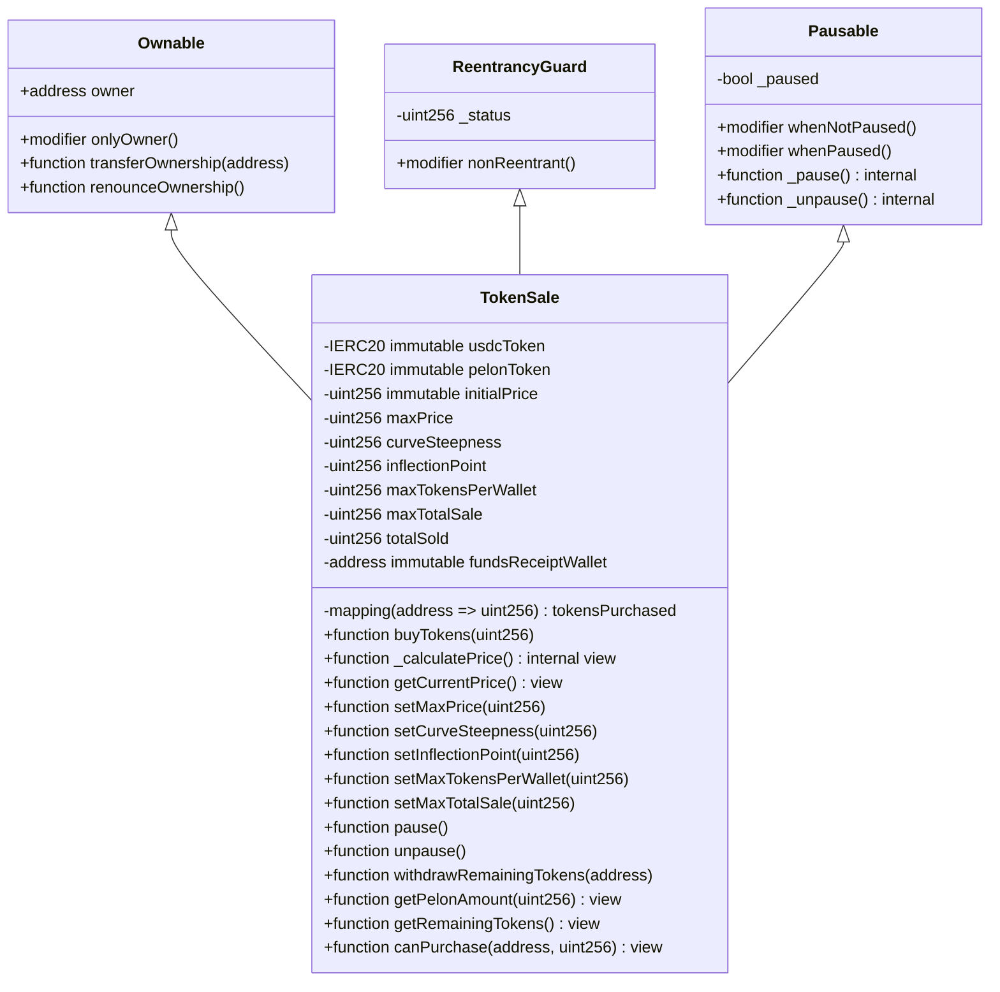

# TokenSale Contract Technical Analysis

## Executive Summary

The `TokenSale` contract implements an ERC20 token distribution mechanism through direct exchange with USDC tokens, incorporating multiple security layers and control mechanisms to prevent market manipulation and ensure equitable distribution. The contract utilizes multiple inheritance from OpenZeppelin contracts to implement battle-tested security patterns, specifically `Ownable` for administrative access control, `ReentrancyGuard` to prevent reentrancy attacks, and `Pausable` to allow suspension of operations in emergency scenarios.

The contract architecture is designed to operate as a bonding curve token sale system with sigmoid pricing, where the price increases dynamically based on tokens sold. Each purchase transaction executes a sequential series of validations before performing token transfers. The design prioritizes security over gas optimization, implementing redundant checks and utilizing the `SafeERC20` library for all token transfer operations.

## Architecture and Contract Inheritance

The `TokenSale` contract extends three base contracts from OpenZeppelin through multiple inheritance, a feature that Solidity supports through the use of the `is` keyword followed by multiple contracts separated by commas. This architecture allows combining functionalities from different base contracts without code duplication.



### Multiple Inheritance Analysis

Multiple inheritance in Solidity requires careful resolution of the inheritance order due to the C3 Linearization algorithm used by the compiler. In this case, the order `Ownable, ReentrancyGuard, Pausable` is critical because:

1. **Ownable**: Provides the most fundamental access control mechanism, establishing the contract owner during construction.
2. **ReentrancyGuard**: Implements the internal `_status` state that must be initialized before any state operations.
3. **Pausable**: Depends on the contract state being correctly initialized.

The `TokenSale` constructor explicitly invokes `Ownable(msg.sender)`, setting the deployment `msg.sender` as the initial owner. The constructors of `ReentrancyGuard` and `Pausable` execute automatically in the inheritance order, initializing `_status = 1` (not entered) and `_paused = false` respectively.

## Security Analysis

### Reentrancy Protection

The contract implements protection against reentrancy attacks through OpenZeppelin's `nonReentrant` modifier, which utilizes an enhanced checks-effects-interactions (CEI) pattern. The `nonReentrant` modifier maintains an internal `_status` state that acts as a binary semaphore:

- State `1`: The contract is not in a recursive call (initial state)
- State `2`: The contract is executing a protected function

The mechanism works through the following flow:

1. Upon entering a function with `nonReentrant`, it verifies that `_status != 2`
2. Sets `_status = 2` through an atomic operation
3. Executes the function body
4. Upon exit (even through revert), restores `_status = 1`

This implementation is superior to a simple boolean because it prevents race conditions in contracts that may receive calls from multiple simultaneous sources. The use of `nonReentrant` in `buyTokens` is especially critical because the function performs two external transfers: first USDC from the buyer and then PELON to the buyer.

### Exhaustive Validations

The contract implements validations at multiple layers, beginning in the constructor and extending to all state-modifying functions. Constructor validations guarantee initial state integrity:

```solidity
require(_usdcToken != address(0), "TokenSale: USDC address cannot be zero");
require(_pelonToken != address(0), "TokenSale: PELON address cannot be zero");
require(_initialPrice > 0, "TokenSale: Initial price must be greater than zero");
require(_maxPrice > 0, "TokenSale: Max price must be greater than zero");
require(_initialPrice < _maxPrice, "TokenSale: Initial price must be less than max price");
require(_curveSteepness > 0, "TokenSale: Curve steepness must be greater than zero");
require(_inflectionPoint > 0, "TokenSale: Inflection point must be greater than zero");
require(_maxTokensPerWallet > 0, "TokenSale: Max tokens per wallet must be greater than zero");
require(_maxTotalSale > 0, "TokenSale: Max total sale must be greater than zero");
require(_fundsReceiptWallet != address(0), "TokenSale: Funds receipt wallet cannot be zero");
```

These validations prevent invalid states that could be exploited to cause unexpected behaviors. Specifically:

- **Zero addresses**: Prevent the contract from attempting to interact with invalid addresses, which would result in failed transactions or fund loss.
- **Zero price**: Avoids division by zero and transactions without cost.
- **Zero limits**: Guarantee that anti-whale and global limit control mechanisms function correctly.

### SafeERC20 for Secure Transfers

The contract utilizes `SafeERC20` through the `using SafeERC20 for IERC20` directive, which extends the `IERC20` interface with safe functions that handle non-standard tokens. Some ERC20 tokens (like USDT) do not return a boolean value in `transfer` and `transferFrom`, which can cause calls to fail silently.

The `safeTransfer` and `safeTransferFrom` functions from SafeERC20:

1. Attempt the standard transfer
2. Verify the return value if the token supports it
3. If the token doesn't return a value, verify that the balance changed
4. Revert if no verification passes

This pattern is especially important when working with tokens that may have non-standard implementations, as is the case with USDC which may have additional restrictions or specific behaviors depending on the blockchain network.

### Pause Mechanism

The contract implements a pause mechanism through OpenZeppelin's `Pausable`, which allows the owner to suspend all critical operations in emergency scenarios. The `whenNotPaused` modifier is applied to `buyTokens`, meaning that when the contract is paused:

- Users cannot purchase tokens
- Administrative functions continue to work (allowing unpause)
- Contract state remains intact

This mechanism is crucial for responding to vulnerabilities discovered post-deployment or for pausing the sale during maintenance. However, it's important to note that pausing does not affect query functions (`view`), allowing frontend interfaces to continue displaying updated information.

### Immutability of Critical Variables

The contract uses the `immutable` modifier for several critical variables that are only assigned during construction and never modified afterward:

#### Tokens (`usdcToken` and `pelonToken`)

The `usdcToken` and `pelonToken` variables are declared as `immutable`, meaning:

1. They can only be assigned once, during construction
2. The compiler optimizes access to these variables by injecting their value directly into the bytecode
3. They cannot be modified after deployment

This immutability prevents attacks where an attacker could change token addresses to redirect funds to malicious addresses.

#### Price Parameters (`initialPrice`)

The `initialPrice` variable is declared as `immutable`, guaranteeing that:

1. The initial price of the bonding curve cannot be modified after deployment
2. Access to this variable is optimized (read from bytecode instead of storage)
3. Gas costs are significantly reduced in `_calculatePrice()`, which executes on every purchase and query

#### Funds Receipt Address (`fundsReceiptWallet`)

The `fundsReceiptWallet` variable is declared as `immutable`, ensuring that:

1. The address receiving USDC funds cannot be modified
2. Access is optimized in `buyTokens()`, where it's read on every purchase
3. Any accidental or malicious modification of the destination address is prevented

**Gas Optimization**: The use of `immutable` reduces read costs from ~2,100 gas (SLOAD) to ~3 gas (PUSH from bytecode), resulting in savings of approximately 2,097 gas per read. Considering these variables are read frequently in critical operations, the cumulative savings are considerable.

## Control Mechanisms

### Anti-Whale Protection

The contract implements an anti-whale mechanism through the `maxTokensPerWallet` variable and the `tokensPurchased` mapping. This mechanism limits the total amount of PELON tokens that an address can acquire during the entire sale, not per individual transaction.

The `tokensPurchased` mapping maintains a cumulative record of tokens purchased by each address. In each call to `buyTokens`, the contract calculates:

```solidity
uint256 newTotal = tokensPurchased[msg.sender] + pelonAmount;
require(newTotal <= maxTokensPerWallet, "TokenSale: Purchase would exceed wallet limit");
```

This design allows users to make multiple purchases as long as the cumulative total doesn't exceed the limit. However, it's important to note that this limit is global and doesn't reset, meaning that once reached, the address cannot purchase more tokens even if the limit is subsequently increased.

### Global Sale Limit

The `maxTotalSale` variable establishes an upper limit for the total amount of tokens that can be sold during the entire contract operation. This limit is verified in each transaction:

```solidity
require(totalSold + pelonAmount <= maxTotalSale, "TokenSale: Purchase would exceed total sale limit");
```

The `totalSold` variable is atomically incremented with each successful purchase, guaranteeing that the global limit is never exceeded. This mechanism is especially useful for:

- Controlling the initial circulating supply of the token
- Implementing sale rounds with specific limits
- Preventing accidental sale of more tokens than allocated for public sale

### Sigmoid Bonding Curve Pricing

The contract implements a sigmoid bonding curve mechanism where the price increases dynamically based on the number of tokens sold. The price calculation uses a sigmoid function that provides smooth price transitions:

- **Initial Price**: The starting price when no tokens have been sold
- **Max Price**: The maximum price the curve can reach
- **Inflection Point**: The point where the curve is steepest (typically set to half of `maxTotalSale`)
- **Curve Steepness**: Parameter controlling the shape of the curve

The price formula is:
```
price = initialPrice + (maxPrice - initialPrice) * (totalSold²) / (inflectionPoint² + totalSold²)
```

This sigmoid approximation:
- Starts at `initialPrice` when `totalSold = 0`
- Increases smoothly as more tokens are sold
- Reaches approximately `maxPrice` when `totalSold >= inflectionPoint * 2`
- Uses only multiplication and division for gas efficiency

**Precision Optimization**: The `_calculatePrice()` implementation has been optimized to maximize arithmetic precision through operation reordering. Operations are performed in the order: multiplication → addition → final division, avoiding precision loss that would occur if dividing before multiplying. This optimization ensures more accurate price calculations, especially for intermediate `totalSold` values.

The owner can adjust the curve parameters through `setMaxPrice()`, `setCurveSteepness()`, and `setInflectionPoint()` to adapt to market conditions. The price is calculated dynamically on each purchase using `_calculatePrice()`, ensuring fair pricing that reflects demand.

The conversion formula for calculating tokens received is:
```
pelonAmount = (usdcAmount * currentPrice) / 1e6
```

Where `currentPrice` is the dynamically calculated price based on `totalSold`. The `1e6` factor compensates for the difference between USDC's 6 decimals and PELON's 18 decimals.

## Transaction Flow

### buyTokens Function Analysis

The `buyTokens` function is the core of the contract and executes a strict sequence of validations and operations. The following diagram illustrates the complete flow:

```mermaid
flowchart TD
    A[User calls buyTokens] --> B{Contract paused?}
    B -->|Yes| C[Revert: Contract paused]
    B -->|No| D{Reentrancy check}
    D -->|In execution| E[Revert: Reentrancy]
    D -->|Free| F[Validate usdcAmount > 0]
    F -->|No| G[Revert: Amount zero]
    F -->|Yes| H[Calculate currentPrice = _calculatePrice()]
    H --> H1[Calculate pelonAmount = usdcAmount * currentPrice / 1e6]
    H1 --> I{pelonAmount > 0?}
    I -->|No| J[Revert: Calculated amount zero]
    I -->|Yes| K[Calculate newTotal = tokensPurchased + pelonAmount]
    K --> L{newTotal <= maxTokensPerWallet?}
    L -->|No| M[Revert: Exceeds wallet limit]
    L -->|Yes| N{totalSold + pelonAmount <= maxTotalSale?}
    N -->|No| O[Revert: Exceeds total sale limit]
    N -->|Yes| P[Verify contract balance]
    P --> Q{contractBalance >= pelonAmount?}
    Q -->|No| R[Revert: Insufficient tokens]
    Q -->|Yes| S[Transfer USDC: msg.sender -> fundsReceiptWallet]
    S --> T{Transfer successful?}
    T -->|No| U[Revert: Transfer failed]
    T -->|Yes| V[Update tokensPurchased]
    V --> W[Increment totalSold]
    W --> X[Transfer PELON: contract -> msg.sender]
    X --> Y{Transfer successful?}
    Y -->|No| Z[Revert: Transfer failed]
    Y -->|Yes| AA[Emit TokensPurchased event]
    AA --> AB[Success]
    
    style C fill:#ff6b6b
    style E fill:#ff6b6b
    style G fill:#ff6b6b
    style J fill:#ff6b6b
    style M fill:#ff6b6b
    style O fill:#ff6b6b
    style R fill:#ff6b6b
    U fill:#ff6b6b
    Z fill:#ff6b6b
    style AB fill:#51cf66
```

### Operation Order (CEI Pattern)

The `buyTokens` function follows the Checks-Effects-Interactions (CEI) pattern, which is fundamental for preventing reentrancy vulnerabilities:

1. **Checks (Validations)**: All validations are performed before any state modification or external interaction:
   - USDC amount validation
   - PELON amount calculation and validation
   - Limit verifications (wallet and global)
   - Contract balance verification

2. **Effects (State Changes)**: State modifications are performed after validations but before external interactions:
   - Update of `tokensPurchased[msg.sender]`
   - Increment of `totalSold`

3. **Interactions (External Calls)**: External calls are performed at the end:
   - USDC transfer from buyer
   - PELON transfer to buyer
   - Event emission

This order is critical because if an external interaction (such as `safeTransferFrom`) triggers reentrancy, the state is already updated, so validations in the recursive call would fail, preventing the attack.

### Sequential Validations

Each validation in `buyTokens` serves a specific purpose and is ordered to minimize gas consumption in early failure cases:

1. **`usdcAmount > 0`**: Prevents transactions without value and division by zero
2. **`pelonAmount > 0`**: Ensures the bonding curve price calculation results in a valid amount (prevents edge cases where price is extremely low)
3. **Wallet limit**: Prevents excessive token concentration
4. **Global limit**: Prevents overselling
5. **Contract balance**: Ensures the contract has sufficient tokens to fulfill the transaction

The contract balance verification is performed after all limit validations because it's the most expensive in terms of gas (requires an `SLOAD` and an external `balanceOf` call).

## Administrative Functions

### Parameter Management

The contract provides three functions to modify operational parameters, all protected by `onlyOwner`:

#### setMaxPrice

```solidity
function setMaxPrice(uint256 _maxPrice) external onlyOwner {
    require(_maxPrice > 0, "TokenSale: Max price must be greater than zero");
    require(initialPrice < _maxPrice, "TokenSale: Max price must be greater than initial price");
    maxPrice = _maxPrice;
    emit BondingCurveParametersUpdated();
}
```

This function allows adjustment of the maximum price in the bonding curve. The change affects future price calculations immediately but maintains the sigmoid curve shape. The max price must always be greater than the initial price.

#### setCurveSteepness

```solidity
function setCurveSteepness(uint256 _curveSteepness) external onlyOwner {
    require(_curveSteepness > 0, "TokenSale: Curve steepness must be greater than zero");
    curveSteepness = _curveSteepness;
    emit BondingCurveParametersUpdated();
}
```

This function allows adjustment of the curve steepness parameter, which affects how quickly the price increases along the curve. Higher values result in steeper curves.

#### setInflectionPoint

```solidity
function setInflectionPoint(uint256 _inflectionPoint) external onlyOwner {
    require(_inflectionPoint > 0, "TokenSale: Inflection point must be greater than zero");
    inflectionPoint = _inflectionPoint;
    emit BondingCurveParametersUpdated();
}
```

This function allows adjustment of the inflection point, which determines where the curve is steepest. Typically set to approximately half of `maxTotalSale` for optimal price distribution.

#### setMaxTokensPerWallet

```solidity
function setMaxTokensPerWallet(uint256 _maxTokensPerWallet) external onlyOwner {
    require(_maxTokensPerWallet > 0, "TokenSale: Max tokens per wallet must be greater than zero");
    maxTokensPerWallet = _maxTokensPerWallet;
    emit MaxTokensPerWalletUpdated(_maxTokensPerWallet);
}
```

This function allows adjustment of the anti-whale limit. Increasing the limit allows addresses that had reached the previous limit to purchase more tokens. Decreasing the limit doesn't affect addresses that have already purchased more than the new limit but prevents additional purchases.

#### setMaxTotalSale

```solidity
function setMaxTotalSale(uint256 _maxTotalSale) external onlyOwner {
    require(_maxTotalSale > 0, "TokenSale: Max total sale must be greater than zero");
    maxTotalSale = _maxTotalSale;
    emit MaxTotalSaleUpdated(_maxTotalSale);
}
```

This function allows adjustment of the global sale limit. An increase allows selling more tokens than originally planned. A decrease may prevent future sales if `totalSold` already exceeds the new limit, but doesn't revert already completed sales.

### Remaining Token Withdrawal

The `withdrawRemainingTokens` function allows the owner to withdraw tokens remaining in the contract after the sale has ended or if tokens need to be withdrawn for any reason:

```solidity
function withdrawRemainingTokens(address token) external onlyOwner {
    require(token != address(0), "TokenSale: Token address cannot be zero");
    IERC20 tokenContract = IERC20(token);
    uint256 balance = tokenContract.balanceOf(address(this));
    require(balance > 0, "TokenSale: No tokens to withdraw");
    tokenContract.safeTransfer(owner(), balance);
    emit TokensWithdrawn(owner(), token, balance);
}
```

This function is generic and can withdraw any ERC20 token in the contract, not just PELON. This is useful for:

- Withdrawing unsold PELON tokens after the sale ends
- Withdrawing USDC tokens that may have been accidentally sent to the contract
- Withdrawing any other tokens that may have been sent to the contract

The use of `safeTransfer` guarantees that the transfer works even with non-standard tokens.

### Pause Control

The `pause` and `unpause` functions provide emergency control over the contract:

```solidity
function pause() external onlyOwner {
    _pause();
    emit SalePaused(msg.sender);
}

function unpause() external onlyOwner {
    _unpause();
    emit SaleUnpaused(msg.sender);
}
```

These functions are simple wrappers around OpenZeppelin's internal `_pause()` and `_unpause()` functions. The pause state is stored in a `_paused` state variable that is atomically modified. Custom events provide off-chain traceability of when and by whom the sale was paused or resumed.

## Query Functions

### getPelonAmount

```solidity
function getPelonAmount(uint256 usdcAmount) external view returns (uint256) {
    if (usdcAmount == 0) return 0;
    uint256 currentPrice = _calculatePrice();
    return (usdcAmount * currentPrice) / 1e6;
}
```

This function allows calculating the amount of PELON tokens that would be received for a specific USDC amount without executing a transaction. The function uses the current bonding curve price based on tokens already sold. The function is `view`, meaning it doesn't modify state and can be called without gas cost from off-chain interfaces or from other contracts.

The handling of the `usdcAmount == 0` case prevents unnecessary calculations and returns a clear result. This function is essential for user interfaces that need to display purchase estimates before the user confirms the transaction.

### getCurrentPrice

```solidity
function getCurrentPrice() external view returns (uint256) {
    return _calculatePrice();
}
```

This function returns the current price calculated from the bonding curve based on the current `totalSold`. This allows users and interfaces to query the current price before making a purchase decision.

### getRemainingTokens

```solidity
function getRemainingTokens() external view returns (uint256) {
    uint256 remaining = maxTotalSale - totalSold;
    uint256 contractBalance = pelonToken.balanceOf(address(this));
    return remaining < contractBalance ? remaining : contractBalance;
}
```

This function calculates the amount of tokens available for sale, considering both the global sale limit and the actual contract balance. The return is the minimum between:

1. **Remaining tokens according to limit**: `maxTotalSale - totalSold` (how many more tokens can be sold according to the limit)
2. **Contract balance**: The actual amount of PELON tokens the contract has available

This logic is important because the contract may have more tokens than planned for sale, or may have fewer tokens if some were withdrawn. The function always returns the most conservative value (the lesser of the two), guaranteeing that the interface displays the actual amount available for purchase.

### canPurchase

```solidity
function canPurchase(
    address wallet,
    uint256 usdcAmount
) external view returns (bool canBuy, string memory reason) {
    // ... sequential validations ...
    return (true, "");
}
```

This function is the most sophisticated of the query functions, as it replicates all validations from `buyTokens` but in `view` mode. The function returns a tuple with:

1. **`canBuy`**: A boolean indicating whether the purchase would be successful
2. **`reason`**: A string explaining why the purchase would fail (empty if it would succeed)

**Note**: The return variable is named `canBuy` (instead of `canPurchase`) to avoid shadowing the function name, following Solidity best practices and improving code readability.

This function is extremely useful for:

- **User interfaces**: Display specific error messages before attempting the transaction
- **Integrations**: Allow other contracts to verify if a purchase is valid before executing it
- **Debugging**: Identify exactly which validation is failing without needing to execute transactions

The function replicates the exact order of validations from `buyTokens`:
1. Pause verification
2. USDC amount validation
3. Current price calculation using bonding curve
4. PELON amount calculation and validation (using dynamic price)
5. Wallet limit verification
6. Global limit verification
7. Contract balance verification

This order guarantees that error messages are consistent with the actual errors that would occur in `buyTokens`. The price used is calculated dynamically based on the current `totalSold`, ensuring accurate estimates.

## Events and Logging

The contract emits events for all critical operations, providing complete off-chain traceability. Events are indexed when appropriate to allow efficient filtering in blockchain clients.

### TokensPurchased

```solidity
event TokensPurchased(
    address indexed buyer,
    uint256 usdcAmount,
    uint256 pelonAmount
);
```

This event is emitted on each successful purchase. The `buyer` field is indexed, allowing filtering of all purchases from a specific address. The `usdcAmount` and `pelonAmount` fields are not indexed because they are numeric values rarely used for filtering, but they provide complete transaction context.

### Administrative Events

The `BondingCurveParametersUpdated`, `MaxTokensPerWalletUpdated`, and `MaxTotalSaleUpdated` events provide a complete record of all changes to contract parameters. These events are essential for:

- Off-chain audits
- User interfaces that display change history
- Contract behavior analysis

### Pause Events

The `SalePaused` and `SaleUnpaused` events record when and by whom the sale was paused or resumed. The `account` field (which is `msg.sender` in the functions) is indexed, allowing filtering by the administrator who performed the action.

### TokensWithdrawn

```solidity
event TokensWithdrawn(address indexed to, address indexed token, uint256 amount);
```

This event records all token withdrawals from the contract. Both `to` and `token` are indexed, allowing filtering by recipient or token type. This is useful for tracking which tokens were withdrawn and where they were sent.

## Technical Considerations

### Arithmetic Precision

The contract utilizes Solidity integer arithmetic, which has no native decimal support. To handle conversion between USDC (6 decimals) and PELON (18 decimals), the contract uses the formula:

```solidity
uint256 currentPrice = _calculatePrice();
pelonAmount = (usdcAmount * currentPrice) / 1e6
```

The `1e6` factor compensates for the decimal difference. The `currentPrice` is dynamically calculated from the bonding curve based on `totalSold`:

- `usdcAmount` is in units of 1e-6 USDC (micro-USDC)
- `currentPrice` is in units of 1e-18 PELON (PELON wei), calculated from the sigmoid curve
- Division by `1e6` converts the result to units of 1e-18 PELON

For example, if `initialPrice = 3000` (representing 0.000003 PELON per USDC) and no tokens have been sold:
- 1 USDC = 1,000,000 micro-USDC
- `currentPrice = 3000` (initial price)
- `pelonAmount = (1,000,000 * 3000) / 1,000,000 = 3,000` base units of PELON
- 3,000 base units = 0.000003 PELON (considering 18 decimals)

As tokens are sold, the price increases according to the sigmoid bonding curve, so later purchasers will receive fewer tokens per USDC.

This precision is sufficient for most use cases but may result in rounding down in extreme cases. For example, if `usdcAmount = 1` (1 micro-USDC) and `currentPrice = 1`, the result would be `0` due to integer division rounding.

### Decimal Handling

The contract assumes that:
- USDC has 6 decimals (USDC standard)
- PELON has 18 decimals (ERC20 standard)

These values are not verified in the contract, meaning that if deployed with tokens having different decimals, the price calculation will be incorrect. This is a deployment responsibility and should be verified off-chain before implementation.

### Gas Optimization

The contract prioritizes security over gas optimization, resulting in some intentional inefficiencies:

1. **Redundant validations**: Some validations are performed both in `canPurchase` (if called) and in `buyTokens`. However, `canPurchase` is optional and only used off-chain.

2. **Multiple SLOADs**: The `buyTokens` function performs multiple storage reads (`tokensPurchased[msg.sender]`, `totalSold`, `maxTokensPerWallet`, etc.). Some of these could be optimized using local variables, but readability and security have priority.

3. **Events with non-indexed data**: Events include non-indexed data that increases gas cost but provides valuable off-chain information.

### Edge Cases and Limits

The contract handles several edge cases:

1. **Zero amount**: All functions that accept amounts verify they are greater than zero.

2. **Arithmetic overflow**: Solidity 0.8.30 has automatic protection against overflow/underflow through automatic revert. However, the contract must ensure that `totalSold` never exceeds `maxTotalSale`, which is guaranteed through validation before increment.

3. **Insufficient balance**: The contract verifies it has sufficient tokens before transferring, but doesn't verify that the buyer has sufficient USDC. This verification is performed implicitly when `safeTransferFrom` fails if the buyer doesn't have sufficient balance or allowance.

4. **Reached limits**: If a user reaches `maxTokensPerWallet`, they cannot purchase more tokens even if the limit is subsequently increased (because `tokensPurchased[msg.sender]` is already at the previous maximum). However, if the limit is increased before reaching it, the user can continue purchasing up to the new limit.

## State Diagram

The contract has two main states that affect its operation:


## Contract Strengths

### Use of Battle-Tested Libraries

The contract relies exclusively on OpenZeppelin contracts, which are:

- **Extensively audited**: OpenZeppelin is the most audited contract library in the Ethereum ecosystem
- **Production-proven**: Millions of dollars in value are protected by OpenZeppelin contracts
- **Actively maintained**: Receive regular security updates
- **Exhaustively documented**: Have complete technical documentation

The use of these libraries significantly reduces the risk of vulnerabilities compared to custom implementations.

### Multiple Security Layers

The contract implements defense in depth through:

1. **ReentrancyGuard**: Prevents reentrancy attacks
2. **SafeERC20**: Handles non-standard tokens safely
3. **Exhaustive validations**: Prevents invalid states
4. **Pausable**: Allows rapid response to emergencies
5. **Ownable**: Administrative access control

Each layer protects against different attack vectors, and the combination provides robust protection against most known vulnerabilities.

### Administrative Flexibility

The contract provides administrative control over critical parameters while maintaining security through:

- **Access control**: Only the owner can modify parameters
- **Events**: All modifications are logged and traceable
- **Validations**: Parameters cannot be set to invalid values

This flexibility allows adaptation to changing conditions without needing to redeploy the contract.

### Transparency through Events

All critical events are emitted and appropriately indexed, allowing:

- **Complete traceability**: Any action can be tracked off-chain
- **Data analysis**: Events can be aggregated for statistical analysis
- **User interfaces**: Events provide real-time data for dashboards

### Query Functions for UX

The `view` functions allow user interfaces to:

- **Display estimates**: `getPelonAmount` allows calculating costs before purchasing
- **Display availability**: `getRemainingTokens` shows how many tokens remain
- **Display specific errors**: `canPurchase` provides detailed error messages

This significantly improves user experience by preventing transactions that would fail and providing clear feedback.

## Security Audits

### Slither Analysis

The `TokenSale` contract has been exhaustively analyzed using [Slither](https://github.com/crytic/slither), a static source code analysis tool for Solidity smart contracts developed by Crytic.

**Analysis results**:
- **Slither version**: 0.11.3
- **Active detectors**: 100
- **Analyzed contracts**: 43 (including OpenZeppelin dependencies)
- **Total results**: 73 (after corrections)

**Identified and corrected issues**:

1. **Divide Before Multiply** in `_calculatePrice()` - Corrected by reordering operations to maximize arithmetic precision
2. **Variable Shadowing** in `canPurchase()` - Corrected by renaming the return variable from `canPurchase` to `canBuy`
3. **Variables that should be `immutable`** - Corrected by declaring `initialPrice` and `fundsReceiptWallet` as `immutable`

All issues identified in the `TokenSale` contract have been corrected and verified through re-analysis. For detailed technical information about the security analysis, implemented fixes, and their impact, see the [complete Slither security documentation](./security-slither.md).

## Conclusion

The `TokenSale` contract represents a solid and secure implementation of a token sale mechanism, incorporating industry best security practices and providing administrative flexibility while maintaining user security. The use of battle-tested libraries, multiple security layers, and well-designed query functions make this contract a solid foundation for token distribution.

The contract architecture prioritizes security and clarity over gas optimization, which is appropriate for a contract that will handle user funds. Exhaustive validations and the CEI pattern guarantee that transactions are atomic and secure, while events provide complete transparency for off-chain audits and analysis.

