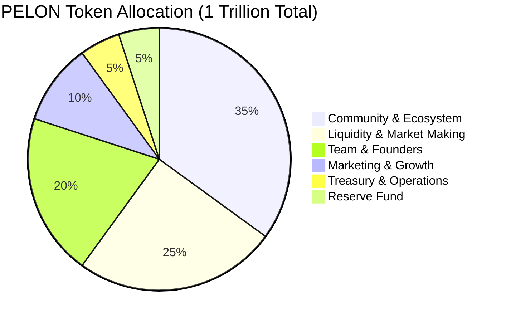

# Pelon Club Token (PELON) - Tokenomics Allocation

## The Future of Token-Gated Education is Here

Pelon Club Token powers the first decentralized educational platform that truly monetizes knowledge while building a global community of elite students and educators. With a total supply of 1 trillion PELON tokens, our tokenomics model is designed for long-term sustainability, community growth, and strategic value creation.

## Token Overview

- **Token Name:** Pelon Club Token
- **Symbol:** PELON
- **Total Supply:** 1,000,000,000,000 PELON (1 Trillion)
- **Network:** Base (Ethereum L2)
- **Token Standard:** ERC20 with advanced extensions (ERC1363, ERC20Permit, ERC20Votes, ERC20Burnable)

## Tokenomics Distribution

Our conservative allocation model prioritizes community growth, market stability, and sustainable development. Here's how 1 trillion PELON tokens are strategically allocated:

### Distribution Overview

### Complete Allocation Breakdown

| Category | Percentage | Tokens | Purpose |
|----------|-----------|--------|---------|
| **Community & Ecosystem** | 35% | 350B | Drive adoption and engagement |
| **Liquidity & Market Making** | 25% | 250B | Ensure market stability |
| **Team & Founders** | 20% | 200B | Align long-term incentives |
| **Marketing & Growth** | 10% | 100B | Accelerate user acquisition |
| **Treasury & Operations** | 5% | 50B | Fund ongoing operations |
| **Reserve Fund** | 5% | 50B | Strategic reserves |

### Detailed Allocation Table with Wallet Addresses

| Category | Subcategory | Percentage | Tokens | Wallet Address |
|----------|-------------|-----------|--------|----------------|
| **Community & Ecosystem** | **TOTAL** | **35%** | **350B** | `0xeB7D78ed5F19592dFD5cF97443d961e85595Daa5` |
| Community & Ecosystem | Initial Airdrops | 5% | 50B | `0xeB7D78ed5F19592dFD5cF97443d961e85595Daa5` |
| Community & Ecosystem | Participation Incentives | 10% | 100B | `0xeB7D78ed5F19592dFD5cF97443d961e85595Daa5` |
| Community & Ecosystem | Educational Rewards | 10% | 100B | `0xeB7D78ed5F19592dFD5cF97443d961e85595Daa5` |
| Community & Ecosystem | Referral Program | 5% | 50B | `0xeB7D78ed5F19592dFD5cF97443d961e85595Daa5` |
| Community & Ecosystem | DAO Governance | 5% | 50B | `0xeB7D78ed5F19592dFD5cF97443d961e85595Daa5` |
| **Liquidity & Market Making** | **TOTAL** | **25%** | **250B** | `0xFF9e0a72842751698A62050e94fad0CE8C0b368a` |
| Liquidity & Market Making | Initial DEX Liquidity | 15% | 150B | `0xFF9e0a72842751698A62050e94fad0CE8C0b368a` |
| Liquidity & Market Making | Liquidity Reserve | 10% | 100B | `0xFF9e0a72842751698A62050e94fad0CE8C0b368a` |
| **Team & Founders** | **TOTAL** | **20%** | **200B** | `0xaEeaA55ED4f7df9E4C5688011cEd1E2A1b696772` |
| Team & Founders | Founding Team | 15% | 150B | `0xaEeaA55ED4f7df9E4C5688011cEd1E2A1b696772` |
| Team & Founders | Advisors | 5% | 50B | `0xaEeaA55ED4f7df9E4C5688011cEd1E2A1b696772` |
| **Marketing & Growth** | **TOTAL** | **10%** | **100B** | `0xc08bF97eeE16e73DFA022265118B513D10Ae3F1C` |
| Marketing & Growth | Marketing Campaigns | 6% | 60B | `0xc08bF97eeE16e73DFA022265118B513D10Ae3F1C` |
| Marketing & Growth | Partnerships | 2% | 20B | `0xc08bF97eeE16e73DFA022265118B513D10Ae3F1C` |
| Marketing & Growth | Influencers/KOLs | 2% | 20B | `0xc08bF97eeE16e73DFA022265118B513D10Ae3F1C` |
| **Treasury & Operations** | **TOTAL** | **5%** | **50B** | `0x4826b07de6d05783121A7f28147F82D3eEEb7E1b` |
| Treasury & Operations | Operations | 3% | 30B | `0x4826b07de6d05783121A7f28147F82D3eEEb7E1b` |
| Treasury & Operations | Emergency Fund | 2% | 20B | `0x4826b07de6d05783121A7f28147F82D3eEEb7E1b` |
| **Reserve Fund** | **TOTAL** | **5%** | **50B** | `0xfBeec866499B868B87C3730AA4F3a7921707f7b2` |
| Reserve Fund | Strategic Reserve | 5% | 50B | `0xfBeec866499B868B87C3730AA4F3a7921707f7b2` |

### Detailed Allocation Structure

```mermaid
flowchart TD
    A[Total Supply: 1 Trillion PELON] --> B[Community & Ecosystem: 35% - 350B]
    A --> C[Liquidity & Market Making: 25% - 250B]
    A --> D[Team & Founders: 20% - 200B]
    A --> E[Marketing & Growth: 10% - 100B]
    A --> F[Treasury & Operations: 5% - 50B]
    A --> G[Reserve Fund: 5% - 50B]
    
    B --> B1[Initial Airdrops: 5% - 50B]
    B --> B2[Participation Incentives: 10% - 100B]
    B --> B3[Educational Rewards: 10% - 100B]
    B --> B4[Referral Program: 5% - 50B]
    B --> B5[DAO Governance: 5% - 50B]
    
    C --> C1[Initial DEX Liquidity: 15% - 150B]
    C --> C2[Liquidity Reserve: 10% - 100B]
    
    D --> D1[Founding Team: 15% - 150B]
    D --> D2[Advisors: 5% - 50B]
    
    E --> E1[Marketing Campaigns: 6% - 60B]
    E --> E2[Partnerships: 2% - 20B]
    E --> E3[Influencers & KOLs: 2% - 20B]
    
    F --> F1[Operations: 3% - 30B]
    F --> F2[Emergency Fund: 2% - 20B]
    
    G --> G1[Strategic Reserve: 5% - 50B]
    
    style A fill:#4338ca,stroke:#000,stroke-width:3px,color:#fff
    style B fill:#6366f1,stroke:#000,stroke-width:2px,color:#fff
    style C fill:#818cf8,stroke:#000,stroke-width:2px,color:#fff
    style D fill:#a5b4fc,stroke:#000,stroke-width:2px,color:#fff
    style E fill:#c7d2fe,stroke:#000,stroke-width:2px,color:#000
    style F fill:#e0e7ff,stroke:#000,stroke-width:2px,color:#000
    style G fill:#eef2ff,stroke:#000,stroke-width:2px,color:#000
```

---

## 1. Community & Ecosystem (35% - 350B PELON)

The largest allocation reflects our commitment to building a thriving, engaged community. This category drives user acquisition, retention, and platform growth.

**Breakdown:**
- **Initial Airdrops (5% - 50B):** Reward early adopters and build initial user base
- **Participation Incentives (10% - 100B):** Encourage active engagement and platform usage
- **Educational Rewards (10% - 100B):** Incentivize learning and content consumption
- **Referral Program (5% - 50B):** Viral growth mechanism for organic user acquisition
- **DAO Governance (5% - 50B):** Empower community decision-making and decentralization

**Why This Matters:** A strong community is the foundation of any successful Web3 project. By allocating 35% to community initiatives, we ensure that value flows directly to users who contribute to the platform's success.

---

## 2. Liquidity & Market Making (25% - 250B PELON)

Market stability and liquidity are critical for token utility and investor confidence. This allocation ensures healthy trading conditions from day one.

**Breakdown:**
- **Initial DEX Liquidity (15% - 150B):** Launch with deep liquidity pools
- **Liquidity Reserve (10% - 100B):** Maintain market depth and stability over time

**Why This Matters:** Adequate liquidity prevents price manipulation, reduces slippage, and creates a better trading experience for all participants. This allocation demonstrates our commitment to building a sustainable token economy.

---

## 3. Team & Founders (20% - 200B PELON)

The team allocation ensures long-term alignment between founders, advisors, and the project's success. This creates strong incentives for continued development and growth.

**Breakdown:**
- **Founding Team (15% - 150B):** Core development and strategic execution
- **Advisors (5% - 50B):** Strategic guidance and industry expertise

**Why This Matters:** A well-incentivized team is essential for long-term project success. This allocation ensures that key stakeholders remain committed to the platform's growth and development over multiple years.

---

## 4. Marketing & Growth (10% - 100B PELON)

Strategic marketing accelerates user acquisition and platform awareness. This allocation funds growth initiatives that drive adoption.

**Breakdown:**
- **Marketing Campaigns (6% - 60B):** Brand awareness and user acquisition
- **Partnerships (2% - 20B):** Strategic alliances with educational institutions and platforms
- **Influencers & KOLs (2% - 20B):** Leverage thought leaders in education and Web3

**Why This Matters:** In a competitive market, strategic marketing is essential for standing out. This allocation ensures we can reach our target audience effectively and build a recognizable brand in the education and Web3 space.

---

## 5. Treasury & Operations (5% - 50B PELON)

Operational funds ensure the platform can function smoothly, handle unexpected costs, and maintain development momentum.

**Breakdown:**
- **Operations (3% - 30B):** Day-to-day platform operations and maintenance
- **Emergency Fund (2% - 20B):** Unforeseen circumstances and critical needs

**Why This Matters:** Having operational reserves prevents project stagnation and ensures continuity. This allocation provides a safety net for maintaining platform quality and responding to market needs.

---

## 6. Reserve Fund (5% - 50B PELON)

Strategic reserves provide flexibility for future opportunities, unexpected market conditions, or strategic initiatives that emerge over time.

**Breakdown:**
- **Strategic Reserve (5% - 50B):** Future opportunities and strategic initiatives

**Why This Matters:** Markets evolve, opportunities arise, and having reserves allows us to capitalize on strategic moments without diluting other allocations. This fund provides the flexibility needed for long-term success.

---

## Wallet Addresses Summary

All token allocations are managed through dedicated wallet addresses on the Base network. Each category has its own wallet for transparent and verifiable on-chain allocation tracking.

### 📍 Community & Ecosystem

**Wallet Address:** `0xeB7D78ed5F19592dFD5cF97443d961e85595Daa5`  
**Total Allocation:** 35% (350B PELON)  
**Funding Transaction:** [View on BaseScan](https://sepolia.basescan.org/tx/0x40fbddd3c2c7f1b947de5264726d88fb5672191d950878d0de8e28ff4f4eb990)

**Subcategories:**
- Initial Airdrops: 5% (50B)
- Participation Incentives: 10% (100B)
- Educational Rewards: 10% (100B)
- Referral Program: 5% (50B)
- DAO Governance: 5% (50B)

### 📍 Liquidity & Market Making

**Wallet Address:** `0xFF9e0a72842751698A62050e94fad0CE8C0b368a`  
**Total Allocation:** 25% (250B PELON)  
**Funding Transaction:** [View on BaseScan](https://sepolia.basescan.org/tx/0xb04e76fb716c823938caa5bd7b19947a682491b26c64ea1cf63a7e377e14c16a)

**Subcategories:**
- Initial DEX Liquidity: 15% (150B)
- Liquidity Reserve: 10% (100B)

### 📍 Team & Founders

**Wallet Address:** `0xaEeaA55ED4f7df9E4C5688011cEd1E2A1b696772`  
**Total Allocation:** 20% (200B PELON)  
**Funding Transaction:** [View on BaseScan](https://sepolia.basescan.org/tx/0xdd043bacb0ad2841ce537decb45c45712178c51310f6f58e60614d56af1839c7)

**Subcategories:**
- Founding Team: 15% (150B)
- Advisors: 5% (50B)

**Note:** This is an existing address (no new private key was generated).

### 📍 Marketing & Growth

**Wallet Address:** `0xc08bF97eeE16e73DFA022265118B513D10Ae3F1C`  
**Total Allocation:** 10% (100B PELON)  
**Funding Transaction:** [View on BaseScan](https://sepolia.basescan.org/tx/0x4c32c188f109c6eda27fff319fe9a65ff82c7bd3cced6588be70a91442f13487)

**Subcategories:**
- Marketing Campaigns: 6% (60B)
- Partnerships: 2% (20B)
- Influencers/KOLs: 2% (20B)

### 📍 Treasury & Operations

**Wallet Address:** `0x4826b07de6d05783121A7f28147F82D3eEEb7E1b`  
**Total Allocation:** 5% (50B PELON)  
**Funding Transaction:** [View on BaseScan](https://sepolia.basescan.org/tx/0xa51127c19a32f926b8aed8f63f055f80aa95671e00c33e27c965f1d65b58a439)

**Subcategories:**
- Operations: 3% (30B)
- Emergency Fund: 2% (20B)

### 📍 Reserve Fund

**Wallet Address:** `0xfBeec866499B868B87C3730AA4F3a7921707f7b2`  
**Total Allocation:** 5% (50B PELON)  
**Funding Transaction:** [View on BaseScan](https://sepolia.basescan.org/tx/0x866b9c956d7d350b93aa97dffdfb95721e37da574372643ef268fba0ba539f12)

**Subcategories:**
- Strategic Reserve: 5% (50B)

---

## Verification

✅ **Total Allocated:** 100% (1 Trillion PELON)  
✅ **Tokenomics Correctly Balanced**

All allocations can be verified on-chain through the Base network explorer using the wallet addresses provided above.

---

## Why This Tokenomics Model Works

### Conservative Yet Strategic

Our allocation model balances multiple objectives:
- **Community-first approach** with 35% allocation ensures user value creation
- **Market stability** through 25% liquidity allocation builds investor confidence
- **Long-term alignment** with 20% team allocation ensures sustained development
- **Growth acceleration** through 10% marketing allocation drives adoption
- **Operational security** with 10% combined treasury and reserves

### Designed for Sustainability

Unlike projects that allocate too heavily to founders or marketing, our model prioritizes:
1. **Community value** - Users get the largest share
2. **Market health** - Strong liquidity prevents volatility
3. **Long-term thinking** - Team incentives align with multi-year success
4. **Balanced growth** - Marketing without over-allocation

### Transparent and Verifiable

All allocations are clearly defined and can be verified on-chain. This transparency builds trust with investors, users, and the broader community.

---

## Investment Opportunity

Pelon Club Token represents a unique opportunity to participate in the convergence of education and Web3 technology. With a clear use case, strong tokenomics, and a committed team, PELON is positioned to capture value in the growing token-gated education market.

**Key Investment Highlights:**
- Largest allocation to community (35%) ensures user-driven growth
- Strong liquidity allocation (25%) provides market stability
- Conservative team allocation (20%) aligns long-term incentives
- Clear utility through token-gated educational resources
- Governance rights through ERC20Votes integration
- Built on Base for low-cost, scalable transactions

---

## Next Steps

For investors interested in learning more about Pelon Club Token:

1. **Review the platform:** Visit [pelon.club](https://pelon.club)
2. **Join the community:** Connect via [Twitter](https://x.com/PelonClub) and [Telegram](https://t.me/PelonClub)
3. **Contact the team:** Reach out at carlos@pelon.club

---

**Disclaimer:** This document is for informational purposes only and does not constitute financial advice. Token allocations are subject to the project's strategic decisions and market conditions. Always conduct your own research before making investment decisions.