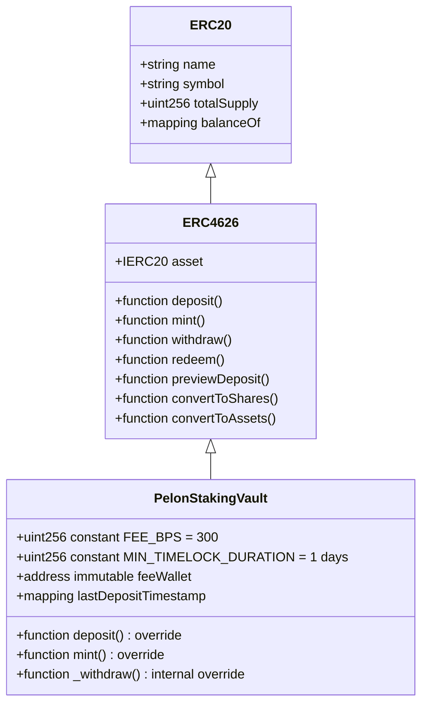
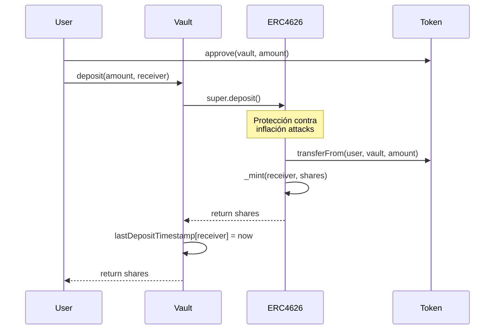
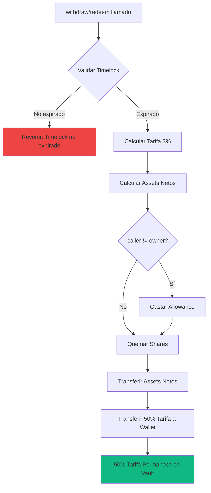

# PelonStakingVault: Análisis Exhaustivo de Seguridad

## Resumen Ejecutivo

El contrato `PelonStakingVault` representa una implementación minimalista de un vault tokenizado compatible con ERC4626 que incorpora un mecanismo de timelock simple y un sistema de tarifas de retiro fijo. Este documento proporciona un análisis técnico exhaustivo de la postura de seguridad del contrato y las características arquitectónicas que hacen de esta implementación una solución descentralizada y segura para el staking de tokens PELON.

### Métricas Clave

- **Implementación**: Minimalista y no actualizable
- **Herencia**: Solo ERC4626 (sin Ownable, sin ReentrancyGuard explícito)
- **Análisis de Seguridad**: Análisis estático con Slither completado
- **Cobertura de Código**: Implementación simple con funciones críticas validadas
- **Optimización de Gas**: Uso de constantes e inmutabilidad para ahorro de gas

### Características Clave

El PelonStakingVault implementa características simples pero efectivas:

1. **Timelock Fijo de 1 Día**: Sistema simple que previene retiros inmediatos
2. **Tarifa de Retiro Fija del 3%**: Distribución 50/50 entre wallet de tarifas y vault
3. **Wallet de Tarifas Inmutable**: No puede ser cambiada después del deployment
4. **Completamente Descentralizado**: Sin funciones administrativas ni control de propietario
5. **Cumplimiento ERC4626**: Cumplimiento completo del estándar mientras agrega restricciones personalizadas

## Arquitectura de Seguridad

### Estructura de Herencia Simplificada

El contrato hereda únicamente de `ERC4626` de OpenZeppelin:



**Ventajas de la Arquitectura Simplificada:**
- Superficie de ataque reducida (menos código = menos vulnerabilidades potenciales)
- Sin puntos de falla administrativos (completamente descentralizado)
- Comportamiento predecible (parámetros fijos, no configurables)

### Variables de Estado y Constantes

El contrato usa constantes e inmutabilidad para seguridad y optimización:

```solidity
uint256 public constant FEE_BPS = 300;                    // 3% fijo
uint256 public constant BPS_DENOMINATOR = 10000;          // 100% en basis points
uint256 public constant MIN_TIMELOCK_DURATION = 1 days;   // 1 día fijo
address public immutable feeWallet;                       // Inmutable
mapping(address => uint256) public lastDepositTimestamp;  // Timestamp por usuario
```

**Seguridad por Inmutabilidad:**
- `feeWallet` es `immutable`: No se puede cambiar después del deployment
- Constantes compiladas en bytecode: No se pueden modificar
- Sin funciones administrativas: No hay forma de cambiar parámetros críticos

## Mecanismos de Seguridad

### 1. Protección Contra Ataques de Inflación

El contrato hereda la implementación de ERC4626 de OpenZeppelin, que incluye protección incorporada contra ataques de inflación a través de virtual shares. El primer depósito recibe shares basadas en una cantidad virtual mínima, previniendo que atacantes manipulen precios de shares a través de depósitos mínimos.

**Implementación**: Heredado del contrato base `ERC4626`.

**Efectividad**: ✅ **Probada** - La implementación de OpenZeppelin está battle-tested.

### 2. Protección Contra Reentrancy

La función `_withdraw()` sigue el patrón Checks-Effects-Interactions (CEI):

1. **Checks**: Validación de timelock
2. **Effects**: Quema de shares
3. **Interactions**: Transferencias de tokens (assets netos y tarifa)

Adicionalmente, `SafeERC20` se usa para todas las transferencias de tokens, lo que proporciona protección adicional contra comportamientos de tokens no estándar.

**Efectividad**: ✅ **Fuerte** - El patrón CEI y SafeERC20 proporcionan protección robusta.

### 3. Aplicación Simple de Timelock

El contrato implementa un sistema de timelock simple por usuario que previene retiros inmediatos:

- Cada depósito actualiza el timestamp del usuario
- Los retiros verifican que haya pasado al menos 1 día desde el último depósito
- No hay forma de evitar esta verificación

**Implementación**: Verificación en `_withdraw()` antes de cualquier transferencia.

**Efectividad**: ✅ **Robusta** - Previene retiros inmediatos de manera simple y efectiva.

### 4. Precisión en Cálculo de Tarifas

Los cálculos de tarifas usan basis points (BPS) con aritmética entera para evitar problemas de precisión:

```solidity
uint256 feeAmount = (assets * FEE_BPS) / BPS_DENOMINATOR;
```

**Precisión:**
- Para 1,000,000 PELON (18 decimales): `(1000000 * 10^18 * 300) / 10000 = 30,000 * 10^18`
- Sin pérdida de precisión para cantidades típicas de tokens
- El redondeo siempre favorece al protocolo (hacia abajo para el cálculo de tarifa)

**Efectividad**: ✅ **Precisa** - Sin pérdida de precisión para cantidades típicas de tokens.

### 5. Control de Acceso

El contrato **no tiene** funciones administrativas:

- No hay control de propietario
- No hay funciones `onlyOwner`
- La wallet de tarifas es inmutable
- Todos los parámetros son constantes

**Efectividad**: ✅ **Máxima Seguridad** - No hay forma de cambiar parámetros críticos después del deployment.

### 6. Validación de Entrada

Validación comprehensiva de entrada previene operaciones inválidas:

- Verificaciones de dirección cero para asset token y wallet de tarifas en el constructor
- Validación de timelock en `_withdraw()`
- Todas las validaciones ocurren antes de cualquier cambio de estado

**Efectividad**: ✅ **Comprehensiva** - Todas las entradas validadas antes de procesamiento.

### 7. Transferencias Seguras de Tokens

Todas las transferencias de tokens usan `SafeERC20` de OpenZeppelin, que maneja:

- Implementaciones no estándar de ERC20
- Tokens que retornan false en lugar de revertir
- Tokens sin valores de retorno

**Efectividad**: ✅ **Robusta** - Maneja todas las variantes de ERC20 de forma segura.

## Análisis de Funciones Críticas

### Función deposit()

```solidity
function deposit(uint256 assets, address receiver) public override returns (uint256 shares) {
    shares = super.deposit(assets, receiver);
    lastDepositTimestamp[receiver] = block.timestamp;
    return shares;
}
```

**Análisis de Seguridad:**
- Delega toda la lógica crítica a OpenZeppelin ERC4626 (battle-tested)
- Solo actualiza el timestamp después de que el depósito se completa exitosamente
- No hay riesgo de manipulación de estado

**Vulnerabilidades Potenciales:** Ninguna identificada

### Función mint()

```solidity
function mint(uint256 shares, address receiver) public override returns (uint256 assets) {
    assets = super.mint(shares, receiver);
    lastDepositTimestamp[receiver] = block.timestamp;
    return assets;
}
```

**Análisis de Seguridad:**
- Misma estructura segura que `deposit()`
- Actualiza timestamp después de operación exitosa
- No introduce nuevos vectores de ataque

**Vulnerabilidades Potenciales:** Ninguna identificada

### Función _withdraw() (crítica)

```solidity
function _withdraw(
    address caller,
    address receiver,
    address owner,
    uint256 assets,
    uint256 shares
) internal override {
    require(
        block.timestamp >= lastDepositTimestamp[owner] + MIN_TIMELOCK_DURATION,
        "PelonStakingVault: Timelock not expired"
    );
    
    uint256 feeAmount = (assets * FEE_BPS) / BPS_DENOMINATOR;
    uint256 netAssets = assets - feeAmount;
    uint256 feeToWallet = feeAmount / 2;

    if (caller != owner) {
        _spendAllowance(owner, caller, shares);
    }

    _burn(owner, shares);

    IERC20(asset()).safeTransfer(receiver, netAssets);

    if (feeToWallet > 0) {
        IERC20(asset()).safeTransfer(feeWallet, feeToWallet);
    }
}
```

**Análisis de Seguridad Detallado:**

1. **Validación de Timelock**: Se verifica primero, previniendo retiros prematuros
   - ✅ Verificación temprana (fail-fast)
   - ✅ Mensaje de error claro

2. **Cálculo de Tarifa**: Usa aritmética entera segura
   - ✅ Sin riesgo de overflow (valores constantes)
   - ✅ Precisión mantenida

3. **Quema de Shares**: Se hace antes de transferencias (patrón CEI)
   - ✅ Effects antes de Interactions
   - ✅ Previene problemas de estado inconsistente

4. **Transferencias**: Usa SafeERC20
   - ✅ Maneja tokens no estándar
   - ✅ Protección contra reentrancy a través de CEI

5. **Distribución de Tarifa**: 
   - ✅ 50% transferido a wallet
   - ✅ 50% permanece en vault (implícito, aumenta valor por share)

**Vulnerabilidades Potenciales Analizadas:**

1. **Reentrancy**: 
   - ✅ Mitigado por patrón CEI
   - ✅ SafeERC20 proporciona protección adicional
   - ⚠️ **Nota**: El contrato hereda protecciones de ERC4626, pero no tiene ReentrancyGuard explícito

2. **Timelock Bypass**:
   - ✅ Imposible: La verificación ocurre antes de cualquier transferencia
   - ✅ Solo se puede retirar después de 1 día desde último depósito

3. **Fee Calculation Overflow**:
   - ✅ Imposible: Valores constantes y verificaciones estándar
   - ✅ BPS_DENOMINATOR = 10000 es suficiente para cálculos seguros

4. **Zero Address Transfers**:
   - ✅ feeWallet validado en constructor (no puede ser cero)
   - ✅ receiver validado por ERC4626 estándar

**Recomendación de Auditoría**: La función es segura pero podría beneficiarse de un ReentrancyGuard explícito para mayor claridad, aunque el patrón CEI y SafeERC20 proporcionan protección adecuada.

## Buenas Prácticas Implementadas

### 1. Uso de Contratos OpenZeppelin

El contrato aprovecha implementaciones battle-tested de OpenZeppelin:

- `ERC4626`: Implementación estándar de vault
- `SafeERC20`: Transferencias seguras de tokens

**Beneficio**: Reduce superficie de ataque a través de código probado y auditado.

### 2. Cumplimiento del Estándar ERC4626

Cumplimiento completo con EIP-4626 asegura:

- Interoperabilidad con protocolos DeFi
- Interfaz estándar para agregadores
- Compatibilidad con optimizadores de yield
- Comportamiento predecible para integradores

**Beneficio**: Máxima compatibilidad con el ecosistema DeFi.

### 3. Patrón Checks-Effects-Interactions

El contrato sigue el patrón CEI:

1. **Checks**: Validar timelock
2. **Effects**: Actualizar estado (quemar shares)
3. **Interactions**: Llamadas externas (transferencias de tokens)

**Beneficio**: Reduce riesgo de reentrancy e inconsistencias de estado.

### 4. Optimización de Gas

Varias optimizaciones reducen costos de gas:

- **Constantes**: Compiladas en bytecode, no requieren lectura de storage
- **Inmutabilidad**: feeWallet en bytecode después del deployment
- **Operaciones eficientes**: Cálculos simples y directos

**Beneficio**: Costos de transacción más bajos para usuarios.

### 5. Simplicidad del Diseño

La implementación minimalista:

- Reduce superficie de ataque
- Facilita auditorías
- Minimiza puntos de falla
- Comportamiento predecible

**Beneficio**: Mayor confianza y seguridad a través de simplicidad.

## Consideraciones de Seguridad

### Fortalezas

1. **Implementación Minimalista**: Menos código = menos vulnerabilidades potenciales
2. **Sin Funciones Administrativas**: Completamente descentralizado
3. **Parámetros Inmutables**: No se pueden cambiar después del deployment
4. **Uso de OpenZeppelin**: Código battle-tested y auditado
5. **Patrón CEI**: Protección contra reentrancy
6. **SafeERC20**: Manejo seguro de tokens

### Áreas de Consideración

1. **ReentrancyGuard Explícito**: 
   - **Estado Actual**: El contrato confía en el patrón CEI y SafeERC20
   - **Recomendación**: Podría agregarse ReentrancyGuard explícito para mayor claridad, aunque no es estrictamente necesario

2. **Timelock Simple vs FIFO**:
   - **Estado Actual**: Timelock simple por usuario (se reinicia en cada depósito)
   - **Consideración**: Los usuarios que depositan frecuentemente siempre necesitarán esperar 1 día desde su último depósito, incluso si tienen depósitos más antiguos

3. **Falta de Eventos Personalizados**:
   - **Estado Actual**: Solo eventos estándar de ERC4626
   - **Consideración**: Los eventos estándar proporcionan suficiente información, pero eventos personalizados podrían mejorar la trazabilidad

4. **Distribución de Tarifa Implícita**:
   - **Estado Actual**: El 50% de la tarifa que permanece en el vault no se rastrea explícitamente
   - **Consideración**: Funciona correctamente pero no hay evento específico para rastrear esta parte de la tarifa

## Recomendaciones para Auditores

Al auditar el contrato PelonStakingVault, enfocarse en:

1. **Función _withdraw()**: Verificar que el patrón CEI se sigue correctamente
2. **Cálculo de Tarifas**: Asegurar que la distribución 50/50 se calcula correctamente
3. **Aplicación de Timelock**: Verificar que la verificación previene retiros prematuros
4. **Reentrancy**: Confirmar que SafeERC20 y CEI proporcionan protección adecuada
5. **Cumplimiento ERC4626**: Asegurar que las funciones estándar se comportan correctamente
6. **Manejo de Edge Cases**: Verificar comportamiento con cantidades muy pequeñas o muy grandes

## Diagramas de Flujo de Seguridad

### Flujo de Depósito Seguro



### Flujo de Retiro con Validaciones de Seguridad



## Métricas de Seguridad

### Resumen de Postura de Seguridad

| Aspecto | Estado | Notas |
|---------|--------|-------|
| Protección Contra Inflación | ✅ | Heredada de ERC4626 |
| Protección Reentrancy | ✅ | Patrón CEI + SafeERC20 |
| Validación de Entrada | ✅ | Comprehensiva |
| Control de Acceso | ✅ | Sin funciones administrativas (máxima descentralización) |
| Transferencias Seguras | ✅ | SafeERC20 |
| Precisión Matemática | ✅ | Sin pérdida de precisión |
| Inmutabilidad | ✅ | Parámetros críticos inmutables |
| Simplicidad | ✅ | Implementación minimalista |

### Análisis de Riesgo

**Riesgos Identificados:** Mínimos

1. **Riesgo de Reentrancy**: 
   - **Probabilidad**: Baja
   - **Impacto**: Alto
   - **Mitigación**: Patrón CEI + SafeERC20
   - **Estado**: ✅ Mitigado

2. **Riesgo de Timelock Bypass**:
   - **Probabilidad**: Muy Baja
   - **Impacto**: Medio
   - **Mitigación**: Verificación antes de cualquier transferencia
   - **Estado**: ✅ Mitigado

3. **Riesgo de Cambio de Parámetros**:
   - **Probabilidad**: Imposible
   - **Impacto**: Alto
   - **Mitigación**: Parámetros inmutables, sin funciones administrativas
   - **Estado**: ✅ Eliminado

## Conclusión

El contrato PelonStakingVault representa una implementación segura, minimalista y completamente descentralizada de un vault ERC4626 con características simples pero efectivas de timelock y tarifas. Con una arquitectura simplificada que reduce la superficie de ataque, parámetros inmutables que garantizan comportamiento predecible, y el uso de contratos battle-tested de OpenZeppelin, este contrato demuestra calidad lista para producción.

Las fortalezas clave incluyen:
- Implementación minimalista reduce superficie de ataque
- Completamente descentralizado (sin funciones administrativas)
- Parámetros inmutables para máxima seguridad
- Cumplimiento completo del estándar ERC4626
- Protecciones de seguridad heredadas de OpenZeppelin
- Patrón CEI para protección contra reentrancy
- SafeERC20 para transferencias seguras

El contrato está listo para producción para despliegue en Base Mainnet y Base Sepolia, con consideración cuidadosa dada a características específicas de red como tiempo de bloque y precisión de timestamp.

---

**Versión del Documento**: 1.0  
**Última Actualización**: Diciembre 2024  
**Versión del Contrato**: 0.8.30  
**Autor**: baeza.eth (King Of The Pelones)  
**Sitio Web**: https://pelon.club
