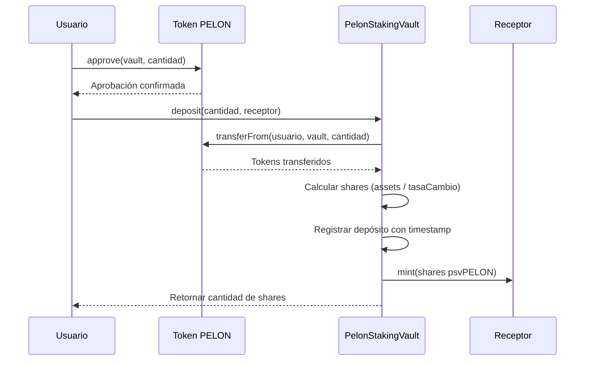
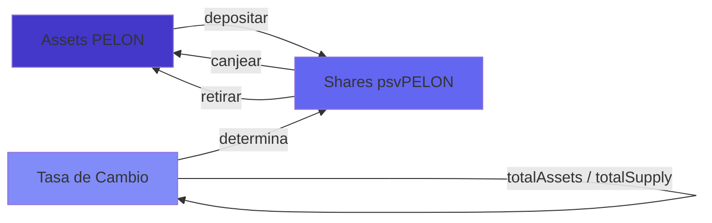
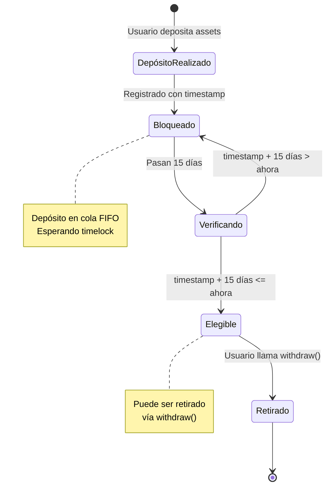
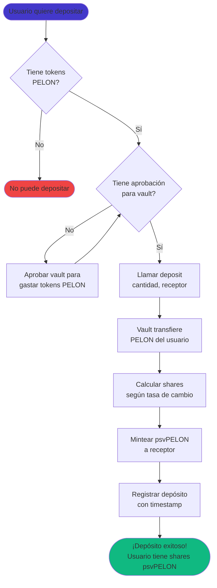
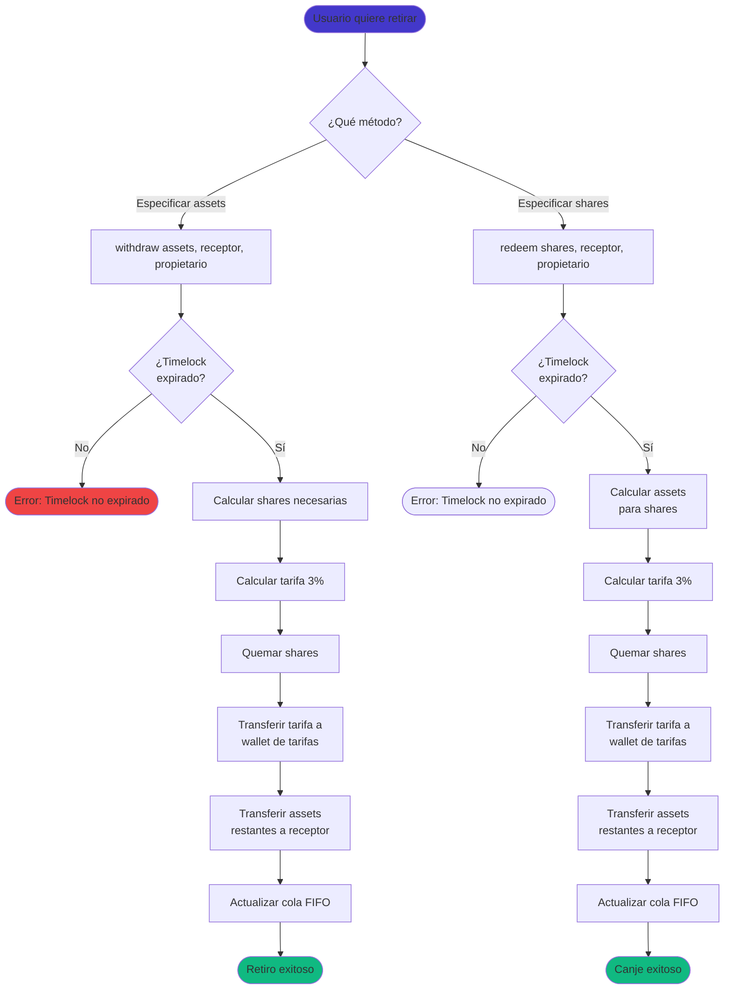

# Guía de Usuario del PelonStakingVault

## Introducción

El PelonStakingVault es un vault tokenizado compatible con ERC4626 que te permite hacer staking de tus tokens PELON. Cuando depositas tokens PELON en el vault, recibes shares del vault (psvPELON) que representan tu propiedad proporcional de los assets del vault. Esta guía explica cómo funciona el vault, cómo interactuar con él y qué esperar al hacer staking de tus tokens.

### ¿Qué es un Vault ERC4626?

ERC4626 es una interfaz estándar para vaults tokenizados en DeFi. Piensa en ello como un fondo mutuo: depositas assets (tokens PELON) y recibes shares (psvPELON) que representan tu porción del fondo. La ventaja clave es que estas shares son en sí mismas tokens ERC20, lo que significa que puedes transferirlas, comerciarlas o usarlas en otros protocolos DeFi.

El vault mantiene una relación entre assets y shares. Inicialmente, esta relación es 1:1 (1 PELON = 1 psvPELON), pero puede cambiar según los assets totales del vault y las shares totales. El estándar ERC4626 proporciona funciones integradas para convertir entre assets y shares de manera precisa.

### ¿Por qué usar PelonStakingVault?

El PelonStakingVault implementa dos mecanismos clave:

1. **Timelock Configurable (FIFO)**: Cada depósito está bloqueado por un período configurable (por defecto 15 días, rango 1-90 días) antes de poder ser retirado. El sistema usa una cola First-In-First-Out (FIFO), lo que significa que tus depósitos más antiguos se vuelven disponibles para retiro primero. La duración del timelock puede ser ajustada por el propietario del contrato.

2. **Tarifa de Retiro Configurable**: Cuando retiras assets usando las funciones `withdraw()` o `redeem()`, se deduce automáticamente una tarifa configurable (por defecto 3%, máximo 10%) que se distribuye: 50% a wallet de tarifas, 25% re-stakeado (aumenta valor por share para todos los holders), y 25% quemado. El porcentaje de tarifa puede ser ajustado por el propietario del contrato.

Estos mecanismos fomentan el staking a largo plazo asegurando que todos los retiros estén sujetos a las mismas restricciones de timelock y tarifa. El componente de re-staking proporciona valor adicional a todos los participantes del vault aumentando el valor por share.

### Conceptos Básicos

**Assets**: Tokens PELON que depositas en el vault. Estos son los tokens subyacentes.

**Shares**: Tokens psvPELON que representan tu propiedad en el vault. Recibes estos cuando depositas assets.

**Tasa de Cambio**: La relación entre assets y shares. Se calcula como `totalAssets / totalSupply`. Cuando el vault está vacío, la tasa es 1:1. A medida que se agregan o eliminan assets, la tasa se ajusta.

**Timelock**: Un período configurable (por defecto 15 días, rango 1-90 días) durante el cual los assets depositados no pueden ser retirados usando `withdraw()` o `redeem()`. El timelock aplica por depósito y se rastrea individualmente. La duración puede ser ajustada por el propietario del contrato.

**Cola FIFO**: Sistema First-In-First-Out donde los depósitos se procesan en orden cronológico. Tus depósitos más antiguos se vuelven disponibles para retiro primero.

## Mecánica del Vault

### Cómo Funcionan los Depósitos

Cuando depositas tokens PELON en el vault, sucede lo siguiente:

1. Apruebas el contrato del vault para gastar tus tokens PELON (una vez o por transacción).
2. Llamas a `deposit(cantidad, receptor)` especificando cuántos tokens PELON depositar y quién debe recibir las shares.
3. El vault transfiere tus tokens PELON de tu wallet al contrato del vault.
4. El vault calcula cuántas shares debes recibir según la tasa de cambio actual.
5. El vault mintea shares psvPELON a la dirección del receptor especificada.
6. El vault registra tu depósito con un timestamp para el seguimiento del timelock.

El número de shares que recibes depende de la tasa de cambio actual. Si eres el primer depositante, recibirás shares en una relación 1:1. Si otros ya han depositado, la tasa puede diferir ligeramente debido al redondeo o si el vault ha acumulado assets.



### Cálculo de Shares

El vault usa el mecanismo estándar de cálculo de shares de ERC4626. Cuando depositas assets, el vault calcula las shares usando:

```
shares = assets * totalSupply / totalAssets
```

Si el vault está vacío (totalSupply = 0), el primer depósito usa un cálculo simplificado que asegura que recibas shares iguales a tus assets (relación 1:1), menos cualquier redondeo.

Para depósitos posteriores, la fórmula asegura que recibas una share proporcional del vault basada en los assets totales actuales. Esto protege contra ataques de inflación donde alguien podría manipular el valor del vault.

### Conversión Entre Assets y Shares

El vault proporciona varias funciones de solo lectura para ayudarte a entender la relación entre assets y shares:

- `convertToAssets(shares)`: Retorna cuántos tokens PELON representa una cantidad dada de shares
- `convertToShares(assets)`: Retorna cuántas shares recibirías por una cantidad dada de tokens PELON
- `previewDeposit(assets)`: Muestra cuántas shares recibirías por un depósito
- `previewWithdraw(assets)`: Muestra cuántas shares se quemarían por un retiro (antes de tarifa, según estándar ERC4626)
- `previewRedeem(shares)`: Muestra cuántos assets recibirías por canjear shares (antes de tarifa, según estándar ERC4626)
- `previewWithdrawAfterFee(assets)`: Muestra cuántos assets recibirías realmente después de que se deduzca la tarifa de retiro
- `previewRedeemAfterFee(shares)`: Muestra cuántos assets recibirías realmente después de canjear shares y pagar la tarifa

**Importante:** Las funciones preview estándar de ERC4626 (`previewWithdraw` y `previewRedeem`) muestran montos antes de tarifas, según el estándar. Usa `previewWithdrawAfterFee()` y `previewRedeemAfterFee()` para ver los montos reales que recibirás después de las tarifas.

Estas funciones son de solo lectura y no requieren gas. Úsalas para planificar tus transacciones antes de ejecutarlas.



## Sistema de Timelock FIFO

### Entendiendo el Timelock Configurable

Cada depósito que haces en el vault se rastrea individualmente con un timestamp. Cuando depositas, el vault registra:
- El número de shares que recibiste
- El timestamp exacto del depósito

Estos depósitos se almacenan en una cola, ordenados cronológicamente (más antiguos primero). Cada depósito debe esperar el período de timelock configurable (por defecto 15 días = 1,296,000 segundos, rango 1-90 días) antes de poder ser retirado usando las funciones `withdraw()` o `redeem()`. La duración del timelock es establecida por el propietario del contrato y puede ser ajustada dentro del rango de 1-90 días.

### Cómo Funciona FIFO

FIFO (First-In-First-Out) significa que tus depósitos más antiguos se vuelven disponibles para retiro primero. Así es como funciona:

1. Cuando haces un depósito, se agrega al final de tu cola personal.
2. El vault verifica depósitos desde el principio (más antiguos) hasta el final (más nuevos).
3. Solo los depósitos que han pasado el período de timelock configurable (por defecto 15 días) son elegibles para retiro.
4. Cuando retiras, el vault elimina shares de tus depósitos elegibles más antiguos primero.

Este diseño previene que retires selectivamente depósitos más nuevos mientras los más antiguos permanecen bloqueados. Debes retirar en orden cronológico.

### Ejemplo: Múltiples Depósitos

Digamos que haces tres depósitos:

- **Día 0**: Depositas 1000 PELON → Recibes 1000 psvPELON (Depósito A)
- **Día 5**: Depositas 500 PELON → Recibes 500 psvPELON (Depósito B)
- **Día 10**: Depositas 2000 PELON → Recibes 2000 psvPELON (Depósito C)

Tu cola se ve así:

```
[Depósito A: 1000 shares, Día 0] → [Depósito B: 500 shares, Día 5] → [Depósito C: 2000 shares, Día 10]
```

**En el Día 12 (asumiendo timelock de 15 días):**
- Depósito A tiene 12 días (aún no elegible, necesita 15 días)
- Depósito B tiene 7 días (aún no elegible)
- Depósito C tiene 2 días (aún no elegible)
- **Shares retirables: 0**

**En el Día 16:**
- Depósito A tiene 16 días (¡elegible! 16 > 15)
- Depósito B tiene 11 días (aún no elegible)
- Depósito C tiene 6 días (aún no elegible)
- **Shares retirables: 1000** (solo Depósito A)

**En el Día 20:**
- Depósito A tiene 20 días (elegible)
- Depósito B tiene 15 días (¡elegible! 15 = 15)
- Depósito C tiene 10 días (aún no elegible)
- **Shares retirables: 1500** (Depósito A + Depósito B)

**En el Día 25:**
- Depósito A tiene 25 días (elegible)
- Depósito B tiene 20 días (elegible)
- Depósito C tiene 15 días (¡elegible! 15 = 15)
- **Shares retirables: 3500** (Todos los depósitos)

**Nota:** La duración del timelock es configurable por el propietario del contrato (por defecto 15 días, rango 1-90 días). Verifica la duración actual del timelock usando `timelockDuration()` si es necesario.



### ¿Por qué FIFO?

El sistema FIFO asegura equidad y previene manipulación. Sin él, los usuarios podrían:
- Hacer múltiples depósitos pequeños
- Retirar solo los depósitos más nuevos (si hubieran pasado el timelock)
- Mantener depósitos antiguos bloqueados mientras acceden a fondos más nuevos

Con FIFO, debes retirar en orden, asegurando que el mecanismo de timelock funcione como se pretende para todos los depósitos.

### Verificando tu Cantidad Retirable

Antes de intentar un retiro, puedes verificar cuánto puedes retirar:

- `getWithdrawableShares(usuario)`: Retorna el número total de shares que han pasado el timelock
- `getWithdrawableAssets(usuario)`: Retorna la cantidad equivalente de tokens PELON para tus shares retirables

Estas son funciones de solo lectura (sin costo de gas) que puedes llamar para verificar tu balance disponible antes de hacer una transacción de retiro.

## Sistema de Tarifas de Retiro

### La Tarifa Configurable

Cuando retiras assets usando las funciones `withdraw()` o `redeem()`, se deduce automáticamente una tarifa configurable (por defecto 3%, máximo 10%) del monto del retiro. Esta tarifa se calcula como:

```
tarifa = assets * withdrawFeeBps / 10000
```

Donde `withdrawFeeBps` es la tarifa actual en puntos básicos (por defecto 300 = 3%). La tarifa se deduce antes de que los assets se transfieran a ti.

### Distribución de Tarifas (50/25/25)

La tarifa de retiro se distribuye en tres destinos:

1. **50% a Wallet de Tarifas**: Transferencia directa a la dirección de wallet de tarifas configurable
2. **25% Re-stakeado**: Transferido de vuelta al contrato del vault SIN mintear nuevas shares
   - Esto aumenta el valor por share para todos los holders existentes
   - Proporciona un mecanismo de recompensa compuesto que beneficia a todos los stakers
   - Tus shares se vuelven más valiosas incluso si no retiras
3. **25% Quemado**: Tanto tokens PELON como shares psvPELON equivalentes son quemados
   - Reduce el suministro total, creando presión deflacionaria
   - Beneficia a todos los holders de tokens a través de suministro reducido

### Ejemplo de Cálculo de Tarifa

Si retiras 1000 tokens PELON con una tarifa del 3%:

```
Tarifa Total = 1000 * 300 / 10000 = 30 PELON
Assets recibidos = 1000 - 30 = 970 PELON

Distribución de Tarifas:
- Wallet de tarifas: 15 PELON (50%)
- Re-stakeado: 7.5 PELON (25%, aumenta valor por share)
- Quemado: 7.5 PELON (25%, tanto PELON como psvPELON)
```

Recibes 970 PELON, y la tarifa de 30 PELON se distribuye como se muestra arriba.

### Beneficios del Re-staking

El componente de re-staking del 25% crea valor para todos los participantes del vault:

- **Aumento del Valor por Share**: Cuando se agregan assets sin mintear shares, la tasa de cambio aumenta
- **Todos los Holders se Benefician**: Las shares de cada holder existente se vuelven más valiosas
- **Efecto Compuesto**: Mientras más tiempo hagas staking, más te beneficias del re-staking
- **Sin Dilución**: A diferencia de las recompensas tradicionales que mintean nuevos tokens, esto no diluye a los holders existentes

**Ejemplo:**
- Vault tiene 1,000,000 PELON y 1,000,000 shares (relación 1:1)
- Alguien retira 10,000 PELON con tarifa del 3% = 300 PELON tarifa total
- 75 PELON son re-stakeados (sin mintear nuevas shares)
- Nuevo estado: 1,000,075 PELON, 999,925 shares
- Nueva tasa de cambio: 1.00015 PELON por share (¡aumento del 0.015% para todos!)

### Configuración de Tarifas

El porcentaje de tarifa de retiro es configurable por el propietario del contrato (por defecto 3%, máximo 10%). El propietario del contrato puede:
- Ajustar la tarifa según la economía del protocolo
- Establecerla en 0% para deshabilitar temporalmente las tarifas
- Aumentarla hasta 10% para generar más ingresos

Verifica la tarifa actual usando `withdrawFeeBps()` si es necesario.

### Interacción entre Tarifa y Timelock

Tanto `withdraw()` como `redeem()` están sujetos a las mismas restricciones de timelock y tarifa:

- **Usa `withdraw()`**: Sujeto a timelock configurable (FIFO) y tarifa configurable. Especificas el monto exacto de assets que deseas retirar.
- **Usa `redeem()`**: Sujeto a timelock configurable (FIFO) y tarifa configurable. Especificas el monto de shares que deseas canjear.

Ambas funciones tienen el mismo comportamiento en términos de restricciones y tarifas. La diferencia principal es que `withdraw()` trabaja con assets (tokens PELON) mientras que `redeem()` trabaja con shares (psvPELON).

## Operaciones del Usuario

### Hacer un Depósito

**Paso 1: Aprobar el Vault**

Antes de depositar, debes aprobar el contrato del vault para gastar tus tokens PELON. Esta es una aprobación estándar ERC20:

```solidity
pelonToken.approve(direccionVault, cantidad);
```

Puedes aprobar una cantidad específica para un solo depósito, o aprobar una cantidad mayor (o `type(uint256).max` para ilimitado) si planeas hacer múltiples depósitos.

**Paso 2: Llamar deposit()**

Una vez aprobado, llama a la función `deposit()` del vault:

```solidity
vault.deposit(cantidad, receptor);
```

Donde:
- `cantidad`: El número de tokens PELON a depositar (en wei, considerando 18 decimales)
- `receptor`: La dirección que recibirá las shares psvPELON (usualmente tu propia dirección)

La función retorna el número de shares que recibiste. También puedes verificar tu balance de psvPELON después de la transacción para confirmar.

**Paso 3: Verificar tu Depósito**

Después de depositar, puedes verificar:
- Tu balance de psvPELON (debe igualar las shares retornadas)
- Tu registro de depósito: `getUserDeposits(tuDireccion)` retorna un array de todos tus depósitos con timestamps



### Verificar tus Shares

Tus shares psvPELON son tokens ERC20, así que puedes verificar tu balance usando la función estándar ERC20 `balanceOf()`:

```solidity
psvPELON.balanceOf(tuDireccion)
```

También puedes usar la función `balanceOf()` del vault directamente, ya que psvPELON es el token de shares del vault.

### Verificar Cantidades Retirables

Antes de retirar, verifica cuánto puedes retirar:

```solidity
// Verificar shares retirables
uint256 shares = vault.getWithdrawableShares(tuDireccion);

// Verificar assets retirables (equivalente PELON)
uint256 assets = vault.getWithdrawableAssets(tuDireccion);
```

Estas funciones iteran a través de tus depósitos en orden FIFO y suman todas las shares de depósitos que han pasado el timelock de 15 días.

### Retirar Assets

Tienes dos opciones para retirar:

#### Opción 1: withdraw() - Retiro Basado en Assets

Esta función te permite especificar exactamente cuántos tokens PELON quieres retirar:

```solidity
vault.withdraw(assets, receptor, propietario);
```

Donde:
- `assets`: El número de tokens PELON que quieres retirar
- `receptor`: Dirección que recibirá los tokens PELON
- `propietario`: Dirección que posee las shares (usualmente tu dirección, o usa `msg.sender`)

**Importante**: Esta función:
- Está sujeta al timelock de 15 días (solo se pueden usar shares retirables)
- Cobra una tarifa de retiro del 3%
- Calcula y quema las shares requeridas automáticamente

#### Opción 2: redeem() - Retiro Basado en Shares

Esta función te permite especificar cuántas shares canjear:

```solidity
vault.redeem(shares, receptor, propietario);
```

Donde:
- `shares`: El número de shares psvPELON a canjear
- `receptor`: Dirección que recibirá los tokens PELON
- `propietario`: Dirección que posee las shares

**Importante**: Esta función:
- Está sujeta al timelock de 15 días (solo se pueden usar shares retirables)
- Cobra una tarifa de retiro del 3%
- Calcula y transfiere los assets correspondientes a las shares canjeadas



### Cuándo Usar Cada Método

**Usa `withdraw()` cuando:**
- Sabes exactamente cuántos tokens PELON necesitas
- Tus depósitos han pasado el timelock de 15 días
- Estás de acuerdo con pagar la tarifa del 3%
- Quieres retirar montos específicos de assets

**Usa `redeem()` cuando:**
- Sabes exactamente cuántas shares quieres canjear
- Tus depósitos han pasado el timelock de 15 días
- Estás de acuerdo con pagar la tarifa del 3%
- Estás trabajando con montos de shares en lugar de montos de assets

## Casos de Uso Prácticos

### Caso 1: Depósito y Retiro Simple

**Escenario**: Alicia deposita 10,000 tokens PELON y espera 15 días antes de retirar.

**Día 0 - Depósito:**
- Alicia aprueba el vault para 10,000 PELON
- Alicia llama `deposit(10000 * 10^18, direccionAlicia)`
- Vault transfiere 10,000 PELON de Alicia
- Vault mintea 10,000 psvPELON a Alicia (asumiendo relación 1:1)
- Vault registra: Depósito de 10,000 shares en timestamp Día 0

**Día 0 - Verificación:**
- Balance de psvPELON de Alicia: 10,000
- `getWithdrawableShares(alicia)`: 0 (timelock no expirado)
- `getWithdrawableAssets(alicia)`: 0

**Día 16 - Retiro:**
- Timelock expirado (16 > 15 días)
- `getWithdrawableShares(alicia)`: 10,000
- `getWithdrawableAssets(alicia)`: 10,000 PELON
- Alicia llama `withdraw(10000 * 10^18, direccionAlicia, direccionAlicia)`
- Cálculo de tarifa: 10,000 * 300 / 10,000 = 300 PELON tarifa total
- Distribución de tarifas:
  - Wallet de tarifas: 150 PELON (50%)
  - Re-stakeado: 75 PELON (25%, aumenta valor por share para todos)
  - Quemado: 75 PELON (25%, tanto PELON como psvPELON)
- Alicia recibe: 10,000 - 300 = 9,700 PELON
- Balance de psvPELON de Alicia: 0

**Resultado**: Alicia hizo staking por 16 días, recibió 9,700 PELON de vuelta (97% del original), pagó 300 PELON de tarifa (3%). Los 75 PELON re-stakeados aumentan el valor por share para todos los participantes restantes del vault.

### Caso 2: Múltiples Depósitos en el Tiempo

**Escenario**: Bob hace tres depósitos en diferentes momentos y quiere entender cuándo cada uno se vuelve disponible.

**Línea de Tiempo:**
- **Día 0**: Bob deposita 5,000 PELON → Recibe 5,000 psvPELON (Depósito 1)
- **Día 7**: Bob deposita 3,000 PELON → Recibe 3,000 psvPELON (Depósito 2)
- **Día 14**: Bob deposita 2,000 PELON → Recibe 2,000 psvPELON (Depósito 3)

**Cola de Bob:**
```
[Depósito 1: 5000 shares, Día 0] → [Depósito 2: 3000 shares, Día 7] → [Depósito 3: 2000 shares, Día 14]
```

**Día 10 - Verificar Estado:**
- Depósito 1: 10 días de antigüedad (no elegible, necesita 15 días)
- Depósito 2: 3 días de antigüedad (no elegible)
- Depósito 3: Aún no hecho
- `getWithdrawableShares(bob)`: 0

**Día 15 - Verificar Estado:**
- Depósito 1: 15 días de antigüedad (¡elegible! 15 >= 15)
- Depósito 2: 8 días de antigüedad (no elegible, necesita 7 días más)
- Depósito 3: 1 día de antigüedad (no elegible)
- `getWithdrawableShares(bob)`: 5,000 (solo Depósito 1)

Bob puede retirar hasta 5,000 PELON de assets (menos tarifa configurable, por defecto 3%, si usa `withdraw()`).

**Día 22 - Verificar Estado:**
- Depósito 1: 22 días de antigüedad (elegible)
- Depósito 2: 15 días de antigüedad (¡elegible! 15 >= 15)
- Depósito 3: 8 días de antigüedad (no elegible)
- `getWithdrawableShares(bob)`: 8,000 (Depósito 1 + Depósito 2)

Bob ahora puede retirar hasta 8,000 PELON de assets.

**Día 29 - Verificar Estado:**
- Todos los depósitos son elegibles
- `getWithdrawableShares(bob)`: 10,000 (todos los depósitos)

### Caso 3: Intentar Retiro Temprano

**Escenario**: Carlos deposita 1,000 PELON en el Día 0 e intenta retirar en el Día 10.

**Día 0:**
- Carlos deposita 1,000 PELON → Recibe 1,000 psvPELON

**Día 10:**
- Timelock: 10 días (necesita 15 días)
- `getWithdrawableShares(carlos)`: 0
- Carlos intenta: `withdraw(1000 * 10^18, direccionCarlos, direccionCarlos)`

**Resultado**: La transacción revierte con error:
```
"PelonStakingVault: Insufficient withdrawable shares (timelock not expired)"
```

**Solución**: Carlos debe esperar hasta que el timelock expire (por defecto 15 días desde el depósito). Una vez que el timelock haya expirado, puede usar tanto `withdraw()` como `redeem()`, ambos sujetos a la tarifa de retiro configurable (por defecto 3%).

### Caso 4: Retiro Parcial

**Escenario**: Diana deposita 20,000 PELON y más tarde quiere retirar solo 5,000 PELON.

**Día 0:**
- Diana deposita 20,000 PELON → Recibe 20,000 psvPELON

**Día 20 (timelock expirado):**
- `getWithdrawableShares(diana)`: 20,000
- Diana quiere retirar 5,000 PELON
- Diana llama `withdraw(5000 * 10^18, direccionDiana, direccionDiana)`

**Cálculo:**
- Shares necesarias: Calculadas por el vault según la tasa de cambio actual
- Tarifa total: 5,000 * 300 / 10,000 = 150 PELON (asumiendo tarifa del 3%)
- Distribución de tarifas:
  - Wallet de tarifas: 75 PELON (50%)
  - Re-stakeado: 37.5 PELON (25%, aumenta valor por share)
  - Quemado: 37.5 PELON (25%, tanto PELON como psvPELON)
- Diana recibe: 5,000 - 150 = 4,850 PELON
- psvPELON restante de Diana: ~15,000 (monto exacto depende de las shares quemadas)

**Actualización FIFO:**
El vault elimina shares del depósito más antiguo de Diana (el depósito de 20,000 shares) proporcionalmente. Si la tasa de cambio sigue siendo 1:1, aproximadamente 5,000 shares se eliminan de ese depósito, dejando 15,000 shares en el Depósito 1.

**Resultado**: Diana todavía tiene 15,000 psvPELON en staking y puede retirar más más tarde, o hacer depósitos adicionales que se agregarán a su cola.

### Caso 5: Comparación entre withdraw() y redeem()

**Escenario**: Eva tiene 10,000 psvPELON de un depósito hecho hace 20 días. Quiere recuperar sus tokens PELON.

**Usando withdraw():**
```solidity
vault.withdraw(10000 * 10^18, direccionEva, direccionEva);
```
- Especifica: 10,000 tokens PELON deseados
- Timelock: ✅ Pasado (20 > 15 días, asumiendo timelock por defecto)
- Tarifa: 3% = 300 PELON (asumiendo tarifa por defecto)
- Distribución de tarifas: 150 a wallet, 75 re-stakeados, 75 quemados
- Recibe: 9,700 PELON
- Shares quemadas: Calculadas automáticamente (~10,000 si tasa 1:1)

**Usando redeem():**
```solidity
vault.redeem(10000 * 10^18, direccionEva, direccionEva);
```
- Especifica: 10,000 shares psvPELON a canjear
- Timelock: ✅ Pasado (20 > 15 días, asumiendo timelock por defecto)
- Tarifa: 3% = ~300 PELON (calculada sobre los assets recibidos, asumiendo tarifa por defecto)
- Assets calculados: ~10,000 PELON (según tasa de cambio)
- Distribución de tarifas: ~150 a wallet, ~75 re-stakeados, ~75 quemados
- Recibe: ~9,700 PELON (después de tarifa)
- Shares quemadas: 10,000 (exactamente como se especificó)

**Tabla de Comparación:**

| Aspecto | withdraw() | redeem() |
|---------|-----------|----------|
| Especificar | Monto de assets | Monto de shares |
| Timelock | Requerido (configurable, por defecto 15 días) | Requerido (configurable, por defecto 15 días) |
| Tarifa | Configurable (por defecto 3%, máx 10%) | Configurable (por defecto 3%, máx 10%) |
| Recibe (ejemplo 10k) | 9,700 PELON (después de tarifa 3%) | ~9,700 PELON (después de tarifa 3%) |
| Caso de uso | Saber monto de assets necesario | Saber monto de shares a canjear |

**Recomendación**: Ambas funciones tienen las mismas restricciones de timelock y tarifa. Usa `withdraw()` cuando sepas el monto exacto de assets que necesitas, y `redeem()` cuando sepas el monto exacto de shares que quieres canjear.

## Preguntas Frecuentes

### ¿Necesito aprobar tokens antes de depositar?

Sí. El contrato del vault necesita permiso para transferir tus tokens PELON. Debes llamar `approve(direccionVault, cantidad)` en el contrato de tokens PELON antes de llamar `deposit()`. Este es un requisito estándar ERC20.

Puedes aprobar una cantidad específica para una sola transacción, o aprobar una cantidad mayor (o ilimitado con `type(uint256).max`) si planeas hacer múltiples depósitos.

### ¿Puedo transferir mis shares psvPELON?

Sí. psvPELON es un token ERC20 estándar, así que puedes transferirlo como cualquier otro token. Cuando transfieres psvPELON a otra dirección, esa dirección se convierte en la propietaria de esas shares y puede canjearlas o retirarlas (sujeto a timelock si usa `withdraw()`).

Sin embargo, nota que el timelock está vinculado a la dirección del depositante original. Si transfieres shares a alguien más, la verificación de timelock todavía se basa en la cola de depósitos del depositante original para ambas funciones `withdraw()` y `redeem()`.

### ¿Qué pasa si intento retirar antes de que expire el timelock?

Si llamas `withdraw()` o `redeem()` antes de que tus depósitos hayan pasado el período de timelock configurable (por defecto 15 días), la transacción revertirá con un mensaje de error indicando shares retirables insuficientes. Debes esperar a que el timelock expire antes de poder retirar tus assets. Verifica la duración actual del timelock usando `timelockDuration()` si es necesario.

### ¿Cómo se calcula el valor de mis shares?

El valor de tus shares está determinado por la tasa de cambio del vault:

```
valorShare = shares * totalAssets / totalSupply
```

Donde:
- `totalAssets`: Total de tokens PELON en el vault
- `totalSupply`: Total de shares psvPELON en circulación

Inicialmente, cuando el vault está vacío, la tasa es 1:1. A medida que se agregan o eliminan assets, la tasa se ajusta. El estándar ERC4626 asegura que este cálculo sea preciso y protege contra manipulación.

Puedes verificar el valor actual de tus shares usando:
- `convertToAssets(tusShares)`: Retorna el equivalente PELON de tus shares
- `previewRedeem(tusShares)`: Muestra cuántos PELON recibirías por canjear

### ¿Hay límites de depósito o retiro?

No. El vault no impone límites en:
- Cuánto puedes depositar
- Cuántos depósitos puedes hacer
- Cuánto puedes retirar (siempre que el timelock se satisfaga)

Las únicas restricciones son:
- Debes tener suficientes tokens PELON para depositar
- Debes tener suficientes shares para retirar/canjear
- `withdraw()` requiere que los depósitos hayan pasado el timelock de 15 días

### ¿Puedo ver mi historial de depósitos?

Sí. Puedes llamar `getUserDeposits(tuDireccion)` para obtener un array de todos tus depósitos. Cada depósito incluye:
- `shares`: Número de shares recibidas
- `timestamp`: Timestamp del bloque cuando se hizo el depósito

Esto te ayuda a rastrear cuándo cada depósito se volverá elegible para retiro.

### ¿Qué pasa si el vault no tiene assets?

Si el vault está vacío (nadie ha depositado), el primer depositante recibirá shares en una relación 1:1. El estándar ERC4626 maneja este caso límite para prevenir división por cero y asegurar distribución justa de shares.

### ¿Puedo usar psvPELON en otros protocolos DeFi?

Sí. Como psvPELON es un token ERC20 estándar, puedes usarlo en cualquier protocolo que acepte tokens ERC20. Sin embargo, ten en cuenta que:
- El timelock aplica a operaciones `withdraw()` y `redeem()`, no a las shares mismas
- Otros protocolos no sabrán sobre el mecanismo de timelock
- Para retirar tus assets del vault, debes esperar a que el timelock expire

### ¿Cómo sé cuándo mis depósitos se vuelven disponibles?

Usa las funciones de solo lectura:
- `getWithdrawableShares(tuDireccion)`: Retorna shares elegibles para retiro
- `getWithdrawableAssets(tuDireccion)`: Retorna equivalente PELON

Estas funciones verifican todos tus depósitos y suman shares de depósitos que han pasado el período de timelock configurable (por defecto 15 días). Llámalas antes de intentar un retiro para evitar transacciones fallidas. También puedes usar `previewWithdrawAfterFee()` y `previewRedeemAfterFee()` para ver exactamente cuánto recibirás después de las tarifas.

### ¿Qué pasa con las tarifas de retiro?

La tarifa de retiro configurable (por defecto 3%, máximo 10%) se distribuye en tres destinos:
1. **50% a Wallet de Tarifas**: Se envía a una dirección de wallet de tarifas configurable
2. **25% Re-stakeado**: Se transfiere de vuelta al vault sin mintear shares, aumentando el valor por share para todos los holders
3. **25% Quemado**: Tanto tokens PELON como shares psvPELON equivalentes son quemados

El propietario del contrato puede:
- Actualizar la dirección de la wallet de tarifas usando `setFeeWallet()`
- Ajustar el porcentaje de tarifa (0-10%) usando `setWithdrawFeeBps()`
- Cambiar la duración del timelock (1-90 días) usando `setTimelockDuration()`

Las tarifas se cobran en operaciones `withdraw()` y `redeem()`.

## Consideraciones Técnicas

### Costos de Gas

Costos de gas estimados para operaciones comunes (aproximado, varía según condiciones de red):

- **Approve**: ~46,000 gas (una vez, o por transacción si no usas aprobación ilimitada)
- **Deposit**: ~120,000 - 150,000 gas (incluye transferencia de tokens, minteo de shares, registro de depósito)
- **Withdraw**: ~150,000 - 180,000 gas (incluye verificación de timelock, cálculo de tarifa, quema de shares, actualización de cola FIFO)
- **Redeem**: ~150,000 - 180,000 gas (incluye verificación de timelock, cálculo de tarifa, quema de shares, actualización de cola FIFO)
- **Funciones de solo lectura** (getWithdrawableShares, etc.): 0 gas (solo lectura)

Estas estimaciones asumen condiciones estándar. Los costos de gas pueden variar según:
- Congestión de red
- Número de depósitos en tu cola (más depósitos = más gas para operaciones FIFO)
- Cálculos de tasa de cambio actuales

### Mejores Prácticas

1. **Verifica antes de transaccionar**: Usa funciones de solo lectura (`getWithdrawableShares`, `previewDeposit`, etc.) para verificar montos antes de ejecutar transacciones.

2. **Aprueba sabiamente**: Considera aprobar una cantidad mayor o ilimitada si planeas múltiples depósitos, pero ten en cuenta las implicaciones de seguridad.

3. **Entiende el timelock**: Planifica tus retiros alrededor del timelock de 15 días. Usa `getUserDeposits()` para rastrear cuándo los depósitos se vuelven elegibles.

4. **Elige el método correcto**: Usa `withdraw()` cuando necesites montos específicos de assets. Usa `redeem()` cuando sepas el monto exacto de shares que quieres canjear. Ambas funciones tienen las mismas restricciones de timelock y tarifa.

5. **Monitorea tus shares**: Tu balance de psvPELON representa tu stake. Mantén un registro de él por separado de tu balance de PELON.

6. **Conciencia FIFO**: Recuerda que los retiros procesan los depósitos más antiguos primero. No puedes retirar selectivamente depósitos más nuevos mientras los más antiguos están bloqueados.

### Consideraciones de Seguridad

El PelonStakingVault usa contratos probados de OpenZeppelin:
- **ERC4626**: Implementación estándar con protección contra ataques de inflación
- **SafeERC20**: Manejo seguro de transferencias de tokens
- **Ownable**: Control de acceso para funciones administrativas

Características de seguridad clave:
- Protección contra reentrancy (heredada de ERC4626)
- Operaciones matemáticas seguras
- Validación de entrada
- Aplicación de timelock previene retiros prematuros

Siempre:
- Verifica direcciones de contratos antes de interactuar
- Verifica dos veces los parámetros de transacción
- Comienza con montos de prueba pequeños
- Revisa los detalles de la transacción antes de confirmar

### Obtener Ayuda

Si encuentras problemas o tienes preguntas:
- Revisa esta guía primero
- Consulta la documentación técnica: [Análisis Técnico del Contrato PelonStakingVault](./pelon-staking-vault.md)
- Contacta al equipo a través de canales oficiales:
  - Sitio web: https://pelon.club
  - Email: carlos@pelon.club
  - Twitter: https://x.com/PelonClub
  - Telegram: https://t.me/PelonClub

---

**Última Actualización**: Diciembre 2024  
**Versión del Contrato**: PelonStakingVault v1.0  
**Red**: Base Mainnet / Base Sepolia Testnet

**Características Clave:**
- Timelock configurable (1-90 días, por defecto 15 días)
- Tarifa de retiro configurable (0-10%, por defecto 3%)
- Distribución de tarifas: 50% wallet, 25% re-stakeado (aumenta valor por share), 25% quemado
- Funciones preview mostrando montos netos después de tarifas
- Sistema FIFO optimizado para eficiencia de gas

