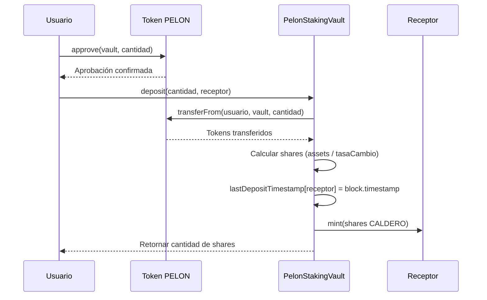
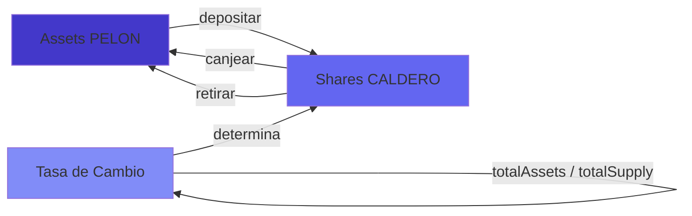
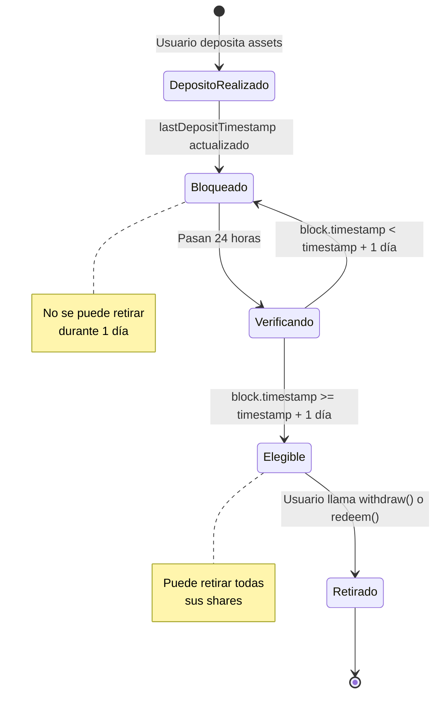
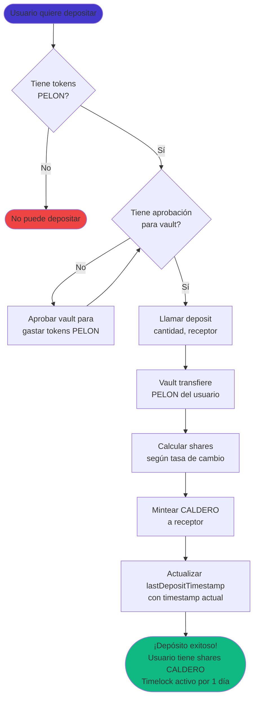
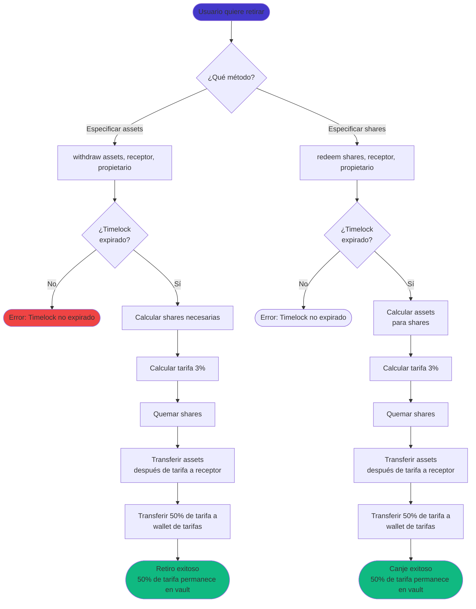

# Guía de Usuario del PelonStakingVault

## Introducción

El PelonStakingVault es un vault tokenizado compatible con ERC4626 que te permite hacer staking de tus tokens PELON. Cuando depositas tokens PELON en el vault, recibes shares del vault (CALDERO) que representan tu propiedad proporcional de los assets del vault. Esta guía explica cómo funciona el vault, cómo interactuar con él y qué esperar al hacer staking de tus tokens.

### ¿Qué es un Vault ERC4626?

ERC4626 es una interfaz estándar para vaults tokenizados en DeFi. Piensa en ello como un fondo mutuo: depositas assets (tokens PELON) y recibes shares (CALDERO) que representan tu porción del fondo. La ventaja clave es que estas shares son en sí mismas tokens ERC20, lo que significa que puedes transferirlas, comerciarlas o usarlas en otros protocolos DeFi.

El vault mantiene una relación entre assets y shares. Inicialmente, esta relación es 1:1 (1 PELON = 1 CALDERO), pero puede cambiar según los assets totales del vault y las shares totales. El estándar ERC4626 proporciona funciones integradas para convertir entre assets y shares de manera precisa.

### ¿Por qué usar PelonStakingVault?

El PelonStakingVault implementa dos mecanismos clave:

1. **Timelock Fijo de 1 Día**: Cada depósito bloquea los assets por un período fijo de 1 día antes de poder ser retirado. El timelock se reinicia cada vez que haces un nuevo depósito, contando desde el último depósito.

2. **Tarifa de Retiro Fija del 3%**: Cuando retiras assets usando las funciones `withdraw()` o `redeem()`, se deduce automáticamente una tarifa fija del 3% que se distribuye: 50% a wallet de tarifas, 50% permanece en el vault (aumenta valor por share para todos los holders).

Estos mecanismos fomentan el staking a corto plazo asegurando que todos los retiros estén sujetos a las mismas restricciones de timelock y tarifa. El componente que permanece en el vault proporciona valor adicional a todos los participantes del vault aumentando el valor por share.

### Conceptos Básicos

**Assets**: Tokens PELON que depositas en el vault. Estos son los tokens subyacentes.

**Shares**: Tokens CALDERO que representan tu propiedad en el vault. Recibes estos cuando depositas assets.

**Tasa de Cambio**: La relación entre assets y shares. Se calcula como `totalAssets / totalSupply`. Cuando el vault está vacío, la tasa es 1:1. A medida que se agregan o eliminan assets, la tasa se ajusta.

**Timelock**: Un período fijo de 1 día durante el cual los assets depositados no pueden ser retirados usando `withdraw()` o `redeem()`. El timelock aplica por usuario y se reinicia en cada nuevo depósito.

## Mecánica del Vault

### Cómo Funcionan los Depósitos

Cuando depositas tokens PELON en el vault, sucede lo siguiente:

1. Apruebas el contrato del vault para gastar tus tokens PELON (una vez o por transacción).
2. Llamas a `deposit(cantidad, receptor)` especificando cuántos tokens PELON depositar y quién debe recibir las shares.
3. El vault transfiere tus tokens PELON de tu wallet al contrato del vault.
4. El vault calcula cuántas shares debes recibir según la tasa de cambio actual.
5. El vault mintea shares CALDERO a la dirección del receptor especificada.
6. El vault actualiza el timestamp de último depósito del receptor.

El número de shares que recibes depende de la tasa de cambio actual. Si eres el primer depositante, recibirás shares en una relación 1:1. Si otros ya han depositado, la tasa puede diferir ligeramente debido al redondeo o si el vault ha acumulado assets.



### Cálculo de Shares

El vault usa el mecanismo estándar de cálculo de shares de ERC4626. Cuando depositas assets, el vault calcula las shares usando:

```
shares = assets * totalSupply / totalAssets
```

Si el vault está vacío (totalSupply = 0), el primer depósito usa un cálculo simplificado que asegura que recibas shares iguales a tus assets (relación 1:1), menos cualquier redondeo.

Para depósitos posteriores, la fórmula asegura que recibas una share proporcional del vault basada en los assets totales actuales. Esto protege contra ataques de inflación donde alguien podría manipular el valor del vault.

### Conversión Entre Assets y Shares

El vault proporciona varias funciones de solo lectura para ayudarte a entender la relación entre assets y shares:

- `convertToAssets(shares)`: Retorna cuántos tokens PELON representa una cantidad dada de shares
- `convertToShares(assets)`: Retorna cuántas shares recibirías por una cantidad dada de tokens PELON
- `previewDeposit(assets)`: Muestra cuántas shares recibirías por un depósito
- `previewWithdraw(assets)`: Muestra cuántas shares se quemarían por un retiro (antes de tarifa, según estándar ERC4626)
- `previewRedeem(shares)`: Muestra cuántos assets recibirías por canjear shares (antes de tarifa, según estándar ERC4626)

**Importante:** Las funciones preview estándar de ERC4626 (`previewWithdraw` y `previewRedeem`) muestran montos antes de tarifas, según el estándar. Para calcular cuánto recibirás después de la tarifa del 3%, puedes calcular manualmente: `assets - (assets * 3 / 100)`.

Estas funciones son de solo lectura y no requieren gas. Úsalas para planificar tus transacciones antes de ejecutarlas.



## Sistema de Timelock Simple

### Entendiendo el Timelock Fijo

Cada usuario tiene un único timestamp que se actualiza cada vez que deposita. Cuando depositas, el vault actualiza tu timestamp de último depósito con el momento actual. Los assets solo pueden ser retirados si han pasado al menos 1 día desde tu último depósito.

**Características del Timelock:**
- **Duración fija**: 1 día (86400 segundos)
- **No es configurable**: Es una constante del contrato
- **Se reinicia en cada depósito**: Cada vez que depositas, el timelock se reinicia contando desde ese momento
- **Aplica a todas tus shares**: No importa cuántas veces deposites, el timelock aplica a todas tus shares basándose en tu último depósito

### Cómo Funciona el Timelock

El timelock funciona de manera simple:

1. Cuando haces un depósito (o mint), el vault actualiza tu `lastDepositTimestamp` con el `block.timestamp` actual.
2. Cuando intentas retirar (usando `withdraw()` o `redeem()`), el vault verifica que `block.timestamp >= lastDepositTimestamp + 1 día`.
3. Si el timelock no ha expirado, la transacción revierte con el mensaje "PelonStakingVault: Timelock not expired".

Este diseño previene retiros inmediatos y reduce la volatilidad a corto plazo.



### Ejemplo: Múltiples Depósitos

El comportamiento del timelock con múltiples depósitos es importante de entender:

**Escenario:**
- **Día 0**: Depositas 1000 PELON → Recibes 1000 CALDERO
  - `lastDepositTimestamp[tuDireccion] = Día 0`
- **Día 0.5**: Depositas 500 PELON → Recibes 500 CALDERO
  - `lastDepositTimestamp[tuDireccion] = Día 0.5` (¡se reinicia!)
- **Día 1**: Intentas retirar
  - Verificación: `Día 1 >= Día 0.5 + 1 día?` → `Día 1 >= Día 1.5?` → **NO**
  - La transacción **revierte** (solo han pasado 0.5 días desde el último depósito)
- **Día 1.5**: Puedes retirar
  - Verificación: `Día 1.5 >= Día 0.5 + 1 día?` → `Día 1.5 >= Día 1.5?` → **SÍ**
  - Puedes retirar **todas** tus shares (1500 CALDERO), no solo las del último depósito

**Punto Importante:** El timelock se reinicia cada vez que depositas. Esto significa que si depositas frecuentemente, siempre necesitarás esperar 1 día desde tu último depósito para poder retirar, incluso si algunos de tus depósitos anteriores tienen más de 1 día de antigüedad.

### ¿Por qué el Timelock se Reinicia?

El timelock simple por usuario con reinicio en cada depósito:
- Previene retiros inmediatos después de depositar
- Reduce la volatilidad a corto plazo
- Simplifica la implementación del contrato
- Asegura que siempre haya al menos 1 día entre depósito y retiro

## Sistema de Tarifas de Retiro

### La Tarifa Fija

Cuando retiras assets usando las funciones `withdraw()` o `redeem()`, se deduce automáticamente una tarifa fija del 3% del monto del retiro. Esta tarifa se calcula como:

```
tarifa = assets * 300 / 10000
```

Donde 300 representa 3% en basis points. La tarifa se deduce antes de que los assets se transfieran a ti.

### Distribución de Tarifas (50/50)

La tarifa de retiro se distribuye en dos destinos:

1. **50% a Wallet de Tarifas**: Transferencia directa a la dirección de wallet de tarifas inmutable (configurada al desplegar el contrato)

2. **50% Permanece en el Vault**: El resto de la tarifa permanece en el contrato del vault
   - Esto aumenta el valor por share para todos los holders existentes
   - Proporciona un mecanismo de recompensa compuesto que beneficia a todos los stakers
   - Tus shares se vuelven más valiosas incluso si no retiras

### Ejemplo de Cálculo de Tarifa

Si retiras 1000 tokens PELON con una tarifa del 3%:

```
Tarifa Total = 1000 * 300 / 10000 = 30 PELON
Assets recibidos = 1000 - 30 = 970 PELON

Distribución de Tarifas:
- Wallet de tarifas: 15 PELON (50%)
- Permanece en vault: 15 PELON (50%, aumenta valor por share)
```

Recibes 970 PELON, y la tarifa de 30 PELON se distribuye como se muestra arriba.

### Beneficios de la Retención en el Vault

El componente que permanece en el vault (50%) crea valor para todos los participantes del vault:

- **Aumento del Valor por Share**: Cuando se retiran assets con tarifa, parte de la tarifa permanece en el vault sin mintear shares adicionales, lo que aumenta la tasa de cambio
- **Todos los Holders se Benefician**: Las shares de cada holder existente se vuelven más valiosas
- **Efecto Compuesto**: Mientras más tiempo hagas staking, más te beneficias de las tarifas que otros pagan
- **Sin Dilución**: A diferencia de las recompensas tradicionales que mintean nuevos tokens, esto no diluye a los holders existentes

**Ejemplo:**
- Vault tiene 1,000,000 PELON y 1,000,000 shares (relación 1:1)
- Alguien retira 10,000 PELON con tarifa del 3% = 300 PELON tarifa total
- 150 PELON permanecen en el vault (sin mintear nuevas shares)
- Nuevo estado: 1,000,150 PELON, 999,900 shares
- Nueva tasa de cambio: 1.00025 PELON por share (¡aumento del 0.025% para todos!)

### Configuración de Tarifas

El porcentaje de tarifa de retiro es **fijo** al 3% y no puede ser cambiado. Esto proporciona:
- Transparencia completa (todos saben exactamente cuánto se cobra)
- Comportamiento predecible
- Máxima descentralización (sin funciones administrativas)

### Interacción entre Tarifa y Timelock

Tanto `withdraw()` como `redeem()` están sujetos a las mismas restricciones de timelock y tarifa:

- **Usa `withdraw()`**: Sujeto a timelock de 1 día y tarifa del 3%. Especificas el monto exacto de assets que deseas retirar.
- **Usa `redeem()`**: Sujeto a timelock de 1 día y tarifa del 3%. Especificas el monto de shares que deseas canjear.

Ambas funciones tienen el mismo comportamiento en términos de restricciones y tarifas. La diferencia principal es que `withdraw()` trabaja con assets (tokens PELON) mientras que `redeem()` trabaja con shares (CALDERO).

## Operaciones del Usuario

### Hacer un Depósito

**Paso 1: Aprobar el Vault**

Antes de depositar, debes aprobar el contrato del vault para gastar tus tokens PELON. Esta es una aprobación estándar ERC20:

```solidity
pelonToken.approve(direccionVault, cantidad);
```

Puedes aprobar una cantidad específica para un solo depósito, o aprobar una cantidad mayor (o `type(uint256).max` para ilimitado) si planeas hacer múltiples depósitos.

**Paso 2: Llamar deposit()**

Una vez aprobado, llama a la función `deposit()` del vault:

```solidity
vault.deposit(cantidad, receptor);
```

Donde:
- `cantidad`: El número de tokens PELON a depositar (en wei, considerando 18 decimales)
- `receptor`: La dirección que recibirá las shares CALDERO (usualmente tu propia dirección)

La función retorna el número de shares que recibiste. También puedes verificar tu balance de CALDERO después de la transacción para confirmar.

**Paso 3: Verificar tu Depósito**

Después de depositar, puedes verificar:
- Tu balance de CALDERO (debe igualar las shares retornadas)
- Tu timestamp de último depósito: `lastDepositTimestamp(tuDireccion)` retorna el timestamp de tu último depósito



### Verificar tus Shares

Tus shares CALDERO son tokens ERC20, así que puedes verificar tu balance usando la función estándar ERC20 `balanceOf()`:

```solidity
caldero.balanceOf(tuDireccion)
```

También puedes usar la función `balanceOf()` del vault directamente, ya que CALDERO es el token de shares del vault.

### Verificar Timelock

Antes de retirar, puedes verificar si tu timelock ha expirado consultando directamente:

```solidity
uint256 lastDeposit = vault.lastDepositTimestamp(tuDireccion);
uint256 currentTime = block.timestamp;
bool canWithdraw = currentTime >= lastDeposit + 1 days;
```

O simplemente intentar retirar y ver si la transacción revierte (si el timelock no ha expirado, revertirá con el mensaje "PelonStakingVault: Timelock not expired").

### Retirar Assets

Tienes dos opciones para retirar:

#### Opción 1: withdraw() - Retiro Basado en Assets

Esta función te permite especificar exactamente cuántos tokens PELON quieres retirar:

```solidity
vault.withdraw(assets, receptor, propietario);
```

Donde:
- `assets`: El número de tokens PELON que quieres retirar
- `receptor`: Dirección que recibirá los tokens PELON
- `propietario`: Dirección que posee las shares (usualmente tu dirección, o usa `msg.sender`)

**Importante**: Esta función:
- Está sujeta al timelock de 1 día (debe haber pasado desde tu último depósito)
- Cobra una tarifa de retiro del 3%
- Calcula y quema las shares requeridas automáticamente

#### Opción 2: redeem() - Retiro Basado en Shares

Esta función te permite especificar cuántas shares canjear:

```solidity
vault.redeem(shares, receptor, propietario);
```

Donde:
- `shares`: El número de shares CALDERO a canjear
- `receptor`: Dirección que recibirá los tokens PELON
- `propietario`: Dirección que posee las shares

**Importante**: Esta función:
- Está sujeta al timelock de 1 día (debe haber pasado desde tu último depósito)
- Cobra una tarifa de retiro del 3%
- Calcula y transfiere los assets correspondientes a las shares canjeadas



### Cuándo Usar Cada Método

**Usa `withdraw()` cuando:**
- Sabes exactamente cuántos tokens PELON necesitas
- Tu timelock ha expirado (1 día desde tu último depósito)
- Estás de acuerdo con pagar la tarifa del 3%
- Quieres retirar montos específicos de assets

**Usa `redeem()` cuando:**
- Sabes exactamente cuántas shares quieres canjear
- Tu timelock ha expirado (1 día desde tu último depósito)
- Estás de acuerdo con pagar la tarifa del 3%
- Estás trabajando con montos de shares en lugar de montos de assets

## Casos de Uso Prácticos

### Caso 1: Depósito y Retiro Simple

**Escenario**: Alicia deposita 10,000 tokens PELON y espera 1 día antes de retirar.

**Día 0 - Depósito:**
- Alicia aprueba el vault para 10,000 PELON
- Alicia llama `deposit(10000 * 10^18, direccionAlicia)`
- Vault transfiere 10,000 PELON de Alicia
- Vault mintea 10,000 CALDERO a Alicia (asumiendo relación 1:1)
- `lastDepositTimestamp[direccionAlicia] = Día 0`

**Día 0 - Verificación:**
- Balance de CALDERO de Alicia: 10,000
- Timelock: No expirado (necesita 1 día)

**Día 1.1 - Retiro:**
- Timelock expirado (1.1 > 1 día)
- Alicia llama `withdraw(10000 * 10^18, direccionAlicia, direccionAlicia)`
- Cálculo de tarifa: 10,000 * 300 / 10,000 = 300 PELON tarifa total
- Distribución de tarifas:
  - Wallet de tarifas: 150 PELON (50%)
  - Permanece en vault: 150 PELON (50%, aumenta valor por share para todos)
- Alicia recibe: 10,000 - 300 = 9,700 PELON
- Balance de CALDERO de Alicia: 0

**Resultado**: Alicia hizo staking por 1.1 días, recibió 9,700 PELON de vuelta (97% del original), pagó 300 PELON de tarifa (3%). Los 150 PELON que permanecen en el vault aumentan el valor por share para todos los participantes restantes del vault.

### Caso 2: Múltiples Depósitos y Reinicio de Timelock

**Escenario**: Bob hace dos depósitos en diferentes momentos y quiere entender cuándo puede retirar.

**Línea de Tiempo:**
- **Día 0**: Bob deposita 5,000 PELON → Recibe 5,000 CALDERO
  - `lastDepositTimestamp[bob] = Día 0`
- **Día 0.5**: Bob deposita 3,000 PELON → Recibe 3,000 CALDERO
  - `lastDepositTimestamp[bob] = Día 0.5` (¡se reinicia!)

**Día 1 - Intentar Retirar:**
- Timelock: `Día 1 >= Día 0.5 + 1 día?` → `Día 1 >= Día 1.5?` → **NO**
- Bob intenta: `withdraw(5000 * 10^18, bob, bob)`
- **Resultado**: La transacción revierte con "PelonStakingVault: Timelock not expired"

**Día 1.5 - Retiro Exitoso:**
- Timelock: `Día 1.5 >= Día 0.5 + 1 día?` → `Día 1.5 >= Día 1.5?` → **SÍ**
- Bob puede retirar todas sus shares (8,000 CALDERO)
- Bob llama `withdraw(8000 * 10^18, bob, bob)`
- Bob recibe: 8,000 - 240 = 7,760 PELON (después de 3% de tarifa)

**Lección**: El timelock se reinicia en cada depósito. Si depositas frecuentemente, siempre necesitarás esperar 1 día desde tu último depósito.

### Caso 3: Intentar Retiro Temprano

**Escenario**: Carlos deposita 1,000 PELON en el Día 0 e intenta retirar en el Día 0.5.

**Día 0:**
- Carlos deposita 1,000 PELON → Recibe 1,000 CALDERO
- `lastDepositTimestamp[carlos] = Día 0`

**Día 0.5:**
- Timelock: 0.5 días (necesita 1 día)
- Carlos intenta: `withdraw(1000 * 10^18, direccionCarlos, direccionCarlos)`

**Resultado**: La transacción revierte con error:
```
"PelonStakingVault: Timelock not expired"
```

**Solución**: Carlos debe esperar hasta que el timelock expire (1 día desde el depósito). Una vez que el timelock haya expirado, puede usar tanto `withdraw()` como `redeem()`, ambos sujetos a la tarifa de retiro del 3%.

### Caso 4: Retiro Parcial

**Escenario**: Diana deposita 20,000 PELON y más tarde quiere retirar solo 5,000 PELON.

**Día 0:**
- Diana deposita 20,000 PELON → Recibe 20,000 CALDERO
- `lastDepositTimestamp[diana] = Día 0`

**Día 1.5 (timelock expirado):**
- Diana quiere retirar 5,000 PELON
- Diana llama `withdraw(5000 * 10^18, direccionDiana, direccionDiana)`

**Cálculo:**
- Shares necesarias: Calculadas por el vault según la tasa de cambio actual
- Tarifa total: 5,000 * 300 / 10,000 = 150 PELON (tarifa del 3%)
- Distribución de tarifas:
  - Wallet de tarifas: 75 PELON (50%)
  - Permanece en vault: 75 PELON (50%, aumenta valor por share)
- Diana recibe: 5,000 - 150 = 4,850 PELON
- CALDERO restante de Diana: ~15,000 (monto exacto depende de las shares quemadas)

**Resultado**: Diana todavía tiene ~15,000 CALDERO en staking y puede retirar más más tarde, o hacer depósitos adicionales que reiniciarán su timelock.

### Caso 5: Comparación entre withdraw() y redeem()

**Escenario**: Eva tiene 10,000 CALDERO de un depósito hecho hace 1.5 días. Quiere recuperar sus tokens PELON.

**Usando withdraw():**
```solidity
vault.withdraw(10000 * 10^18, direccionEva, direccionEva);
```
- Especifica: 10,000 tokens PELON deseados
- Timelock: ✅ Pasado (1.5 > 1 día)
- Tarifa: 3% = 300 PELON
- Distribución de tarifas: 150 a wallet, 150 permanece en vault
- Recibe: 9,700 PELON
- Shares quemadas: Calculadas automáticamente (~10,000 si tasa 1:1)

**Usando redeem():**
```solidity
vault.redeem(10000 * 10^18, direccionEva, direccionEva);
```
- Especifica: 10,000 shares CALDERO a canjear
- Timelock: ✅ Pasado (1.5 > 1 día)
- Tarifa: 3% = ~300 PELON (calculada sobre los assets recibidos)
- Assets calculados: ~10,000 PELON (según tasa de cambio)
- Distribución de tarifas: ~150 a wallet, ~150 permanece en vault
- Recibe: ~9,700 PELON (después de tarifa)
- Shares quemadas: 10,000 (exactamente como se especificó)

**Tabla de Comparación:**

| Aspecto | withdraw() | redeem() |
|---------|-----------|----------|
| Especificar | Monto de assets | Monto de shares |
| Timelock | Requerido (1 día fijo) | Requerido (1 día fijo) |
| Tarifa | 3% fijo | 3% fijo |
| Recibe (ejemplo 10k) | 9,700 PELON (después de tarifa 3%) | ~9,700 PELON (después de tarifa 3%) |
| Caso de uso | Saber monto de assets necesario | Saber monto de shares a canjear |

**Recomendación**: Ambas funciones tienen las mismas restricciones de timelock y tarifa. Usa `withdraw()` cuando sepas el monto exacto de assets que necesitas, y `redeem()` cuando sepas el monto exacto de shares que quieres canjear.

## Preguntas Frecuentes

### ¿Necesito aprobar tokens antes de depositar?

Sí. El contrato del vault necesita permiso para transferir tus tokens PELON. Debes llamar `approve(direccionVault, cantidad)` en el contrato de tokens PELON antes de llamar `deposit()`. Este es un requisito estándar ERC20.

Puedes aprobar una cantidad específica para una sola transacción, o aprobar una cantidad mayor (o ilimitado con `type(uint256).max`) si planeas hacer múltiples depósitos.

### ¿Puedo transferir mis shares CALDERO?

Sí. CALDERO es un token ERC20 estándar, así que puedes transferirlo como cualquier otro token. Cuando transfieres CALDERO a otra dirección, esa dirección se convierte en la propietaria de esas shares y puede canjearlas o retirarlas (sujeto a timelock si usa `withdraw()`).

Sin embargo, nota que el timelock está vinculado a la dirección del usuario. Si transfieres shares a alguien más, la verificación de timelock todavía se basa en el `lastDepositTimestamp` del propietario original de las shares.

### ¿Qué pasa si intento retirar antes de que expire el timelock?

Si llamas `withdraw()` o `redeem()` antes de que haya pasado 1 día desde tu último depósito, la transacción revertirá con un mensaje de error indicando que el timelock no ha expirado. Debes esperar a que el timelock expire antes de poder retirar tus assets.

### ¿Cómo se calcula el valor de mis shares?

El valor de tus shares está determinado por la tasa de cambio del vault:

```
valorShare = shares * totalAssets / totalSupply
```

Donde:
- `totalAssets`: Total de tokens PELON en el vault
- `totalSupply`: Total de shares CALDERO en circulación

Inicialmente, cuando el vault está vacío, la tasa es 1:1. A medida que se agregan o eliminan assets, la tasa se ajusta. El estándar ERC4626 asegura que este cálculo sea preciso y protege contra manipulación.

Puedes verificar el valor actual de tus shares usando:
- `convertToAssets(tusShares)`: Retorna el equivalente PELON de tus shares
- `previewRedeem(tusShares)`: Muestra cuántos PELON recibirías por canjear (antes de tarifa)

### ¿Hay límites de depósito o retiro?

No. El vault no impone límites en:
- Cuánto puedes depositar
- Cuántos depósitos puedes hacer
- Cuánto puedes retirar (siempre que el timelock se satisfaga)

Las únicas restricciones son:
- Debes tener suficientes tokens PELON para depositar
- Debes tener suficientes shares para retirar/canjear
- `withdraw()` requiere que haya pasado 1 día desde tu último depósito

### ¿Cómo sé cuándo puedo retirar?

Puedes verificar tu timestamp de último depósito directamente:

```solidity
uint256 lastDeposit = vault.lastDepositTimestamp(tuDireccion);
uint256 currentTime = block.timestamp;
bool canWithdraw = currentTime >= lastDeposit + 1 days;
```

O simplemente intentar retirar y ver si la transacción revierte. Si el timelock no ha expirado, la transacción revertirá con el mensaje "PelonStakingVault: Timelock not expired".

### ¿Qué pasa si el vault no tiene assets?

Si el vault está vacío (nadie ha depositado), el primer depositante recibirá shares en una relación 1:1. El estándar ERC4626 maneja este caso límite para prevenir división por cero y asegurar distribución justa de shares.

### ¿Puedo usar CALDERO en otros protocolos DeFi?

Sí. Como CALDERO es un token ERC20 estándar, puedes usarlo en cualquier protocolo que acepte tokens ERC20. Sin embargo, ten en cuenta que:
- El timelock aplica a operaciones `withdraw()` y `redeem()`, no a las shares mismas
- Otros protocolos no sabrán sobre el mecanismo de timelock
- Para retirar tus assets del vault, debes esperar a que el timelock expire

### ¿Qué pasa con las tarifas de retiro?

La tarifa de retiro fija del 3% se distribuye en dos destinos:
1. **50% a Wallet de Tarifas**: Se envía a una dirección de wallet de tarifas inmutable (configurada al desplegar el contrato)
2. **50% Permanece en el Vault**: Se queda en el contrato del vault, aumentando el valor por share para todos los holders

La wallet de tarifas es **inmutable** y no puede ser cambiada después del deployment. El porcentaje de tarifa también es **fijo** al 3% y no puede ser cambiado.

Las tarifas se cobran en operaciones `withdraw()` y `redeem()`.

## Consideraciones Técnicas

### Costos de Gas

Costos de gas estimados para operaciones comunes (aproximado, varía según condiciones de red):

- **Approve**: ~46,000 gas (una vez, o por transacción si no usas aprobación ilimitada)
- **Deposit**: ~120,000 - 150,000 gas (incluye transferencia de tokens, minteo de shares, actualización de timestamp)
- **Withdraw**: ~150,000 - 180,000 gas (incluye verificación de timelock, cálculo de tarifa, quema de shares, transferencias)
- **Redeem**: ~150,000 - 180,000 gas (incluye verificación de timelock, cálculo de tarifa, quema de shares, transferencias)
- **Funciones de solo lectura** (convertToAssets, previewDeposit, etc.): 0 gas (solo lectura)

Estas estimaciones asumen condiciones estándar. Los costos de gas pueden variar según:
- Congestión de red
- Cálculos de tasa de cambio actuales

### Mejores Prácticas

1. **Verifica antes de transaccionar**: Usa funciones de solo lectura (`convertToAssets`, `previewDeposit`, etc.) para verificar montos antes de ejecutar transacciones.

2. **Aprueba sabiamente**: Considera aprobar una cantidad mayor o ilimitada si planeas múltiples depósitos, pero ten en cuenta las implicaciones de seguridad.

3. **Entiende el timelock**: El timelock se reinicia en cada depósito. Si depositas frecuentemente, siempre necesitarás esperar 1 día desde tu último depósito para poder retirar.

4. **Elige el método correcto**: Usa `withdraw()` cuando necesites montos específicos de assets. Usa `redeem()` cuando sepas el monto exacto de shares que quieres canjear. Ambas funciones tienen las mismas restricciones de timelock y tarifa.

5. **Monitorea tus shares**: Tu balance de CALDERO representa tu stake. Mantén un registro de él por separado de tu balance de PELON.

6. **Calcula manualmente las tarifas**: Las funciones preview estándar muestran montos antes de tarifas. Para calcular cuánto recibirás después de la tarifa del 3%, calcula: `assets - (assets * 3 / 100)`.

### Consideraciones de Seguridad

El PelonStakingVault usa contratos probados de OpenZeppelin:
- **ERC4626**: Implementación estándar con protección contra ataques de inflación
- **SafeERC20**: Manejo seguro de transferencias de tokens

Características de seguridad clave:
- Protección contra reentrancy (heredada de ERC4626)
- Operaciones matemáticas seguras
- Validación de entrada
- Aplicación de timelock previene retiros prematuros
- Wallet de tarifas inmutable (no se puede cambiar)

Siempre:
- Verifica direcciones de contratos antes de interactuar
- Verifica dos veces los parámetros de transacción
- Comienza con montos de prueba pequeños
- Revisa los detalles de la transacción antes de confirmar

### Obtener Ayuda

Si encuentras problemas o tienes preguntas:
- Revisa esta guía primero
- Consulta la documentación técnica: [Análisis Técnico del Contrato PelonStakingVault](./pelon-staking-vault.md)
- Contacta al equipo a través de canales oficiales:
  - Sitio web: https://pelon.club
  - Email: carlos@pelon.club
  - Twitter: https://x.com/PelonClub
  - Telegram: https://t.me/PelonClub

---

**Última Actualización**: Diciembre 2024  
**Versión del Contrato**: PelonStakingVault v1.0  
**Red**: Base Mainnet / Base Sepolia Testnet

**Características Clave:**
- Timelock fijo (1 día)
- Tarifa de retiro fija (3%)
- Distribución de tarifas: 50% wallet, 50% permanece en vault (aumenta valor por share)
- Completamente descentralizado (sin funciones administrativas)
