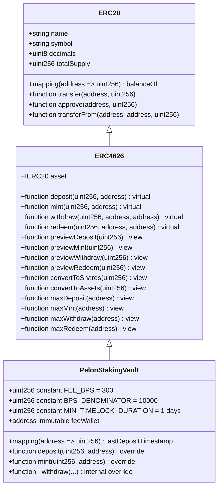
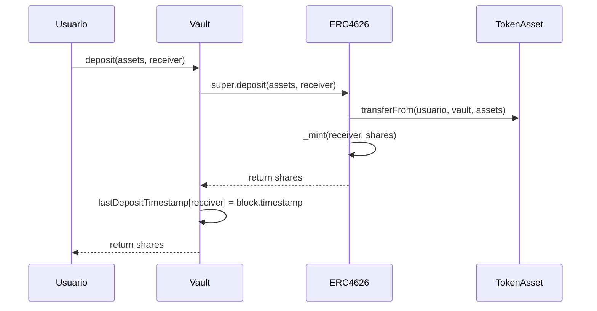
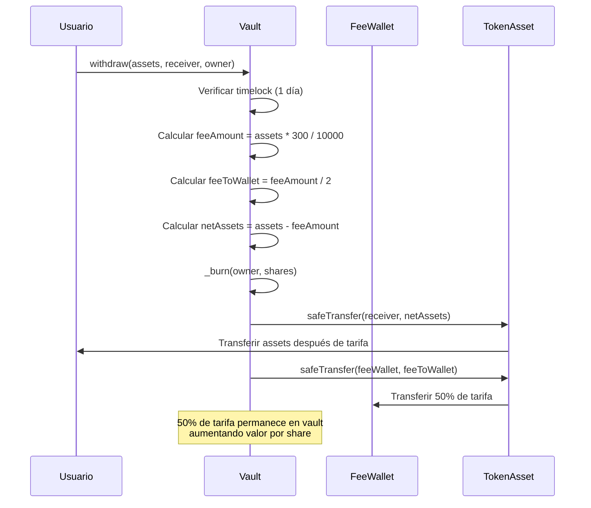
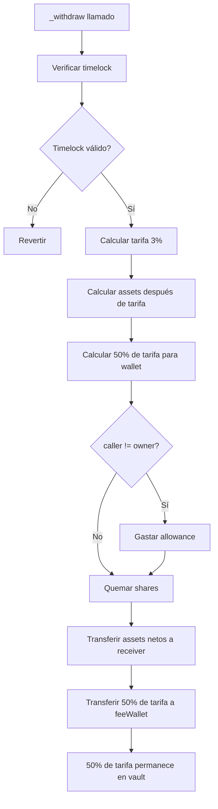

# Análisis Técnico del Contrato PelonStakingVault

## Resumen Ejecutivo

El contrato `PelonStakingVault` implementa un vault tokenizado compatible con ERC4626 para el staking de tokens PELON. Es una implementación minimalista y no actualizable que extiende la implementación probada de OpenZeppelin con un mecanismo de timelock simple y un sistema de tarifas de retiro fijo. El contrato permite a los usuarios depositar tokens PELON y recibir shares proporcionales del vault (CALDERO) que representan su participación en el vault, mientras aplica un período de timelock fijo de 1 día en los retiros.

La arquitectura utiliza únicamente la herencia de `ERC4626` de OpenZeppelin para la funcionalidad estándar de vault. El contrato mantiene plena compatibilidad con el estándar ERC4626 mientras agrega restricciones personalizadas en la función `_withdraw()`, aplicando timelock y tarifas de retiro a todas las operaciones de retiro y redención para asegurar consistencia.

El mecanismo de timelock es simple y por usuario: cada vez que un usuario deposita, se actualiza su timestamp de último depósito. Cuando un usuario intenta retirar assets, el contrato valida que haya pasado al menos 1 día desde su último depósito. Este diseño previene retiros inmediatos y reduce la volatilidad a corto plazo.

## Arquitectura y Herencia de Contratos

El contrato `PelonStakingVault` hereda únicamente de `ERC4626` de OpenZeppelin. Esta estructura de herencia proporciona una base sólida para las operaciones del vault manteniendo una implementación minimalista.



### Análisis del Orden de Herencia

El contrato `ERC4626` en sí mismo hereda de `ERC20`, creando una jerarquía de herencia de dos niveles:

1. **ERC20**: Proporciona la funcionalidad base de token para las shares del vault (CALDERO)
2. **ERC4626**: Extiende ERC20 con operaciones específicas de vault y lógica de conversión shares/assets

El constructor invoca explícitamente `ERC20("Pelon Vault: Caldero", "CALDERO")` para establecer el nombre y símbolo del token de shares del vault, y `ERC4626(asset)` para inicializar el vault con el asset subyacente (token PELON).

**Características de diseño:**
- No hay funciones administrativas (completamente descentralizado)
- No hay control de propietario
- Fee wallet inmutable (configurada una vez en el constructor)
- Implementación minimalista reduce la superficie de ataque

## Cumplimiento del Estándar ERC4626

El contrato mantiene pleno cumplimiento con el estándar ERC4626 (EIP-4626), que define una interfaz estándar para vaults tokenizados. Este cumplimiento asegura interoperabilidad con infraestructura DeFi existente, incluyendo agregadores, optimizadores de yield y otros protocolos que interactúan con vaults ERC4626.

### Funciones Estándar Preservadas

Todas las funciones estándar de ERC4626 permanecen completamente funcionales:

- **`deposit(uint256 assets, address receiver)`**: Deposita assets y mintea shares, con actualización adicional del timestamp de último depósito
- **`mint(uint256 shares, address receiver)`**: Mintea shares por assets, con actualización adicional del timestamp de último depósito
- **`withdraw(uint256 assets, address receiver, address owner)`**: Retira assets con restricciones de timelock y tarifa de retiro fija (3%)
- **`redeem(uint256 shares, address receiver, address owner)`**: Redime shares por assets con restricciones de timelock y tarifa de retiro fija (3%)
- **`previewDeposit(uint256 assets)`**: Calcula shares para una cantidad de assets dada
- **`previewMint(uint256 shares)`**: Calcula assets requeridos para una cantidad de shares dada
- **`previewWithdraw(uint256 assets)`**: Calcula shares requeridos para un retiro de assets dado
- **`previewRedeem(uint256 shares)`**: Calcula assets recibidos por una redención de shares dada
- **`convertToShares(uint256 assets)`**: Convierte assets a shares usando la tasa de cambio actual
- **`convertToAssets(uint256 shares)`**: Convierte shares a assets usando la tasa de cambio actual

### Comportamiento Modificado

La función `_withdraw()` tiene comportamiento modificado:

- **Aplicación de Timelock**: Solo se pueden retirar assets si han pasado al menos 1 día desde el último depósito del usuario
- **Tarifa de Retiro**: Se deduce una tarifa fija del 3% de los assets retirados y se distribuye: 50% a wallet de tarifas, 50% permanece en el vault (aumenta valor por share)

## Sistema de Timelock Simple

El mecanismo de timelock implementa un sistema simple por usuario donde solo se rastrea el timestamp del último depósito. Este diseño asegura que los usuarios no puedan retirar inmediatamente después de depositar.

### Estructura de Rastreo de Depósitos

Cada usuario tiene un único timestamp que se actualiza en cada depósito:

```solidity
mapping(address => uint256) public lastDepositTimestamp;
```

Este mapeo mantiene el timestamp del bloque cuando el usuario realizó su último depósito (a través de `deposit()` o `mint()`).

### Mecanismo de Registro de Depósitos

Cuando un usuario deposita assets a través de `deposit()` o `mint()`, el contrato:

1. Ejecuta la lógica estándar de depósito/mint de ERC4626 vía `super.deposit()` o `super.mint()`
2. Actualiza `lastDepositTimestamp[receiver]` con el `block.timestamp` actual



### Validación de Timelock

Cuando un usuario intenta retirar assets, el contrato valida la elegibilidad del timelock:

1. Obtiene el timestamp del último depósito del usuario
2. Verifica que `block.timestamp >= lastDepositTimestamp[owner] + MIN_TIMELOCK_DURATION`
3. Si la validación falla, la transacción revierte con el mensaje "PelonStakingVault: Timelock not expired"

```mermaid
flowchart TD
    A[Usuario llama withdraw/redeem] --> B[Obtener lastDepositTimestamp[owner]]
    B --> C{block.timestamp >= timestamp + 1 día?}
    C -->|No| D[Revertir: Timelock no expirado]
    C -->|Sí| E[Proceder con retiro]
```

### Duración del Timelock

El contrato usa un timelock fijo de 1 día:

```solidity
uint256 public constant MIN_TIMELOCK_DURATION = 1 days; // 86400 segundos
```

**Características del timelock:**
- Duración fija: 1 día (86400 segundos)
- No es configurable (constante)
- Se verifica en cada operación de retiro/redeem
- Se reinicia en cada nuevo depósito (actualiza el timestamp)

**Consideraciones:**
- El timelock se reinicia cada vez que el usuario deposita
- Si un usuario deposita múltiples veces, solo cuenta el timestamp del último depósito
- El timelock previene retiros inmediatos pero permite retiros después de 1 día

## Mecanismo de Tarifa de Retiro

El contrato implementa una tarifa de retiro fija del 3% que se deduce de los assets retirados y se distribuye en dos destinos: 50% a la wallet de tarifas inmutable y 50% permanece en el vault (aumenta el valor por share implícitamente).

### Cálculo de Tarifa

La tarifa de retiro se calcula usando basis points (BPS) para precisión:

```solidity
uint256 public constant FEE_BPS = 300; // 3%
uint256 public constant BPS_DENOMINATOR = 10000; // 100% en basis points
```

La fórmula de cálculo de tarifa:
```solidity
uint256 feeAmount = (assets * FEE_BPS) / BPS_DENOMINATOR;
```

Este enfoque asegura:
- Cálculo preciso de tarifa sin aritmética de punto flotante
- Sin errores de redondeo en el cálculo de tarifa
- Porcentaje de tarifa fijo (300 BPS = 3%)

### Distribución de Tarifas (50/50)

La tarifa de retiro se divide en dos componentes:

1. **50% a Wallet de Tarifas**: Transferencia directa a la dirección de wallet de tarifas inmutable
2. **50% permanece en Vault**: El resto de la tarifa permanece en el contrato del vault
   - Esto aumenta `totalAssets()` mientras `totalSupply()` permanece constante (o disminuye si se queman shares)
   - Efectivamente aumenta el valor por share para todos los holders existentes
   - Proporciona un mecanismo de recompensa compuesto que beneficia a todos los stakers

**Cálculo de Distribución de Tarifas:**
```solidity
uint256 feeAmount = (assets * FEE_BPS) / BPS_DENOMINATOR;
uint256 netAssets = assets - feeAmount;
uint256 feeToWallet = feeAmount / 2; // 50%
// El otro 50% permanece en el vault implícitamente
```

### Beneficios del Mecanismo de Retención en Vault

El componente que permanece en el vault (50%) crea valor para todos los participantes del vault:

- **Aumento del Valor por Share**: Cuando se retiran assets con tarifa, parte de la tarifa permanece en el vault sin mintear shares adicionales, lo que aumenta la tasa de cambio (`totalAssets / totalSupply`)
- **Efecto Compuesto**: Todos los holders existentes se benefician del aumento del valor por share
- **Incentivo a Largo Plazo**: Fomenta el staking a largo plazo a medida que el valor por share crece con el tiempo
- **Sin Dilución**: A diferencia de las recompensas de staking tradicionales que mintean nuevos tokens, este mecanismo no diluye a los holders existentes

**Ejemplo:**
- Vault tiene 1,000,000 PELON assets y 1,000,000 shares CALDERO (relación 1:1)
- Usuario retira 10,000 PELON con tarifa del 3% = 300 PELON tarifa total
- Distribución de tarifa: 150 PELON a wallet, 150 PELON permanecen en vault
- Nuevo estado: 1,000,150 PELON assets, 999,900 shares CALDERO
- Nueva tasa de cambio: ~1.00025 PELON por share (aumento del 0.025% para todos los holders)

### Flujo de Transferencia de Tarifa



### Gestión de la Wallet de Tarifas

La dirección de la wallet de tarifas es **inmutable** y se establece durante la construcción del contrato:

```solidity
address public immutable feeWallet;
```

Este diseño proporciona:
- Seguridad: No se puede cambiar después del deployment (completamente descentralizado)
- Transparencia: La dirección se establece una vez y permanece constante
- Simplicidad: No requiere funciones administrativas

La wallet de tarifas inicial se establece durante la construcción del contrato y no puede ser la dirección cero, asegurando que las tarifas siempre se envíen a un destinatario válido.

## Variables de Estado y Constantes

### Constantes

**`FEE_BPS`**: `uint256 public constant`
- Valor: `300` (representando 3%)
- Propósito: Porcentaje fijo de tarifa de retiro en basis points
- Inmutabilidad: No puede ser modificado después del despliegue

**`BPS_DENOMINATOR`**: `uint256 public constant`
- Valor: `10000` (representando 100%)
- Propósito: Denominador para cálculos de basis points
- Visibilidad: Pública para transparencia

**`MIN_TIMELOCK_DURATION`**: `uint256 public constant`
- Valor: `1 days` (86,400 segundos)
- Propósito: Duración fija del timelock
- Inmutabilidad: No puede ser modificado después del despliegue

### Variables de Estado

**`feeWallet`**: `address public immutable`
- Propósito: Dirección que recibe el 50% de las tarifas de retiro
- Mutabilidad: Inmutable (se establece en el constructor y no puede cambiar)
- Inicialización: Establecida en el constructor, validada para ser no-cero

**`lastDepositTimestamp`**: `mapping(address => uint256) public`
- Propósito: Rastrea el timestamp del último depósito de cada usuario
- Funcionalidad: Se actualiza cada vez que un usuario deposita o mintea shares
- Uso: Se verifica en operaciones de retiro/redeem para validar el timelock

## Análisis de Funciones Principales

### Constructor

```solidity
constructor(IERC20 assetToken, address _feeWallet)
    ERC20("Pelon Vault: Caldero", "CALDERO")
    ERC4626(assetToken)
{
    require(address(assetToken) != address(0), "PelonStakingVault: Asset token cannot be zero address");
    require(_feeWallet != address(0), "PelonStakingVault: Fee wallet cannot be zero address");
    feeWallet = _feeWallet;
}
```

**Parámetros:**
- `assetToken`: El token ERC20 subyacente (PELON) que puede ser depositado en el vault
- `_feeWallet`: Dirección que recibirá el 50% de las tarifas de retiro

**Orden de Inicialización:**
1. Constructor `ERC20` establece el nombre y símbolo del token de shares del vault ("Pelon Vault: Caldero", "CALDERO")
2. Constructor `ERC4626` inicializa el vault con el asset subyacente
3. Validación de parámetros del constructor

**Validación:**
- El token asset debe ser una dirección no-cero
- La wallet de tarifas debe ser una dirección no-cero para prevenir pérdida de tarifas

### Función deposit()

```solidity
function deposit(uint256 assets, address receiver) public override returns (uint256 shares) {
    shares = super.deposit(assets, receiver);
    lastDepositTimestamp[receiver] = block.timestamp;
    return shares;
}
```

**Funcionalidad:**
1. Llama al `ERC4626.deposit()` padre para ejecutar la lógica estándar de depósito
2. Actualiza el timestamp del último depósito para el receptor
3. Retorna las shares minteadas al receptor

**Puntos Clave:**
- Mantiene el comportamiento estándar completo de ERC4626
- Agrega actualización de timelock sin modificar la funcionalidad principal
- Las shares se mintean a `receiver`, no a `msg.sender` (permite depósitos en nombre de otros)

### Función mint()

```solidity
function mint(uint256 shares, address receiver) public override returns (uint256 assets) {
    assets = super.mint(shares, receiver);
    lastDepositTimestamp[receiver] = block.timestamp;
    return assets;
}
```

**Funcionalidad:**
1. Llama al `ERC4626.mint()` padre para ejecutar la lógica estándar de mint
2. Actualiza el timestamp del último depósito para el receptor
3. Retorna los assets requeridos para mintear las shares especificadas

**Puntos Clave:**
- Operación inversa de `deposit()` (especificar shares, recibir cantidad de assets)
- Mismo mecanismo de actualización de timelock que `deposit()`
- Útil cuando los usuarios quieren adquirir un número específico de shares

### Función _withdraw() (función interna sobrescrita)

```solidity
function _withdraw(
    address caller,
    address receiver,
    address owner,
    uint256 assets,
    uint256 shares
) internal override {
    require(
        block.timestamp >= lastDepositTimestamp[owner] + MIN_TIMELOCK_DURATION,
        "PelonStakingVault: Timelock not expired"
    );
    
    uint256 feeAmount = (assets * FEE_BPS) / BPS_DENOMINATOR;
    
    uint256 netAssets = assets - feeAmount;
    
    uint256 feeToWallet = feeAmount / 2;

    if (caller != owner) {
        _spendAllowance(owner, caller, shares);
    }

    _burn(owner, shares);

    IERC20(asset()).safeTransfer(receiver, netAssets);

    if (feeToWallet > 0) {
        IERC20(asset()).safeTransfer(feeWallet, feeToWallet);
    }
}
```

**Flujo de Función:**



**Características Clave:**
- Validación de timelock antes del procesamiento
- Cálculo y transferencia de tarifa
- El 50% de la tarifa permanece en el vault implícitamente
- Soporte para retiros aprobados (retiros de terceros)

**Consideraciones de Seguridad:**
- El timelock se verifica primero para prevenir retiros prematuros
- La tarifa se calcula antes de las transferencias
- El allowance se gasta antes de quemar shares
- Usa `SafeERC20` para transferencias seguras de tokens

## Eventos

El contrato no define eventos personalizados. Utiliza únicamente los eventos estándar de ERC4626:

- **`Deposit`**: Emitido cuando se depositan assets (heredado de ERC4626)
- **`Withdraw`**: Emitido cuando se retiran assets (heredado de ERC4626)

Estos eventos estándar proporcionan suficiente información para rastreo off-chain y análisis.

## Consideraciones de Seguridad

### Protección Contra Ataques de Inflación

El contrato hereda la implementación de ERC4626 de OpenZeppelin, que incluye protección incorporada contra ataques de inflación. El estándar usa un mecanismo de "virtual shares" que previene que atacantes manipulen los precios de shares depositando cantidades mínimas antes de depósitos grandes.

**Cómo Funciona:**
- ERC4626 usa `_convertToShares()` y `_convertToAssets()` con protección de redondeo
- El primer depositante recibe shares basadas en una cantidad virtual mínima
- Los depósitos subsecuentes usan balances de assets reales para conversión

### Protección Contra Reentrancy

El contrato hereda las protecciones de reentrancy de la implementación ERC4626 de OpenZeppelin. La función `_withdraw()` sigue el patrón Checks-Effects-Interactions (CEI):

1. **Checks**: Validación de timelock
2. **Effects**: Quema de shares
3. **Interactions**: Transferencias de tokens (assets netos y tarifa)

`SafeERC20` se usa para todas las transferencias de tokens, lo que proporciona protección adicional contra comportamientos de tokens no estándar.

### Prevención de Bypass de Timelock

El sistema de timelock simple previene que los usuarios retiren inmediatamente después de depositar:

- Cada depósito actualiza el timestamp del usuario
- Los retiros verifican que haya pasado al menos 1 día desde el último depósito
- No hay forma de evitar esta verificación

Este diseño asegura que los usuarios no puedan hacer retiros inmediatos, reduciendo la volatilidad a corto plazo.

### Precisión del Cálculo de Tarifa

El cálculo de tarifa usa aritmética entera con basis points para evitar pérdida de precisión:

```solidity
uint256 feeAmount = (assets * FEE_BPS) / BPS_DENOMINATOR;
```

**Análisis de Precisión:**
- Para 1,000,000 PELON (18 decimales): `(1000000 * 10^18 * 300) / 10000 = 30,000 * 10^18`
- Sin pérdida de precisión para cantidades típicas de tokens
- El redondeo siempre favorece al protocolo (hacia abajo para el cálculo de tarifa)

### Control de Acceso

El contrato **no tiene** funciones administrativas:

- No hay control de propietario
- No hay funciones `onlyOwner`
- La wallet de tarifas es inmutable
- Todos los parámetros son constantes

Este diseño proporciona:
- Máxima descentralización
- Sin riesgo de cambios no autorizados
- Comportamiento predecible y transparente

## Optimización de Gas

### Uso de Constantes

Las constantes se compilan en bytecode, proporcionando ahorros de gas:
- `FEE_BPS`: Leído desde bytecode (~3 gas) vs storage (~2,100 gas)
- `BPS_DENOMINATOR`: Misma optimización
- `MIN_TIMELOCK_DURATION`: Misma optimización

### Inmutabilidad

La wallet de tarifas es `immutable`, lo que significa:
- Se almacena en bytecode después del deployment
- Lecturas desde bytecode en lugar de storage
- Ahorro de gas significativo

### Funciones View

Las funciones view de ERC4626 están disponibles para consultas sin costo de gas:
- `convertToShares()` y `convertToAssets()` para conversiones
- `previewDeposit()`, `previewMint()`, `previewWithdraw()`, `previewRedeem()` para estimaciones

## Ejemplos de Uso

### Ejemplo 1: Depósito y Retiro Básico

```solidity
// Usuario deposita 1000 tokens PELON
uint256 assets = 1000 * 10**18; // 1000 PELON con 18 decimales
uint256 shares = vault.deposit(assets, msg.sender);

// Después de 1 día, el usuario puede retirar
// (asumiendo que no ha hecho más depósitos)
vault.withdraw(assets, msg.sender, msg.sender);
// Usuario recibe: assets - (assets * 3 / 100) = 970 PELON
// Distribución de tarifas (3% = 30 PELON total):
//   - Wallet de tarifas: 15 PELON (50%)
//   - Permanece en vault: 15 PELON (50%, aumenta valor por share)
```

### Ejemplo 2: Múltiples Depósitos

```solidity
// Día 0: Depositar 100 PELON
vault.deposit(100 * 10**18, msg.sender);
// lastDepositTimestamp[msg.sender] = block.timestamp (Día 0)

// Día 0.5: Depositar 200 PELON
vault.deposit(200 * 10**18, msg.sender);
// lastDepositTimestamp[msg.sender] = block.timestamp (Día 0.5) - SE REINICIA

// Día 1.5: Puede retirar (1 día desde último depósito en Día 0.5)
vault.withdraw(200 * 10**18, msg.sender, msg.sender);
// Usuario recibe: 194 PELON (después de 3% de tarifa)
```

**Nota Importante:** El timelock se reinicia en cada depósito. Si un usuario deposita múltiples veces, solo cuenta el tiempo desde el último depósito.

### Ejemplo 3: Usar redeem() para Canjear Shares

```solidity
// Usuario tiene shares y quiere canjearlas por assets
uint256 shares = 1000 * 10**18; // 1000 shares

// Verificar que ha pasado el timelock (1 día desde último depósito)
// Si el timelock no ha expirado, la transacción revertirá

// redeem() aplica timelock y tarifa del 3%
uint256 assets = vault.redeem(shares, msg.sender, msg.sender);
// Usuario recibe assets después de aplicar tarifa del 3%
```

**Nota:** `redeem()` también aplica las mismas restricciones de timelock y tarifa que `withdraw()`, asegurando consistencia en el comportamiento del vault.

## Consideraciones de Despliegue

### Despliegue en Base Mainnet

**Especificaciones de Red:**
- Chain ID: 8453
- Tiempo de Bloque: ~2 segundos
- Precio de Gas: Variable (verificar condiciones actuales de red)

**Pasos de Despliegue:**
1. Desplegar contrato de token PELON (si no está ya desplegado)
2. Desplegar PelonStakingVault con dirección del token PELON y dirección de wallet de tarifas
3. Verificar contrato en Basescan
4. Inicializar vault con liquidez inicial si es necesario

**Parámetros del Constructor:**
- `assetToken`: Dirección del contrato de token PELON
- `_feeWallet`: Dirección que recibirá las tarifas de retiro (debe ser no-cero, inmutable)

### Despliegue en Base Sepolia Testnet

**Especificaciones de Red:**
- Chain ID: 84532
- Tiempo de Bloque: ~2 segundos
- Propósito: Pruebas y desarrollo

**Consideraciones de Pruebas:**
- Usar tokens PELON de prueba o mocks
- Probar timelock con diferentes escenarios
- Verificar recolección y distribución de tarifas
- Probar comportamiento con múltiples depósitos

### Configuración Inicial

**Selección de Wallet de Tarifas:**
- Elegir una wallet segura, no-custodial para la recolección de tarifas
- Considerar multi-sig para seguridad adicional
- Documentar dirección de wallet de tarifas para transparencia
- **IMPORTANTE**: La dirección no se puede cambiar después del deployment (es inmutable)

**Inicialización del Vault:**
- No se requiere depósito inicial (el vault puede comenzar vacío)
- El primer depositante recibe shares basadas en el mecanismo de virtual shares de ERC4626
- Considerar sembrar el vault con liquidez inicial para mejor UX

## Conclusión

El contrato `PelonStakingVault` proporciona un mecanismo de staking seguro y compatible con ERC4626 con características simples pero efectivas de timelock y tarifas. El diseño mantiene pleno cumplimiento del estándar mientras agrega restricciones personalizadas que protegen el protocolo y generan ingresos a través de tarifas de retiro.

Fortalezas clave de la implementación:
- Cumplimiento completo del estándar ERC4626 para interoperabilidad
- Sistema de timelock fijo (1 día) previniendo retiros inmediatos
- Sistema de tarifas fijo (3%) con distribución de tarifas transparente (50/50)
- Mecanismo de retención en vault que aumenta el valor por share para todos los holders
- Implementación minimalista reduce superficie de ataque
- Completamente descentralizado (sin funciones administrativas)
- Contratos base probados de OpenZeppelin
- Wallet de tarifas inmutable para máxima seguridad

El contrato está listo para producción para despliegue en Base Mainnet y Base Sepolia, con consideración cuidadosa dada a características específicas de red como tiempo de bloque y precisión de timestamp.

---

**Última actualización:** Diciembre 2024  
**Versión del sistema de diseño:** 1.0.0  
**Tema activo:** Minimalista y Descentralizado  
**Autor:** baeza.eth (King Of The Pelones)
