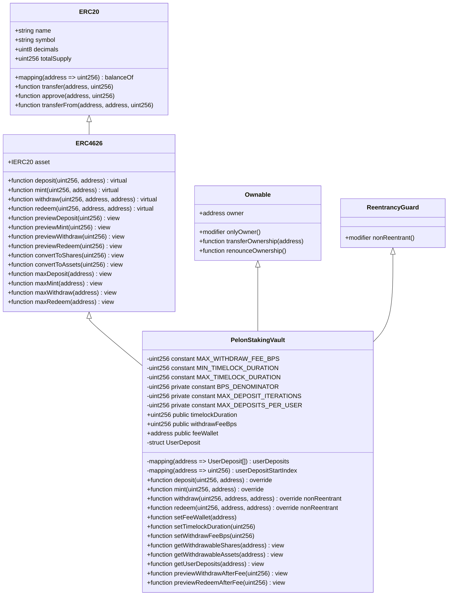
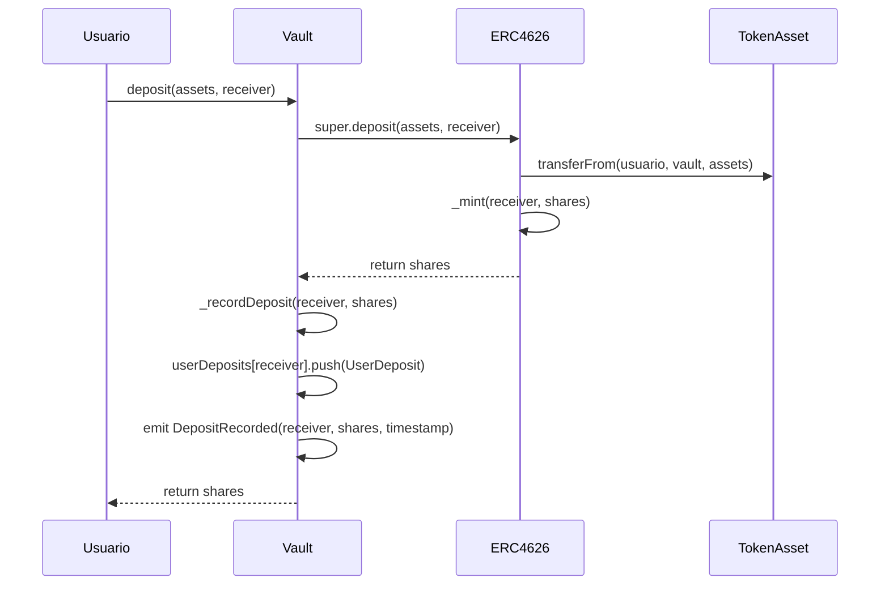
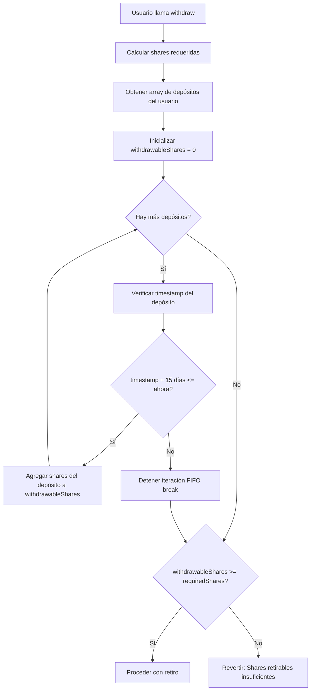
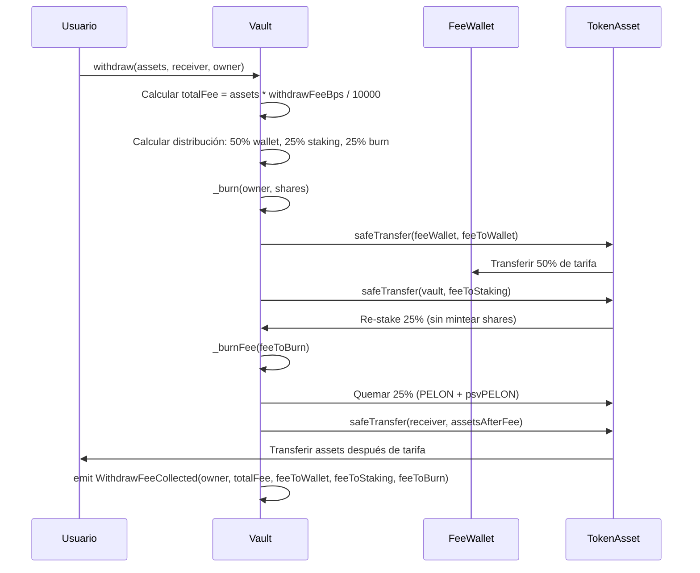
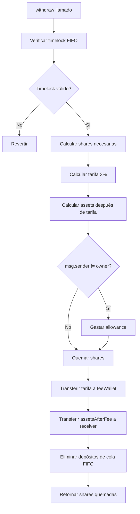

# Análisis Técnico del Contrato PelonStakingVault

## Resumen Ejecutivo

El contrato `PelonStakingVault` implementa un sistema de vault tokenizado compatible con ERC4626 para el staking de tokens PELON, extendiendo la implementación probada de OpenZeppelin con un mecanismo de timelock First-In-First-Out (FIFO) y un sistema de tarifas de retiro configurable. El contrato permite a los usuarios depositar tokens PELON y recibir shares proporcionales del vault (psvPELON) que representan su participación en el vault, mientras aplica un período de timelock configurable (por defecto 15 días, rango 1-90 días) en los retiros mediante un sistema de cola FIFO estricto.

La arquitectura aprovecha la herencia múltiple de contratos de OpenZeppelin, específicamente `ERC4626` para la funcionalidad estándar de vault, `Ownable` para el control administrativo sobre la configuración de la wallet de tarifas, timelock y tarifas, y `ReentrancyGuard` para protección contra ataques de reentrancia. El contrato mantiene plena compatibilidad con el estándar ERC4626 mientras agrega restricciones personalizadas en las funciones `withdraw()` y `redeem()`, aplicando timelock y tarifas de retiro a ambas operaciones para asegurar consistencia y prevenir evasión de restricciones.

El mecanismo de timelock opera sobre una base por depósito, donde cada depósito se rastrea individualmente con su timestamp. Cuando un usuario intenta retirar assets, el contrato valida que solo los depósitos que han excedido el período de timelock configurable (por defecto 15 días) pueden ser retirados, procesándolos en orden FIFO estricto. Este diseño previene que los usuarios evadan el timelock retirando selectivamente depósitos más nuevos mientras los depósitos antiguos permanecen bloqueados.

## Arquitectura y Herencia de Contratos

El contrato `PelonStakingVault` utiliza herencia múltiple para combinar funcionalidad de los contratos `ERC4626` y `Ownable` de OpenZeppelin. Esta estructura de herencia proporciona una base sólida para las operaciones del vault mientras mantiene control administrativo sobre parámetros críticos.



### Análisis del Orden de Herencia

El orden de herencia `ERC4626, Ownable, ReentrancyGuard` es crítico para la inicialización correcta. El contrato `ERC4626` en sí mismo hereda de `ERC20`, creando una jerarquía de herencia de múltiples niveles:

1. **ERC20**: Proporciona la funcionalidad base de token para las shares del vault (psvPELON)
2. **ERC4626**: Extiende ERC20 con operaciones específicas de vault y lógica de conversión shares/assets
3. **Ownable**: Agrega control de acceso administrativo para la gestión de la wallet de tarifas, timelock y configuración de tarifas
4. **ReentrancyGuard**: Proporciona protección contra ataques de reentrancia mediante el modificador `nonReentrant`

El constructor invoca explícitamente `ERC20("Pelon Staking Vault", "psvPELON")` para establecer el nombre y símbolo del token de shares del vault, `ERC4626(asset)` para inicializar el vault con el asset subyacente (token PELON), y `Ownable(msg.sender)` para establecer al deployer como propietario del contrato. `ReentrancyGuard` se hereda para proteger las funciones `withdraw()` y `redeem()`.

## Cumplimiento del Estándar ERC4626

El contrato mantiene pleno cumplimiento con el estándar ERC4626 (EIP-4626), que define una interfaz estándar para vaults tokenizados. Este cumplimiento asegura interoperabilidad con infraestructura DeFi existente, incluyendo agregadores, optimizadores de yield y otros protocolos que interactúan con vaults ERC4626.

### Funciones Estándar Preservadas

Todas las funciones estándar de ERC4626 permanecen completamente funcionales:

- **`deposit(uint256 assets, address receiver)`**: Deposita assets y mintea shares, con rastreo adicional de depósitos
- **`mint(uint256 shares, address receiver)`**: Mintea shares por assets, con rastreo adicional de depósitos
- **`redeem(uint256 shares, address receiver, address owner)`**: Redime shares por assets con restricciones de timelock y tarifa de retiro configurable (por defecto 3%)
- **`previewDeposit(uint256 assets)`**: Calcula shares para una cantidad de assets dada
- **`previewMint(uint256 shares)`**: Calcula assets requeridos para una cantidad de shares dada
- **`previewWithdraw(uint256 assets)`**: Calcula shares requeridos para un retiro de assets dado
- **`previewRedeem(uint256 shares)`**: Calcula assets recibidos por una redención de shares dada
- **`convertToShares(uint256 assets)`**: Convierte assets a shares usando la tasa de cambio actual
- **`convertToAssets(uint256 shares)`**: Convierte shares a assets usando la tasa de cambio actual

### Comportamiento Modificado

Las funciones `withdraw()` y `redeem()` tienen comportamiento modificado con las mismas restricciones:

- **Aplicación de Timelock**: Solo los depósitos que han excedido el período de timelock configurable (por defecto 15 días, rango 1-90 días) pueden ser retirados
- **Tarifa de Retiro**: Se deduce una tarifa configurable (por defecto 3%, máximo 10%) de los assets retirados y se distribuye: 50% a wallet de tarifas, 25% re-stakeado (aumenta valor por share), 25% quemado
- **Procesamiento FIFO**: Los depósitos se procesan en orden estricto primero-en-entrar-primero-en-salir

Ambas funciones aplican estas restricciones de manera consistente, asegurando que no haya forma de evitar el timelock o la tarifa. La diferencia principal entre `withdraw()` y `redeem()` es que `withdraw()` trabaja con assets (tokens PELON) mientras que `redeem()` trabaja con shares (psvPELON).

## Sistema de Timelock FIFO

El mecanismo de timelock implementa un sistema de cola estricto First-In-First-Out donde cada depósito se rastrea individualmente con su timestamp. Este diseño asegura que los depósitos deben ser retirados en el orden en que fueron realizados, y solo después de que el período de timelock haya expirado.

### Estructura de Rastreo de Depósitos

Cada depósito se registra usando la estructura `UserDeposit`:

```solidity
struct UserDeposit {
    uint256 shares;      // Número de shares del vault de este depósito
    uint256 timestamp;   // Timestamp del bloque cuando se realizó el depósito
}
```

El mapeo `userDeposits` mantiene un array de depósitos para cada dirección de usuario, formando una cola FIFO donde el primer elemento representa el depósito más antiguo:

```solidity
mapping(address => UserDeposit[]) public userDeposits;
```

### Mecanismo de Registro de Depósitos

Cuando un usuario deposita assets a través de `deposit()` o `mint()`, el contrato:

1. Ejecuta la lógica estándar de depósito/mint de ERC4626 vía `super.deposit()` o `super.mint()`
2. Calcula las shares recibidas de la operación
3. Valida que el usuario no exceda `MAX_DEPOSITS_PER_USER` (1000 depósitos activos)
4. Registra una nueva entrada `UserDeposit` con el `block.timestamp` actual
5. Emite un evento `DepositRecorded` para rastreo off-chain

**Límite de Depósitos:**
- Máximo de 1000 depósitos activos por dirección de usuario
- Depósitos activos = depósitos totales - depósitos consumidos (rastreados vía `userDepositStartIndex`)
- Previene agotamiento de gas de usuarios con cantidades excesivas de depósitos
- La validación ocurre en `_recordDeposit()` antes de agregar nuevo depósito



### Validación de Timelock

Cuando un usuario intenta retirar assets, el contrato valida la elegibilidad del timelock a través de `_checkTimelock()`:

1. Calcula las shares requeridas para la cantidad de assets solicitada usando `previewWithdraw(assets)`
2. Determina las shares retirables iterando a través de los depósitos en orden FIFO
3. Se detiene en el primer depósito que no ha excedido el período de timelock
4. Requiere que las shares retirables sean suficientes para el retiro solicitado



### Procesamiento de Retiro FIFO

La función `_removeDeposits()` procesa los retiros en orden FIFO estricto usando un sistema optimizado basado en índices:

1. Usa `userDepositStartIndex` para rastrear la posición inicial de depósitos activos
2. Itera a través de los depósitos comenzando desde `startIndex` (depósito activo más antiguo)
3. Valida que cada depósito haya excedido el timelock antes de la eliminación
4. Elimina shares de los depósitos en orden hasta que se satisfaga la cantidad de retiro
5. Actualiza `userDepositStartIndex` para omitir depósitos procesados (optimización de gas)
6. Maneja el consumo parcial de depósitos cuando un depósito es más grande que la cantidad de retiro restante

**Optimización de Gas:**
En lugar de desplazar elementos del array (complejidad O(n)), el contrato usa un enfoque basado en índices:
- `userDepositStartIndex[user]` rastrea dónde comienzan los depósitos activos
- Cuando los depósitos se consumen completamente, el índice se incrementa
- Esto evita operaciones costosas de desplazamiento de arrays
- Máximo de `MAX_DEPOSIT_ITERATIONS` (500) iteraciones para prevenir agotamiento de gas

El algoritmo asegura que:
- Solo los depósitos que han pasado el timelock pueden ser eliminados
- Los depósitos se consumen en orden cronológico
- Los depósitos parciales se manejan correctamente (las shares restantes permanecen en la cola)
- Los costos de gas se minimizan a través de la optimización basada en índices

```mermaid
flowchart TD
    A[Iniciar _removeDeposits] --> B[sharesToRemove = shares]
    B --> C{deposits.length > 0 AND sharesToRemove > 0?}
    C -->|Sí| D[Obtener primer depósito deposits[0]]
    D --> E{timestamp + 15 días <= ahora?}
    E -->|No| F[Revertir: Timelock no expirado]
    E -->|Sí| G{firstDeposit.shares <= sharesToRemove?}
    G -->|Sí| H[sharesToRemove -= firstDeposit.shares]
    H --> I[Desplazar todos los depósitos una posición a la izquierda]
    I --> J[deposits.pop]
    J --> C
    G -->|No| K[firstDeposit.shares -= sharesToRemove]
    K --> L[sharesToRemove = 0]
    L --> C
    C -->|No| M{sharesToRemove == 0?}
    M -->|Sí| N[Éxito]
    M -->|No| O[Revertir: Depósitos elegibles insuficientes]
```

### Duración del Timelock y Consideraciones de la Red Base

El contrato usa `block.timestamp` en lugar de `block.number` para los cálculos de timelock, lo cual es crítico para restricciones basadas en tiempo precisas en la red Base:

**Por qué `block.timestamp` en Base:**

- Base Mainnet y Base Sepolia tienen tiempos de bloque consistentes de aproximadamente 2 segundos
- `block.timestamp` proporciona cálculos basados en tiempo precisos independientemente de las variaciones del tiempo de bloque
- El timelock configurable (por defecto 15 días = 1,296,000 segundos) requiere medición de tiempo precisa
- `block.number` sería menos preciso debido a posibles variaciones en el tiempo de bloque

**Configuración del Timelock:**
```solidity
uint256 public timelockDuration; // Por defecto: 15 días (1,296,000 segundos)
uint256 public constant MIN_TIMELOCK_DURATION = 1 days;
uint256 public constant MAX_TIMELOCK_DURATION = 90 days;
```

La duración del timelock es configurable por el propietario del contrato vía `setTimelockDuration()` dentro del rango de 1-90 días. El valor por defecto de `15 days` (1,296,000 segundos) se establece en el constructor, asegurando comportamiento consistente en todas las condiciones de red.

**Control Administrativo:**
El propietario del contrato puede actualizar la duración del timelock usando `setTimelockDuration(uint256 duration)`, que valida que la nueva duración esté dentro del rango permitido (1-90 días). Esto proporciona flexibilidad para ajustar el período de timelock según las necesidades del protocolo mientras se mantienen límites razonables.

## Mecanismo de Tarifa de Retiro

El contrato implementa una tarifa de retiro configurable (por defecto 3%, máximo 10%) que se deduce de los assets retirados y se distribuye en tres destinos: 50% a la wallet de tarifas, 25% re-stakeado en el vault (sin mintear shares, aumentando el valor por share), y 25% quemado (tanto tokens PELON como shares psvPELON equivalentes). Esta tarifa aplica a operaciones `withdraw()` y `redeem()`, asegurando que todas las retiradas estén sujetas a la misma distribución de tarifas.

### Cálculo de Tarifa

La tarifa de retiro se calcula usando basis points (BPS) para precisión:

```solidity
uint256 public withdrawFeeBps; // Por defecto: 300 (3%), configurable hasta 1000 (10%)
uint256 public constant MAX_WITHDRAW_FEE_BPS = 1000; // Máximo 10%
uint256 private constant BPS_DENOMINATOR = 10000; // 100% en basis points
```

La fórmula de cálculo de tarifa:
```solidity
uint256 totalFee = (assets * withdrawFeeBps) / BPS_DENOMINATOR;
```

Este enfoque asegura:
- Cálculo preciso de tarifa sin aritmética de punto flotante
- Sin errores de redondeo en el cálculo de tarifa
- Porcentaje de tarifa configurable (por defecto 300 BPS = 3%, máximo 1000 BPS = 10%)

### Distribución de Tarifas (50/25/25)

La tarifa de retiro se divide en tres componentes:

1. **50% a Wallet de Tarifas**: Transferencia directa a la dirección de wallet de tarifas configurable
2. **25% Re-staking**: Transferido de vuelta al contrato del vault SIN mintear nuevas shares
   - Esto aumenta `totalAssets()` mientras `totalSupply()` permanece constante
   - Efectivamente aumenta el valor por share para todos los holders existentes
   - Proporciona un mecanismo de recompensa compuesto que beneficia a todos los stakers
3. **25% Quemado**: Tanto tokens PELON como shares psvPELON equivalentes son quemados
   - Reduce el suministro total de ambos assets y shares
   - Crea presión deflacionaria en el token

**Cálculo de Distribución de Tarifas:**
```solidity
function _calculateFeeDistribution(uint256 assets) 
    internal 
    view 
    returns (uint256 feeToWallet, uint256 feeToBurn, uint256 feeToStaking, uint256 totalFee) 
{
    uint256 denominatorSquared = BPS_DENOMINATOR * BPS_DENOMINATOR;
    
    feeToWallet = (assets * withdrawFeeBps * 5000) / denominatorSquared; // 50%
    feeToBurn = (assets * withdrawFeeBps * 2500) / denominatorSquared; // 25%
    feeToStaking = (assets * withdrawFeeBps * 2500) / denominatorSquared; // 25%
    totalFee = feeToWallet + feeToBurn + feeToStaking;
}
```

### Beneficios del Mecanismo de Re-staking

El componente de re-staking del 25% crea valor para todos los participantes del vault:

- **Aumento del Valor por Share**: Cuando se agregan assets al vault sin mintear shares, la tasa de cambio (`totalAssets / totalSupply`) aumenta
- **Efecto Compuesto**: Todos los holders existentes se benefician del aumento del valor por share
- **Incentivo a Largo Plazo**: Fomenta el staking a largo plazo a medida que el valor por share crece con el tiempo
- **Sin Dilución**: A diferencia de las recompensas de staking tradicionales que mintean nuevos tokens, este mecanismo no diluye a los holders existentes

**Ejemplo:**
- Vault tiene 1,000,000 PELON assets y 1,000,000 shares psvPELON (relación 1:1)
- Usuario retira 10,000 PELON con tarifa del 3% = 300 PELON tarifa total
- Distribución de tarifa: 150 PELON a wallet, 75 PELON re-stakeados, 75 PELON quemados
- Nuevo estado: 1,000,075 PELON assets, 999,925 shares psvPELON
- Nueva tasa de cambio: 1.00015 PELON por share (aumento del 0.015% para todos los holders)

### Flujo de Transferencia de Tarifa



### Gestión de Configuración de Tarifas

El porcentaje de tarifa de retiro es configurable por el propietario del contrato a través de la función `setWithdrawFeeBps()`:

```solidity
function setWithdrawFeeBps(uint256 feeBps) external onlyOwner {
    require(
        feeBps <= MAX_WITHDRAW_FEE_BPS,
        "PelonStakingVault: Withdrawal fee exceeds maximum"
    );
    withdrawFeeBps = feeBps;
    emit WithdrawFeeBpsUpdated(feeBps);
}
```

**Restricciones:**
- Tarifa máxima: 10% (1000 BPS)
- Tarifa por defecto: 3% (300 BPS)
- Puede establecerse en 0% si es necesario (sin tarifa)

### Gestión de la Wallet de Tarifas

La dirección de la wallet de tarifas es configurable por el propietario del contrato a través de la función `setFeeWallet()`:

```solidity
function setFeeWallet(address newFeeWallet) external onlyOwner {
    require(newFeeWallet != address(0), "PelonStakingVault: Fee wallet cannot be zero address");
    feeWallet = newFeeWallet;
    emit FeeWalletUpdated(newFeeWallet);
}
```

Este diseño permite:
- Flexibilidad para cambiar la dirección del destinatario de tarifas si es necesario
- Capacidad de respuesta de emergencia para la gestión de la wallet de tarifas
- Transparencia a través de eventos `FeeWalletUpdated`

La wallet de tarifas inicial se establece durante la construcción del contrato y no puede ser la dirección cero, asegurando que las tarifas siempre se envíen a un destinatario válido.

## Variables de Estado y Constantes

### Constantes

**`MAX_WITHDRAW_FEE_BPS`**: `uint256 public constant`
- Valor: `1000` (representando 10%)
- Propósito: Porcentaje máximo permitido de tarifa de retiro en basis points
- Inmutabilidad: No puede ser modificado después del despliegue

**`MIN_TIMELOCK_DURATION`**: `uint256 public constant`
- Valor: `1 days` (86,400 segundos)
- Propósito: Duración mínima permitida del timelock
- Inmutabilidad: No puede ser modificado después del despliegue

**`MAX_TIMELOCK_DURATION`**: `uint256 public constant`
- Valor: `90 days` (7,776,000 segundos)
- Propósito: Duración máxima permitida del timelock
- Inmutabilidad: No puede ser modificado después del despliegue

**`BPS_DENOMINATOR`**: `uint256 private constant`
- Valor: `10000` (representando 100%)
- Propósito: Denominador para cálculos de basis points
- Visibilidad: Privado para prevenir acceso externo (solo cálculo interno)

**`MAX_DEPOSIT_ITERATIONS`**: `uint256 private constant`
- Valor: `500`
- Propósito: Número máximo de iteraciones de depósitos permitidas en `_removeDeposits()` para prevenir agotamiento de gas
- Visibilidad: Constante privada para uso interno

**`MAX_DEPOSITS_PER_USER`**: `uint256 private constant`
- Valor: `1000`
- Propósito: Número máximo de depósitos activos permitidos por dirección de usuario
- Visibilidad: Constante privada para validación interna

### Variables de Estado

**`timelockDuration`**: `uint256 public`
- Propósito: Define el tiempo mínimo que los depósitos deben permanecer bloqueados antes del retiro
- Valor por Defecto: `15 days` (1,296,000 segundos)
- Rango: 1-90 días (configurable por propietario)
- Mutabilidad: Puede ser actualizada por el propietario vía `setTimelockDuration()`
- Inicialización: Establecida en el constructor a 15 días

**`withdrawFeeBps`**: `uint256 public`
- Propósito: Define el porcentaje de tarifa de retiro en basis points
- Valor por Defecto: `300` (representando 3%)
- Valor Máximo: `1000` (representando 10%)
- Mutabilidad: Puede ser actualizada por el propietario vía `setWithdrawFeeBps()`
- Inicialización: Establecida en el constructor a 300 BPS (3%)

**`feeWallet`**: `address public`
- Propósito: Dirección que recibe el 50% de las tarifas de retiro
- Mutabilidad: Puede ser actualizada por el propietario vía `setFeeWallet()`
- Inicialización: Establecida en el constructor, validada para ser no-cero

**`userDeposits`**: `mapping(address => UserDeposit[]) public`
- Propósito: Cola FIFO de depósitos para cada dirección de usuario
- Estructura: Array de estructuras `UserDeposit` ordenadas cronológicamente
- Acceso: Mapeo público permite consulta directa de arrays de depósitos

**`userDepositStartIndex`**: `mapping(address => uint256) public`
- Propósito: Seguimiento optimizado de índice para eliminación FIFO de depósitos
- Funcionalidad: Rastrea el índice inicial de depósitos activos, evitando operaciones costosas de desplazamiento de arrays
- Optimización de Gas: Reduce los costos de gas para usuarios con muchos depósitos usando eliminación basada en índice en lugar de desplazamiento de arrays

## Análisis de Funciones Principales

### Constructor

```solidity
constructor(IERC20 asset, address _feeWallet)
    ERC20("Pelon Staking Vault", "psvPELON")
    ERC4626(asset)
    Ownable(msg.sender)
{
    require(_feeWallet != address(0), "PelonStakingVault: Fee wallet cannot be zero address");
    feeWallet = _feeWallet;
}
```

**Parámetros:**
- `asset`: El token ERC20 subyacente (PELON) que puede ser depositado en el vault
- `_feeWallet`: Dirección que recibirá las tarifas de retiro

**Orden de Inicialización:**
1. Constructor `ERC20` establece el nombre y símbolo del token de shares del vault
2. Constructor `ERC4626` inicializa el vault con el asset subyacente
3. Constructor `Ownable` establece al deployer como propietario del contrato
4. Validación y asignación de la wallet de tarifas

**Validación:**
- La wallet de tarifas debe ser una dirección no-cero para prevenir pérdida de tarifas

### Función deposit()

```solidity
function deposit(uint256 assets, address receiver) public override returns (uint256 shares) {
    shares = super.deposit(assets, receiver);
    _recordDeposit(receiver, shares);
    return shares;
}
```

**Funcionalidad:**
1. Llama al `ERC4626.deposit()` padre para ejecutar la lógica estándar de depósito
2. Registra el depósito con el timestamp actual para el rastreo de timelock
3. Retorna las shares minteadas al receptor

**Puntos Clave:**
- Mantiene el comportamiento estándar completo de ERC4626
- Agrega rastreo de depósitos sin modificar la funcionalidad principal
- Las shares se mintean a `receiver`, no a `msg.sender` (permite depósitos en nombre de otros)

### Función mint()

```solidity
function mint(uint256 shares, address receiver) public override returns (uint256 assets) {
    assets = super.mint(shares, receiver);
    _recordDeposit(receiver, shares);
    return assets;
}
```

**Funcionalidad:**
1. Llama al `ERC4626.mint()` padre para ejecutar la lógica estándar de mint
2. Registra el depósito con el timestamp actual para el rastreo de timelock
3. Retorna los assets requeridos para mintear las shares especificadas

**Puntos Clave:**
- Operación inversa de `deposit()` (especificar shares, recibir cantidad de assets)
- Mismo mecanismo de rastreo de depósitos que `deposit()`
- Útil cuando los usuarios quieren adquirir un número específico de shares

### Función withdraw()

```solidity
function withdraw(uint256 assets, address receiver, address owner) 
    public override nonReentrant returns (uint256 shares) 
{
    // Verificar restricciones de timelock (FIFO)
    _checkTimelock(owner, assets);

    // Calcular shares necesarias para el retiro
    shares = previewWithdraw(assets);
    
    // Calcular distribución de tarifas (50/25/25)
    (uint256 feeToWallet, uint256 feeToBurn, uint256 feeToStaking, uint256 totalFee) = _calculateFeeDistribution(assets);
    uint256 netAssets = assets - totalFee;

    // Procesar retiro: quemar shares y transferir assets (con tarifa aplicada)
    if (msg.sender != owner) {
        _spendAllowance(owner, msg.sender, shares);
    }

    _burn(owner, shares);
    _removeDeposits(owner, shares);

    // Distribuir tarifas
    if (totalFee > 0) {
        if (feeToWallet > 0) {
            IERC20(asset()).safeTransfer(feeWallet, feeToWallet);
        }

        if (feeToStaking > 0) {
            IERC20(asset()).safeTransfer(address(this), feeToStaking);
        }

        if (feeToBurn > 0) {
            _burnFee(feeToBurn);
        }

        emit WithdrawFeeCollected(owner, totalFee, feeToWallet, feeToStaking, feeToBurn);
    }

    // Transferir assets restantes al receptor
    IERC20(asset()).safeTransfer(receiver, netAssets);

    return shares;
}
```

**Flujo de Función:**



**Características Clave:**
- Validación de timelock antes del procesamiento
- Cálculo y transferencia de tarifa antes de los assets del usuario
- Eliminación de depósitos FIFO después del retiro exitoso
- Soporte para retiros aprobados (retiros de terceros)

**Consideraciones de Seguridad:**
- Protegida con modificador `nonReentrant` de `ReentrancyGuard`
- La tarifa se transfiere primero para prevenir problemas de reentrancy
- El allowance se gasta antes de quemar shares
- La eliminación de depósitos ocurre después de que todas las transferencias se completen

### Función setFeeWallet()

```solidity
function setFeeWallet(address newFeeWallet) external onlyOwner {
    require(newFeeWallet != address(0), "PelonStakingVault: Fee wallet cannot be zero address");
    feeWallet = newFeeWallet;
    emit FeeWalletUpdated(newFeeWallet);
}
```

**Control de Acceso:**
- Restringido al propietario del contrato vía modificador `onlyOwner`
- Previene cambios no autorizados de la wallet de tarifas

**Validación:**
- La wallet de tarifas debe ser una dirección no-cero
- Previene asignación accidental o maliciosa de dirección cero

**Emisión de Eventos:**
- El evento `FeeWalletUpdated` proporciona transparencia para monitoreo off-chain

### Función setTimelockDuration()

```solidity
function setTimelockDuration(uint256 duration) external onlyOwner {
    require(
        duration >= MIN_TIMELOCK_DURATION && duration <= MAX_TIMELOCK_DURATION,
        "PelonStakingVault: Timelock duration out of bounds"
    );
    timelockDuration = duration;
    emit TimelockDurationUpdated(duration);
}
```

**Control de Acceso:**
- Restringido al propietario del contrato vía modificador `onlyOwner`
- Previene cambios no autorizados de la duración del timelock

**Validación:**
- La duración debe estar entre 1 día (MIN_TIMELOCK_DURATION) y 90 días (MAX_TIMELOCK_DURATION)
- Previene establecer el timelock a valores irrazonables

**Emisión de Eventos:**
- El evento `TimelockDurationUpdated` proporciona transparencia para monitoreo off-chain

**Casos de Uso:**
- Ajustar el timelock según las necesidades del protocolo
- Acortar el timelock para mejor experiencia de usuario (mínimo 1 día)
- Alargar el timelock para incentivos de compromiso más fuertes (máximo 90 días)

### Función setWithdrawFeeBps()

```solidity
function setWithdrawFeeBps(uint256 feeBps) external onlyOwner {
    require(
        feeBps <= MAX_WITHDRAW_FEE_BPS,
        "PelonStakingVault: Withdrawal fee exceeds maximum"
    );
    withdrawFeeBps = feeBps;
    emit WithdrawFeeBpsUpdated(feeBps);
}
```

**Control de Acceso:**
- Restringido al propietario del contrato vía modificador `onlyOwner`
- Previene cambios no autorizados de tarifas

**Validación:**
- La tarifa no debe exceder el 10% (1000 BPS)
- Puede establecerse en 0% si es necesario (sin tarifa)
- Previene establecer tarifas a valores irrazonables

**Emisión de Eventos:**
- El evento `WithdrawFeeBpsUpdated` proporciona transparencia para monitoreo off-chain

**Casos de Uso:**
- Ajustar la tarifa según la economía del protocolo
- Reducir la tarifa para fomentar más retiros
- Aumentar la tarifa (hasta 10%) para generar más ingresos
- Establecer en 0% para deshabilitar temporalmente las tarifas

## Funciones de Consulta

### getWithdrawableShares()

```solidity
function getWithdrawableShares(address user) public view returns (uint256 withdrawableShares) {
    uint256 currentTime = block.timestamp;
    UserDeposit[] storage deposits = userDeposits[user];
    uint256 startIndex = userDepositStartIndex[user];
    
    for (uint256 i = startIndex; i < deposits.length; i++) {
        if (currentTime >= deposits[i].timestamp + timelockDuration) {
            withdrawableShares += deposits[i].shares;
        } else {
            break; // FIFO: detener en primer depósito no elegible
        }
    }
    return withdrawableShares;
}
```

**Propósito:** Calcula el número total de shares que un usuario puede retirar, considerando solo los depósitos que han excedido el período de timelock.

**Algoritmo:**
1. Comienza la iteración desde `userDepositStartIndex[user]` (punto de inicio optimizado)
2. Itera a través de los depósitos en orden FIFO
3. Acumula shares de depósitos que han pasado el timelock
4. Se detiene en el primer depósito que no ha excedido el timelock (break FIFO)
5. Retorna el total de shares retirables

**Optimización de Gas:** 
- Usa `startIndex` para omitir depósitos ya procesados
- Usa referencia de storage para evitar copias innecesarias en memoria
- Solo itera a través de depósitos activos

### getWithdrawableAssets()

```solidity
function getWithdrawableAssets(address user) public view returns (uint256 withdrawableAssets) {
    uint256 withdrawableShares = getWithdrawableShares(user);
    if (withdrawableShares > 0) {
        withdrawableAssets = convertToAssets(withdrawableShares);
    }
}
```

**Propósito:** Convierte shares retirables a assets usando la tasa de cambio actual.

**Funcionalidad:**
1. Llama a `getWithdrawableShares()` para obtener shares elegibles
2. Usa `convertToAssets()` de ERC4626 para calcular el valor en assets
3. Retorna cero si no hay shares retirables

**Caso de Uso:** Las interfaces frontend pueden mostrar cantidades de assets retirables sin conversión manual.

### getUserDeposits()

```solidity
function getUserDeposits(address user) external view returns (UserDeposit[] memory) {
    return userDeposits[user];
}
```

**Propósito:** Retorna el historial completo de depósitos para una dirección de usuario.

**Valor de Retorno:** Array de estructuras `UserDeposit` que contienen:
- `shares`: Número de shares de cada depósito
- `timestamp`: Timestamp del bloque cuando se realizó el depósito

**Caso de Uso:** Análisis off-chain, visualización frontend del historial de depósitos, cálculos de countdown de timelock.

### previewWithdrawAfterFee()

```solidity
function previewWithdrawAfterFee(uint256 assets) public view returns (uint256 netAssets) {
    uint256 fee = (assets * withdrawFeeBps) / BPS_DENOMINATOR;
    netAssets = assets - fee;
}
```

**Propósito:** Calcula los assets netos que un usuario recibiría después de que se deduzca la tarifa de retiro.

**Parámetros:**
- `assets`: La cantidad de assets (tokens PELON) a retirar

**Valor de Retorno:** Assets netos después de la deducción de tarifa

**Diferencia con `previewWithdraw()`:**
- `previewWithdraw()`: Función estándar ERC4626 que muestra las shares necesarias (antes de considerar la tarifa)
- `previewWithdrawAfterFee()`: Muestra los assets reales recibidos después de la deducción de tarifa

**Caso de Uso:** Las interfaces frontend pueden mostrar a los usuarios exactamente cuánto recibirán después de las tarifas, mejorando la transparencia.

### previewRedeemAfterFee()

```solidity
function previewRedeemAfterFee(uint256 shares) public view returns (uint256 netAssets) {
    uint256 assets = previewRedeem(shares);
    uint256 fee = (assets * withdrawFeeBps) / BPS_DENOMINATOR;
    netAssets = assets - fee;
}
```

**Propósito:** Calcula los assets netos que un usuario recibiría después de canjear shares y deducir la tarifa de retiro.

**Parámetros:**
- `shares`: La cantidad de shares (psvPELON) a canjear

**Valor de Retorno:** Assets netos después de la deducción de tarifa

**Diferencia con `previewRedeem()`:**
- `previewRedeem()`: Función estándar ERC4626 que muestra assets antes de la tarifa (según el estándar)
- `previewRedeemAfterFee()`: Muestra los assets reales recibidos después de la deducción de tarifa

**Caso de Uso:** Las interfaces frontend pueden mostrar a los usuarios exactamente cuánto recibirán después de canjear shares y pagar tarifas.

## Eventos

### DepositRecorded

```solidity
event DepositRecorded(address indexed user, uint256 shares, uint256 timestamp);
```

**Emitido Cuando:** Se registra un nuevo depósito en la cola FIFO.

**Parámetros:**
- `user`: Dirección que recibió las shares del vault
- `shares`: Número de shares minteadas del depósito
- `timestamp`: Timestamp del bloque cuando se realizó el depósito

**Caso de Uso:** Rastreo off-chain del historial de depósitos, cálculos de expiración de timelock, análisis.

### WithdrawFeeCollected

```solidity
event WithdrawFeeCollected(
    address indexed user, 
    uint256 feeAmount, 
    uint256 feeToWallet, 
    uint256 feeToRestake, 
    uint256 feeToBurn
);
```

**Emitido Cuando:** Se cobra una tarifa de retiro y se distribuye entre los tres destinos.

**Parámetros:**
- `user`: Dirección que inició el retiro (propietario de las shares)
- `feeAmount`: Cantidad total de assets cobrados como tarifa
- `feeToWallet`: Cantidad enviada a la wallet de tarifas (50% de la tarifa total)
- `feeToRestake`: Cantidad re-stakeada en el vault (25% de la tarifa total)
- `feeToBurn`: Cantidad quemada (25% de la tarifa total)

**Caso de Uso:** Rastreo de tarifas, análisis de ingresos, sistemas contables, monitoreo de cantidades re-stakeadas y quemadas.

### TimelockDurationUpdated

```solidity
event TimelockDurationUpdated(uint256 indexed newDuration);
```

**Emitido Cuando:** La duración del timelock es actualizada por el propietario.

**Parámetros:**
- `newDuration`: Nueva duración del timelock en segundos

**Caso de Uso:** Monitoreo de cambios administrativos, rastreo de cumplimiento, sistemas off-chain que necesitan rastrear cambios de timelock.

### WithdrawFeeBpsUpdated

```solidity
event WithdrawFeeBpsUpdated(uint256 indexed newFeeBps);
```

**Emitido Cuando:** El porcentaje de tarifa de retiro es actualizado por el propietario.

**Parámetros:**
- `newFeeBps`: Nueva tarifa de retiro en basis points

**Caso de Uso:** Monitoreo de cambios administrativos, rastreo de cumplimiento, aplicaciones frontend que muestran información de tarifas.

### FeeWalletUpdated

```solidity
event FeeWalletUpdated(address indexed newWallet);
```

**Emitido Cuando:** La dirección de la wallet de tarifas es actualizada por el propietario.

**Parámetros:**
- `newWallet`: Nueva dirección de la wallet de tarifas

**Caso de Uso:** Monitoreo de cambios administrativos, rastreo de cumplimiento.

## Consideraciones de Seguridad

### Protección Contra Ataques de Inflación

El contrato hereda la implementación de ERC4626 de OpenZeppelin, que incluye protección incorporada contra ataques de inflación. El estándar usa un mecanismo de "virtual shares" que previene que atacantes manipulen los precios de shares depositando cantidades mínimas antes de depósitos grandes.

**Cómo Funciona:**
- ERC4626 usa `_convertToShares()` y `_convertToAssets()` con protección de redondeo
- El primer depositante recibe shares basadas en una cantidad virtual mínima
- Los depósitos subsecuentes usan balances de assets reales para conversión

### Protección Contra Reentrancy

El contrato usa `ReentrancyGuard` de OpenZeppelin para proteger contra ataques de reentrancia:

- **Funciones `withdraw()` y `redeem()`**: Protegidas con modificador `nonReentrant`
- El modificador `nonReentrant` mantiene un estado interno `_status` que actúa como un semáforo binario
- Previene que las funciones sean llamadas recursivamente mientras una ejecución está en progreso
- Esto es especialmente crítico porque ambas funciones realizan múltiples transferencias externas de tokens

Adicionalmente, el contrato sigue el patrón Checks-Effects-Interactions (CEI):

1. **Checks**: Validación de timelock, verificación de allowance
2. **Effects**: Quema de shares, eliminación de depósitos
3. **Interactions**: Transferencias de tokens (tarifa y assets del usuario)

`SafeERC20` se usa para todas las transferencias de tokens, lo que proporciona protección adicional contra comportamientos de tokens no estándar.

### Prevención de Bypass de Timelock

El sistema FIFO previene que los usuarios retiren selectivamente depósitos más nuevos mientras los depósitos antiguos permanecen bloqueados:

- Los depósitos deben ser retirados en orden cronológico
- Los retiros parciales consumen depósitos del más antiguo al más nuevo
- El sistema rompe la iteración en el primer depósito no elegible

Este diseño asegura que los usuarios no puedan manipular el sistema haciendo múltiples depósitos pequeños e intentando retirarlos fuera de orden.

### Precisión del Cálculo de Tarifa

El cálculo de tarifa usa aritmética entera con basis points para evitar pérdida de precisión:

```solidity
uint256 fee = (assets * WITHDRAW_FEE_BPS) / BPS_DENOMINATOR;
```

**Análisis de Precisión:**
- Para 1,000,000 PELON (18 decimales): `(1000000 * 10^18 * 300) / 10000 = 30,000 * 10^18`
- Sin pérdida de precisión para cantidades típicas de tokens
- El redondeo siempre favorece al protocolo (hacia abajo para el cálculo de tarifa)

### Control de Acceso

El contrato usa `Ownable` de OpenZeppelin para funciones administrativas:

- Solo `setFeeWallet()` requiere privilegios de propietario
- Las funciones estándar de ERC4626 permanecen sin permisos
- La propiedad puede ser transferida o renunciada si es necesario

## Optimización de Gas

### Optimización de Storage

**Gestión de Arrays de Depósitos:**
- Los depósitos se almacenan en arrays, requiriendo gas para operaciones de arrays
- El desplazamiento de arrays en `_removeDeposits()` tiene complejidad O(n) para el número de depósitos
- Los usuarios con muchos depósitos pequeños incurrirán en costos de gas más altos

**Oportunidades de Optimización:**
- Considerar agrupación de depósitos para usuarios con depósitos pequeños frecuentes
- El frontend puede agregar múltiples depósitos antes del retiro
- Arrays grandes de depósitos pueden beneficiarse de estructuras de datos alternativas (actualización futura)

### Uso de Constantes

Las constantes se compilan en bytecode, proporcionando ahorros de gas:
- `TIMELOCK_DURATION`: Leído desde bytecode (~3 gas) vs storage (~2,100 gas)
- `WITHDRAW_FEE_BPS`: Misma optimización
- `BPS_DENOMINATOR`: Constante privada, inlined en cálculos

### Eficiencia de Funciones View

Las funciones view usan copias en memoria para evitar lecturas repetidas de storage:
- `getWithdrawableShares()` copia el array de depósitos a memoria una vez
- La iteración ocurre en memoria, reduciendo operaciones SLOAD de storage
- Trade-off: Mayor uso de memoria para menor costo de gas

## Ejemplos de Uso

### Ejemplo 1: Depósito y Retiro Básico

```solidity
// Usuario deposita 1000 tokens PELON
uint256 assets = 1000 * 10**18; // 1000 PELON con 18 decimales
uint256 shares = vault.deposit(assets, msg.sender);

// Después de 15 días, el usuario puede retirar
uint256 withdrawableAssets = vault.getWithdrawableAssets(msg.sender);
if (withdrawableAssets >= assets) {
    vault.withdraw(assets, msg.sender, msg.sender);
    // Usuario recibe: assets - (assets * 3 / 100) = 970 PELON
    // Distribución de tarifas (3% = 30 PELON total):
    //   - Wallet de tarifas: 15 PELON (50%)
    //   - Re-stakeado: 7.5 PELON (25%, aumenta valor por share)
    //   - Quemado: 7.5 PELON (25%, tanto PELON como psvPELON)
}
```

### Ejemplo 2: Múltiples Depósitos con FIFO

```solidity
// Día 1: Depositar 100 PELON
vault.deposit(100 * 10**18, msg.sender);

// Día 5: Depositar 200 PELON
vault.deposit(200 * 10**18, msg.sender);

// Día 10: Depositar 300 PELON
vault.deposit(300 * 10**18, msg.sender);

// Día 16: Primer depósito es retirable
uint256 withdrawable = vault.getWithdrawableAssets(msg.sender);
// withdrawable = 100 PELON (solo primer depósito elegible)

// Día 20: Primeros dos depósitos son retirables
withdrawable = vault.getWithdrawableAssets(msg.sender);
// withdrawable = 300 PELON (primeros dos depósitos elegibles)

// Día 25: Todos los depósitos son retirables
withdrawable = vault.getWithdrawableAssets(msg.sender);
// withdrawable = 600 PELON (todos los depósitos elegibles)
```

### Ejemplo 3: Usar redeem() para Canjear Shares

```solidity
// Usuario tiene shares y quiere canjearlas por assets
uint256 shares = 1000 * 10**18; // 1000 shares

// Verificar que las shares son retirables (timelock expirado)
uint256 withdrawableShares = vault.getWithdrawableShares(msg.sender);
require(withdrawableShares >= shares, "Timelock no expirado");

// redeem() aplica timelock y tarifa del 3%
uint256 assets = vault.redeem(shares, msg.sender, msg.sender);
// Usuario recibe assets después de aplicar tarifa del 3%
```

**Nota:** `redeem()` ahora aplica las mismas restricciones de timelock y tarifa que `withdraw()`, asegurando consistencia en el comportamiento del vault.

### Ejemplo 4: Consultar Historial de Depósitos

```solidity
// Obtener todos los depósitos de un usuario
UserDeposit[] memory deposits = vault.getUserDeposits(userAddress);

for (uint256 i = 0; i < deposits.length; i++) {
    uint256 depositTime = deposits[i].timestamp;
    uint256 depositShares = deposits[i].shares;
    uint256 unlockTime = depositTime + vault.timelockDuration();
    
    if (block.timestamp >= unlockTime) {
        // Depósito es retirable
    } else {
        // Depósito aún está bloqueado
        uint256 timeRemaining = unlockTime - block.timestamp;
    }
}
```

## Consideraciones de Despliegue

### Despliegue en Base Mainnet

**Especificaciones de Red:**
- Chain ID: 8453
- Tiempo de Bloque: ~2 segundos
- Precio de Gas: Variable (verificar condiciones actuales de red)

**Pasos de Despliegue:**
1. Desplegar contrato de token PELON (si no está ya desplegado)
2. Desplegar PelonStakingVault con dirección del token PELON y dirección de wallet de tarifas
3. Verificar contrato en Basescan
4. Inicializar vault con liquidez inicial si es necesario

**Parámetros del Constructor:**
- `asset`: Dirección del contrato de token PELON
- `_feeWallet`: Dirección que recibirá las tarifas de retiro (debe ser no-cero)

### Despliegue en Base Sepolia Testnet

**Especificaciones de Red:**
- Chain ID: 84532
- Tiempo de Bloque: ~2 segundos
- Propósito: Pruebas y desarrollo

**Consideraciones de Pruebas:**
- Usar tokens PELON de prueba o mocks
- Probar timelock con diferentes duraciones usando `setTimelockDuration()`
- Verificar recolección y distribución de tarifas
- Probar mecanismo FIFO con múltiples depósitos

### Configuración Inicial

**Selección de Wallet de Tarifas:**
- Elegir una wallet segura, no-custodial para la recolección de tarifas
- Considerar multi-sig para seguridad adicional
- Documentar dirección de wallet de tarifas para transparencia

**Inicialización del Vault:**
- No se requiere depósito inicial (el vault puede comenzar vacío)
- El primer depositante recibe shares basadas en el mecanismo de virtual shares de ERC4626
- Considerar sembrar el vault con liquidez inicial para mejor UX

## Conclusión

El contrato `PelonStakingVault` proporciona un mecanismo de staking seguro y compatible con ERC4626 con características innovadoras de timelock FIFO y tarifas. El diseño mantiene pleno cumplimiento del estándar mientras agrega restricciones personalizadas que protegen el protocolo y generan ingresos a través de tarifas de retiro.

Fortalezas clave de la implementación:
- Cumplimiento completo del estándar ERC4626 para interoperabilidad
- Sistema de timelock configurable (1-90 días, por defecto 15 días) previniendo manipulación de restricciones de retiro
- Sistema de tarifas configurable (0-10%, por defecto 3%) con distribución de tarifas transparente (50/25/25)
- Mecanismo de re-staking que aumenta el valor por share para todos los holders
- Sistema FIFO optimizado usando eliminación basada en índices para eficiencia de gas
- Límites de depósitos previniendo agotamiento de gas (máximo 1000 depósitos por usuario)
- Contratos base probados de OpenZeppelin
- Capacidades completas de rastreo y consulta de depósitos
- Funciones preview mostrando assets netos después de tarifas

El contrato está listo para producción para despliegue en Base Mainnet y Base Sepolia, con consideración cuidadosa dada a características específicas de red como tiempo de bloque y precisión de timestamp.

