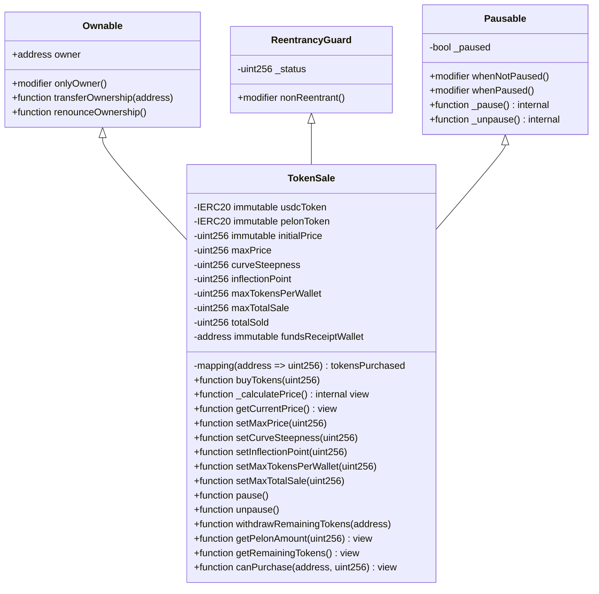
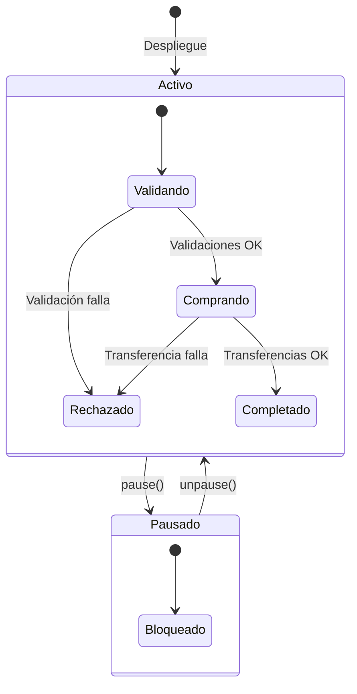

# Análisis Técnico del Contrato TokenSale

## Resumen Ejecutivo

El contrato `TokenSale` implementa un mecanismo de distribución de tokens ERC20 mediante intercambio directo con tokens USDC, incorporando múltiples capas de seguridad y mecanismos de control para prevenir manipulaciones de mercado y garantizar una distribución equitativa. El contrato utiliza herencia múltiple de contratos OpenZeppelin para implementar patrones de seguridad probados en producción, específicamente `Ownable` para control de acceso administrativo, `ReentrancyGuard` para prevenir ataques de reentrancia, y `Pausable` para permitir la suspensión de operaciones en caso de emergencias.

La arquitectura del contrato está diseñada para operar como un sistema de venta de tokens con bonding curve sigmoide, donde el precio aumenta dinámicamente según los tokens vendidos. Cada transacción de compra ejecuta una serie de validaciones secuenciales antes de realizar las transferencias de tokens. El diseño prioriza la seguridad sobre la optimización de gas, implementando checks redundantes y utilizando la biblioteca `SafeERC20` para todas las operaciones de transferencia de tokens.

## Arquitectura y Herencia de Contratos

El contrato `TokenSale` extiende tres contratos base de OpenZeppelin mediante herencia múltiple, una característica que Solidity soporta mediante el uso de la palabra clave `is` seguida de múltiples contratos separados por comas. Esta arquitectura permite combinar funcionalidades de diferentes contratos base sin necesidad de duplicar código.



### Análisis de Herencia Múltiple

La herencia múltiple en Solidity requiere una resolución cuidadosa del orden de herencia debido al algoritmo C3 Linearization utilizado por el compilador. En este caso, el orden `Ownable, ReentrancyGuard, Pausable` es crítico porque:

1. **Ownable**: Proporciona el mecanismo de control de acceso más fundamental, estableciendo el propietario del contrato durante la construcción.
2. **ReentrancyGuard**: Implementa el estado interno `_status` que debe ser inicializado antes de cualquier operación de estado.
3. **Pausable**: Depende de que el estado del contrato esté correctamente inicializado.

El constructor de `TokenSale` invoca explícitamente `Ownable(msg.sender)`, estableciendo el `msg.sender` del despliegue como el propietario inicial. Los constructores de `ReentrancyGuard` y `Pausable` se ejecutan automáticamente en el orden de herencia, inicializando `_status = 1` (no entrante) y `_paused = false` respectivamente.

## Análisis de Seguridad

### Protección contra Reentrancy

El contrato implementa protección contra ataques de reentrancia mediante el modificador `nonReentrant` de OpenZeppelin, que utiliza un patrón de checks-effects-interactions (CEI) mejorado. El modificador `nonReentrant` mantiene un estado interno `_status` que actúa como un semáforo binario:

- Estado `1`: El contrato no está en una llamada recursiva (estado inicial)
- Estado `2`: El contrato está ejecutando una función protegida

El mecanismo funciona mediante el siguiente flujo:

1. Al entrar a una función con `nonReentrant`, se verifica que `_status != 2`
2. Se establece `_status = 2` mediante una operación atómica
3. Se ejecuta el cuerpo de la función
4. Al salir (incluso mediante revert), se restablece `_status = 1`

Esta implementación es superior a un simple booleano porque previene condiciones de carrera en contratos que pueden recibir llamadas desde múltiples fuentes simultáneamente. El uso de `nonReentrant` en `buyTokens` es especialmente crítico porque la función realiza dos transferencias externas: primero de USDC desde el comprador y luego de PELON hacia el comprador.

### Validaciones Exhaustivas

El contrato implementa validaciones en múltiples capas, comenzando en el constructor y extendiéndose a todas las funciones que modifican estado. Las validaciones del constructor garantizan la integridad del estado inicial:

```solidity
require(_usdcToken != address(0), "TokenSale: USDC address cannot be zero");
require(_pelonToken != address(0), "TokenSale: PELON address cannot be zero");
require(_initialPrice > 0, "TokenSale: Initial price must be greater than zero");
require(_maxPrice > 0, "TokenSale: Max price must be greater than zero");
require(_initialPrice < _maxPrice, "TokenSale: Initial price must be less than max price");
require(_curveSteepness > 0, "TokenSale: Curve steepness must be greater than zero");
require(_inflectionPoint > 0, "TokenSale: Inflection point must be greater than zero");
require(_maxTokensPerWallet > 0, "TokenSale: Max tokens per wallet must be greater than zero");
require(_maxTotalSale > 0, "TokenSale: Max total sale must be greater than zero");
require(_fundsReceiptWallet != address(0), "TokenSale: Funds receipt wallet cannot be zero");
```

Estas validaciones previenen estados inválidos que podrían explotarse para causar comportamientos inesperados. Específicamente:

- **Direcciones cero**: Previenen que el contrato intente interactuar con direcciones inválidas, lo que resultaría en transacciones fallidas o pérdida de fondos.
- **Precio cero**: Evita divisiones por cero y transacciones sin costo.
- **Límites cero**: Garantizan que los mecanismos de control anti-whale y límite global funcionen correctamente.

### SafeERC20 para Transferencias Seguras

El contrato utiliza `SafeERC20` mediante la directiva `using SafeERC20 for IERC20`, que extiende la interfaz `IERC20` con funciones seguras que manejan tokens no estándar. Algunos tokens ERC20 (como USDT) no retornan un valor booleano en `transfer` y `transferFrom`, lo que puede causar que las llamadas fallen silenciosamente.

Las funciones `safeTransfer` y `safeTransferFrom` de SafeERC20:

1. Intentan la transferencia estándar
2. Verifican el retorno si el token lo soporta
3. Si el token no retorna un valor, verifican que el balance cambió
4. Revierten si ninguna verificación pasa

Este patrón es especialmente importante cuando se trabaja con tokens que pueden tener implementaciones no estándar, como es el caso de USDC que puede tener restricciones adicionales o comportamientos específicos dependiendo de la red blockchain.

### Mecanismo de Pausa

El contrato implementa un mecanismo de pausa mediante `Pausable` de OpenZeppelin, que permite al propietario suspender todas las operaciones críticas en caso de emergencia. El modificador `whenNotPaused` se aplica a `buyTokens`, lo que significa que cuando el contrato está pausado:

- Los usuarios no pueden comprar tokens
- Las funciones de administración siguen funcionando (permitiendo unpause)
- El estado del contrato se mantiene intacto

Este mecanismo es crucial para responder a vulnerabilidades descubiertas post-despliegue o para pausar la venta durante mantenimiento. Sin embargo, es importante notar que la pausa no afecta las funciones de consulta (`view`), lo que permite que las interfaces frontend sigan mostrando información actualizada.

### Inmutabilidad de Variables Críticas

El contrato utiliza el modificador `immutable` para varias variables críticas que solo se asignan durante la construcción y nunca se modifican después:

#### Tokens (`usdcToken` y `pelonToken`)

Las variables `usdcToken` y `pelonToken` están declaradas como `immutable`, lo que significa que:

1. Solo pueden ser asignadas una vez, durante la construcción
2. El compilador optimiza el acceso a estas variables inyectando su valor directamente en el bytecode
3. No pueden ser modificadas después del despliegue

Esta inmutabilidad previene ataques donde un atacante podría cambiar las direcciones de los tokens para redirigir fondos a direcciones maliciosas.

#### Parámetros de Precio (`initialPrice`)

La variable `initialPrice` está declarada como `immutable`, garantizando que:

1. El precio inicial de la bonding curve no puede modificarse después del despliegue
2. Se optimiza el acceso a esta variable (lectura desde bytecode en lugar de storage)
3. Se reduce significativamente el costo de gas en `_calculatePrice()`, que se ejecuta en cada compra y consulta

#### Dirección de Recepción de Fondos (`fundsReceiptWallet`)

La variable `fundsReceiptWallet` está declarada como `immutable`, asegurando que:

1. La dirección que recibe los fondos USDC no puede modificarse
2. Se optimiza el acceso en `buyTokens()`, donde se lee en cada compra
3. Se previene cualquier modificación accidental o maliciosa de la dirección de destino

**Optimización de Gas**: El uso de `immutable` reduce el costo de lectura de ~2,100 gas (SLOAD) a ~3 gas (PUSH desde bytecode), resultando en un ahorro de aproximadamente 2,097 gas por lectura. Considerando que estas variables se leen frecuentemente en operaciones críticas, el ahorro acumulado es considerable.

## Mecanismos de Control

### Protección Anti-Whale

El contrato implementa un mecanismo anti-whale mediante la variable `maxTokensPerWallet` y el mapping `tokensPurchased`. Este mecanismo limita la cantidad total de tokens PELON que una dirección puede adquirir durante toda la venta, no por transacción individual.

El mapping `tokensPurchased` mantiene un registro acumulativo de tokens comprados por cada dirección. En cada llamada a `buyTokens`, el contrato calcula:

```solidity
uint256 newTotal = tokensPurchased[msg.sender] + pelonAmount;
require(newTotal <= maxTokensPerWallet, "TokenSale: Purchase would exceed wallet limit");
```

Este diseño permite que los usuarios realicen múltiples compras siempre que el total acumulado no exceda el límite. Sin embargo, es importante notar que este límite es global y no se resetea, lo que significa que una vez alcanzado, la dirección no puede comprar más tokens incluso si el límite se incrementa posteriormente.

### Límite Global de Venta

La variable `maxTotalSale` establece un límite superior para la cantidad total de tokens que pueden venderse durante toda la operación del contrato. Este límite se verifica en cada transacción:

```solidity
require(totalSold + pelonAmount <= maxTotalSale, "TokenSale: Purchase would exceed total sale limit");
```

La variable `totalSold` se incrementa atómicamente con cada compra exitosa, garantizando que el límite global nunca se exceda. Este mecanismo es especialmente útil para:

- Controlar la oferta circulante inicial del token
- Implementar rondas de venta con límites específicos
- Prevenir la venta accidental de más tokens de los asignados para la venta pública

### Bonding Curve Sigmoide para Precios

El contrato implementa un mecanismo de bonding curve sigmoide donde el precio aumenta dinámicamente según el número de tokens vendidos. El cálculo de precio utiliza una función sigmoide que proporciona transiciones de precio suaves:

- **Precio Inicial**: El precio inicial cuando no se han vendido tokens
- **Precio Máximo**: El precio máximo que la curva puede alcanzar
- **Punto de Inflexión**: El punto donde la curva es más pronunciada (típicamente establecido en la mitad de `maxTotalSale`)
- **Pendiente de la Curva**: Parámetro que controla la forma de la curva

La fórmula del precio es:
```
precio = precioInicial + (precioMaximo - precioInicial) * (totalVendido²) / (puntoInflexion² + totalVendido²)
```

Esta aproximación sigmoide:
- Comienza en `precioInicial` cuando `totalVendido = 0`
- Aumenta suavemente a medida que se venden más tokens
- Alcanza aproximadamente `precioMaximo` cuando `totalVendido >= puntoInflexion * 2`
- Usa solo multiplicación y división para eficiencia de gas

**Optimización de Precisión**: La implementación de `_calculatePrice()` ha sido optimizada para maximizar la precisión aritmética mediante el reordenamiento de operaciones. Las operaciones se realizan en el orden: multiplicación → suma → división final, evitando la pérdida de precisión que ocurriría si se dividiera antes de multiplicar. Esta optimización garantiza cálculos de precio más precisos, especialmente para valores intermedios de `totalSold`.

El propietario puede ajustar los parámetros de la curva mediante `setMaxPrice()`, `setCurveSteepness()`, y `setInflectionPoint()` para adaptarse a condiciones de mercado. El precio se calcula dinámicamente en cada compra usando `_calculatePrice()`, garantizando un precio justo que refleja la demanda.

La fórmula de conversión para calcular los tokens recibidos es:
```
pelonAmount = (usdcAmount * precioActual) / 1e6
```

Donde `precioActual` es el precio calculado dinámicamente basado en `totalVendido`. El factor `1e6` compensa la diferencia entre los 6 decimales de USDC y los 18 decimales de PELON.

## Flujo de Transacciones

### Análisis de la Función buyTokens

La función `buyTokens` es el núcleo del contrato y ejecuta una secuencia estricta de validaciones y operaciones. El siguiente diagrama ilustra el flujo completo:

```mermaid
flowchart TD
    A[Usuario llama buyTokens] --> B{Contrato pausado?}
    B -->|Sí| C[Revert: Contrato pausado]
    B -->|No| D{Reentrancy check}
    D -->|En ejecución| E[Revert: Reentrancy]
    D -->|Libre| F[Validar usdcAmount > 0]
    F -->|No| G[Revert: Amount zero]
    F -->|Sí| H[Calcular precioActual = _calculatePrice()]
    H --> H1[Calcular pelonAmount = usdcAmount * precioActual / 1e6]
    H1 --> I{pelonAmount > 0?}
    I -->|No| J[Revert: Calculated amount zero]
    I -->|Sí| K[Calcular newTotal = tokensPurchased + pelonAmount]
    K --> L{newTotal <= maxTokensPerWallet?}
    L -->|No| M[Revert: Exceeds wallet limit]
    L -->|Sí| N{totalSold + pelonAmount <= maxTotalSale?}
    N -->|No| O[Revert: Exceeds total sale limit]
    N -->|Sí| P[Verificar balance del contrato]
    P --> Q{contractBalance >= pelonAmount?}
    Q -->|No| R[Revert: Insufficient tokens]
    Q -->|Sí| S[Transferir USDC: msg.sender -> fundsReceiptWallet]
    S --> T{Transfer exitosa?}
    T -->|No| U[Revert: Transfer failed]
    T -->|Sí| V[Actualizar tokensPurchased]
    V --> W[Incrementar totalSold]
    W --> X[Transferir PELON: contract -> msg.sender]
    X --> Y{Transfer exitosa?}
    Y -->|No| Z[Revert: Transfer failed]
    Y -->|Sí| AA[Emitir evento TokensPurchased]
    AA --> AB[Éxito]
    
    style C fill:#ff6b6b
    style E fill:#ff6b6b
    style G fill:#ff6b6b
    style J fill:#ff6b6b
    style M fill:#ff6b6b
    style O fill:#ff6b6b
    style R fill:#ff6b6b
    U fill:#ff6b6b
    Z fill:#ff6b6b
    style AB fill:#51cf66
```

### Orden de Operaciones (CEI Pattern)

La función `buyTokens` sigue el patrón Checks-Effects-Interactions (CEI), que es fundamental para prevenir vulnerabilidades de reentrancia:

1. **Checks (Validaciones)**: Todas las validaciones se realizan antes de cualquier modificación de estado o interacción externa:
   - Validación de cantidad de USDC
   - Cálculo y validación de cantidad de PELON
   - Verificación de límites (wallet y global)
   - Verificación de balance del contrato

2. **Effects (Efectos)**: Las modificaciones de estado se realizan después de las validaciones pero antes de las interacciones externas:
   - Actualización de `tokensPurchased[msg.sender]`
   - Incremento de `totalSold`

3. **Interactions (Interacciones)**: Las llamadas externas se realizan al final:
   - Transferencia de USDC desde el comprador
   - Transferencia de PELON al comprador
   - Emisión de evento

Este orden es crítico porque si una interacción externa (como `safeTransferFrom`) desencadena una reentrancia, el estado ya está actualizado, por lo que las validaciones en la llamada recursiva fallarían, previniendo el ataque.

### Validaciones Secuenciales

Cada validación en `buyTokens` sirve un propósito específico y está ordenada para minimizar el consumo de gas en casos de fallo temprano:

1. **`usdcAmount > 0`**: Previene transacciones sin valor y divisiones por cero
2. **`pelonAmount > 0`**: Asegura que el cálculo del precio de la bonding curve resulte en una cantidad válida (previene casos edge donde el precio es extremadamente bajo)
3. **Límite por wallet**: Previene concentración excesiva de tokens
4. **Límite global**: Previene exceso de venta
5. **Balance del contrato**: Asegura que el contrato tiene suficientes tokens para cumplir la transacción

La verificación del balance del contrato se realiza después de todas las validaciones de límites porque es la más costosa en términos de gas (requiere un `SLOAD` y una llamada externa `balanceOf`).

## Funciones de Administración

### Gestión de Parámetros

El contrato proporciona tres funciones para modificar parámetros operativos, todas protegidas por `onlyOwner`:

#### setMaxPrice

```solidity
function setMaxPrice(uint256 _maxPrice) external onlyOwner {
    require(_maxPrice > 0, "TokenSale: Max price must be greater than zero");
    require(initialPrice < _maxPrice, "TokenSale: Max price must be greater than initial price");
    maxPrice = _maxPrice;
    emit BondingCurveParametersUpdated();
}
```

Esta función permite ajustar el precio máximo en la bonding curve. El cambio afecta los cálculos de precio futuros inmediatamente pero mantiene la forma sigmoide de la curva. El precio máximo debe ser siempre mayor que el precio inicial.

#### setCurveSteepness

```solidity
function setCurveSteepness(uint256 _curveSteepness) external onlyOwner {
    require(_curveSteepness > 0, "TokenSale: Curve steepness must be greater than zero");
    curveSteepness = _curveSteepness;
    emit BondingCurveParametersUpdated();
}
```

Esta función permite ajustar el parámetro de pendiente de la curva, que afecta qué tan rápidamente aumenta el precio a lo largo de la curva. Valores más altos resultan en curvas más pronunciadas.

#### setInflectionPoint

```solidity
function setInflectionPoint(uint256 _inflectionPoint) external onlyOwner {
    require(_inflectionPoint > 0, "TokenSale: Inflection point must be greater than zero");
    inflectionPoint = _inflectionPoint;
    emit BondingCurveParametersUpdated();
}
```

Esta función permite ajustar el punto de inflexión, que determina dónde la curva es más pronunciada. Típicamente establecido en aproximadamente la mitad de `maxTotalSale` para una distribución óptima de precios.

#### setMaxTokensPerWallet

```solidity
function setMaxTokensPerWallet(uint256 _maxTokensPerWallet) external onlyOwner {
    require(_maxTokensPerWallet > 0, "TokenSale: Max tokens per wallet must be greater than zero");
    maxTokensPerWallet = _maxTokensPerWallet;
    emit MaxTokensPerWalletUpdated(_maxTokensPerWallet);
}
```

Esta función permite ajustar el límite anti-whale. Un incremento del límite permite que direcciones que habían alcanzado el límite anterior puedan comprar más tokens. Una disminución del límite no afecta a direcciones que ya han comprado más que el nuevo límite, pero previene compras adicionales.

#### setMaxTotalSale

```solidity
function setMaxTotalSale(uint256 _maxTotalSale) external onlyOwner {
    require(_maxTotalSale > 0, "TokenSale: Max total sale must be greater than zero");
    maxTotalSale = _maxTotalSale;
    emit MaxTotalSaleUpdated(_maxTotalSale);
}
```

Esta función permite ajustar el límite global de venta. Un incremento permite vender más tokens de los originalmente planificados. Una disminución puede prevenir ventas futuras si `totalSold` ya excede el nuevo límite, pero no revierte ventas ya realizadas.

### Retiro de Tokens Residuales

La función `withdrawRemainingTokens` permite al propietario retirar tokens que quedan en el contrato después de que la venta haya terminado o si se necesita retirar tokens por cualquier razón:

```solidity
function withdrawRemainingTokens(address token) external onlyOwner {
    require(token != address(0), "TokenSale: Token address cannot be zero");
    IERC20 tokenContract = IERC20(token);
    uint256 balance = tokenContract.balanceOf(address(this));
    require(balance > 0, "TokenSale: No tokens to withdraw");
    tokenContract.safeTransfer(owner(), balance);
    emit TokensWithdrawn(owner(), token, balance);
}
```

Esta función es genérica y puede retirar cualquier token ERC20 que esté en el contrato, no solo PELON. Esto es útil para:

- Retirar tokens PELON no vendidos al finalizar la venta
- Retirar tokens USDC que puedan haber sido enviados accidentalmente al contrato
- Retirar cualquier otro token que pueda haber sido enviado al contrato

El uso de `safeTransfer` garantiza que la transferencia funcione incluso con tokens no estándar.

### Control de Pausa

Las funciones `pause` y `unpause` proporcionan control de emergencia sobre el contrato:

```solidity
function pause() external onlyOwner {
    _pause();
    emit SalePaused(msg.sender);
}

function unpause() external onlyOwner {
    _unpause();
    emit SaleUnpaused(msg.sender);
}
```

Estas funciones son wrappers simples alrededor de las funciones internas `_pause()` y `_unpause()` de OpenZeppelin. El estado de pausa se almacena en una variable de estado `_paused` que es modificada atómicamente. Los eventos personalizados proporcionan trazabilidad off-chain de cuándo y por quién se pausó o reanudó la venta.

## Funciones de Consulta

### getPelonAmount

```solidity
function getPelonAmount(uint256 usdcAmount) external view returns (uint256) {
    if (usdcAmount == 0) return 0;
    uint256 currentPrice = _calculatePrice();
    return (usdcAmount * currentPrice) / 1e6;
}
```

Esta función permite calcular la cantidad de tokens PELON que se recibirían por una cantidad específica de USDC sin ejecutar una transacción. La función usa el precio actual de la bonding curve basado en los tokens ya vendidos. La función es `view`, lo que significa que no modifica el estado y puede ser llamada sin costo de gas desde interfaces off-chain o desde otros contratos.

El manejo del caso `usdcAmount == 0` previene cálculos innecesarios y devuelve un resultado claro. Esta función es esencial para interfaces de usuario que necesitan mostrar estimaciones de compra antes de que el usuario confirme la transacción.

### getCurrentPrice

```solidity
function getCurrentPrice() external view returns (uint256) {
    return _calculatePrice();
}
```

Esta función retorna el precio actual calculado de la bonding curve basado en el `totalVendido` actual. Esto permite a usuarios e interfaces consultar el precio actual antes de tomar una decisión de compra.

### getRemainingTokens

```solidity
function getRemainingTokens() external view returns (uint256) {
    uint256 remaining = maxTotalSale - totalSold;
    uint256 contractBalance = pelonToken.balanceOf(address(this));
    return remaining < contractBalance ? remaining : contractBalance;
}
```

Esta función calcula la cantidad de tokens disponibles para la venta, considerando tanto el límite global de venta como el balance real del contrato. El retorno es el mínimo entre:

1. **Tokens restantes según límite**: `maxTotalSale - totalSold` (cuántos tokens más se pueden vender según el límite)
2. **Balance del contrato**: La cantidad real de tokens PELON que el contrato tiene disponibles

Esta lógica es importante porque el contrato puede tener más tokens de los que se planean vender, o puede tener menos tokens si algunos fueron retirados. La función siempre retorna el valor más conservador (el menor de los dos), garantizando que la interfaz muestre la cantidad real disponible para compra.

### canPurchase

```solidity
function canPurchase(
    address wallet,
    uint256 usdcAmount
) external view returns (bool canBuy, string memory reason) {
    // ... validaciones secuenciales ...
    return (true, "");
}
```

Esta función es la más sofisticada de las funciones de consulta, ya que replica todas las validaciones de `buyTokens` pero en modo `view`. La función retorna una tupla con:

1. **`canBuy`**: Un booleano indicando si la compra sería exitosa
2. **`reason`**: Un string explicando por qué la compra fallaría (vacío si sería exitosa)

**Nota**: La variable de retorno se denomina `canBuy` (en lugar de `canPurchase`) para evitar shadowing del nombre de la función, siguiendo las mejores prácticas de Solidity y mejorando la legibilidad del código.

Esta función es extremadamente útil para:

- **Interfaces de usuario**: Mostrar mensajes de error específicos antes de intentar la transacción
- **Integraciones**: Permitir que otros contratos verifiquen si una compra es válida antes de ejecutarla
- **Debugging**: Identificar exactamente qué validación está fallando sin necesidad de ejecutar transacciones

La función replica el orden exacto de validaciones de `buyTokens`:
1. Verificación de pausa
2. Validación de cantidad de USDC
3. Cálculo del precio actual usando bonding curve
4. Cálculo y validación de cantidad de PELON (usando precio dinámico)
5. Verificación de límite por wallet
6. Verificación de límite global
7. Verificación de balance del contrato

Este orden garantiza que los mensajes de error sean consistentes con los errores reales que se producirían en `buyTokens`. El precio utilizado se calcula dinámicamente basado en el `totalVendido` actual, asegurando estimaciones precisas.

## Eventos y Logging

El contrato emite eventos para todas las operaciones críticas, proporcionando trazabilidad completa off-chain. Los eventos son indexados cuando es apropiado para permitir filtrado eficiente en clientes blockchain.

### TokensPurchased

```solidity
event TokensPurchased(
    address indexed buyer,
    uint256 usdcAmount,
    uint256 pelonAmount
);
```

Este evento se emite en cada compra exitosa. El campo `buyer` está indexado, lo que permite filtrar todas las compras de una dirección específica. Los campos `usdcAmount` y `pelonAmount` no están indexados porque son valores numéricos que raramente se usan para filtrar, pero proporcionan el contexto completo de la transacción.

### Eventos de Administración

Los eventos `BondingCurveParametersUpdated`, `MaxTokensPerWalletUpdated`, y `MaxTotalSaleUpdated` proporcionan un registro completo de todos los cambios en los parámetros del contrato. Estos eventos son esenciales para:

- Auditorías off-chain
- Interfaces de usuario que muestran el historial de cambios
- Análisis de comportamiento del contrato

### Eventos de Pausa

Los eventos `SalePaused` y `SaleUnpaused` registran cuándo y por quién se pausó o reanudó la venta. El campo `account` (que es `msg.sender` en las funciones) está indexado, permitiendo filtrar por el administrador que realizó la acción.

### TokensWithdrawn

```solidity
event TokensWithdrawn(address indexed to, address indexed token, uint256 amount);
```

Este evento registra todos los retiros de tokens del contrato. Ambos `to` y `token` están indexados, permitiendo filtrar por destinatario o por tipo de token. Esto es útil para rastrear qué tokens fueron retirados y a dónde fueron enviados.

## Consideraciones Técnicas

### Precisión Aritmética

El contrato utiliza aritmética de enteros de Solidity, que no tiene soporte nativo para decimales. Para manejar la conversión entre USDC (6 decimales) y PELON (18 decimales), el contrato utiliza la fórmula:

```solidity
uint256 currentPrice = _calculatePrice();
pelonAmount = (usdcAmount * currentPrice) / 1e6
```

El factor `1e6` compensa la diferencia de decimales. El `precioActual` se calcula dinámicamente de la bonding curve basado en `totalVendido`:

- `usdcAmount` está en unidades de 1e-6 USDC (micro-USDC)
- `precioActual` está en unidades de 1e-18 PELON (wei de PELON), calculado de la curva sigmoide
- La división por `1e6` convierte el resultado a unidades de 1e-18 PELON

Por ejemplo, si `precioInicial = 3000` (representando 0.000003 PELON por USDC) y no se han vendido tokens:
- 1 USDC = 1,000,000 micro-USDC
- `precioActual = 3000` (precio inicial)
- `pelonAmount = (1,000,000 * 3000) / 1,000,000 = 3,000` unidades base de PELON
- 3,000 unidades base = 0.000003 PELON (considerando 18 decimales)

A medida que se venden tokens, el precio aumenta según la bonding curve sigmoide, por lo que los compradores posteriores recibirán menos tokens por USDC.

Esta precisión es suficiente para la mayoría de casos de uso, pero puede resultar en redondeo hacia abajo en casos extremos. Por ejemplo, si `usdcAmount = 1` (1 micro-USDC) y `precioActual = 1`, el resultado sería `0` debido al redondeo por división entera.

### Manejo de Decimales

El contrato asume que:
- USDC tiene 6 decimales (estándar de USDC)
- PELON tiene 18 decimales (estándar ERC20)

Estos valores no se verifican en el contrato, lo que significa que si se despliega con tokens que tienen diferentes decimales, el cálculo del precio será incorrecto. Esta es una responsabilidad del despliegue y debería verificarse off-chain antes de la implementación.

### Optimización de Gas

El contrato prioriza la seguridad sobre la optimización de gas, lo que resulta en algunas ineficiencias intencionales:

1. **Validaciones redundantes**: Algunas validaciones se realizan tanto en `canPurchase` (si se llama) como en `buyTokens`. Sin embargo, `canPurchase` es opcional y solo se usa off-chain.

2. **Múltiples SLOADs**: La función `buyTokens` realiza múltiples lecturas de storage (`tokensPurchased[msg.sender]`, `totalSold`, `maxTokensPerWallet`, etc.). Algunas de estas podrían optimizarse usando variables locales, pero la legibilidad y seguridad tienen prioridad.

3. **Eventos con datos no indexados**: Los eventos incluyen datos no indexados que aumentan el costo de gas pero proporcionan información valiosa off-chain.

### Casos Edge y Límites

El contrato maneja varios casos edge:

1. **Cantidad cero**: Todas las funciones que aceptan cantidades verifican que sean mayores que cero.

2. **Overflow aritmético**: Solidity 0.8.30 tiene protección automática contra overflow/underflow mediante revert automático. Sin embargo, el contrato debe asegurarse de que `totalSold` nunca exceda `maxTotalSale`, lo cual se garantiza mediante la validación antes del incremento.

3. **Balance insuficiente**: El contrato verifica que tenga suficientes tokens antes de transferir, pero no verifica que el comprador tenga suficiente USDC. Esta verificación se realiza implícitamente cuando `safeTransferFrom` falla si el comprador no tiene suficiente balance o allowance.

4. **Límites alcanzados**: Si un usuario alcanza `maxTokensPerWallet`, no puede comprar más tokens incluso si el límite se incrementa posteriormente (porque `tokensPurchased[msg.sender]` ya está en el máximo anterior). Sin embargo, si el límite se incrementa antes de alcanzarlo, el usuario puede continuar comprando hasta el nuevo límite.

## Diagrama de Estados

El contrato tiene dos estados principales que afectan su operación:



## Fortalezas del Contrato

### Uso de Bibliotecas Probadas

El contrato se basa exclusivamente en contratos de OpenZeppelin, que son:

- **Auditados extensivamente**: OpenZeppelin es la biblioteca de contratos más auditada en el ecosistema Ethereum
- **Probados en producción**: Millones de dólares en valor están protegidos por contratos OpenZeppelin
- **Mantenidos activamente**: Reciben actualizaciones de seguridad regulares
- **Documentados exhaustivamente**: Tienen documentación técnica completa

El uso de estas bibliotecas reduce significativamente el riesgo de vulnerabilidades comparado con implementaciones personalizadas.

### Múltiples Capas de Seguridad

El contrato implementa defensa en profundidad mediante:

1. **ReentrancyGuard**: Previene ataques de reentrancia
2. **SafeERC20**: Maneja tokens no estándar de forma segura
3. **Validaciones exhaustivas**: Previene estados inválidos
4. **Pausable**: Permite respuesta rápida a emergencias
5. **Ownable**: Control de acceso administrativo

Cada capa protege contra diferentes vectores de ataque, y la combinación proporciona protección robusta contra la mayoría de vulnerabilidades conocidas.

### Flexibilidad Administrativa

El contrato proporciona control administrativo sobre parámetros críticos mientras mantiene la seguridad mediante:

- **Control de acceso**: Solo el propietario puede modificar parámetros
- **Eventos**: Todas las modificaciones son registradas y trazables
- **Validaciones**: Los parámetros no pueden establecerse en valores inválidos

Esta flexibilidad permite adaptarse a condiciones cambiantes sin necesidad de redesplegar el contrato.

### Transparencia mediante Eventos

Todos los eventos críticos son emitidos y indexados apropiadamente, permitiendo:

- **Trazabilidad completa**: Cualquier acción puede ser rastreada off-chain
- **Análisis de datos**: Los eventos pueden ser agregados para análisis estadísticos
- **Interfaces de usuario**: Los eventos proporcionan datos en tiempo real para dashboards

### Funciones de Consulta para UX

Las funciones `view` permiten que las interfaces de usuario:

- **Muestren estimaciones**: `getPelonAmount` permite calcular costos antes de comprar
- **Muestren disponibilidad**: `getRemainingTokens` muestra cuántos tokens quedan
- **Muestren errores específicos**: `canPurchase` proporciona mensajes de error detallados

Esto mejora significativamente la experiencia del usuario al prevenir transacciones que fallarían y proporcionar feedback claro.

## Auditorías de Seguridad

### Análisis con Slither

El contrato `TokenSale` ha sido analizado exhaustivamente utilizando [Slither](https://github.com/crytic/slither), una herramienta de análisis estático de código fuente para contratos inteligentes Solidity desarrollada por Crytic.

**Resultados del análisis**:
- **Versión de Slither**: 0.11.3
- **Detectores activos**: 100
- **Contratos analizados**: 43 (incluyendo dependencias de OpenZeppelin)
- **Resultados totales**: 73 (después de correcciones)

**Problemas identificados y corregidos**:

1. **Divide Before Multiply** en `_calculatePrice()` - Corregido mediante reordenamiento de operaciones para maximizar precisión aritmética
2. **Variable Shadowing** en `canPurchase()` - Corregido renombrando la variable de retorno de `canPurchase` a `canBuy`
3. **Variables que deberían ser `immutable`** - Corregido declarando `initialPrice` y `fundsReceiptWallet` como `immutable`

Todos los problemas identificados en el contrato `TokenSale` han sido corregidos y verificados mediante re-análisis. Para más detalles técnicos sobre el análisis de seguridad, las correcciones implementadas y su impacto, consulta la [documentación completa de seguridad Slither](./security-slither.md).

## Conclusión

El contrato `TokenSale` representa una implementación sólida y segura de un mecanismo de venta de tokens, incorporando mejores prácticas de seguridad de la industria y proporcionando flexibilidad administrativa mientras mantiene la seguridad del usuario. El uso de bibliotecas probadas, múltiples capas de seguridad, y funciones de consulta bien diseñadas hacen de este contrato una base sólida para la distribución de tokens.

La arquitectura del contrato prioriza la seguridad y la claridad sobre la optimización de gas, lo cual es apropiado para un contrato que manejará fondos de usuarios. Las validaciones exhaustivas y el patrón CEI garantizan que las transacciones sean atómicas y seguras, mientras que los eventos proporcionan transparencia completa para auditorías y análisis off-chain.

