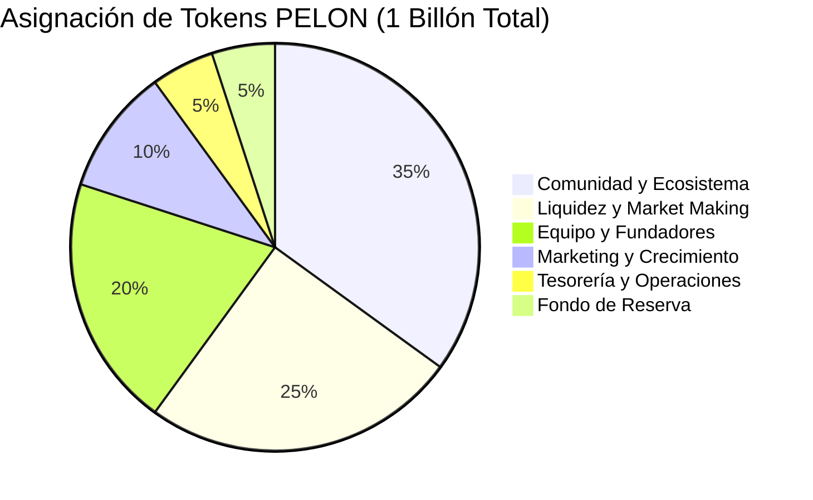

# Pelon Club Token (PELON) - Asignación Tokenómica

## El Futuro de la Educación Token-Gated Está Aquí

Pelon Club Token impulsa la primera plataforma educativa descentralizada que realmente monetiza el conocimiento mientras construye una comunidad global de estudiantes y educadores de élite. Con un suministro total de 1 billón de tokens PELON, nuestro modelo tokenómico está diseñado para sostenibilidad a largo plazo, crecimiento comunitario y creación de valor estratégico.

## Resumen del Token

- **Nombre del Token:** Pelon Club Token
- **Símbolo:** PELON
- **Suministro Total:** 1,000,000,000,000 PELON (1 Billón)
- **Red:** Base (Ethereum L2)
- **Estándar del Token:** ERC20 con extensiones avanzadas (ERC1363, ERC20Permit, ERC20Votes, ERC20Burnable)

## Distribución Tokenómica

Nuestro modelo de asignación conservador prioriza el crecimiento comunitario, la estabilidad del mercado y el desarrollo sostenible. Así es como se asignan estratégicamente 1 billón de tokens PELON:

### Vista General de Distribución

### Desglose Completo de Asignación

| Categoría | Porcentaje | Tokens | Propósito |
|-----------|-----------|--------|-----------|
| **Comunidad y Ecosistema** | 35% | 350B | Impulsar adopción y participación |
| **Liquidez y Market Making** | 25% | 250B | Garantizar estabilidad del mercado |
| **Equipo y Fundadores** | 20% | 200B | Alinear incentivos a largo plazo |
| **Marketing y Crecimiento** | 10% | 100B | Acelerar adquisición de usuarios |
| **Tesorería y Operaciones** | 5% | 50B | Financiar operaciones continuas |
| **Fondo de Reserva** | 5% | 50B | Reservas estratégicas |

### Tabla Detallada de Asignación con Direcciones de Wallet

| Categoría | Subcategoría | Porcentaje | Tokens | Dirección de Wallet |
|-----------|--------------|-----------|--------|---------------------|
| **Comunidad y Ecosistema** | **TOTAL** | **35%** | **350B** | `0xeB7D78ed5F19592dFD5cF97443d961e85595Daa5` |
| Comunidad y Ecosistema | Airdrops Iniciales | 5% | 50B | `0xeB7D78ed5F19592dFD5cF97443d961e85595Daa5` |
| Comunidad y Ecosistema | Incentivos Participación | 10% | 100B | `0xeB7D78ed5F19592dFD5cF97443d961e85595Daa5` |
| Comunidad y Ecosistema | Recompensas Educativas | 10% | 100B | `0xeB7D78ed5F19592dFD5cF97443d961e85595Daa5` |
| Comunidad y Ecosistema | Programa Referidos | 5% | 50B | `0xeB7D78ed5F19592dFD5cF97443d961e85595Daa5` |
| Comunidad y Ecosistema | Gobernanza DAO | 5% | 50B | `0xeB7D78ed5F19592dFD5cF97443d961e85595Daa5` |
| **Liquidez y Market Making** | **TOTAL** | **25%** | **250B** | `0xFF9e0a72842751698A62050e94fad0CE8C0b368a` |
| Liquidez y Market Making | Liquidez Inicial DEX | 15% | 150B | `0xFF9e0a72842751698A62050e94fad0CE8C0b368a` |
| Liquidez y Market Making | Reserva Liquidez | 10% | 100B | `0xFF9e0a72842751698A62050e94fad0CE8C0b368a` |
| **Equipo y Fundadores** | **TOTAL** | **20%** | **200B** | `0xaEeaA55ED4f7df9E4C5688011cEd1E2A1b696772` |
| Equipo y Fundadores | Equipo Fundador | 15% | 150B | `0xaEeaA55ED4f7df9E4C5688011cEd1E2A1b696772` |
| Equipo y Fundadores | Advisors | 5% | 50B | `0xaEeaA55ED4f7df9E4C5688011cEd1E2A1b696772` |
| **Marketing y Crecimiento** | **TOTAL** | **10%** | **100B** | `0xc08bF97eeE16e73DFA022265118B513D10Ae3F1C` |
| Marketing y Crecimiento | Campañas Marketing | 6% | 60B | `0xc08bF97eeE16e73DFA022265118B513D10Ae3F1C` |
| Marketing y Crecimiento | Partnerships | 2% | 20B | `0xc08bF97eeE16e73DFA022265118B513D10Ae3F1C` |
| Marketing y Crecimiento | Influencers/KOLs | 2% | 20B | `0xc08bF97eeE16e73DFA022265118B513D10Ae3F1C` |
| **Tesorería y Operaciones** | **TOTAL** | **5%** | **50B** | `0x4826b07de6d05783121A7f28147F82D3eEEb7E1b` |
| Tesorería y Operaciones | Operaciones | 3% | 30B | `0x4826b07de6d05783121A7f28147F82D3eEEb7E1b` |
| Tesorería y Operaciones | Emergencias | 2% | 20B | `0x4826b07de6d05783121A7f28147F82D3eEEb7E1b` |
| **Fondo de Reserva** | **TOTAL** | **5%** | **50B** | `0xfBeec866499B868B87C3730AA4F3a7921707f7b2` |
| Fondo de Reserva | Reserva Estratégica | 5% | 50B | `0xfBeec866499B868B87C3730AA4F3a7921707f7b2` |

### Estructura Detallada de Asignación

```mermaid
flowchart TD
    A[Suministro Total: 1 Billón PELON] --> B[Comunidad y Ecosistema: 35% - 350B]
    A --> C[Liquidez y Market Making: 25% - 250B]
    A --> D[Equipo y Fundadores: 20% - 200B]
    A --> E[Marketing y Crecimiento: 10% - 100B]
    A --> F[Tesorería y Operaciones: 5% - 50B]
    A --> G[Fondo de Reserva: 5% - 50B]
    
    B --> B1[Airdrops Iniciales: 5% - 50B]
    B --> B2[Incentivos Participación: 10% - 100B]
    B --> B3[Recompensas Educativas: 10% - 100B]
    B --> B4[Programa Referidos: 5% - 50B]
    B --> B5[Gobernanza DAO: 5% - 50B]
    
    C --> C1[Liquidez Inicial DEX: 15% - 150B]
    C --> C2[Reserva Liquidez: 10% - 100B]
    
    D --> D1[Equipo Fundador: 15% - 150B]
    D --> D2[Asesores: 5% - 50B]
    
    E --> E1[Campañas Marketing: 6% - 60B]
    E --> E2[Partnerships: 2% - 20B]
    E --> E3[Influencers y KOLs: 2% - 20B]
    
    F --> F1[Operaciones: 3% - 30B]
    F --> F2[Fondo Emergencia: 2% - 20B]
    
    G --> G1[Reserva Estratégica: 5% - 50B]
    
    style A fill:#4338ca,stroke:#000,stroke-width:3px,color:#fff
    style B fill:#6366f1,stroke:#000,stroke-width:2px,color:#fff
    style C fill:#818cf8,stroke:#000,stroke-width:2px,color:#fff
    style D fill:#a5b4fc,stroke:#000,stroke-width:2px,color:#fff
    style E fill:#c7d2fe,stroke:#000,stroke-width:2px,color:#000
    style F fill:#e0e7ff,stroke:#000,stroke-width:2px,color:#000
    style G fill:#eef2ff,stroke:#000,stroke-width:2px,color:#000
```

---

## 1. Comunidad y Ecosistema (35% - 350B PELON)

La asignación más grande refleja nuestro compromiso con la construcción de una comunidad próspera y comprometida. Esta categoría impulsa la adquisición de usuarios, la retención y el crecimiento de la plataforma.

**Desglose:**
- **Airdrops Iniciales (5% - 50B):** Recompensar early adopters y construir base de usuarios inicial
- **Incentivos de Participación (10% - 100B):** Fomentar participación activa y uso de la plataforma
- **Recompensas Educativas (10% - 100B):** Incentivar aprendizaje y consumo de contenido
- **Programa de Referidos (5% - 50B):** Mecanismo de crecimiento viral para adquisición orgánica de usuarios
- **Gobernanza DAO (5% - 50B):** Empoderar toma de decisiones comunitaria y descentralización

**Por Qué Importa:** Una comunidad fuerte es la base de cualquier proyecto Web3 exitoso. Al asignar 35% a iniciativas comunitarias, aseguramos que el valor fluya directamente a los usuarios que contribuyen al éxito de la plataforma.

---

## 2. Liquidez y Market Making (25% - 250B PELON)

La estabilidad del mercado y la liquidez son críticas para la utilidad del token y la confianza de los inversores. Esta asignación garantiza condiciones de trading saludables desde el primer día.

**Desglose:**
- **Liquidez Inicial DEX (15% - 150B):** Lanzamiento con pools de liquidez profundos
- **Reserva de Liquidez (10% - 100B):** Mantener profundidad y estabilidad del mercado a lo largo del tiempo

**Por Qué Importa:** La liquidez adecuada previene la manipulación de precios, reduce el slippage y crea una mejor experiencia de trading para todos los participantes. Esta asignación demuestra nuestro compromiso con la construcción de una economía de tokens sostenible.

---

## 3. Equipo y Fundadores (20% - 200B PELON)

La asignación del equipo asegura una alineación a largo plazo entre fundadores, asesores y el éxito del proyecto. Esto crea incentivos fuertes para el desarrollo y crecimiento continuo.

**Desglose:**
- **Equipo Fundador (15% - 150B):** Desarrollo core y ejecución estratégica
- **Asesores (5% - 50B):** Orientación estratégica y experiencia de la industria

**Por Qué Importa:** Un equipo bien incentivado es esencial para el éxito del proyecto a largo plazo. Esta asignación asegura que los stakeholders clave permanezcan comprometidos con el crecimiento y desarrollo de la plataforma durante múltiples años.

---

## 4. Marketing y Crecimiento (10% - 100B PELON)

El marketing estratégico acelera la adquisición de usuarios y el reconocimiento de la plataforma. Esta asignación financia iniciativas de crecimiento que impulsan la adopción.

**Desglose:**
- **Campañas de Marketing (6% - 60B):** Reconocimiento de marca y adquisición de usuarios
- **Partnerships (2% - 20B):** Alianzas estratégicas con instituciones educativas y plataformas
- **Influencers y KOLs (2% - 20B):** Aprovechar líderes de opinión en educación y Web3

**Por Qué Importa:** En un mercado competitivo, el marketing estratégico es esencial para destacar. Esta asignación asegura que podamos llegar a nuestra audiencia objetivo de manera efectiva y construir una marca reconocible en el espacio de educación y Web3.

---

## 5. Tesorería y Operaciones (5% - 50B PELON)

Los fondos operativos aseguran que la plataforma pueda funcionar sin problemas, manejar costos inesperados y mantener el impulso de desarrollo.

**Desglose:**
- **Operaciones (3% - 30B):** Operaciones y mantenimiento diario de la plataforma
- **Fondo de Emergencia (2% - 20B):** Circunstancias imprevistas y necesidades críticas

**Por Qué Importa:** Tener reservas operativas previene el estancamiento del proyecto y asegura la continuidad. Esta asignación proporciona una red de seguridad para mantener la calidad de la plataforma y responder a las necesidades del mercado.

---

## 6. Fondo de Reserva (5% - 50B PELON)

Las reservas estratégicas proporcionan flexibilidad para oportunidades futuras, condiciones de mercado inesperadas o iniciativas estratégicas que surjan con el tiempo.

**Desglose:**
- **Reserva Estratégica (5% - 50B):** Oportunidades futuras e iniciativas estratégicas

**Por Qué Importa:** Los mercados evolucionan, surgen oportunidades y tener reservas nos permite capitalizar momentos estratégicos sin diluir otras asignaciones. Este fondo proporciona la flexibilidad necesaria para el éxito a largo plazo.

---

## Resumen por Direcciones de Wallet

Todas las asignaciones de tokens se gestionan a través de direcciones de wallet dedicadas en la red Base. Cada categoría tiene su propia wallet para un seguimiento transparente y verificable de las asignaciones on-chain.

### 📍 Comunidad y Ecosistema

**Dirección de Wallet:** `0xeB7D78ed5F19592dFD5cF97443d961e85595Daa5`  
**Asignación Total:** 35% (350B PELON)  
**Transacción de Funding:** [Ver en BaseScan](https://sepolia.basescan.org/tx/0x40fbddd3c2c7f1b947de5264726d88fb5672191d950878d0de8e28ff4f4eb990)

**Subcategorías:**
- Airdrops Iniciales: 5% (50B)
- Incentivos Participación: 10% (100B)
- Recompensas Educativas: 10% (100B)
- Programa Referidos: 5% (50B)
- Gobernanza DAO: 5% (50B)

### 📍 Liquidez y Market Making

**Dirección de Wallet:** `0xFF9e0a72842751698A62050e94fad0CE8C0b368a`  
**Asignación Total:** 25% (250B PELON)  
**Transacción de Funding:** [Ver en BaseScan](https://sepolia.basescan.org/tx/0xb04e76fb716c823938caa5bd7b19947a682491b26c64ea1cf63a7e377e14c16a)

**Subcategorías:**
- Liquidez Inicial DEX: 15% (150B)
- Reserva Liquidez: 10% (100B)

### 📍 Equipo y Fundadores

**Dirección de Wallet:** `0xaEeaA55ED4f7df9E4C5688011cEd1E2A1b696772`  
**Asignación Total:** 20% (200B PELON)  
**Transacción de Funding:** [Ver en BaseScan](https://sepolia.basescan.org/tx/0xdd043bacb0ad2841ce537decb45c45712178c51310f6f58e60614d56af1839c7)

**Subcategorías:**
- Equipo Fundador: 15% (150B)
- Advisors: 5% (50B)

**Nota:** Esta es una dirección existente (no se generó nueva clave privada).

### 📍 Marketing y Crecimiento

**Dirección de Wallet:** `0xc08bF97eeE16e73DFA022265118B513D10Ae3F1C`  
**Asignación Total:** 10% (100B PELON)  
**Transacción de Funding:** [Ver en BaseScan](https://sepolia.basescan.org/tx/0x4c32c188f109c6eda27fff319fe9a65ff82c7bd3cced6588be70a91442f13487)

**Subcategorías:**
- Campañas Marketing: 6% (60B)
- Partnerships: 2% (20B)
- Influencers/KOLs: 2% (20B)

### 📍 Tesorería y Operaciones

**Dirección de Wallet:** `0x4826b07de6d05783121A7f28147F82D3eEEb7E1b`  
**Asignación Total:** 5% (50B PELON)  
**Transacción de Funding:** [Ver en BaseScan](https://sepolia.basescan.org/tx/0xa51127c19a32f926b8aed8f63f055f80aa95671e00c33e27c965f1d65b58a439)

**Subcategorías:**
- Operaciones: 3% (30B)
- Emergencias: 2% (20B)

### 📍 Fondo de Reserva

**Dirección de Wallet:** `0xfBeec866499B868B87C3730AA4F3a7921707f7b2`  
**Asignación Total:** 5% (50B PELON)  
**Transacción de Funding:** [Ver en BaseScan](https://sepolia.basescan.org/tx/0x866b9c956d7d350b93aa97dffdfb95721e37da574372643ef268fba0ba539f12)

**Subcategorías:**
- Reserva Estratégica: 5% (50B)

---

## Verificación

✅ **Total Asignado:** 100% (1 Billón PELON)  
✅ **Tokenómica Correctamente Balanceada**

Todas las asignaciones pueden ser verificadas on-chain a través del explorador de la red Base usando las direcciones de wallet proporcionadas arriba.

---

## Por Qué Este Modelo Tokenómico Funciona

### Conservador Pero Estratégico

Nuestro modelo de asignación equilibra múltiples objetivos:
- **Enfoque comunitario** con 35% de asignación asegura creación de valor para usuarios
- **Estabilidad del mercado** a través de 25% de asignación de liquidez construye confianza de inversores
- **Alineación a largo plazo** con 20% de asignación del equipo asegura desarrollo sostenido
- **Aceleración del crecimiento** a través de 10% de asignación de marketing impulsa adopción
- **Seguridad operativa** con 10% combinado de tesorería y reservas

### Diseñado para Sostenibilidad

A diferencia de proyectos que asignan demasiado a fundadores o marketing, nuestro modelo prioriza:
1. **Valor comunitario** - Los usuarios obtienen la mayor participación
2. **Salud del mercado** - Liquidez fuerte previene volatilidad
3. **Pensamiento a largo plazo** - Incentivos del equipo alineados con éxito multi-anual
4. **Crecimiento balanceado** - Marketing sin sobre-asignación

### Transparente y Verificable

Todas las asignaciones están claramente definidas y pueden ser verificadas on-chain. Esta transparencia construye confianza con inversores, usuarios y la comunidad en general.

---

## Oportunidad de Inversión

Pelon Club Token representa una oportunidad única para participar en la convergencia de educación y tecnología Web3. Con un caso de uso claro, tokenómica sólida y un equipo comprometido, PELON está posicionado para capturar valor en el creciente mercado de educación token-gated.

**Puntos Destacados de Inversión:**
- Mayor asignación a comunidad (35%) asegura crecimiento impulsado por usuarios
- Asignación de liquidez fuerte (25%) proporciona estabilidad del mercado
- Asignación conservadora del equipo (20%) alinea incentivos a largo plazo
- Utilidad clara a través de recursos educativos token-gated
- Derechos de gobernanza a través de integración ERC20Votes
- Construido en Base para transacciones de bajo costo y escalables

---

## Próximos Pasos

Para inversores interesados en aprender más sobre Pelon Club Token:

1. **Revisa la plataforma:** Visita [pelon.club](https://pelon.club)
2. **Únete a la comunidad:** Conéctate vía [Twitter](https://x.com/PelonClub) y [Telegram](https://t.me/PelonClub)
3. **Contacta al equipo:** Escríbenos a carlos@pelon.club

---

**Descargo de Responsabilidad:** Este documento es solo para fines informativos y no constituye asesoramiento financiero. Las asignaciones de tokens están sujetas a las decisiones estratégicas del proyecto y condiciones del mercado. Siempre realiza tu propia investigación antes de tomar decisiones de inversión.